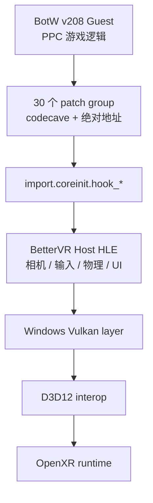
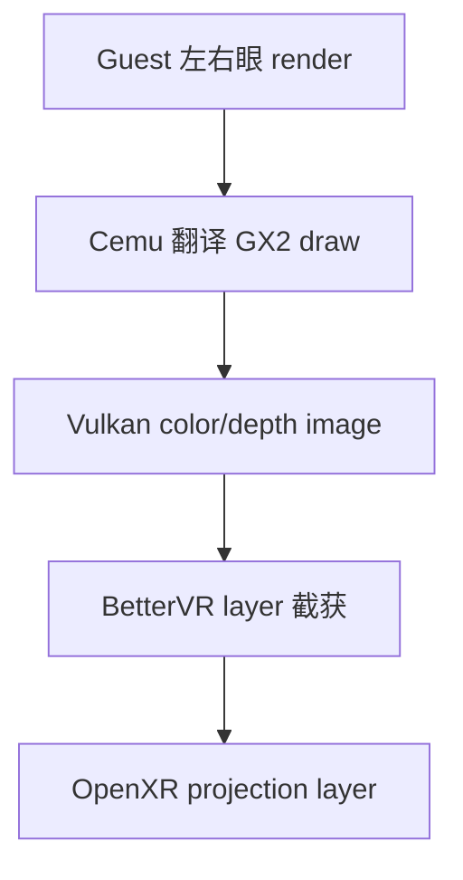
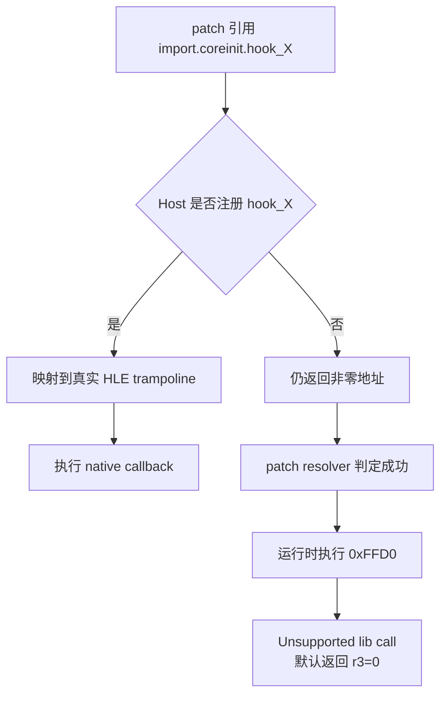
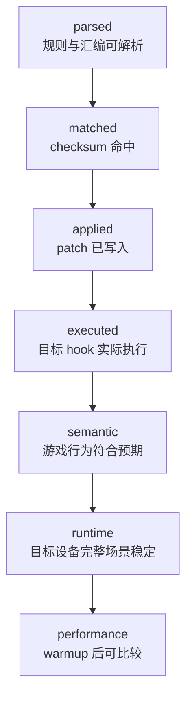
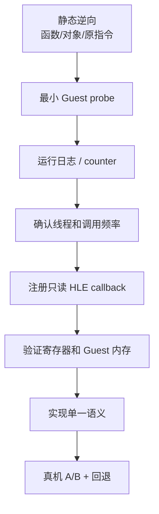
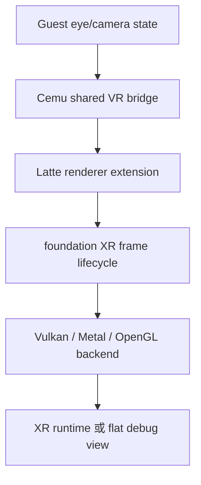

# BotW BetterVR 在 Cemu Android 上的实现边界

本文记录 BetterVR 对 BotW v208 的 Guest patch、Host HLE 和 XR renderer 三层结构，以及 2026-08-01 在 AYANEO Pocket DS 上的真实兼容性探针。结论先行：

- Cemu Android 现有 graphic-pack assembler、`moduleMatches`、codecave、绝对地址 patch 和 shader override 链路可用；
- BetterVR 核心包不能原样工作：30 个 patch group 虽然全部 applied，但自定义 HLE callback 未注册，实际调用落入 unsupported trampoline，完整 warmup 仍卡在启动画面；
- 经过 launcher 模板展开的 BetterVR Graphics 子包可以完成 v208 patch 并进入 gameplay；
- 当前设备 flat BotW 约 12 FPS，尚不具备直接承担 BetterVR 双份 Guest render/draw translation 的性能余量；
- 后续移植应把 Guest patch 作为逆向资产复用，把 HLE、renderer、ImGui 和 XR 生命周期内聚到 Cemu 共享 C++ 与 foundation，不能移植 Windows DLL/D3D12 路径。

## 验证基线

| 项目 | 实测值 |
| --- | --- |
| 分支 | `feature/malos/basic_version` |
| Cemu build hash | `39ec7c55` |
| Android variant | `RelWithDebInfo`，`android:debuggable=true` |
| APK SHA-256 | `95b21774cf6bd9ca63808cda8848a166a3930cd4351fa70f2d615cd484d68388` |
| 设备 | AYANEO Pocket DS，Android API 33 |
| GPU | Adreno 740，Vulkan 1.3 |
| 游戏 | BotW JP，`v208`，DLC `v80` |
| Title ID | `00050000101C9300` |
| 主模块 | `u-king` |
| Cemu patch checksum | `0x6267BFD0` |
| RPX updated/base hash | `fb7911ad` / `dcac9927` |
| 无 mod warmup | 约 12 FPS，可进入复苏神庙 gameplay |

状态层分辨率也在同一构建上复核：此前 `480x28` 来自“当前临时 RenderTarget”，不是 presentation 尺寸；现在改读主窗口/GamePad 窗口物理尺寸，真机显示 `1920x1080`。证据见[修正截图](../verification/20260801-C5/status-resolution-fixed.png)。

## BetterVR 不是单一 graphic pack

BetterVR 同时修改 Guest 游戏逻辑、连接 Host callback，并接管 PC 端最终图像：



另一条渲染数据路径是：



Android 当前只天然具备前两段：Guest patch 与 Cemu renderer。没有 Windows launcher、隐式 Vulkan layer、D3D12 interop，也没有 BetterVR 的 HLE callback 注册。

## Guest patch 实测

静态审计结果：

| 指标 | BetterVR Core | BetterVR Graphics |
| --- | ---: | ---: |
| `patch_*.asm` | 30 | 3 |
| patch group | 30 | 13（覆盖多个游戏版本） |
| v208 `moduleMatches` | `0x6267BFD0` | `0x6267BFD0` |
| 绝对 patch 地址 | 352 | 74 |
| 使用 codecave 的文件 | 30 | 3 |
| 唯一 import | 82 | 1 |
| 自定义 `hook_*` / `log_*` import | 66 | 0 |

BetterVR 上游 Host 侧文档统计注册 67 个 HLE callback；它与 `.asm` 中实际引用集合不是同一个计数口径，但都说明该 mod 不可能只靠复制 graphic pack 完成。

### 为什么 `applied` 仍会失败

Cemu 的函数导入解析会调用 `RPLLoader_FindModuleOrHLEExport()`。如果 HLE 函数不存在，`rpl_mapHLEImport(..., true)` 会创建一个包含 `0xFFD0` 的 unsupported-import trampoline，并返回非零 Guest 地址。



因此以下日志只能证明前三层：

```text
Loaded module 'u-king' with checksum 0x6267bfd0
Applying patch group 'BetterVR_..._V208'
Activate graphic pack: .../Better VR
```

本次临时启用 `UnsupportedAPI` 日志后，真实观察到：

```text
Unsupported lib call: coreinit.hook_OSReportToConsole
Unsupported lib call: coreinit.hook_EndCameraSide
Unsupported lib call: coreinit.hook_BeginCameraSide
Unsupported lib call: coreinit.hook_InjectXRInput
Unsupported lib call: coreinit.hook_UpdateSettings
```

完整 warmup 返回 `completed=6` 只表示按键序列执行完且 title 仍标记为 running；截图仍停在 BotW 启动画面，不能把它当 gameplay ready。见[核心包 warmup 截图](../verification/20260801-C5/bettervr-core-probe-warmed.png)。

## Graphics 子包实测

上游仓库中的 `BreathOfTheWild_Graphics/rules.txt` 不是最终产物，其中有 27 个 `__BETTERVR_*__` launcher 模板引用。原样安装会在 preset 解析阶段失败，不能用于判断 Cemu 的 patch 兼容性。

本次只在 `_out/` 创建隔离副本，把 0.5x–3x preset 展开为固定数值，并让默认 1x 使用 `1280x720`。未修改 BetterVR 仓库，也未把探针作为产品资源提交。真机结果：

1. v208 checksum 命中；
2. `BotW_GUIAspectRatio_V208`、`BotW_AspectRatio_Shared`、
   `BotW_AspectRatio_V208`、`BotW_GUIScreenNames_V208` 全部 applied；
3. 完整 warmup 后进入复苏神庙 gameplay；
4. StatusLayer 约 `11.9 FPS / 83.84 ms`，与 flat 基线同量级；
5. 日志中没有 BetterVR 自定义 `hook_*` unsupported call。

见[Graphics 子包 gameplay 截图](../verification/20260801-C5/bettervr-graphics-probe-warmed.png)。这证明普通 Guest patch/shader override 兼容，但不证明 stereo、6DoF 输入或 OpenXR 输出。

两轮探针结束后，设备端精确 probe 目录已移除，`settings.xml` 回拉后与测试前备份逐字节一致；无 mod 默认 warmup 再次进入 gameplay，见[恢复截图](../verification/20260801-C5/bettervr-restore-warmed.png)。

## 证据等级



| 对象 | 最高证据等级 | 结论 |
| --- | --- | --- |
| BetterVR Core 原包 | `executed` | hook 已执行但落入 unsupported；未到 gameplay |
| 展开后的 Graphics 子包 | `runtime` | v208 gameplay 可用；未做正式性能对比 |
| Stereo render | 未验证 | 没有可用 HLE/XR Host 实现 |
| Android OpenXR present | 未验证 | 当前探针设备也不是 XR 设备 |

## Guest/Host 逆向工作流

后续每个 hook 都按同一闭环推进：



必须记录 Guest/Host 边界：

| 项目 | Guest | Host |
| --- | --- | --- |
| ISA / endian | PPC big-endian | AArch64/x64/arm64 native |
| 地址 | Wii U virtual address / MPTR | C++ pointer |
| 调用状态 | GPR/FPR/LR/CTR/CR | `PPCInterpreter_t` + Cemu service |
| 线程 | BotW Guest scheduler 语义 | Cemu CPU/JIT/renderer 线程 |
| 验证 | 原指令、对象字段、控制流 | callback 命中、参数、生命周期 |

## 推荐的 Android 内聚实现

### 第一阶段：建立 HLE 最小闭环

1. 在共享 C++ 新建 BetterVR/BotW Guest bridge，不放进 Android JNI。
2. 直接调用 Cemu `osLib_registerHLEFunction()` 注册少量 callback。
3. 从 `hook_UpdateSettings`、相机查询或输入读取中选一个只读 hook，先输出 counter/tag。
4. 明确 PPC ABI、Guest pointer 和对象生命周期后再改变行为。
5. 把每个 callback 的支持状态做成表，不一次性注册 67 个空壳。

### 第二阶段：renderer/XR 接口



- foundation 管理 XR、ImGui layer、profiler 和跨平台生命周期；
- Cemu renderer 暴露所需的 color/depth/eye metadata；
- Android/macOS/PC backend 只实现图形 API 接口，不复制一套 BetterVR 状态机；
- 不迁移 Windows registry launcher、外部 DLL、D3D12 interop。

### 第三阶段：受性能门槛约束的 stereo

BetterVR Guest path 会让关键 render/draw translation 接近双份。当前 flat 约 12 FPS，且已有分析显示 Host async readback、`WAIT_REG_MEM`、draw prepare 和 Latte command ring idle 是主要开销。此时直接打开完整 stereo 只会放大已知瓶颈。

先达到稳定 flat 基线并能获得有效 GPU timestamp，再比较：

- mono vs stereo 的 Guest `procFrame`/job 调用次数；
- Latte draw/fast draw 数；
- Host draw preparation 与 command processor 时间；
- per-eye color/depth copy 与 XR submit；
- motion-to-photon 和 frame pacing。

## 下一步

1. 增加“已注册 HLE export”可查询诊断，避免 resolver 把 unsupported trampoline 伪装成兼容成功。
2. 从 BetterVR 66 个实际自定义 import 生成 callback 覆盖表，按相机、输入、UI、物理、渲染分类。
3. 选择一个只读相机 hook 建立 Guest→Host→counter 的最小闭环。
4. 用 flat debug view 验证左右眼状态，不立即接 OpenXR。
5. 基础性能改善后，再评估真正的 foundation XR stereo 路径。

复用工作流见 `skills/cemu-guest-game-patching/SKILL.md`；本次命令与原始日志见[真机验证记录](../verification/20260801-C5/bettervr-device-probe.md)。
