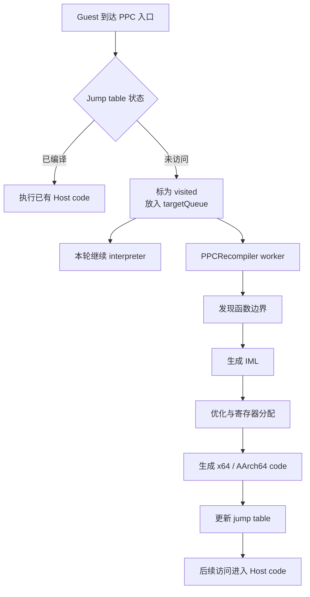
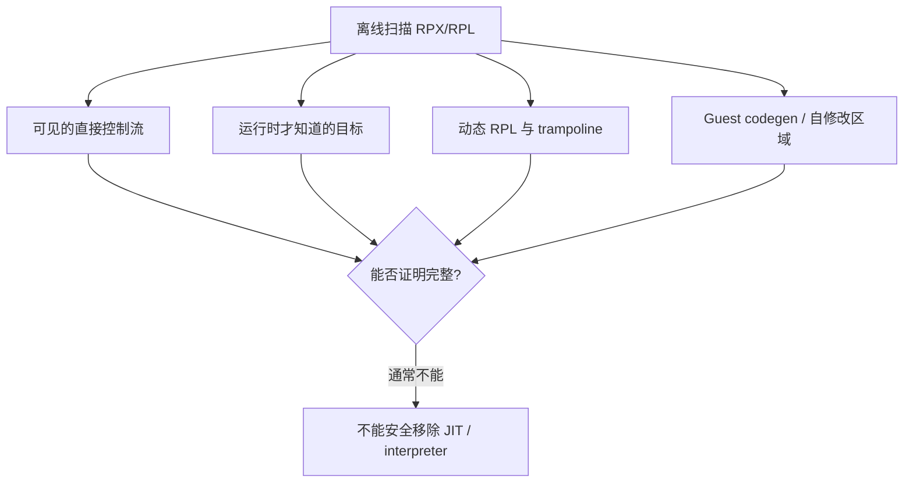
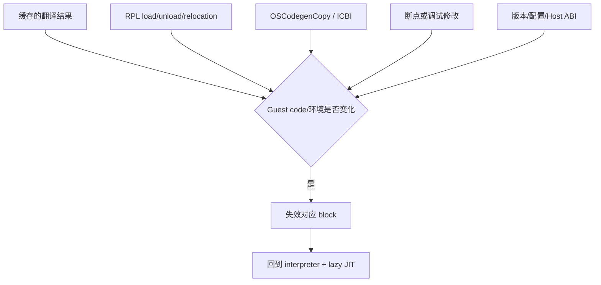
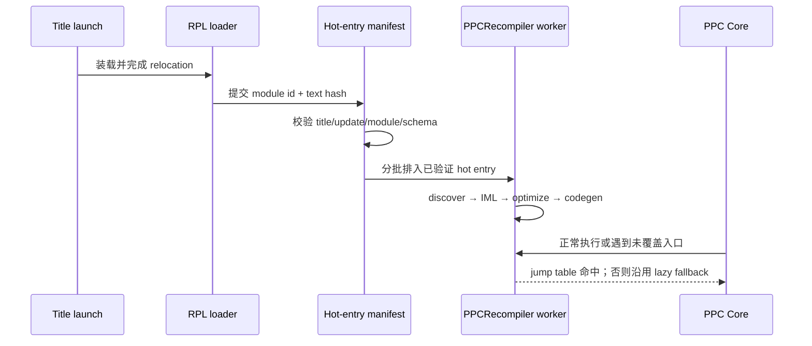

# Cemu AOT 可行性与演进建议

## 1. 结论

对 Cemu 这类包含动态模块、HLE 调用和自修改代码语义的模拟器，**直接实现“把整款
Wii U 游戏离线编译成可持久化 Host 原生代码”的完整 AOT，成本很高，且不是当前
BOTW 长帧的首要优化方向。**

近期最有操作空间的方案不是完整 AOT，而是 **profile-guided eager JIT**：记录某一
标题实际访问过的高频 Guest PPC 入口；下一次启动时，等 RPL 装载和重定位完成后，在
后台提前送入现有 recompiler。它复用当前的边界发现、IML 优化、Host codegen、跳转表
激活和失效机制，主要降低首次到达函数时的解释执行与编译抖动，不改变运行时正确性
兜底。

当前 BOTW frame `#71` 的已知瓶颈仍偏向 Host Latte command decode，而不是已经证明
的 Guest 编译开销。因此顺序应当是：先用本轮新增的 `espresso.recompiler.*`、Guest
JIT/interpreter counters 和 Latte wait/submit 标签重新采集，再决定是否进入 eager JIT
原型，不能把 AOT 当作本次长帧的既定解法。

## 2. 当前 recompiler 是怎样工作的

Cemu 当前使用按需、异步的动态二进制翻译：Guest PPC 第一次访问未编译入口时，将
地址放入编译队列；独立 recompiler 线程发现函数范围，生成并优化 IML，再为 x86-64
或 AArch64 生成 Host 代码，最后写入运行时跳转表。



对应实现入口：

- [`PPCRecompiler_visitAddressNoBlock`](../../src/Cafe/HW/Espresso/Recompiler/PPCRecompiler.cpp#L71)
  负责去重并将 Guest 地址放入 `targetQueue`；
- [`PPCRecompiler_recompileAtAddress`](../../src/Cafe/HW/Espresso/Recompiler/PPCRecompiler.cpp#L443)
  执行函数边界发现、翻译和激活；
- [`PPCRecompiler_recompileFunction`](../../src/Cafe/HW/Espresso/Recompiler/PPCRecompiler.cpp#L179)
  负责 PPC → IML → Host code；
- [`PPCRecompiler_makeRecompiledFunctionActive`](../../src/Cafe/HW/Espresso/Recompiler/PPCRecompiler.cpp#L380)
  把原生入口写入 direct jump table；
- [`PPCRecompiler_invalidateRange`](../../src/Cafe/HW/Espresso/Recompiler/PPCRecompiler.cpp#L622)
  使与变化 Guest code 相交的已编译函数失效；
- [`PPCRecompiler_Shutdown`](../../src/Cafe/HW/Espresso/Recompiler/PPCRecompiler.cpp#L736)
  清空队列、失效范围和函数存储。当前没有跨进程加载 recompiler cache 的路径。

`dump/recompiler/*.bin` 只是调试时输出当前进程生成的原始机器码；仓库中没有与它配套
的重定位元数据、完整 cache key、完整性验证或下次启动加载器，因此不能把该 dump
当成已有 AOT 基础设施。

## 3. 为什么完整 AOT 成本高

### 3.1 不能在安装文件里完整发现所有可执行路径

Guest 分支目标可能由运行时数据决定，RPL 模块也会在运行过程中加载、链接和卸载。
完整静态扫描既可能漏掉间接分支目标，也可能把数据误判为代码。当前 lazy JIT 用
“实际访问入口”解决发现问题；完整 AOT 必须重新解决代码覆盖率和间接目标问题。



### 3.2 原始 Host 机器码不是可直接跨启动复用的产物

AArch64 backend 会把运行时函数地址直接写进生成代码。例如
[`call_imm`](../../src/Cafe/HW/Espresso/Recompiler/BackendAArch64/BackendAArch64.cpp#L1435)
嵌入 `callAddress`，HLE 路径也嵌入
[`PPCRecompiler_virtualHLE`](../../src/Cafe/HW/Espresso/Recompiler/BackendAArch64/BackendAArch64.cpp#L969)
的地址。ASLR、不同构建、不同进程布局和 Foundation/Cemu ABI 变化都会让这些地址
失效。直接持久化 native block 至少要补：

- Host 代码与数据引用的 relocation 表；
- Guest 入口、内部入口和 Host block 的映射元数据；
- Cemu/recompiler ABI、Host 架构与 CPU feature 的 cache key；
- 可执行内存映射、W^X 权限切换和 instruction-cache 同步；
- 原子写入、完整性校验、损坏回退和版本淘汰；
- RPL 变化、自修改代码、断点和配置变化的精确失效。

### 3.3 Guest code 本身允许变化

RPL 内存释放和刷新会调用
[`PPCRecompiler_invalidateRange`](../../src/Cafe/OS/RPL/rpl.cpp#L32)，模块 text 与 trampoline
在刷新时也会失效。`OSCodegenCopy` / `ICInvalidateRange` 会更新动态 codegen 区域，并在
内容改变时让对应 JIT block 失效；遇到直接写入语义时，当前实现甚至会避免对该区域
JIT。完整 AOT 仍必须保留这些运行时失效与 fallback，因此无法真正删掉动态翻译层。



### 3.4 Android 增加持久化可执行代码的安全边界

Android 官方建议尽量避免动态加载应用外部存储的代码；确需使用时应放在可信的内部
存储，校验完整性，并避免从不可信位置装载。Cemu 即使只缓存本机生成的代码，也不应
将可执行 cache 放在 `/sdcard` 或游戏目录中。可参考 Android 官方的
[Dynamic Code Loading 风险说明](https://developer.android.com/privacy-and-security/risks/dynamic-code-loading)
与[安全建议](https://developer.android.com/privacy-and-security/security-tips)。

这不阻止运行时 JIT，但会提高“跨进程持久化 native cache”的设计、审计和发布成本。

## 4. 方案比较

| 方案 | 实现成本 | 主要收益 | 正确性风险 | 建议 |
| --- | --- | --- | --- | --- |
| 完整 title AOT | 极高 | 理论上减少大部分运行时编译 | 极高；代码发现、动态 RPL、自修改代码仍需 JIT fallback | 不建议近期投入 |
| 持久化 Host native blocks | 高 | 启动和首次访问抖动最低 | 高；relocation、ASLR、W^X、ABI/cache 失效复杂 | 暂缓 |
| 持久化 IML + 元数据 | 中高 | 跳过函数发现与前端翻译 | 中；序列化格式和 Guest code 校验复杂，启动仍需 Host codegen | 可作为第二阶段研究 |
| 热入口 manifest + eager JIT | 中 | 复用现有编译器，明显降低已知路径首次访问抖动 | 低到中；地址必须在模块链接后校验 | **优先原型** |
| 保持 lazy JIT，只优化 worker/队列 | 低到中 | 减少编译排队和锁竞争 | 低 | 与埋点结果配套推进 |

完整 AOT 更可能改善加载阶段和首次进入新区域时的卡顿，而不是已经热起来后的稳定帧
吞吐。如果 BOTW 的稳定帧瓶颈在 Latte/Vulkan，AOT 不会缩短对应 Host GPU 模拟和
物理 GPU 工作。

## 5. 推荐的 profile-guided eager JIT

### 5.1 保存什么

第一版只保存 Guest 侧数据，不保存机器码：

- 已实际进入且成功编译的 Guest PPC 入口；
- 所属 RPX/RPL 标识及 text hash；
- 可选热度、首次出现阶段和累计编译耗时；
- manifest schema 与 recompiler frontend version。

Guest 地址 manifest 不含可执行字节，可跨 x86-64/AArch64 共用，也避免 ASLR/W^X
问题。地址必须和模块身份及 text hash 绑定，不能只用 title ID + 裸地址。

### 5.2 何时预编译

必须等目标模块完成装载和重定位后，再把已验证入口送入现有队列。不能在 App 启动、
游戏文件尚未挂载或 RPL 地址尚未稳定时预编译。



为避免预编译抢占 gameplay CPU，建议分批并设置预算：只在启动/warmup 阶段运行，按
累计编译 wall time 或队列长度限流；一旦进入实际 gameplay 或发现帧时间恶化就降速。

### 5.3 Cache key

最低应包含：

```text
title id
base/update version（BOTW 例：v208）
每个参与模块的 text hash 和 relocation identity
manifest schema / PPC frontend version
影响代码生成语义的 Cemu 配置
```

若未来持久化 IML，再加入 IML schema/optimizer version；若未来持久化 Host native
code，还必须加入 Cemu build/ABI、Host ISA、CPU feature、OS page-policy 等字段。

## 6. 分阶段成本与退出标准

### 阶段 0：补齐观测（已落第一组标签）

使用同一 BOTW v208 / DLC v80 场景重新采集：

- `espresso.recompiler.compile` 及 discover/IML/optimize/codegen/activate 子阶段；
- `espresso.recompiler.invalidate`；
- 每帧 Guest quanta、JIT entries 与 interpreter instructions counters；
- Latte command-ring、TCL ring 和 GX2 command-pool wait counters，判断 Guest 是否让
  Host command consumer 饥饿；
- Latte sync、Vulkan submit/fence 和 shader/pipeline worker 标签，排除 Host/GPU 同步。

退出标准：能回答长帧是否包含 recompiler 工作、PPC interpreter fallback 是否显著、
Guest producer 与 Latte consumer 哪侧在等。不能只因看到 recompiler 线程存在就判断
AOT 有收益。

### 阶段 1：热入口 manifest 原型

预计为中等规模改动，优先只做 Android/BOTW 实验，但实现放在共享 C++ 路径：

1. 记录成功激活的 Guest entry 和模块身份；
2. 标题正常退出时原子写入 app-private cache；
3. 下次 RPL 链接完成后校验并分批送入现有 recompiler queue；
4. 任一校验失败即忽略 cache，保留现有 lazy JIT；
5. debugbus 暴露命中、排队、成功、丢弃和耗时概要。

退出标准：相同存档/路径至少三轮冷启动对照，首次进入 gameplay 的 p95/p99 frame time
和 `cemu.guest_interpreter_instructions_per_frame` 明显下降，同时稳定态 FPS 不回退、
没有 stale-code 错误，cache 删除后行为完全回到基线。

### 阶段 2：评估 IML cache

只有阶段 1 证明前端编译本身仍占明显启动时间时再做。需要稳定序列化 IML、入口和
Guest range 元数据，但 Host backend 仍在当前进程生成原生代码。它比 native cache
安全、可移植，但维护 schema 的长期成本明显高于 hot-entry manifest。

### 阶段 3：native cache / 完整 AOT

只有在 IML/Host codegen 被多轮 trace 证明为不可接受的主要瓶颈，并且 eager JIT 无法
隐藏时才重新立项。该阶段应单独做安全和 cache 正确性设计，不应作为普通性能 patch
顺带加入。

## 7. BOTW 当前优先级

本次 frame `#71` 的 CPU window 为 117.223 ms，已观测到的 Host
`latte.command_buffer.decode` 覆盖 89.481 ms，而 GPU covered time 为 46.137 ms；Guest
quantum 的旧 trace 又存在时间戳/层级异常。由这些证据只能得出：

1. AOT 对“首次执行 Guest code 的抖动”有潜在空间；
2. 还没有证据表明 AOT 能解决当前最长帧；
3. 应先重抓新增标签，把 compile、interpreter、Guest/Host queue wait 与 Latte/Vulkan
   self time 分开；
4. 若长帧不包含编译且 interpreter 比例很低，AOT 优先级应继续低于 Latte 命令处理、
   同步和 GPU pass/submit 优化。

最长帧的完整上下文见
[`cemu-frame-performance.md`](cemu-frame-performance.md)。
