# Cemu 帧性能架构：Guest / Host / GPU 与长帧案例

> BotW draw 从 Guest GX2 HLE、模拟 PM4 到 Host renderer 的专项分析，以及结构化 draw 快速通道实验，见 [Guest 到 Host 的结构化 Draw 快速通道](guest-host-structured-draw-fast-path.md)。

> `WAIT_REG_MEM`、`GX2DrawDone`、readback 与 renderer fence 的生产者/消费者语义，以及
> Host-like dependency/completion point 设计，见 [Guest / Host 同步与完成点架构](guest-host-synchronization.md)。

> Qualcomm/Adreno 的 binning/HSR、Cemu 当前未完成的 conditional-render culling，以及 BotW
> `accurate` / `always_visible` query A/B，见
> [移动 GPU HSR 与 Cemu Occlusion Query 策略](mobile-occlusion-query-hsr.md)。

> 2026-08-07 在 Pico B3110 上完成了第一份对齐 **Cemu Guest 帧边界** 的 BotW RDC，
> 并用 warmup 后 30 秒 Tracy counter 做了交叉验证。完整数据见
> [BotW Guest 命令翻译与 Host Vulkan 提交基线](../verification/botw-command-translation-baseline.md)。

## 2026-08-07 AYN Thor：现代 GPU 能覆盖 draw，前端翻译仍是成本

在默认移除 Host occlusion query、完成完整 warmup 后，对 BotW v208 神庙 gameplay 采集
30 秒 Tracy。样本包含 380 个 frame、3,753,340 个 CPU zone、6,122 个 GPU zone；其中
6,112 个 GPU zone 有真实 Vulkan timestamp。设备当时的 Adreno 频率为 401 MHz，因此绝对
FPS 只用于描述该次样本，不与其他时钟状态混用。

基线 artifact：`20260807-143517-836-tracy-tracy-live-normalized-only-0fdc7925`。

| 每帧指标 | 结果 | 含义 |
| --- | ---: | --- |
| PM4 packet / dword | 61,858 / 318,353 | Guest 协议前端工作量，不是 draw 数 |
| context packet | 21,611 | shader、RT、depth、blend 等虚拟寄存器状态 |
| changed / redundant SET packet | 19,438 / 22,697 | 重复状态包数量甚至高于真实变化包 |
| draw | 3,970 | 现代 Host GPU 可承受的 Wii U 级渲染量 |
| full / fast draw | 1,189 / 2,781 | 约 30% 仍进入完整 Host state prepare |
| Host draw translate | 16.99 ms | 明确属于 LatteThread/Vulkan 前端 CPU 成本 |
| Vulkan submit | 10.42 | threshold 3.07、readback 4.33、frame/acquire/present 各 1 |
| GPU command-buffer root | 46.41 ms | 真实 GPU timestamp；低于约 79 ms 的整帧间隔 |
| present blit / readback copy GPU | 0.66 / 0.18 ms | 最终 blit 和 copy 指令本体都不是主耗时 |

### GPU command-buffer 盲区已拆开

后续在 command-buffer root 内补了 guest render pass、transfer、hazard、present 和
readback GPU scope，并修正 Ptracy 对嵌套 GPU zone 的重复求和。完成 warmup 后的 BotW
v208 神庙窗口为 artifact
`20260807-152929-264-tracy-tracy-live-normalized-only-d71186cb`，正式统计 frame
`1800..2051`，共 252 帧。

| GPU 指标 | 每帧 | 正确解释 |
| --- | ---: | --- |
| command-buffer covered union | 48.36 ms | GPU 根区间并集，是该窗口的实际 GPU 覆盖 |
| 所有嵌套 zone inclusive sum | 96.19 ms | 父子重复求和，只用于检查埋点层级，不能当帧时 |
| guest render-pass self | 43.83 ms | 已标记 GPU 时间的主要部分 |
| command-buffer 未命名 self | 0.63 ms | 根区间扣除直接子区间后的剩余盲区 |
| texture copy / buffer upload | 1.61 / 0.82 ms | 明确的 transfer 子阶段 |
| present blit / surface copy | 0.66 / 0.30 ms | 末端输出与 surface conversion |

因此旧结论中的“GPU command buffer 约 46 ms”不再等于“未知 rendering”。绝大部分已经
落入 guest render pass，根区间未命名 self 只有约 0.63 ms/帧。该窗口平均约 653 个 GPU
zone/帧，即约 1307 次 timestamp write/帧，仍属于高密度埋点；render-pass 归因可用于找
方向，但正式 A/B 还要使用 root-only 或抽样明细复核 profiler perturbation。

2026-08-08 又在用户肉眼确认已经进入同一神庙 gameplay 后直接采集 40 秒，得到 artifact
`20260807-160734-819-tracy-tracy-live-normalized-only-9bd34fa3`。丢弃两端边界后统计
frame `50..477`，共 428 帧；场景截图为
`_out/profiler/gpu-composition-20260808/gameplay-after-capture.png`。这次独立复现与上表
一致：command-buffer covered union 为 `48.45 ms/帧`，guest render-pass self 为
`43.89 ms/帧`，占 covered 的 `90.6%`；command-buffer 未命名 self 仅
`0.63 ms/帧`。其余组成如下：

| GPU 分类 | 每帧 | covered 占比 |
| --- | ---: | ---: |
| Guest render pass self | 43.89 ms | 90.59% |
| texture/buffer/surface/streamout/readback 等 transfer | 3.12 ms | 6.44% |
| present blit | 0.66 ms | 1.37% |
| render-target/input-texture hazard | 0.15 ms | 0.31% |
| command-buffer 未命名 self | 0.63 ms | 1.29% |

对应的 Host counter 平均为 3973 draw、253.4 个 Guest render pass 和 10.40 次 Vulkan
submit/帧。169.0 个 pass 只有一次 draw，207.0 个 pass 最多四次 draw，分别占 Guest
render pass 的 `66.7%` 和 `81.7%`。这说明下一层 GPU 优化不能再笼统归因到
“command buffer”，而应检查细碎 render pass、attachment 切换和 tile/binning 周期。

render-pass duration 的分布也显示，数量与时间不能混为一谈：小于 `0.05 ms` 的 pass
占全部 pass 的约 `63.0%`，但只占 Guest render-pass GPU 时间的 `8.34%`；大于等于
`0.5 ms` 的 pass 只占约 `11.3%`，却贡献 `63.25%` 的时间，其中大于等于 `2 ms` 的
599 个 pass 贡献 `10.97%`。后续应以低频抽样方式给重 pass 补 attachment identity、
draw count、pipeline/shader 和结束原因，不应继续给约 3970 个 draw 逐个写 GPU timestamp。

该轮 Tracy 连接期间 `cemu.fps_milli` 平均为 13.25 FPS；断开后同一进程、同一画面状态层
恢复为 16.5 FPS，采集前截图为 17.0 FPS。约 654 个 GPU zone/帧和 1307 次 timestamp
write/帧具有明显扰动，因此本轮只用硬件 timestamp duration 判断组成，不把连接期间的
绝对 FPS 当产品基线。该驱动仍为 `flags=0`、无 `GpuCalibration` 事件；逐帧关联使用
CPU submit time，不能把 GPU 绝对时间轴与 CPU 时间轴强行对齐。

### Adreno / Tracy 的 CPU-GPU 时间戳校准边界

Foundation 现在同时支持 `VK_EXT_calibrated_timestamps` 与
`VK_KHR_calibrated_timestamps`，并修正了 Tracy symbol table 曾用
`vkGetDeviceProcAddr` 加载 physical-device 函数的问题。驱动提供校准扩展时，Tracy
context 会设置 `flags & 1`，并在长采集中发送 `GpuCalibration` 事件修正漂移。

当前 AYN Thor 的 Adreno 740 驱动（2023-12-27）虽然报告 Vulkan 1.3，但两种校准扩展
都未暴露。实机日志明确为：

```text
Vulkan profiler timestamp calibration: api=none hardware=unavailable fallback=initial-query-pair
```

这种设备不能伪造 calibrated flag。fallback 改为连续 8 次提交极小 timestamp command，
以 CPU submit 前后时间包围 GPU timestamp，选取最窄区间并用中点建立初始时钟锚点；旧实现
只在 `vkQueueWaitIdle` 后取一次 CPU 时间，存在固定的向后偏差。20 秒同类诊断采集对比如下：

| depth-0 GPU start - CPU record end | 旧单次锚点 | 新 8 次最短区间锚点 |
| --- | ---: | ---: |
| 最小值 | 0.304 ms | 0.149 ms |
| P50 | 0.657 ms | 0.512 ms |
| P95 | 0.831 ms | 0.687 ms |
| 最大值 | 6.032 ms | 1.342 ms |

新采集 artifact 为
`20260807-155634-519-tracy-tracy-live-normalized-only-f0434a86`；旧对照为
`20260807-154548-254-tracy-tracy-live-normalized-only-dfabaefe`。新样本 1798 个
depth-0 command buffer 中，前 20% 与后 20% 的中位间隔分别是 0.524 ms 和 0.507 ms，
20 秒内未观察到有意义的漂移。这两轮是 timestamp calibration 专项诊断，没有执行完整
gameplay warmup，只能比较时钟锚点质量，不能作为 FPS 或热点优化基线。

这里的间隔还包含真实 queue submit/调度延迟，所以它不是校准误差本身，也不能把
`flags=0` 写成硬件校准成功。可信边界是：GPU zone duration 继续使用硬件 timestamp；
CPU/GPU 绝对先后和逐帧相对位置在 `flags=0` 时使用 CPU-submit 时间；Ptracy 以
`calibrationSource=initial-query-pair-estimate` 和
`TracyGpuCpuAlignmentUncalibrated` 明确标记这一点。只有 context flag 为 1 且长采集出现
`gpuCalibrationEventCount > 0`，才能把绝对 CPU/GPU timeline 当作硬件周期校准结果。

`vulkan.draw.prepare.full` 聚合约 `11.00 ms/帧`，fast prepare 约 `3.15 ms/帧`。同时
`latte.command_buffer.decode` 的 self time 约 `7.10 ms/帧`。这说明当前问题不是 Adreno
“画不动 Wii U 的约 4k draw”，而是 Cemu 仍在 Host CPU 上解释约 6.2 万个 PM4 packet、
重建约 1.2k 次完整 draw state，并以多个 command buffer 提交给驱动。

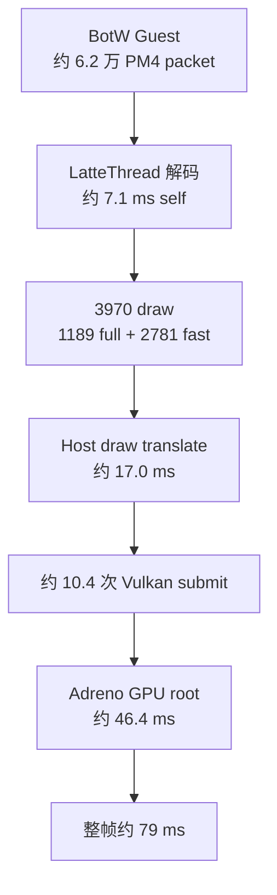

因此后续默认原则是：**保留 Guest 可观察语义，让现代 GPU 直接承担实际渲染量；优先消除
旧硬件 hint、重复状态翻译、过细 command-buffer 批次和不必要同步。** HSR/Hi-Z/binning
可以覆盖隐藏片元，却不会替 Cemu 解码 PM4、创建 descriptor/pipeline 或录制 `vkCmdDraw*`。

当前 300 draw-pass threshold 每帧触发约 3.07 次 submit。曾独立实验把常规阈值提高到
600；readback、present、frame boundary、swapchain acquire、显式 completion 等边界全部
保留。结果证明这不是当前可保留的优化：Vulkan submit 从 `10.42` 降至 `8.41` 次/帧，
`vulkan.submit` CPU 聚合从 `5.75` 降至 `5.48 ms/帧`；但 readback visibility 的
`wait_for_fence` 从 `1.41` 升至 `7.17 ms/帧`，feedback-boundary DrawDone 从 `3.09`
升至 `9.17 ms/帧`。因此默认值已恢复为 300。

这个反例说明：物理 GPU 可以处理更大的 Wii U draw batch，但当前 Guest feedback/readback
仍把“尽早完成”作为可观察语义。后续要先把上一帧 feedback、staging copy 和 completion
point 从主 graphics batch 解耦，再扩大非反馈 draw 的批次；不能只以 submit 数下降判定优化。
600 threshold 实验 artifact 为
`20260807-144803-798-tracy-tracy-live-normalized-only-0c85ae91`，包含 405 个 frame、
5,709 个真实 GPU-time zone；实验代码未保留。

## 最新基线：不是单一 translate 瓶颈

当前最完整的同场景证据把约 `94.06 ms` 的平均帧拆成了三个不能混为一谈的层次：

| 层次 | 直接证据 | 当前判断 |
| --- | --- | --- |
| Guest command 生产/交付 | Guest/Host 都是 60 submissions、135,749 words，pending 为 0 | command queue 没有跨帧积压 |
| Host command consume/translate | consume 77.01 ms，draw translate 17.79 ms | translate 约占帧时 18.9%，是实质成本但不是全部 |
| Host Vulkan 结构与同步 | 4241 draws、255 passes、216 copies、12 submits | 大量短 pass 与 readback/submit 是独立成本 |

稳定窗口中每帧平均 `11.33` 次 Vulkan submit：固定 4 次由 draw-pass threshold 触发，
4～5 次由 readback 触发，另有固定 3 次尚待继续分类。RenderDoc 完整帧还显示
`169/255` 个 render pass 只有一个 draw，`210/255` 个不超过四个 draw。

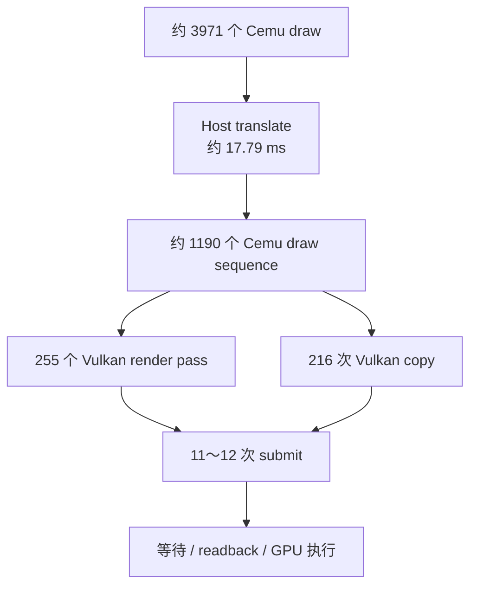

这修正了“只要 Guest 直接调用 Host renderer 就能消除主要开销”的过强假设。即使跳过
部分 PM4 packet decode，attachment/hazard、readback、copy、render-pass 生命周期和
queue submit 仍必须存在。后续优化先按 submit reason 和低 draw pass 做语义安全合并，
再评估 BotW 专有 Host 快速通道；不能先绕过 Guest command stream 再补同步正确性。

> 本文分析的是 **2026-08-01、AYANEO Pocket DS、BOTW v208 / DLC v80、
> Vulkan、Android RelWithDebInfo** 这一次 20 秒 Tracy 采集中的最慢帧，即 frame
> `#71`。它不是“Cemu 在所有设备和游戏中的全局最慢帧”。后续比较必须复用相同场景、
> 构建类型和采集方法。

## 1. 结论

Frame `#71` 用时 **117.223 ms**，是本次 198 帧中的最大值。它相对采集平均帧
99.477 ms 慢 17.746 ms（+17.84%），但同帧 Vulkan GPU 覆盖为 46.137 ms，反而比
全段 GPU 平均值低 1.36%。因此这次长帧不是 GPU 时间突然增长造成的。

当前最可信的归因是：

1. **Host CPU 是这一帧的主导侧。** 198/198 帧均由 Profiler MCP 判定为 CPU 时间
   长于 GPU 时间，frame `#71` 的 CPU/GPU 比达到 2.541x。
2. **Host `LatteThread` 是已观测到的关键路径。** `latte.command_buffer.decode` 在
   帧窗口内精确裁剪后的并集覆盖为 89.481 ms，占整帧 76.33%。
3. **逐 draw 数量上升有贡献，但不能独立解释长帧。** 本帧有 4,129 次 draw，比
   采集均值高 6.65%；CPU 帧时间却高 17.84%，而 `vulkan.draw.prepare` 与
   `vulkan.submit` 没有同比例增长。
4. **长尾主要落在 decode scope 的未细分 self 区域。** 最后一段 decode 从相对
   82.166 ms 持续到帧末，裁剪后 35.057 ms；Tracy 报告该 scope 的原始 self time
   为 31.691 ms。现有埋点无法区分这里是在执行命令、等待 flip/guest、等待 OS 调度，
   还是做未命名的资源和状态处理。
5. **Guest 工作存在，但本次不能可靠量化。** 三个 `PPC Core N` 上都采到了
   `espresso.ppc_quantum`，但 Tracy live import 的嵌套时间戳发生回绕/层级损坏。
   Guest/Host 语义边界可信，Guest wall time 数值不可信。
6. **GPU 仍是后续的第二道上限。** 本段 GPU 平均覆盖 46.773 ms，即使完全消除
   CPU 瓶颈，也只能对应约 21 FPS；但它不是 frame `#71` 成为局部最长帧的原因。

### 1.1 2026-08-02 Render/Texture 独立尺度实验补充

P3 实机验证在同一 BotW 神庙场景提供了新的交叉证据：

| 组合 | 面板瞬时 FPS | Draws | Source | 证据边界 |
| --- | ---: | ---: | --- | --- |
| Texture 1x + Render 1x | 约 12 | 未在本轮截图冻结 | 1280x720 → 1280x720 | 用户同场景观测 |
| Texture 2x + Render 0.5x | 10.5～12.2 | 3,802～3,811（约 2,800 fast） | 1280x720 → 640x360 | warmup 后设备截图 |
| Texture 1x + Render 2x | 8.6 | 3,824（2,813 fast） | 1280x720 → 2560x1440 | warmup 后设备截图 |

单张 StatusLayer 不是稳定 benchmark，不能用 12.2 与 8.6 计算精确收益；但两个现象
足够稳定，可用于确定下一步方向：

1. Render 从 1x 降到 0.5x 后仍约 12 FPS，说明当前 1x 基线没有主要受 raster 像素
   吞吐限制。
2. Render 提高到 2x 后降到约 8.6 FPS，说明额外 raster/RT 带宽会把 GPU 推成新的
   附加瓶颈，但它不是 1x 下约 12 FPS 的首要限制。
3. 0.5x 与 2x 的 draw 数都约为 3.8k，且约 2.8k 进入 fast draw；降低 internal
   extent 不会减少 guest GX2 packet、Latte decode、状态/descriptor 准备和 Vulkan
   draw 记录次数。

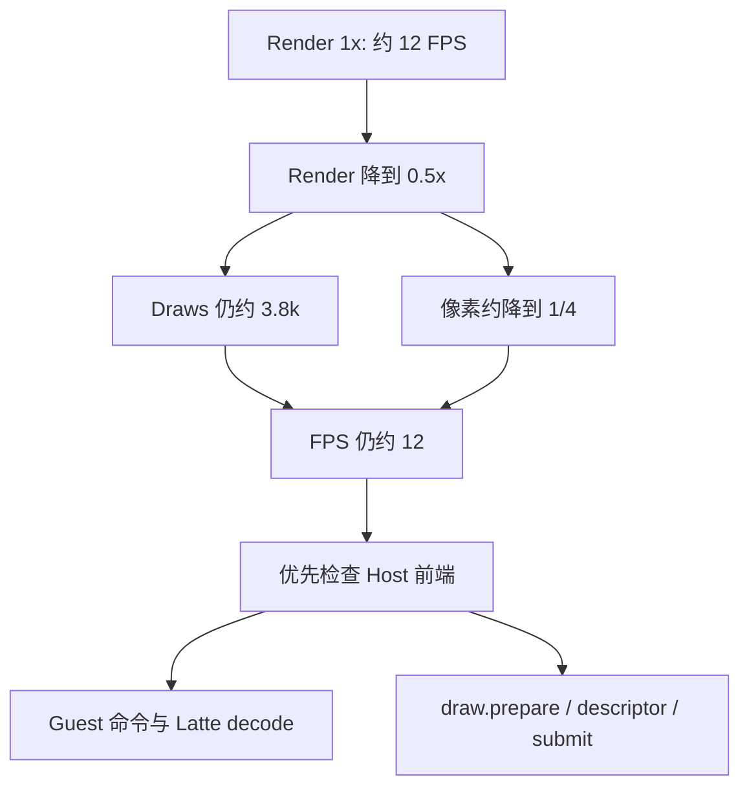

因此 `Texture 2x + Render 0.5x` 当前应视为画质、显存与 raster 成本重新分配的候选，
不是主要提帧方案。下一轮 Tracy 要按 frame 聚合 normal/fast draw、Guest marker/pass、
command words、状态变化、descriptor/pipeline 命中和 submit draw count，验证约 3,800
draws 中哪些可合并、缓存或通过 BotW 专有 marker 快速通道减少 Host 成本。

同一组合完成同步修正后又采集了 10 秒 Tracy（102 帧，trace 位于
`_out/internal-resolution/p3/cemu-botw-render0.5-texture2.tracy`）。最长帧 `#42` 为
116.938 ms，1 秒窗口的 draw 计数稳定在 3,846～3,860。该帧数据把 draw 假设从相关性
推进到了可量化的 Host 成本：

| Host scope | 调用数 | 累计 / self | 对 116.938 ms 帧的解释 |
| --- | ---: | ---: | --- |
| `vulkan.draw.prepare` | 3,801 | 26.157 / 26.157 ms | 约 6.88 µs/draw，直接占约 22.4% |
| `latte.draw_pass.decode` | 1,068 | 22.256 / 3.197 ms | 包含 fast sequence 和部分子 draw，不能再与 prepare 相加 |
| `latte.sync.wait_reg_mem` | 1 | 30.890 / 30.870 ms | 同步等待与 draw 固定成本同样重要 |
| `vulkan.submit` | 12 | 14.839 / 0.037 ms | 大部分时间落在结束、回收和 fence 等子项 |
| `SurfaceScale.PreflightAttachmentGroup` | 1,068 | 4.367 / 4.367 ms | P3 新路径的可优化固定开销 |
| `SurfaceScale.Vulkan.Resample` | 135 | 0.943 / 0.943 ms | 当前不是主瓶颈 |

同帧 GPU 覆盖为 41.943 ms，仍显著短于 116.938 ms CPU 帧。结论不是“3800 draws
解释了全部 12 FPS”，而是“逐 draw prepare 已确认吃掉约 26 ms；另有约 31 ms 的
同步等待”。优化顺序应先拆分 full/fast prepare、pipeline/descriptor/cache 命中，再
分析 `wait_reg_mem` 对应的 Guest marker 与 GPU fence；两条线需要分别验证。

拆分标签后的第二轮 8 秒采集进一步给出了优化重心：

| 路径 | 每帧计数 | 全段次数 | 全段 prepare | 平均每次 |
| --- | ---: | ---: | ---: | ---: |
| full / sequence first draw | 1,013～1,016 | 45,590 | 419.959 ms | 约 9.21 µs |
| fast / continued draw | 2,842～2,845 | 127,669 | 182.493 ms | 约 1.43 µs |

fast draw 已占总 draw 的 73.6%～73.7%，说明现有 continuous draw pass 优化确实大量
命中；但约 26.3% 的 full draw 占两类 prepare 聚合时间约 69.7%。换句话说，BotW 每帧
仍把渲染拆成约 1,000 个需要完整 state/resource/pipeline 准备的 sequence，平均每个
sequence 只有约 2.8 个后续 fast draw。后续专有快速通道首先应记录“为什么结束
continuous pass”，再评估是否能安全放宽某些状态变更的终止条件；不能直接吞掉 Guest
状态包或跨越真实的 attachment/texture hazard。

## 2. 证据基线

| 项目 | 值 |
| --- | --- |
| 设备 | AYANEO Pocket DS，8 核 ARM64，15,257 MB RAM |
| 应用 / PID | `info.cemu.cemu` / `18747` |
| APK | debuggable，Native `RelWithDebInfo` |
| APK SHA-256 | `cd23e6d75bc2395ebff93d4e37e541dcee65150ee8bf9eaf16504b5c0b23f38f` |
| 游戏 | Breath of the Wild，内部版本 v208，DLC v80 |
| Renderer | Vulkan |
| Tracy | 0.10.0，protocol 64 |
| MCP artifact | `20260801-090701-291-tracy-tracy-live-normalized-only-a75500dd` |
| MCP session | 原始分析 `s3`；本文从 artifact 重载为 `s4` |
| 采集长度 | 20 秒，198 个可分析帧 |
| CPU / GPU zones | 875,932 / 777,827 |
| 真实 GPU-time zones | 776,215；另有 1,612 个 CPU-submit fallback，但 frame #71 为 0 |
| 本地 trace | `_out/profiles/cemu-botw-current.tracy`，59,736,635 bytes |
| Trace SHA-256 | `5891b138dc05eeeac9487330e845246730eb7d5fb705f174238a2c343967d366` |
| 游戏态截图 | [`profiler-current-state.png`](../verification/20260801-C5/profiler-current-state.png) |

状态面板在断开 Tracy 后的同一可操作场景显示 12.2 FPS / 81.88 ms。Tracy 在本次
20 秒内解码了 8,060,435 个事件，绝对 FPS 会受到采集开销影响；本文优先用相对变化
和 CPU/GPU 归属判断瓶颈，不把连接 Tracy 时的 FPS 当作最终性能基线。

## 3. Guest / Host 的定义和关联边界

Cemu 中所有代码最终都运行在 host 设备上。本文所说的 Guest / Host 指“模拟语义”，
不是不同物理进程：

| 域 | Tracy 线程 / scope | 语义 | 本次耗时可信度 |
| --- | --- | --- | --- |
| Guest CPU | Host 线程 `PPC Core 0/1/2` 上的 `espresso.ppc_quantum` | 执行 Wii U PPC guest 指令；先尝试 JIT recompiler，剩余周期走 interpreter | 语义高；数值低 |
| Guest → Host 边界 | GX2/PM4 风格 command buffer、寄存器和同步包 | Guest 生成命令，Host Latte 消费 | 映射高；缺少队列等待计时 |
| Host CPU / GPU emulation | `LatteThread` / `latte.command_buffer.decode` | 解析 guest GPU 命令、更新模拟状态、处理 draw/wait/flip/sync | 高，但 self 尚未细分 |
| Host Vulkan CPU | `vulkan.draw.prepare`、`vulkan.submit` | 准备资源/状态、记录 Vulkan 命令、提交和回收 command buffer | 高 |
| Host physical GPU | GPU context 0 / `vulkan.draw`、`vulkan.present_blit` | Adreno 实际执行 Vulkan 命令 | 高；单 draw 受时间戳粒度限制 |
| Frame boundary | `latte.frame.end` / Tracy frame mark | 将连续 timeline 切成 Cemu 帧 | 高；不是整帧工作 scope |

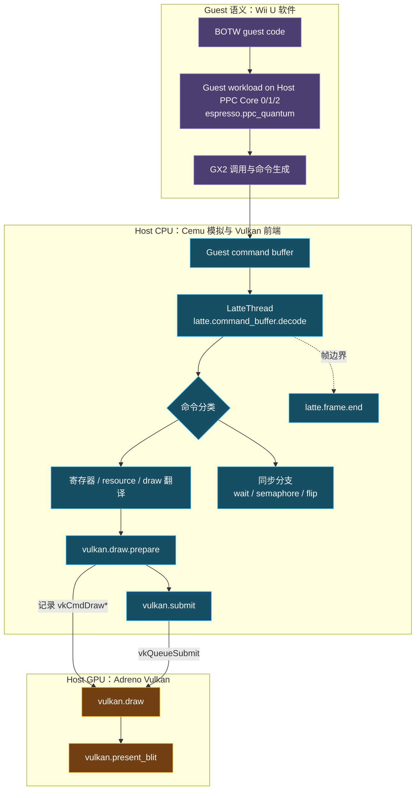

关键解释：`LatteThread` 的输入来自 Guest，但其解码、状态缓存和 Vulkan API 开销属于
Host。Guest PPC 三个线程、LatteThread 与 GPU 可以并行，因此这些线程/设备上的 scope
耗时**不能相加**得到 117.223 ms。

## 4. 关键线程、执行实体与职责

### 4.1 先区分三种“线程”

Cemu 的线程模型不能只按 Tracy 左侧显示的线程名理解：

| 执行实体 | 是什么 | 谁调度 | BOTW 中的作用 |
| --- | --- | --- | --- |
| Guest `OSThread_t` | Wii U 进程看到的逻辑 OS 线程；在 Cemu 中保存 guest 寄存器、栈、优先级、亲和性和状态 | Cemu 的 coreinit guest scheduler | 执行 BOTW 游戏逻辑、任务、GX2 提交、回调及 guest 系统服务；本次未导出逐个 Guest 线程的名字和 ID |
| Host `PPC Core 0/1/2` | Android/Linux 上真实的三个 Native OS 线程 | Android/Linux scheduler | 每个线程承载一个 scheduler fiber，并在多个 Guest `OSThread_t` fiber 之间切换；执行出来的语义仍属于 Guest CPU |
| Host Native 辅助线程 | `LatteThread`、`PPCRecompiler`、Vulkan compiler、IOSU、输入等真实线程 | Android/Linux scheduler | 实现 GPU 模拟、JIT 编译、文件系统、输入和后台任务 |
| Host physical GPU queue | Vulkan graphics queue，不是 CPU 线程 | Vulkan driver / Adreno firmware | 执行由 `LatteThread` 翻译和提交的 Vulkan command buffer |

[`OSSchedulerBegin`](../../src/Cafe/OS/libs/coreinit/coreinit_Thread.cpp#L1482) 在 BOTW 的
multicore recompiler 配置下创建三个 `PPC Core N` Host 线程；每个线程通过
[`__OSFiberThreadEntry`](../../src/Cafe/OS/libs/coreinit/coreinit_Thread.cpp#L1382) 运行当前
Guest `OSThread_t` 的 JIT/interpreter quantum，再回到 Guest scheduler 选择下一条可运行
线程。Guest 线程按优先级、状态和 core affinity 被分派，不与某一个 `PPC Core N`
永久一一绑定。

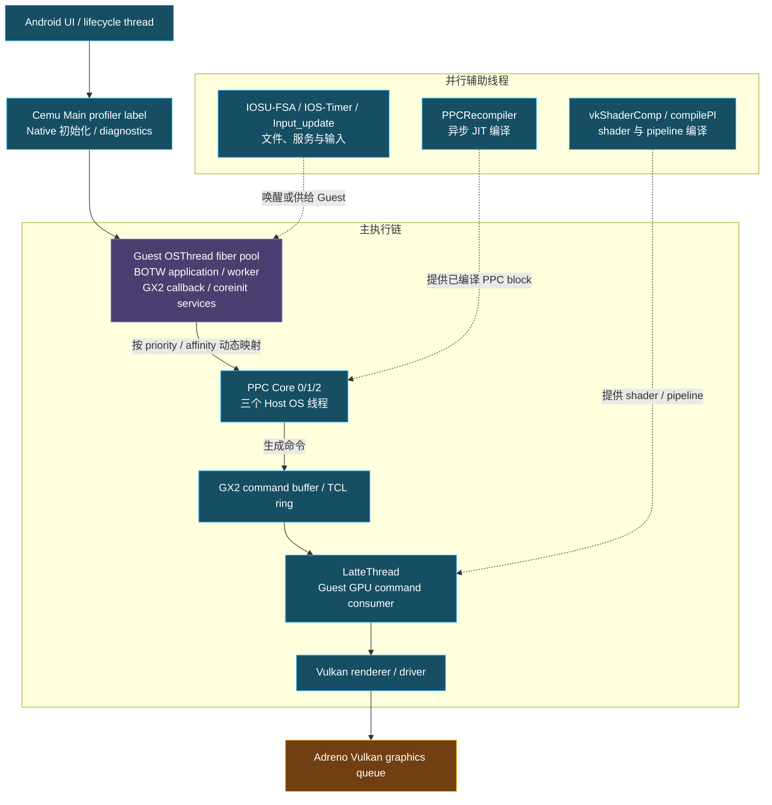

图中的 `BOTW application/worker OSThread` 是职责类别，不是本次 trace 已解析出的实际
线程名。当前证据不足以断言 BOTW 创建了多少条同类线程、各自名字是什么，或者某一条
Guest 线程在 frame `#71` 占了多少时间。

### 4.2 本次 Tracy 实际可见的线程

Profiler MCP 从当前 artifact 解码出以下六条有 Native zone 或 profiler 事件的线程。
这是一张**抓包可见列表**，不是进程的完整线程枚举：

| TID | Trace 名称 | 层级 | 作用 | 本次可得结论 |
| ---: | --- | --- | --- | --- |
| 18903 | `LatteThread` | Host CPU | 持续消费 TCL ring / indirect command buffer，模拟 Latte command processor，并调用 Vulkan renderer | `latte.command_buffer.decode` 是 frame `#71` 已观测到的 Host 关键路径 |
| 18951 | `PPC Core 0` | Host 线程 / Guest 语义 | 承载 Guest `OSThread` fiber，执行 PPC JIT/interpreter quantum | 有 Guest 活动；scope 时间戳损坏，不能量化 |
| 18952 | `PPC Core 1` | Host 线程 / Guest 语义 | 同上，代表第二个模拟 Espresso core | 同上 |
| 18953 | `PPC Core 2` | Host 线程 / Guest 语义 | 同上，代表第三个模拟 Espresso core | 同上 |
| 18778 | `Tracy Sampling` | Profiler | Tracy 自身采样/采集工作 | 只用于理解 profiler 扰动，不属于 Cemu 帧关键路径 |
| 18779 | `Tracy Profiler` | Profiler | Tracy 自身传输和处理工作 | 同上 |

`Cemu Main`、Android UI 线程、JIT/compiler、IOSU、输入、音频和 Vulkan driver worker 没有
出现在这张六线程列表中，只表示当前 20 秒窗口没有导出可被 MCP 识别的 zone/thread
事件，**不表示这些线程不存在、未运行或没有影响帧时**。如要判断 Host 抢占和调度，
下一次需同时采 Perfetto `sched_switch` 或给关键 worker 加低频顶层 zone。

### 4.3 代码中确认的关键 Host 线程

| 线程 / 线程组 | 稳态职责 | 对帧时的可能影响 | 本次是否可量化 |
| --- | --- | --- | --- |
| `Cemu Main` | diagnostics 初始化时赋给当前 Native 调用线程的 profiler label；该入口启动 profiler/DebugBus，Android 生命周期和 surface 通过 JNI 进入 Native | 该 label 不足以证明存在一条独立、常驻的 Cemu 主循环；相关工作仍可能与 PPC/Latte 争用 CPU | 否；本次未出现在 MCP 线程列表；命名点见 [`CemuDiagnostics.cpp`](../../src/Cafe/Diagnostics/CemuDiagnostics.cpp#L144) |
| `PPC Core 0/1/2` | 执行 Guest `OSThread` 的 PPC JIT/interpreter；Guest scheduler 在 fiber 间切换 | BOTW game logic 变重、Guest 同步或 Host 抢占都会延后 GX2 producer | 仅确认活动，不能可靠计时 |
| `LatteThread` / profiler 名 `Latte GPU Thread` | [`LatteCP_ProcessRingbuffer`](../../src/Cafe/HW/Latte/Core/LatteThread.cpp#L218) 循环读取 Guest GPU 命令，处理 draw/sync/flip，并在 Renderer 上记录/提交命令 | command decode、surface/resource 同步、driver 调用、等待和 command starvation 都可进入关键路径 | 是；当前最重要 |
| `PPCRecompiler` | 异步把 Guest PPC 函数编译为 Host ARM64 block | 新代码路径/JIT miss 可带来编译 CPU 竞争；未编译完时 Guest 可能回退 interpreter | 否；代码入口见 [`PPCRecompiler_thread`](../../src/Cafe/HW/Espresso/Recompiler/PPCRecompiler.cpp#L453) |
| `vkShaderComp` | 异步编译翻译后的 Vulkan shader | 新 shader 或 cache miss 可造成 CPU 峰值，必要时仍可能在消费点等待 | 否；入口见 [`CompilerThreadFunc`](../../src/Cafe/HW/Latte/Renderer/Vulkan/RendererShaderVk.cpp#L157) |
| `compilePl` | 构建 Vulkan graphics pipeline | 新材质/状态组合会增加编译工作和 CPU 竞争；warmup 的目标之一是减少该变量 | 否；入口见 [`compilePipeline_thread`](../../src/Cafe/HW/Latte/Renderer/Vulkan/VulkanPipelineCompiler.cpp#L1080) |
| `plCacheCompiler` / `plCacheWriter` / `vkDriverPlCache` | 编译、写入 Cemu stable pipeline cache 及保存 driver pipeline cache | 通常是 warmup/后台工作；写盘或编译仍可能形成干扰 | 否 |
| `IOSU-FSA` | 执行模拟 IOSU 文件系统请求，连接 Guest FS API 与 Host/WUA 存储 | BOTW 场景切换、贴图/资源流式读取或 shader cache I/O 可能出现等待 | 否；入口见 [`iosu_fsa.cpp`](../../src/Cafe/IOSU/fsa/iosu_fsa.cpp#L835) |
| `IOS-Timer` 及 IOSU service threads | 模拟 IOS 定时器和系统服务 | 可唤醒 Guest callback；通常不是 draw 主路径，但会与模拟线程并行 | 否 |
| `Input_update` | 轮询 Host 控制器并更新 Cemu input state | Guest 的 VPAD/KPAD 读取消费其状态；通常开销小 | 否；入口见 [`InputManager.cpp`](../../src/input/InputManager.cpp#L949) |
| Audio backend workers | Host audio callback/输出；Guest AX 工作仍由 PPC fiber 执行 | 音频 callback 过载会引起音频问题并争用 CPU，但本次没有归因数据 | 否 |
| Vulkan driver workers | Qualcomm driver 内部编译、提交、内存管理；数量和命名由 driver 决定 | `vkQueueSubmit`、pipeline 和内存操作可能把工作转移到这些线程 | 否；App zone 不能覆盖 driver 内部工作 |

另外，`GX2 event callback`、coreinit alarm/callback/IPC 等名字属于 Guest `OSThread_t`，
不是额外的 Host OS 线程；例如 [`GX2 event callback`](../../src/Cafe/OS/libs/gx2/GX2_Event.cpp#L247)
最终仍由 `PPC Core N` 中某条 Host 线程以 fiber 形式执行。

### 4.4 从“谁阻塞谁”看关键路径

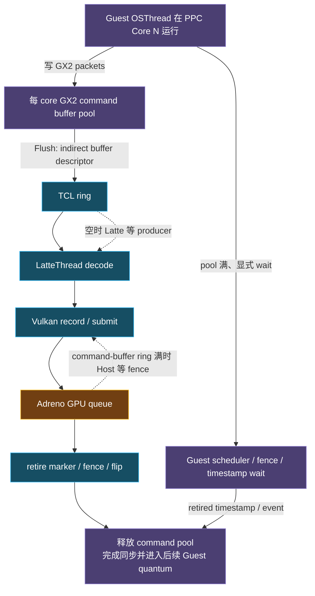

同样表现为 `LatteThread` wall time 变长，根因可能是 Host decode busy、Guest producer
没有及时供给、显式 Guest/Latte 同步、Host 被系统抢占，或 Vulkan command-buffer ring
等 GPU fence。当前 `latte.command_buffer.decode` self scope 没把这些状态分开，所以只能
把它定位为“已观测关键路径”，还不能把全部 89.481 ms 都归为纯 decode 算力开销。

## 5. 以 BOTW 为例的 Guest / Host 交互基础逻辑

### 5.1 启动阶段：从 Android 到 Guest 三核

本次对象是 BOTW v208 / DLC v80 的 WUA。Android UI 选择游戏后，JNI 入口先解析 title，
[`PrepareForegroundTitle`](../../src/android/app/src/main/cpp/NativeEmulation.cpp#L351) 建立
base/update/DLC 对应的虚拟 title 文件系统、内存空间、PPC recompiler 和 RPX；随后
[`LaunchForegroundTitle`](../../src/android/app/src/main/cpp/NativeEmulation.cpp#L390) 启动
IOSU title modules、Cemu 游戏态和 Guest scheduler。当前 BOTW 配置使用 multicore
recompiler，因此最终进入三个 `PPC Core N` Host 线程，而不是为每条 BOTW Guest 线程
创建一条 Android thread。

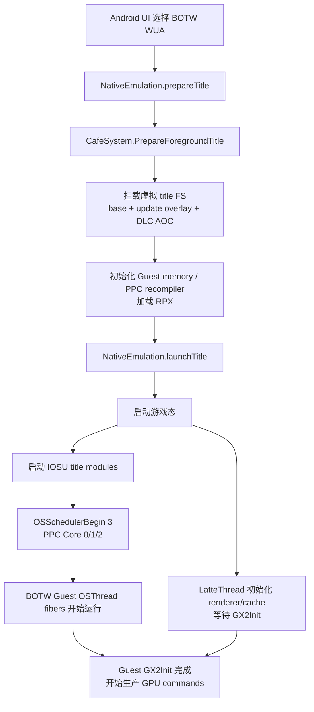

这里不是把三个目录简单拷贝到一起：base 挂载到 `/vol/content`，update 以更高优先级
覆盖同一路径，DLC 则挂载到 `/vol/aoc<TitleId>`；对应逻辑见
[`LoadAndMountForegroundTitle`](../../src/Cafe/CafeSystem.cpp#L733)。BOTW 的 Guest 代码仍按
Wii U 的 FS/GX2/coreinit 接口运行，不知道这些 Host 文件实际来自一个 WUA，也不知道
Host 图形后端是 Vulkan。

### 5.2 BOTW 稳态一帧的主链路

BOTW 一帧不是“Guest 完成后 Host 再完成”的串行函数调用。它是 producer/consumer
流水：Guest PPC 生成 GX2 命令，`LatteThread` 异步消费并翻译，物理 GPU 再异步执行；
三者通常处理不同进度的工作。

```mermaid
sequenceDiagram
    participant Guest as BOTW Guest<br/>OSThread on PPC Core N
    participant Boundary as GX2 command pool<br/>and TCL ring
    participant Host as LatteThread<br/>and Vulkan renderer
    participant Device as Adreno GPU<br/>and Android surface

    loop Guest scheduler quantum
        Guest->>Guest: JIT executes simulation / animation / visibility
        Guest->>Boundary: GX2 state, resource, draw, sync and flip
        Boundary->>Boundary: encode PM4-style packets in Guest memory
        opt display list
            Boundary->>Boundary: record list and emit indirect-buffer packet
        end
        alt buffer needs flush
            Boundary->>Host: submit descriptor + retire marker
        else pool has no safe space
            Boundary-->>Guest: wait for retired timestamp
        end
        Guest->>Guest: end quantum; scheduler switches fiber
    end

    par Host command consumption
        Host->>Host: decode state / draw / sync / flip
        Host->>Host: prepare resources, pipeline and vkCmdDraw*
        Host->>Device: batch vkQueueSubmit
    and Physical GPU execution
        Device->>Device: execute earlier submitted Vulkan work
        Device-->>Host: signal semaphore / fence / query
    end

    Host->>Device: present/blit TV or DRC scan buffer
    Host-->>Boundary: retire marker / flip / event
    Boundary-->>Guest: unblock a later Guest wait
```

图中的 `simulation / animation / visibility / render setup` 是典型的游戏职责描述，不是
本次 trace 已有的 BOTW 函数级 symbol 结论。当前抓包只能确认 Guest quantum 存在，不能
把这些职责分别计时。

### 5.3 GX2 命令如何跨过 Guest / Host 边界

PM4 packet 是 AMD GPU Command Processor 使用的有序命令包，不是某一种 draw。Latte 的
Guest command buffer 以 dword 为单位串联 packet header 与 payload；Cemu 根据 packet type
和 opcode 更新虚拟寄存器或产生 Host 操作。BotW 稳态常见类别如下：

| PM4 类别 / 示例 | Guest 作用 | Host 转换 |
| --- | --- | --- |
| `SET_CONTEXT_REG` | shader、RT、depth、blend、viewport 等上下文 | 更新 Latte state，必要时重选 pipeline/FBO |
| `SET_RESOURCE` / `SET_SAMPLER` | texture、vertex/uniform buffer、sampler | texture cache、descriptor 与 buffer binding |
| `DRAW_INDEX_2` / `DRAW_INDEX_AUTO` | 发起 indexed/non-indexed draw | `vkCmdDrawIndexed` / `vkCmdDraw` |
| `WAIT_REG_MEM` / `EVENT_WRITE` | 顺序、retirement、内存可见性 | dependency、readback completion、Host wait |
| `INDIRECT_BUFFER_PRIV` | 进入 Guest display list/子 command buffer | LatteThread 切换解码区间，不直接等同 Host submit |
| Cemu `IT_HLE_*` | 表达 GX2 HLE 与模拟器内部边界 | query、scanbuffer、surface copy、feedback 等专用处理 |

因此“每帧 6.2 万 PM4 packet、约 4 千 draw”并不矛盾。大量 packet 是状态、资源和同步；
现代 GPU 可以覆盖 draw 的 raster/tiler 工作，但 PM4 解码和 Vulkan 状态翻译仍由 Host CPU
承担。

以 BOTW 发出一批 draw 为例，边界依次是：

1. BOTW Guest 代码在某个 `OSThread_t` 上运行；承载它的 `PPC Core N` 先进入已经生成的
   ARM64 JIT block，未覆盖的剩余 cycle 才走 interpreter。
2. Guest 调用 GX2 API 时，Cemu HLE 将状态/draw/sync 编成 PM4 风格 dword。每个模拟
   core 有自己的 [`s_perCoreCBState`](../../src/Cafe/OS/libs/gx2/GX2_Command.cpp#L17)，
   packet 被写进 Guest 可见的 command pool 或 display list。
3. [`GX2Command_Flush`](../../src/Cafe/OS/libs/gx2/GX2_Command.cpp#L268) 不把整个 buffer
   复制进 ring，而是通过 [`GX2Command_SubmitCommandBuffer`](../../src/Cafe/OS/libs/gx2/GX2_Command.cpp#L222)
   提交 `IT_INDIRECT_BUFFER_PRIV` 描述符和 retire marker；
   [`TCLSubmitToRing`](../../src/Cafe/OS/libs/TCL/TCL.cpp#L132) 负责等待 ring 空间并写入。
4. `LatteThread` 的 [`LatteCP_ProcessRingbuffer`](../../src/Cafe/HW/Latte/Core/LatteCommandProcessor.cpp#L1458)
   读取 top-level ring；遇到 indirect buffer 后进入 `LatteCP_processCommandBuffer`，这正是
   当前 `latte.command_buffer.decode` scope 所在的 Host 区域。
5. draw packet 最终进入 `VulkanRenderer::draw_execute`，Host 进行 shader/pipeline、
   descriptor/resource/state 准备并记录 `vkCmdDraw*`。它对应 CPU zone
   `vulkan.draw.prepare` 和 GPU zone `vulkan.draw`，两者不是同一段执行时间。
6. Vulkan renderer 的新 command buffer 默认将 submit threshold 设为 300 recorded draw
   passes（600 的扩大批次实验因 feedback/readback wait 回退而未保留），
   也会因 readback、显式“尽快提交”等条件提前 submit。frame `#71` 观测到 4,129 draws
   和 12 次 `vulkan.submit`；由于 CPU frame marker、录制和 GPU 执行跨帧流水，不能用
   `4,129 / 300` 推导该帧应有的 submit 次数，也不能假定每批严格 300 draw。

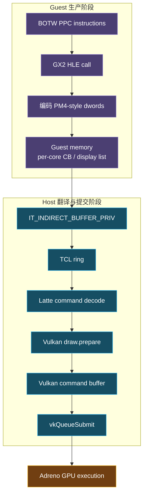

`IT_INDIRECT_BUFFER_PRIV` 的 dword 位于 Guest memory，但读取、递归展开和处理发生在 Host
`LatteThread`；所以“命令来源属于 Guest”和“decode 耗时属于 Host”必须同时成立。

### 5.4 反馈、等待与背压

Guest/Host/GPU 不是无限前冲，主要反馈环包括：

| 等待点 | 等待者 | 等待对象 | 帧分析意义 |
| --- | --- | --- | --- |
| GX2 command pool 无安全空间 | Guest `OSThread`，实际阻塞在承载它的 `PPC Core N` 调用路径 | 已提交 buffer 的 retired timestamp 更新 read pointer | Guest producer 被 GPU/Latte 消费速度反压；代码见 [`GX2Command_StartNewCommandBuffer`](../../src/Cafe/OS/libs/gx2/GX2_Command.cpp#L145) |
| TCL ring 空间不足 | 发起 `TCLSubmitToRing` 的 Guest 调用路径 | `LatteThread` 消费 ring | 可能让 Guest graphics submission 停顿；当前未独立计时 |
| TCL ring 没有命令 | `LatteThread` | Guest 继续生产/flush | 表现为 Host consumer starvation；当前没有 queue-empty zone/counter |
| GX2 wait / semaphore / flip | Guest 或 Latte command decode | Guest memory 条件、retire marker、显示时序或异步操作 | 可能落在 decode self 或 Guest scheduler wait；当前未拆分 |
| Vulkan command-buffer ring 用尽 | `LatteThread` / Vulkan renderer | GPU fence / finished command buffer | 包含于 `vulkan.submit` 父 scope，尚未单列 |
| Present / surface 生命周期 | `LatteThread` / renderer | swapchain image、Android surface 和显示时序 | 本次 present CPU scope 很小，但不能外推所有场景 |

因此“Guest 慢”既可能表示 BOTW PPC 工作本身多，也可能表示 Guest 在等 Host/GPU；
“LatteThread scope 长”既可能表示 Host busy，也可能包含等待。只有新增 queue depth、wait
reason、retire latency 和 OS scheduling 数据后，才能闭环判断方向。

### 5.5 BOTW 的非图形侧交互

图形是 frame `#71` 已观测的关键链路，但 BOTW 还有几条并行侧链：

| 侧链 | Guest 侧 | Host 侧 | 当前 trace 覆盖 |
| --- | --- | --- | --- |
| 资源/文件 | BOTW FS/IOS 请求、Guest 线程等待结果 | IOSU-FSA、WUA/Host filesystem、解压和 page cache | 无可归因 zone；场景切换时应单独观察 I/O |
| Shader/pipeline | Guest GX2 shader/state 首次出现 | shader 翻译、`vkShaderComp`、`compilePl`、stable/driver cache | worker 未出现在本次 MCP 列表；warmup 后仍需记录 cache hit/miss |
| 输入 | Guest VPAD/KPAD 读取 | Android/controller provider 与 `Input_update` | 未计时；一般不是本帧主导项 |
| 音频 | Guest AX 逻辑由 PPC fiber 执行 | Host mixer/audio backend callback | 未计时；可造成 CPU 竞争，但没有本次证据 |
| Guest OS 服务 | coreinit callback/alarm/IPC `OSThread` | PPC fiber scheduler + IOSU services | 只看到聚合 quantum，没有逐 Guest 线程归属 |

### 5.6 当前 BOTW 抓包能回答和不能回答的问题

| 问题 | 当前答案 | 证据状态 |
| --- | --- | --- |
| frame `#71` 是不是 GPU 执行时间突增？ | 不是；GPU 46.137 ms，低于全段均值 | 可验证 |
| 已观测 CPU 关键路径在哪？ | Host `LatteThread`，帧内 decode union 89.481 ms | 可验证 |
| BOTW Guest 是否同时在运行？ | 是；三个 PPC Core 有 365 个匹配 quantum | 可验证，但数值损坏 |
| 哪条 BOTW Guest `OSThread` 最慢？ | 不知道；trace 没有 Guest thread id/name 维度 | 未采集，不能推断 |
| Guest 是计算慢还是等 command pool/fence？ | 不知道 | 缺 Guest wait reason 与 queue/retire counter |
| Latte decode self 是 busy 还是 off-CPU/wait？ | 不知道 | 缺 opcode 子 scope 与 `sched_switch` |
| shader/pipeline 编译是否参与 frame `#71`？ | 不知道；相关 worker 未被当前 artifact 解码 | 不可用“未出现”证明没有参与 |
| 4,129 个 draw 是否来自某个具体 BOTW pass？ | 不知道 | 缺 render-pass/Guest marker 关联 |

这也是下一轮埋点的边界：先补可验证关联，再讨论 BOTW 某个系统、pass 或 Guest 线程的
优化，不能用一般游戏架构常识替代当前版本/当前场景的采集结果。

## 6. Frame #71 与全段、相邻帧的比较

| 指标 | Frame #71 | 198 帧平均 | 相对平均 |
| --- | ---: | ---: | ---: |
| CPU frame | 117.223 ms | 99.477 ms | **+17.84%** |
| Vulkan GPU covered | 46.137 ms | 46.773 ms | **-1.36%** |
| CPU / GPU | 2.541x | 2.137x | CPU 偏离更明显 |
| draw count | 4,129 | 3,871.7 | **+6.65%** |
| GPU zones | 4,130 | 约 3,872.7 | +6.64% |
| 最大单个 GPU zone | 6.291 ms | 非同帧均值 | 不是全段最大 10.486 ms |

相邻帧进一步说明 GPU 没有在 frame `#71` 同步恶化：

| Frame | CPU | GPU | Draws | CPU/GPU |
| ---: | ---: | ---: | ---: | ---: |
| 69 | 101.286 ms | 50.332 ms | 3,682 | 2.012x |
| 70 | 99.587 ms | 50.332 ms | 3,681 | 1.979x |
| **71** | **117.223 ms** | **46.137 ms** | **4,129** | **2.541x** |
| 72 | 99.680 ms | 48.234 ms | 4,042 | 2.067x |
| 73 | 98.295 ms | 46.137 ms | 3,863 | 2.131x |

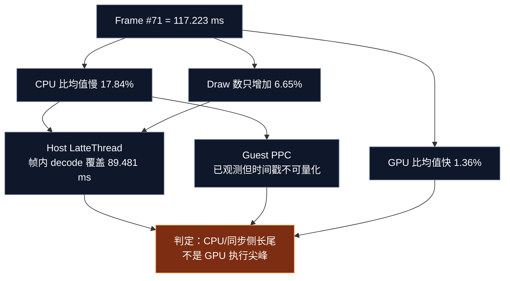

## 7. Frame #71 的端到端时序

帧的 trace-relative 边界为：

```text
start = 184,442,335,868 ns
end   = 184,559,558,576 ns
span  =     117,222,708 ns = 117.223 ms
```

以下时间均相对该帧起点：

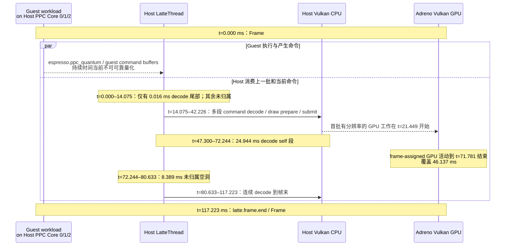

这张图表达的是同一 frame window 内的并行关系，不证明 Guest 命令在同一帧内生产并
消费，也不证明 GPU zone 与某个具体 Guest draw 一一因果对应。

## 8. Host CPU：LatteThread 细分

### 8.1 先修正 `analyze_frame` 的边界统计

Profiler MCP 的 `analyze_frame` 报告：

```text
latte.command_buffer.decode total = 115.478 ms
count = 61
```

这个 115.478 ms 是“与帧相交的 scope 的原始完整时长之和”，不是严格裁剪后的帧内
占用。其中一个 25.975 ms scope 基本位于前一帧，只在 frame `#71` 开头相交约
0.016 ms。按每个 slice 的 start/end 裁剪到 frame `#71` 后：

| 指标 | 精确帧内值 |
| --- | ---: |
| decode slice 数 | 61 |
| 裁剪后总和 / 并集 | **89.481 ms** |
| 相互重叠 | 0 ms |
| frame 覆盖率 | **76.33%** |
| 没有 decode scope 的帧内时间 | **27.742 ms** |

后续自动分析应优先使用裁剪并集，不要把 115.478 / 117.223 直接解释为 98.5% 利用率。

### 8.2 主要 decode 区间

| 相对区间 | 裁剪时长 | Tracy 原始 self | 说明 |
| --- | ---: | ---: | --- |
| 82.166–117.223 ms | **35.057 ms** | 31.691 ms | 最长段；一直延伸到 frame end |
| 47.300–72.244 ms | **24.944 ms** | 24.944 ms | 完全是未细分 self，没有命名 child |
| 18.160–38.910 ms | **20.750 ms** | 4.478 ms | 大部分可由 draw prepare / submit child 解释 |
| 14.410–18.157 ms | 3.747 ms | 1.103 ms | 短 decode burst |
| 38.917–40.489 ms | 1.572 ms | 0.193 ms | 短 decode burst |
| 80.633–82.160 ms | 1.527 ms | 0.269 ms | 紧邻最终长段 |

三个主要无 decode 区间是：

| 相对区间 | 时长 | 当前状态 |
| --- | ---: | --- |
| 0.016–14.075 ms | 14.059 ms | 未归属，可能是 Guest/Host 同步、线程调度或未埋点 Latte 工作 |
| 42.226–47.300 ms | 5.074 ms | 未归属 |
| 72.244–80.633 ms | 8.389 ms | 未归属；不能仅凭数值等于 GPU 时间戳量化步长断言原因 |

其余微小间隔合计约 0.220 ms。

### 8.3 已命名的 Host 子 scope

| Scope | Count | Total | 单次统计 | 归属 |
| --- | ---: | ---: | --- | --- |
| `vulkan.draw.prepare` | 4,129 | 16.848 ms | p50 0.002、p90 0.008、p99 0.030、max 0.244 ms | Host CPU，嵌套于 decode |
| `vulkan.submit` | 12 | 9.454 ms | p50 0.647、p90 1.322、max 2.079 ms | Host CPU / driver，嵌套于 decode |
| `Collect` | 12 | 1.096 ms | max 0.430 ms | profiler GPU query 收集，嵌套于 submit；不要重复相加 |
| `vulkan.present_blit.prepare` | 1 | 0.042 ms | 单次 | Host CPU |
| `latte.frame.end` | 1 | 0.002 ms | 单次 | frame marker，不代表整帧工作 |

全段平均每帧的 `vulkan.draw.prepare` 约 16.54 ms、`vulkan.submit` 约 10.33 ms；
frame `#71` 分别为 16.848 ms 和 9.454 ms。它们没有出现足以解释额外 17.746 ms
帧时的尖峰。因此当前优先目标不是 `vkQueueSubmit` 本身，而是 decode self 与未归属
空洞。

### 8.4 Host scope 对应源码

| Scope / 边界 | 代码入口 | 当前包含的工作 |
| --- | --- | --- |
| `latte.command_buffer.decode` | [`LatteCP_processCommandBuffer`](../../src/Cafe/HW/Latte/Core/LatteCommandProcessor.cpp#L1177) | 命令读取/dispatch、寄存器与 resource 更新、surface sync、indirect buffer、draw、wait、semaphore、flip、async sync |
| draw packets | [`IT_DRAW_INDEX_*`](../../src/Cafe/HW/Latte/Core/LatteCommandProcessor.cpp#L1263) | 进入 draw pass、normal/fast draw 路径，最终调用 renderer |
| wait / sync | [`IT_WAIT_REG_MEM`](../../src/Cafe/HW/Latte/Core/LatteCommandProcessor.cpp#L1297)、[`IT_MEM_SEMAPHORE`](../../src/Cafe/HW/Latte/Core/LatteCommandProcessor.cpp#L1314)、[`IT_HLE_WAIT_FOR_FLIP`](../../src/Cafe/HW/Latte/Core/LatteCommandProcessor.cpp#L1365) | 可能在 decode self 内等待；当前没有独立 zone |
| `vulkan.draw.prepare` | [`VulkanRenderer::draw_execute`](../../src/Cafe/HW/Latte/Renderer/Vulkan/VulkanRendererCore.cpp#L1747) | pipeline/resource/state 准备，记录 `vkCmdDraw*`；同时建立 GPU `vulkan.draw` zone |
| `vulkan.submit` | [`VulkanRenderer::SubmitCommandBuffer`](../../src/Cafe/HW/Latte/Renderer/Vulkan/VulkanRenderer.cpp#L2251) | end render pass、query collect、`vkEndCommandBuffer`、`vkQueueSubmit`、finished buffer 处理和下一个 command buffer 获取 |
| command-buffer fence wait | [`WaitForNextFinishedCommandBuffer`](../../src/Cafe/HW/Latte/Renderer/Vulkan/VulkanRenderer.cpp#L2234) | command buffer ring 用尽时等待 fence；当前只包含在 submit 父 scope 中 |
| present | [`DrawBackbufferQuad`](../../src/Cafe/HW/Latte/Renderer/Vulkan/VulkanRenderer.cpp#L3390) | swapchain acquire、barrier、backbuffer blit |
| frame mark | [`LattePerformanceMonitor_frameEnd`](../../src/Cafe/HW/Latte/Core/LattePerformanceMonitor.cpp#L11) | 更新统计并发出 Tracy frame end |

`latte.command_buffer.decode` 的 self time 是 wall-clock scope time，不等价于 on-CPU
执行时间。Tracy session 没有可用的 `sched_switch` 分析，所以当前无法区分 busy、sleep、
yield、preempted 或等待 Guest/GPU。

## 9. Guest CPU：可以关联什么，暂时不能断言什么

Guest scope 位于 [`__OSFiberThreadEntry`](../../src/Cafe/OS/libs/coreinit/coreinit_Thread.cpp#L1382)。
`espresso.ppc_quantum` 包围：

1. `PPCRecompiler_attemptEnterWithoutRecompile`：优先进入已生成的 JIT block；
2. 未消耗完的 guest cycle：用 `PPCInterpreterSlim_executeInstruction` 继续解释执行；
3. scope 结束后才进入 reservation reset 和 OS scheduler reschedule。

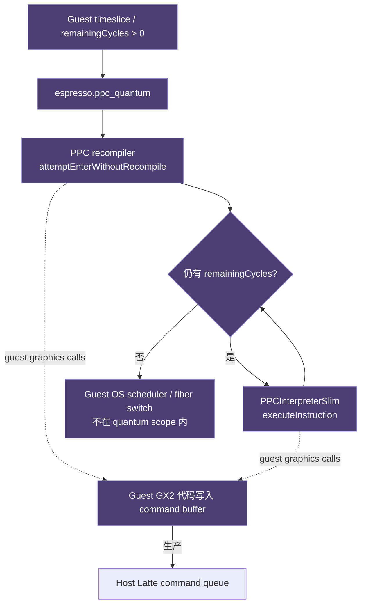

本帧可确认：

- `PPC Core 0/1/2` 都有 `espresso.ppc_quantum`；
- MCP 在 frame query 中匹配到 365 个 quantum scope；
- Guest workload 与 Host Latte/GPU 并行存在。

本帧**不能**使用以下数值做结论：

- `espresso.ppc_quantum totalMs=664690414276.934`；
- `maxMs=94955771214.205`；
- 三核 `selfMs=545.355` 的直接求和。

原因是 live Tracy import 出现异常巨大、递归嵌套的 quantum scope，时间戳明显超过
本次进程/采集寿命；而三个 PPC 线程本来也并行，求和不会得到 frame wall time。
MCP diagnostics 同时说明 callstack payload/sample 尚未导出，硬件采样 IP 也未完成
symbolization 和 CPU-zone attribution。

因此当前 Guest 结论应写为：**Guest 可能参与了 Host command starvation、同步等待或
本身的 CPU critical path，但 frame #71 的现有数据不能对 Guest 与 Host 的 wall time
占比排序。**

## 10. Host GPU：执行量和与 Host CPU 的重叠

Frame `#71` 的 GPU 结果为 high confidence，4,130 个 GPU zones 全部使用真实
`gpu-time`，没有 CPU-submit fallback：

| 指标 | 值 |
| --- | ---: |
| GPU covered time | **46.137 ms** |
| 占 frame window | 39.36% |
| `vulkan.draw` | 4,129 zones，46.134 ms |
| `vulkan.present_blit` | 1 zone，解析为 0 ms |
| 帧内有非零时长的 zone | 19 |
| 解析为 0 的 zone | 4,111 |
| 有效 GPU 活动跨度 | t=21.449–71.781 ms |
| 最大 draw zone | 6.291 ms，t=42.421–48.712 ms |
| 次大 draw zone | 4.194 ms，t=31.935–36.130 ms |
| 其他非零 draw zone | 主要为 2.097 ms |

GPU timestamp 呈明显的约 2.097 ms 量化步长。4,111 个单 draw zone 为 0 不表示这些
draw 免费，只表示当前 GPU 查询/时间戳分辨率不足以逐 draw 分辨。适合本次结论的是
整帧 covered time、活动跨度和大 zone，不是单 draw 平均。

从 CPU 上记录 GPU marker 到 GPU 实际开始的差值，在 19 个非零 zone 上平均为
17.599 ms、p50 为 20.586 ms、最大 28.895 ms。这个差值包含 Vulkan command buffer
继续录制、等待批量 submit 和 GPU queue 排队，不能直接解释成单独的
`vkQueueSubmit` 调用耗时。

Frame `#71` 的 frame-assigned GPU 活动约在 t=71.781 ms 结束，而 Host 最后一段 decode
从 t=82.166 ms 持续到 t=117.223 ms。即使考虑跨帧流水和关联误差，GPU 也没有呈现
“一直忙到 frame end”的形态，进一步支持 CPU/同步尾部而非 GPU 尖峰的判断。

## 11. 新增埋点与下一轮验证顺序

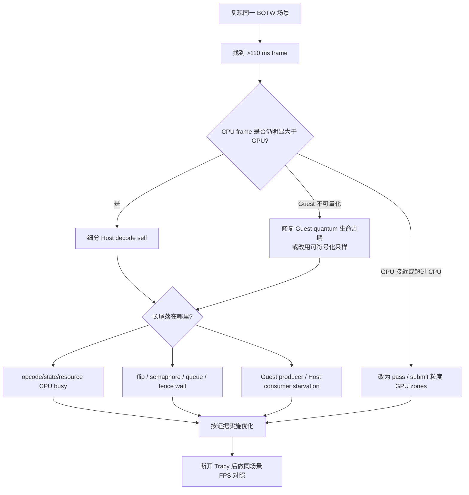

### 11.1 本轮已补的共享 C++ 标签

这些标签同时用于 Android 与桌面端，Foundation profiler 是硬依赖，不再存在条件
关闭分支。标签优先覆盖 frame `#71` 中仍未归类的长段，且
没有继续增加逐 draw 事件：

| 域 | 新增 scope / counter | 要回答的问题 |
| --- | --- | --- |
| Guest 执行 | `cemu.guest_quanta_per_frame`、`cemu.guest_jit_entries_per_frame`、`cemu.guest_interpreter_instructions_per_frame` | 每帧 JIT 命中与 interpreter fallback 的语义工作量 |
| Guest 编译 | `espresso.recompiler.compile` 及 discover/IML/optimize/codegen/activate 子阶段 | 长帧是否与首次编译或某个编译阶段重叠 |
| Guest 失效 | `espresso.recompiler.invalidate` | RPL/codegen/调试失效是否造成重复编译 |
| Guest 背压 | `cemu.gx2_command_pool_wait_count`、`cemu.gx2_command_pool_last_wait_us` | Guest 是否在等 command buffer 退休 |
| Guest → Host ring | `cemu.tcl_ring_*`、`cemu.latte_command_ring_*` wait counters | producer 被塞满，还是 consumer 因无命令而饥饿 |
| Latte decode | `latte.draw_pass.decode`、surface/copy/clear、scanbuffer scopes | decode self time 是否落在 draw pass、资源或 scanbuffer 操作 |
| Latte 同步 | `latte.sync.wait_reg_mem`、`.mem_semaphore_wait`、`.wait_for_flip`、`.async_*` | 尾部是 CPU busy 还是 Guest/GPU 同步等待 |
| Vulkan 生命周期 | `vulkan.command_buffer.process_finished`、`.wait_for_fence` | command buffer 回收是否阻塞 Host |
| Vulkan submit | `vulkan.submit.*` 子阶段 | collect/end/queue-submit/recycle 哪一段变长 |
| 后台编译 | `vulkan.shader.compile`、`vulkan.pipeline.compile`、`vulkan.pipeline_cache.compile/write` | shader/pipeline worker 是否与长帧竞争 CPU |
| IOSU | `iosu.fsa.request` | 流式读取是否形成并发 I/O 尖峰 |

Guest fiber 可以迁移到另一条 Host PPC core 线程，长期等待也可能跨越 Tracy 采集
边界。因此 Guest quantum、GX2 pool wait、TCL ring wait 和 Latte command-ring idle
都使用有限语义计数或在等待完成后提交 counter，不使用可能在另一 Host 线程结束、或
在采集结束时仍未闭合的普通 RAII zone。下一轮应先验证这些名称确实出现在
RelWithDebInfo trace 中，再依据结果决定第二轮埋点。

### 11.2 Host 后续补点

不要继续给每个 draw 增加更多 Tracy zones；本次已有约 3,870–4,129 draw/帧，逐 draw
事件本身会放大采集开销。优先使用少量 scope + per-frame aggregate counter：

1. 将 `latte.command_buffer.decode` self 拆为：command fetch、opcode dispatch、
   state/resource update、normal draw、fast draw、sync/wait、flip/vsync、async command。
2. 为 `IT_WAIT_REG_MEM`、`IT_MEM_SEMAPHORE`、`IT_HLE_WAIT_FOR_FLIP` 和
   `IT_HLE_SYNC_ASYNC_OPERATIONS` 分别累计次数和总 wall time。
3. 每帧记录 command words、opcode 分类数、indirect-buffer 数/最大深度、normal/fast
   draw 数，判断 4,129 draws 是工作量上涨还是同样工作变贵。
4. 将 `vulkan.submit` 拆为 query collect、`vkEndCommandBuffer`、`vkQueueSubmit`、
   `ProcessFinishedCommandBuffers`、`WaitForNextFinishedCommandBuffer`。
5. 增加 Latte command queue depth / empty-wait 时间，直接区分 Host busy 和 Guest
   producer starvation。

### 11.3 Guest 后续补点

1. 用每帧 `guest_quanta`、`guest_jit_entries` 和 `guest_interpreter_instructions` 判断 JIT
   命中及 fallback；这些是语义工作量，不把它们误写为 Guest wall time。
2. 后续再补 JIT miss/leave、成功编译 block 和 guest scheduler 计数；若要恢复 Guest
   wall-time zone，必须先由 Foundation 提供并验证 Tracy fiber-aware 生命周期。
3. 将已有 hardware sample IP 用 APK 内未剥离符号完成 symbolization，并按 PPC core /
   LatteThread 归属。
4. 如需判断阻塞/抢占，增加 Perfetto `sched_switch` 辅助采集；Tracy zone wall time
   单独无法区分 on-CPU 和 off-CPU。

### 11.4 GPU 后续补点

1. 保留 `vulkan.draw`，但正式性能基线建议降采样或增加 render-pass / command-buffer
   粒度 zone，避免每帧四千多个 query。
2. 记录每个 submit 的 draw 数、GPU covered time、CPU marker→GPU start latency。
3. 继续以整帧 GPU covered time 判断 GPU 上限；不要按 0 ms 的单 draw zone 排热点。

### 11.5 最新埋点验证结果

最新 Android RelWithDebInfo 构建在 AYANEO Pocket DS 上完成完整默认 warmup，并通过
截图确认 BOTW v208 已进入初始神庙的可操作 gameplay。正式 Tracy 窗口为 20 秒、
198 个 frame-set 帧，session 为 `s6`。启动和菜单阶段不参与以下结论。

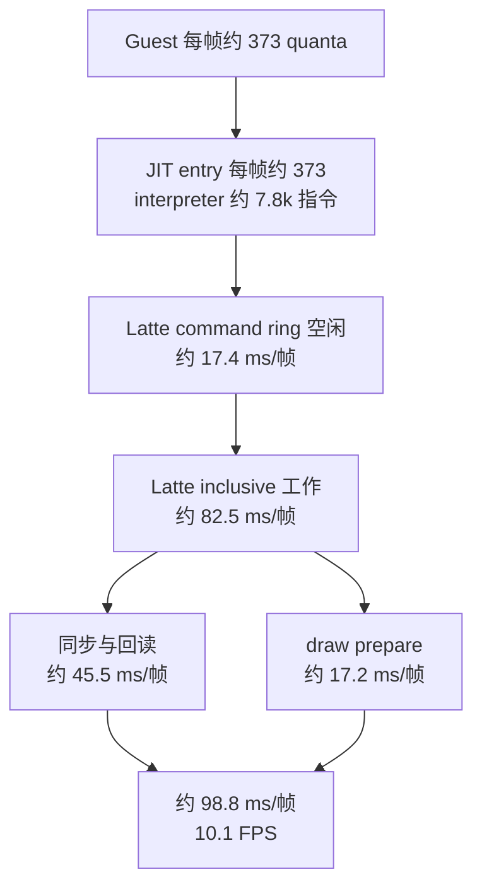

Guest counter 均为有限值：每帧平均 373.4 quanta、372.9 次 JIT entry 和 7,795.6
条 interpreter 指令。JIT entry / quantum 约为 99.85%；20 秒内只有 7 次 recompiler
job、合计 40.040 ms。因此当前稳态低帧率不是 interpreter fallback 或持续编译主导，
AOT 也不是解决这组数据的第一优先级。

Host 的 181 帧有界区间中，`latte.command_buffer.decode` inclusive 平均约
82.51 ms/帧，主要具名子项为：

| Host 子项 | 约每帧 | 说明 |
| --- | ---: | --- |
| `latte.sync.async_readback` | 24.80 ms | GPU readback / fence 路径 |
| `latte.sync.wait_reg_mem` | 20.65 ms | Guest/Host 寄存器内存同步 |
| `vulkan.draw.prepare` | 17.17 ms | 约 3.87k draws 的 CPU 准备 |
| `vulkan.submit` | 11.59 ms | inclusive；最大子项为 recycle |
| `latte.scanbuffer.swap` | 4.02 ms | 呈现路径 |

Latte command ring 另记录到 579 次已完成空闲等待，合计 3,480,999 微秒，折算约
17.4 ms/帧。它与 82.5 ms Latte 工作基本闭合约 100 ms 帧时间，但只能说明 Host
consumer 等待 Guest producer，不能直接证明 Guest PPC CPU 饱和。

最长帧 `#22` 为 118.824 ms，其中 `wait_reg_mem` 26.426 ms、async readback
25.513 ms、fence wait 25.505 ms、draw prepare 18.864 ms；次长帧 `#147` 具有相同
形态。这说明最长帧来自重复出现的同步等待和高 per-draw Host 成本，而不是偶发编译
尖峰。

本次 GPU timestamp 虽匹配到 773,894 个 zone，但抽查 zone 的起止 timestamp 完全
相同，GPU 耗时均为 0 ms；因此本构建只能确认 Host 在 fence/readback 上等待，不能
据此判断 GPU 是否实际饱和。后续必须先修复 timestamp/query 生命周期，并将 GPU zone
从逐 draw 降为 pass/submit 粒度，再给出新的 GPU 排名。

完整采集标识、APK hash、截图、counter 和最长帧表见
[`performance-profiler.md`](../verification/20260801-C5/performance-profiler.md)。

### 11.6 BotW Guest tag 驱动的 Host 快速通道候选

现有 `patch_guest_profiler.asm` 在 BotW v208 的 PPC 函数入口和返回点调用
`coreinit.hook_ProfileSectionBegin/End`。这条 HLE 调用发生在承载 Guest `OSThread` 的
`PPC Core N` 上；它能说明 `drawTV`、`postDrawTV` 等 Guest 阶段何时运行，但不会自动
随 GX2 command buffer 进入 `LatteThread`，也不会减少 PM4 解码、Vulkan draw prepare、
submit 或 fence/readback 成本。因此它当前是定位工具，不是渲染快速通道。

后续若为 BotW 增加专有 Host 快速通道，应按以下证据链推进：

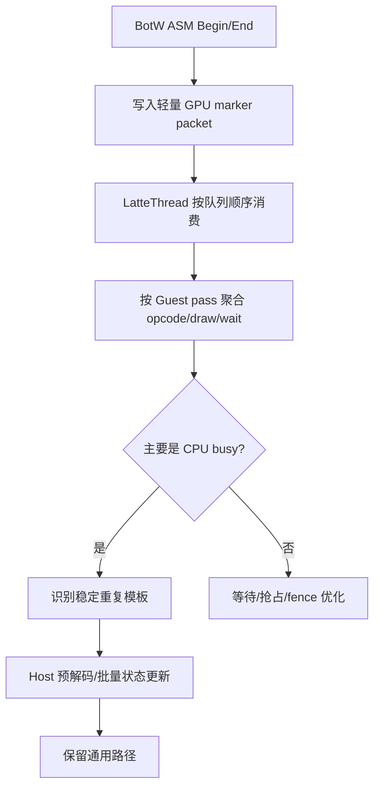

第一步不是缓存 Vulkan command buffer，而是新增一个 Cemu 私有、无 GPU 副作用的
marker packet：Guest ASM/HLE 只写入固定 section ID，`LatteThread` 在原命令顺序中消费
并切换当前 pass。Profiler 再按 pass 聚合 command words、opcode 数、normal/fast draw、
surface transition、wait 和 submit；这样才能把 Guest 的 `PPCSystemTaskDrawTV` 与 Host
实际消费到的工作关联起来，而不是用两条并行时间线猜测因果。

只有同时满足下列条件，才进入 BotW 专有预解码或模板缓存：

- 同一 section 内存在跨帧重复且可稳定识别的 indirect command buffer；
- 实测成本来自 opcode dispatch、寄存器状态翻译或资源查找，而不是
  `wait_reg_mem`、async readback、fence wait、ring empty 或 OS off-CPU；
- 模板的动态字段、Guest 内存依赖、surface serial、shader/pipeline key 和失效条件可完整
  列举；任一条件变化都回退通用 decode；
- 快速路径与通用路径可逐帧抽样对比最终寄存器状态、draw 参数和 RenderDoc 输出。

可优先评估的实现从低风险到高风险依次是：相同状态写入去重、批量 opcode dispatch、
已验证 indirect buffer 的预解码 IR、BotW 固定 pass 的模板实例化。直接复用已录制 Vulkan
command buffer 风险最高，因为 descriptor、image layout、alias、同步和动态资源生命周期
都可能跨帧变化，当前不作为首选。

明确不进入专有快速通道的边界包括：wait/semaphore/flip、readback、query、动态 Guest
内存写入、texture alias/reinterpret、surface family 或 scale generation 变化、shader/pipeline
尚未稳定，以及任何未被 marker 覆盖的命令。专有路径必须是可关闭、可诊断的增量优化，
不能替换通用 Cemu 语义。

当前优先级仍是先修复 GPU pass/submit 时间戳，并完成 marker→Latte 顺序关联。最新数据中
每帧约 24.80 ms async readback、20.65 ms `wait_reg_mem`、17.17 ms draw prepare；这些数字
说明“全部 82.5 ms decode 都可以用模板缓存消除”是不成立的。

### 11.7 Guest→Host 命令与帧尾同步归属

在 Android RelWithDebInfo 上完成默认 warmup、确认进入 BotW v208 初始神庙后，新增的
HLE 调用点归属计数器把 Guest section、GX2 command buffer、帧尾同步和 Host Latte 工作
串到了一条证据链。正式窗口为 Tracy session `s28`，参数 15 秒、147 个 frame-set 帧；
采集前 `guest_profiler_reset` 已成功，采集后 section 配对错误均为 0。断开 Tracy 后同一
画面的状态层为 12.0 FPS / 83.16 ms，采集时逐 draw CPU/GPU zone 会把典型帧放大到约
98～101 ms，因此本节用 trace 判断耗时归属，不用连接态 FPS 代替真实性能。
本轮目标是验证调用归属，不宣称满足下文“最长帧结论至少连续 20 秒”的完整退出标准。

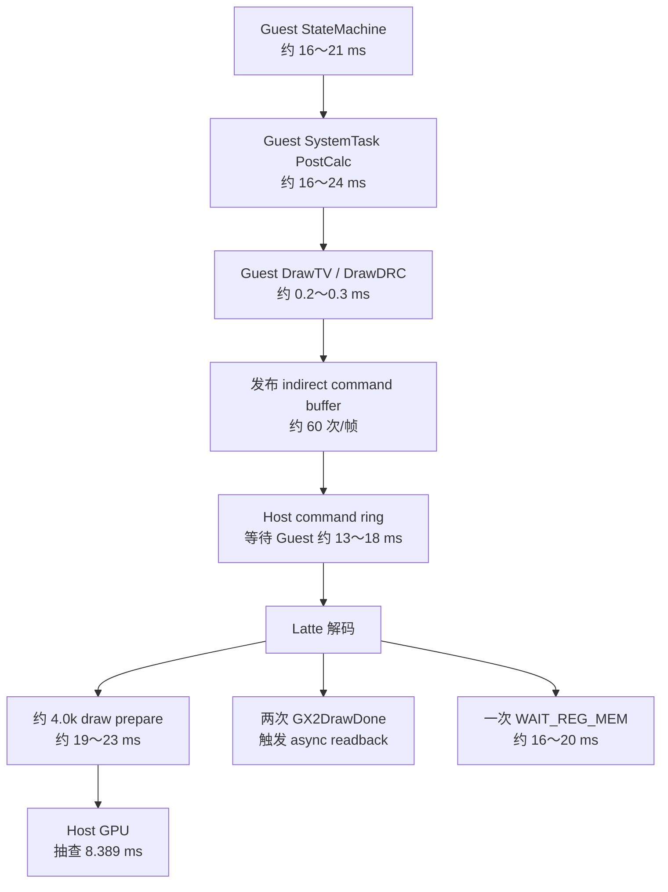

这些分支可能在不同 Host/Guest 线程上重叠，图只表达因果和队列顺序，不能把所有毫秒
直接相加。

#### 命令提交归属

`GX2Command_SubmitCommandBuffer` 现在读取当前 Guest `OSThread` 上仍活动的 profiler
section，并按 section 累计 submission、word 数和 Guest LR。session `s28` 的 counter
差值如下：

| 归属 | submission 事件 | command words 差值 | words 占比 |
| --- | ---: | ---: | ---: |
| `PPCSystemTaskDrawTV` | 5,215 | 20,687,936 | 99.41% |
| `PPCSystemTaskDrawDRC` | 3,129 | 106,968 | 0.51% |
| 未归属 | 596 | 15,456 | 0.07% |
| 总计 | 8,940 | 20,810,440 | 100%（舍入） |

按 149 个 Guest 帧折算约 60 次 submission、139.7k words/帧，其中 DrawTV 约 35 次、
DrawDRC 约 21 次、未归属约 4 次。这里的 words 是 Guest 共享内存中 indirect command
buffer 的 `uint32` 长度，不是 Guest 每帧复制到 Host 的字节数；`DrawTV` 自身只有约
0.1～0.3 ms，说明它主要发布指针与长度，约四千次 draw 的 PM4 解码和 Vulkan 状态准备
发生在后续 `LatteThread`。

因此“Guest→Host 数据传输集中在 rendering”需要改写为更准确的结论：99% 以上的命令
描述量确实在 `DrawTV` scope 内发布，但成本不是一次大 memcpy，而是 Host 随后逐条消费
命令、维护状态、准备 draw 和执行同步。

#### 帧尾三类 Guest HLE 调用点

新埋点记录了 `GX2SetGPUFence`、`GX2DrawDone` 和 `GX2SwapScanBuffers` 进入 Host HLE 时
的 Guest LR。稳定窗口结果没有歧义：

| 事件 | 次数 | Guest LR | 每 Guest 帧 |
| --- | ---: | --- | ---: |
| `GX2SetGPUFence` | 149 | `0x031FAB04` | 1 |
| `GX2DrawDone`，第一处 | 149 | `0x031FAA14` | 1 |
| `GX2SwapScanBuffers` | 149 | `0x031FAB20` | 1 |
| `GX2DrawDone`，第二处 | 149 | `0x031FAB24` | 1 |

LR 是 Guest `bl` 返回地址，所以实际 call instruction 分别位于 LR 前 4 字节。它们组成
下面的 BotW 帧尾序列：

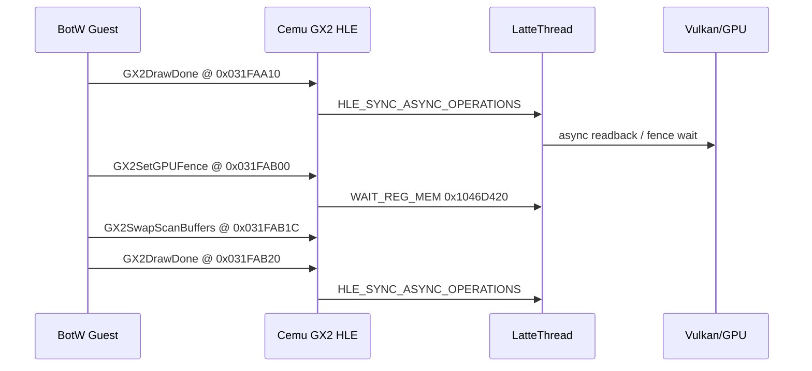

`GX2DrawDone` 在 Vulkan 路径会强制写入 `IT_HLE_SYNC_ASYNC_OPERATIONS`、flush command
buffer，再等待最后 timestamp。session `s28` 中它有 298 个闭合 HLE scope，累计
6,887.7 ms，平均约 23.1 ms/次；Host 同时记录 299 次 async operation、累计
3,161.0 ms。单帧 #70 中两次完整 DrawDone 依次约 25.27 ms 与 21.98 ms，Host
async readback 为 25.12 ms。Guest HLE scope 与 Latte 工作发生在不同线程，不能把两者
相加，但调用次数、顺序和时间相关性证明了 full-sync/readback 由这两次帧尾调用触发。

`GX2SetGPUFence` 每帧一次，固定物理地址 `0x1046D420`。Host 初值长期为 reference-2，
最终值等于 reference；session `s28` 的 `wait_reg_mem` 为 149 次、累计 2,958.1 ms，平均
约 19.85 ms。它等待的是 Guest/CPU 可见内存达到目标值，不是逐次等待约四千个 draw。
下一轮应通过 IDA/runtime watchpoint 找出谁写 `0x1046D420`，再判断它是必要 job barrier、
保守轮询，还是可由事件唤醒替代。

#### 与 BetterVR 优化补丁的静态对齐

BetterVR 的 `patch_RND_StereoRendering_Optimizations.asm` 恰好执行：

- `0x031FAA10 = nop`，移除第一处 pre-swap `GX2DrawDone`；
- 在 `0x031FAB1C` 替换原 `GX2SwapScanBuffers` 调用；
- wrapper 内先 swap、再调用一次 `GX2DrawDone`，返回 `0x031FAB24`。

因此“BotW 每帧两次 DrawDone，其中第一处可能冗余”已经同时拥有动态 trace 与静态 mod
参考。它是当前收益最大的 BotW 专项实验候选，但不能直接当作通用 Cemu 优化：正式启用
前必须做单独 Graphic Pack A/B，检查 readback/query、画面正确性、长时间稳定性和
RenderDoc 帧输出；通用 Host 路径仍保留两次调用的原始语义。

#### 当前瓶颈优先级

1. 先做 BotW `0x031FAA10` pre-swap DrawDone 的可关闭 A/B 实验；理论上最多移除一条
   约 20～25 ms 的 Guest 等待链，但实际收益受两次 full-sync 重叠和 GPU 完成度限制。
2. 用 debugger/IDA 找 `0x1046D420` 的 Guest writer，解释每帧约 20 ms 的
   `WAIT_REG_MEM`，不能只优化 Host 忙轮询表象。
3. 在 `PPCSystemTaskPostCalc` 内只对已静态验证的高成本子调用补 tag；它稳定约
   16～24 ms，但函数含大量 callsite，不应盲目批量 detour。
4. 为 DrawTV→Latte 增加 command-stream marker，按 Guest pass 聚合约四千次 draw；
   当前 draw prepare 仍约 19～23 ms，是独立于帧尾同步的 CPU 成本。
5. GPU frame #70 covered time 为 8.389 ms，且 Render/Texture 均为 1x；当前场景首先是
   Guest/Host CPU 与同步受限，不应先以扩大 GPU 分辨率或 GPU shader 优化作为主线。

## 12. 后续退出标准

下一次声称“定位/修复最长帧”前，至少满足：

- 使用同一设备、BOTW 场景和 Android RelWithDebInfo；
- warmup 完成且截图确认处于可操作 gameplay；
- 至少 20 秒采集，保留 frame count、trace hash 和 artifact id；
- 分别报告 Guest、Host CPU、Host GPU，不能把并行线程耗时相加；
- frame 范围使用裁剪后的 scope union，不能用跨帧 scope 的原始全长；
- 明确区分 CPU busy、OS off-CPU、Guest/Host queue wait 和 GPU fence wait；
- 同时提供 Tracy 连接态和断开态 FPS，量化 profiler perturbation；
- 对比 p50/p90/p95/p99、最慢帧和相邻帧，不能只看单一截图；
- 若 Guest 时间戳仍异常，结论必须保持“Guest 未量化”，不得用推断补数。

## 13. Profiler MCP 查询记录

本文基于以下查询类型：

```text
load_trace_artifact(artifact_id=..., keep_session=true)
analyze_frame(session_id=s4, frame_index=71)
analyze_frame_detail(session_id=s4, frame_index=71)
find_top_slices(session_id=s4, frame #71 time range, name_filter=...)
analyze_gpu_frames(session_id=s4, time_source=gpu-time)
get_gpu_timeline(session_id=s4, frame 71, time_source=gpu-time)
query_counter(session_id=s4, counter_name=...)
get_import_diagnostics(session_id=s3/s4)
```

概要报告与全段统计见
[`performance-profiler.md`](../verification/20260801-C5/performance-profiler.md)。
AOT 的成本、适用边界与推荐的 eager JIT 路径见
[`cemu-aot-assessment.md`](cemu-aot-assessment.md)。
