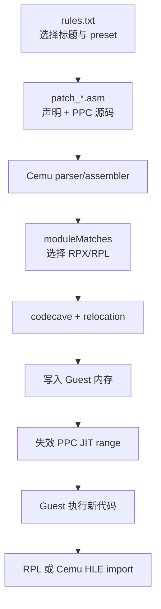
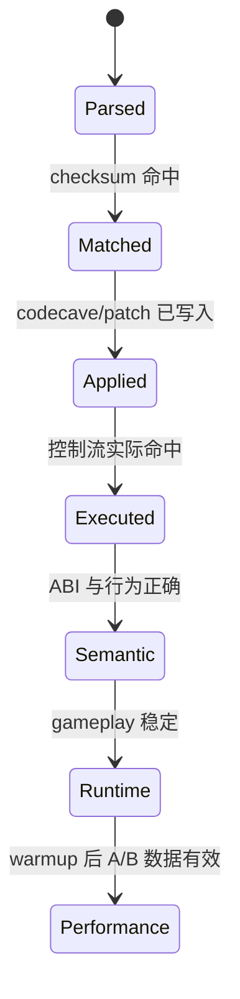
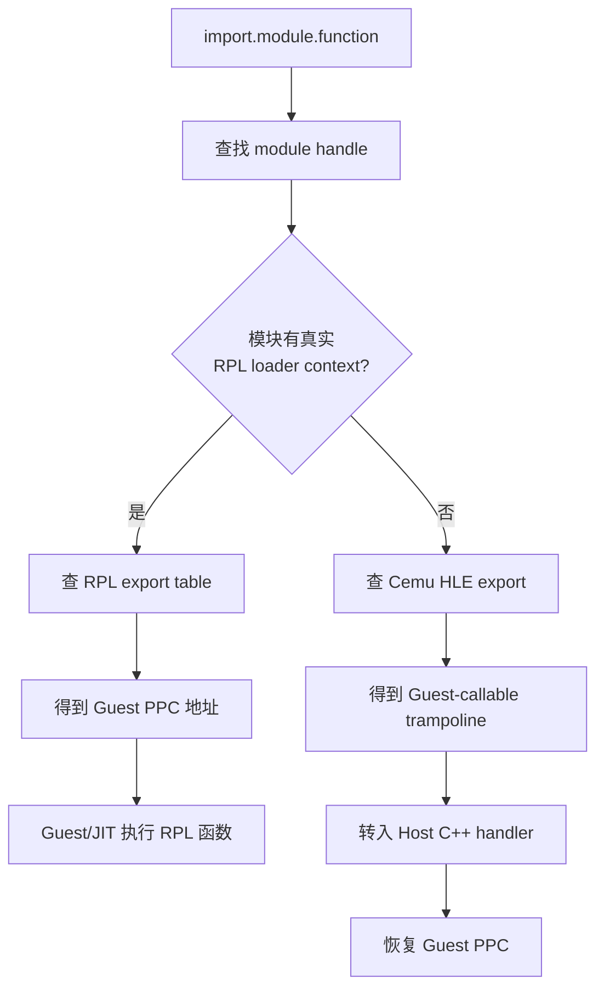
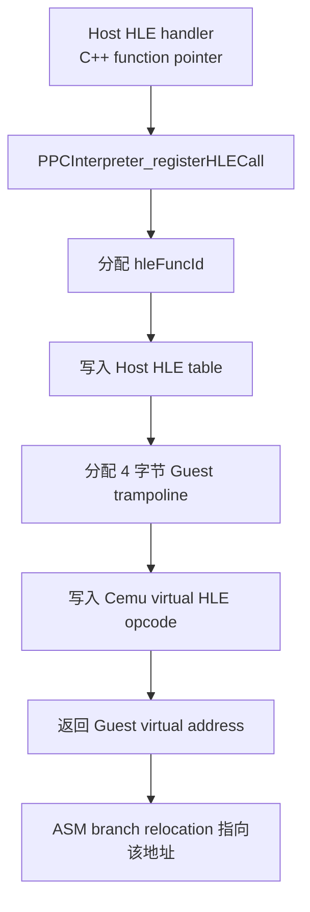
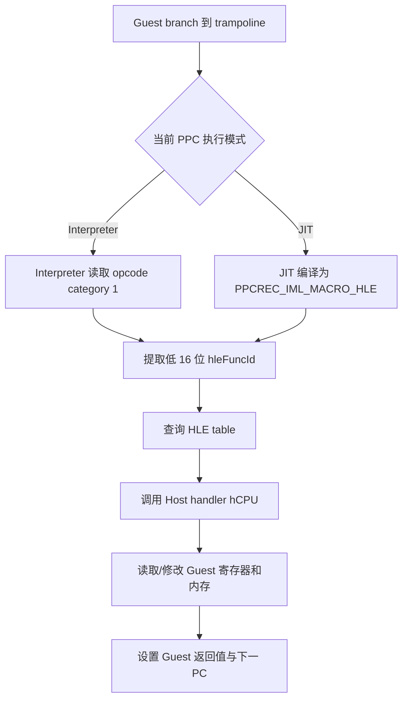
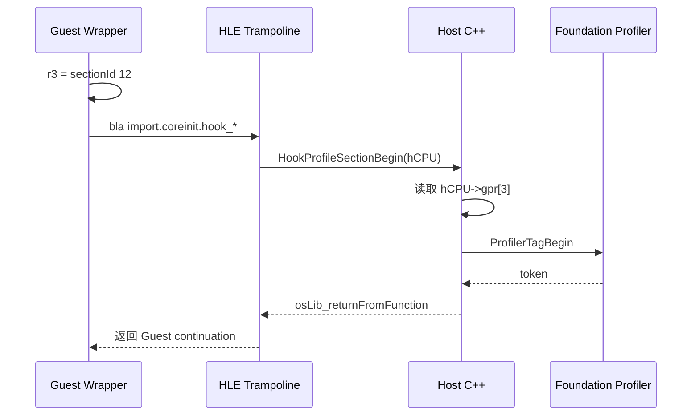
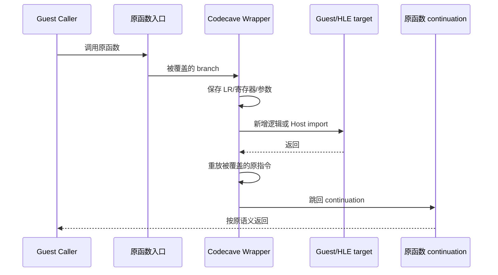

# Cemu Graphic Pack `patch_*.asm` 声明与运行模型

## 1. 定位

Cemu 的 `patch_*.asm` 是一种**带声明式加载信息的运行时 PowerPC assembler/patch
loader 输入**。它不是只供人阅读的 hook 清单，也不是离线修改 RPX、RPL 或 WUA 的通用
二进制 patcher。

一份文件可以同时包含三种内容：

1. 加载声明：补丁组、目标模块、放置位置和生命周期 callback；
2. 汇编与链接信息：PPC 指令、数据、label、变量、表达式、重定位和 import；
3. 真实 patch：在指定 Guest 地址生成数据或指令，或者把原函数入口改跳到 codecave。



因此最准确的描述是：

> 声明负责告诉 Cemu “何时、对哪个模块、把什么放在哪里”；assembler 和 patch applier
> 负责生成真实 PPC 机器码并写入 Guest 地址空间。

## 2. 与 Graphic Pack 其他文件的关系

| 层级 | 常见文件或声明 | 职责 |
| --- | --- | --- |
| Pack 选择 | `rules.txt` | 标题 ID、版本、preset、默认启用状态和 UI 选项 |
| Module 选择 | `moduleMatches` | 用 Cemu patch checksum 选择当前 RPX/RPL |
| Guest patch | `patch_*.asm` | 生成并写入 PPC 指令或 big-endian 数据 |
| 外部符号桥 | `import.<module>.<function>` | 调用 Guest RPL export；解析到 HLE export 时才跨入 Host |
| Renderer 资源 | shader/texture 规则等 | 在 Graphic Pack 的其他路径修改渲染资源或参数 |

Cemu 会搜索同一 Graphic Pack 中的 `patch_*.asm`。只要存在这种文件，就不再为该 Pack
加载旧式 `patches.txt`。新工作应使用 `patch_*.asm`，不要同时维护两套等价 patch。

## 3. 解析、应用和执行不是同一件事



- `parsed`：语法和单条 PPC 指令能被 assembler 接受；
- `matched`：当前模块的 Cemu patch checksum 命中；
- `applied`：完成重定位并写入 Guest 内存；
- `executed`：断点、counter 或 HLE 日志证明新路径实际执行；
- `semantic`：寄存器、返回值、内存副作用和游戏行为符合预期；
- `runtime`：目标场景长时间运行且禁用补丁后可恢复；
- `performance`：完整 warmup 后取得可比较数据。

`Applying patch group` 最多证明 `applied`，不能代替后面四级验证。

## 4. 声明与语法速查

| 语法 | 类别 | 作用 | 是否直接写 Guest 内存 |
| --- | --- | --- | --- |
| `[GroupName]` | 声明 | 开始一个 Patch Group，并重置当前 origin | 否 |
| `moduleMatches = 0x12345678` | 声明 | 只匹配指定模块 checksum | 否 |
| `moduleMatches = crc1, crc2` | 声明 | 同一 group 支持多个已验证模块 | 否 |
| `moduleMatches = rpx` | 声明 | 宽泛匹配当前标题主 RPX | 否 |
| `.origin = codecave` | 布局 | 从本 group 的 codecave 偏移继续布置代码/数据 | 间接 |
| `.origin = 0xADDRESS` | 布局 | 后续内容从指定模块地址连续布置 | 后续行会写 |
| `0xADDRESS = <instruction/data>` | Patch | 只对当前行临时指定写入地址 | 是 |
| `Label:` | 符号 | 把 label 绑定到当前 origin | 否 |
| `0xADDRESS = Label:` | 符号 | 把 label 绑定到明确 Guest 地址 | 否 |
| `Name = expression` | 符号 | 定义整数变量或别名 | 否 |
| `$presetName` | 外部变量 | 读取当前 `rules.txt` preset 值 | 取决于使用位置 |
| `.callback entry Symbol` | 生命周期 | 游戏 main 前由 Cemu 调用该 Guest symbol | callback 会执行 |
| `import.mod.func` | 重定位符号 | 解析 Guest RPL/HLE export 地址 | 调用时进入目标 |
| PPC 指令 | 机器码 | 汇编为 4 字节 PPC 指令 | 是 |
| 数据 directive | 数据 | 生成 big-endian 数值、字节或字符串 | 是 |
| `.align N` | 布局 | 用零填充到指定对齐 | 是 |
| `;` 或 `#` | 注释 | 忽略字符串之外的后续内容 | 否 |

每个 group 必须有 `moduleMatches` checksum，或者使用 `rpx` 选择器；否则整个 ASM 解析失败。

## 5. Group 与 `moduleMatches`

### 5.1 精确模块 checksum

```asm
[BotW_V208_Probe]
moduleMatches = 0x6267BFD0
```

这里的值是 Cemu 计算并在模块加载日志中输出的 patch checksum，不等同于：

- Title version；
- DLC version；
- 文件 SHA-256；
- RPX header 中的普通字段；
- 另一平台或另一版本的函数地址。

同一个补丁确实经过逐地址验证时，可以列出多个 checksum：

```asm
moduleMatches = 0x11111111, 0x22222222
```

不能只因为两个版本函数名相同就合并 checksum；必须分别确认地址、被覆盖原指令和
continuation。

### 5.2 `moduleMatches = rpx`

```asm
moduleMatches = rpx
```

这个写法匹配当前标题的主 RPX，适合不依赖具体字节布局的少数场景。它缺少 checksum 的
版本隔离，不应被用来掩盖未完成的地址迁移。包含绝对函数地址、prologue detour 或结构偏移
时，应使用精确 checksum。

### 5.3 Group 边界

遇到新的 `[Group]` 时，Cemu 会结束前一组并重置 origin。每个 group 独立申请 codecave，
但同一次模块应用过程允许 label、变量和 import 经多轮解析。不要依赖不必要的跨 group
符号耦合；否则拆分、禁用或迁移某个 group 会变得困难。

## 6. Origin、固定地址和 codecave

### 6.1 `.origin = codecave`

```asm
[Probe]
moduleMatches = 0x6267BFD0
.origin = codecave

ProbeEntry:
    li r3, 12
    blr
```

这里的 `ProbeEntry` 最初是 group 内的低地址偏移。模块命中后，Cemu：

1. 计算该 group 需要的 codecave 大小；
2. 在 Guest 可执行地址空间分配 codecave；
3. 把 label 和指令地址重定位到实际 codecave base；
4. 修正引用该 label 的指令或数据。

不要手工假设 codecave 最终基址，也不要把一次运行中观察到的 codecave 地址固化到 ASM。

多次使用 `.origin = codecave` 会从该 group 当前已知的 codecave 末尾继续，不是创建另一个
独立分配区。

### 6.2 `.origin = 0xADDRESS`

```asm
.origin = 0x02000000
nop
nop
```

后续内容按长度连续写入。地址必须落在当前 `moduleMatches` 命中的模块 section 或可识别的
codecave 区域内。对于代码 patch，连续覆盖比单地址写入风险更高，应逐条记录原字节。

### 6.3 单行固定地址

```asm
0x02C57E50 = ba ProbeEntry
0x101BF8E8 = .float ($width / $height)
```

`0xADDRESS =` 只临时覆盖当前行的 origin，不会移动后续的正常 origin；固定地址写入也不会
自动插入对齐填充。它既可写 PPC 指令，也可写数据。

地址前缀后接 label 时只建立符号，不写数据：

```asm
0x02C57E54 = OriginalFunctionContinue:
```

## 7. Label、变量、preset 与表达式

### 7.1 Label

```asm
.origin = codecave

Wrapper:
    ba OriginalContinue

0x02000004 = OriginalContinue:
```

label 可以向前或向后引用。Cemu 会进行多轮解析，因此 wrapper 可以先引用后面声明的
continuation。label 表示地址，不会自动生成 trampoline、保存寄存器或重放原指令。

### 7.2 普通变量

```asm
ProfilerSection = 12
BufferSize = 0x40 * 4
```

变量是表达式结果，不占用 Guest 内存。需要存入 Guest 内存时必须由数据 directive 或指令
引用：

```asm
li r3, ProfilerSection
.uint BufferSize
```

### 7.3 Preset 变量

以 `$` 开头的变量来自当前 Graphic Pack 的 active preset：

```asm
0x101BF8E8 = .float ($width / $height)
li r12, $qualityPreset
```

它适合分辨率、宽高比、质量等级和布尔开关。preset 只能提供数值，不能动态查找 Guest
对象或函数。

### 7.4 表达式和地址拆分

当前实现支持普通算术/比较表达式，并提供地址重定位相关形式：

```asm
lis  r12, Wrapper@ha
addi r12, r12, Wrapper@l
mtctr r12
bctr
```

支持的 suffix 是：

- `@hi` / `@h`：地址高 16 位；
- `@ha`：带低 16 位符号进位修正的高 16 位；
- `@lo` / `@l`：低 16 位。

也可以使用 `hi()`、`hi16()`、`ha()`、`ha16()`、`lo()`、`lo16()` 和 `reloc()`。
`reloc(address)` 要求输入地址属于已知模块 section 或 codecave，并返回加载后的实际 Guest
地址。

当前表达式语义会把一个 `@ha/@l` modifier 应用于**整个表达式最终结果**。例如：

```text
symbol@ha + 0x20
```

按 `ha(symbol + 0x20)` 解释，不是 `ha(symbol) + 0x20`。一个表达式中不能混用不同 relocation
modifier。

## 8. 数据 directive 与对齐

Cemu 生成 Wii U Guest 使用的 big-endian 数据：

| 类型 | 原生写法 | 别名 | 元素大小 |
| --- | --- | --- | ---: |
| 单精度浮点 | `.float` | 无 | 4 |
| 双精度浮点 | `.double` | 无 | 8 |
| 32 位整数/指针 | `.uint` | `.int`、`.ptr`、`.u32`、`.long` | 4 |
| 16 位整数 | `.word` | `.u16`、`.short` | 2 |
| 8 位数据 | `.byte` | `.string`、`.u8`、`.char` | 1 |

示例：

```asm
.float 1.0, 2.0
.uint Wrapper, 0x12345678
.byte 0x41, 0x42, 0
.string "probe"
.align 16
```

`.byte` 和 `.string` 接受带 C 风格转义的字符串，并自动在每个字符串后追加 `\0`。`.align`
的参数必须是可立即求值的常量，当前实现接受 1 到 255，并通过写零补齐。

## 9. `.callback entry`

```asm
[Initialization]
moduleMatches = 0x6267BFD0
.origin = codecave

InitializeMod:
    blr

.callback entry InitializeMod
```

`.callback entry` 是当前最接近“hook 声明”的语法。它不覆盖游戏函数入口。Cemu 会：

1. 把 callback symbol 解析为 Guest 地址；
2. 将它登记到 active Graphic Pack；
3. 执行完 RPL entrypoints 和输入模块初始化后；
4. 在进入标题主 executable entrypoint 前通过 `PPCCoreCallback()` 调用它。

当前实现只有 `entry` 这一种 callback type。callback 本体仍是实际 Guest PPC 代码，必须遵守
Guest ABI，并以合法返回路径结束。它适合一次性初始化，不等价于每帧 callback、函数 detour
或应用生命周期通知。

## 10. `import.<module>.<function>`

`import.*` 不是独立 directive，而是表达式解析器识别的外部符号：

```asm
bla import.coreinit.OSReport
bla import.coreinit.hook_ProfileSectionBegin
```

解析过程是：

1. 按名称查找已加载 RPL module；
2. 查找真实 Guest export 或 Cemu HLE export；
3. 将返回的 Guest-callable 地址写入 branch relocation；
4. Guest 执行该调用时进入对应 RPL 代码或 Cemu HLE handler。

同一种 ASM 语法对应两条执行路径，调用者不通过不同关键字选择路径：



### 10.1 HLE trampoline 到底是什么

Host C++ 函数没有可供 Guest PPC 直接执行的地址：Host 可能是 AArch64 或 x86-64，函数指针、
调用约定和地址空间都与 Wii U Guest 不同。Cemu 因此在 Guest 地址空间创建一个很小的
**gateway stub**，让 Guest 能像调用普通 PPC 函数一样先 branch 到一个合法 Guest 地址；这个
stub 就是 HLE trampoline。

注册和生成过程如下：



对一个有效 HLE export，trampoline 当前只有 4 字节。Cemu 写入的值等价于：

```cpp
uint32 opcode = (1u << 26) | hleFuncId;
```

它不是 Wii U 程序原本会使用的普通系统调用指令，而是 Cemu 私有的 **virtual HLE opcode**：

- 高 6 位 opcode category 为 `1`，告诉 Cemu“这是 HLE gateway”；
- 低 16 位保存 `hleFuncId`；
- `hleFuncId` 是 Cemu HLE table 中 Host handler 的索引；
- trampoline 的 Guest 地址可以被 `bl/bla`、函数指针或 vtable 当作普通 callable 地址使用。

例如某次注册为函数分配了 HLE ID `0x0123`，trampoline 的概念内容是：

```text
Guest address 0x00ABC000:
    virtual_hle 0x0123    ; 实际存储 (1 << 26) | 0x0123
```

Guest 并不知道 `0x0123` 对应哪个 Host 指针；映射只保存在 Cemu 内部 HLE table 中。

运行时有两条等价后端路径：



普通同步 HLE handler 最后通常调用：

```cpp
osLib_returnFromFunction(hCPU, returnValue);
```

它将返回值写入 Guest `r3`，再把 Guest instruction pointer 设置为 Guest `LR`。因此调用方通常
必须使用带 link 的 `bl/bla`，由 branch 先把返回地址写入 LR。trampoline 自己不负责建立
栈帧、保存寄存器或生成 LR。

这条路径不是 Android/Linux `svc`，不会进入 Host kernel syscall；也不是模拟一个 Wii U PPC
异常。它完全发生在 Cemu 的 PPC interpreter/JIT dispatcher 内部。

HLE trampoline 和 codecave 的区别是：

| 项目 | Codecave | HLE trampoline |
| --- | --- | --- |
| 创建者 | Graphic Pack patch applier | Cemu RPL/HLE import mapper |
| 内容 | Mod 作者写的真实 PPC 指令和数据 | Cemu 私有 virtual HLE opcode |
| 大小 | 由 wrapper/数据规模决定 | 有效 HLE export 当前通常为 4 字节 |
| 用途 | 实现 Guest 新逻辑 | 把 Guest 调用分派给 Host handler |
| 是否承载业务逻辑 | 是 | 否，只保存 handler ID 并触发分派 |
| Host 不存在时 | patch 本身仍可写入 | 可能生成 unsupported trampoline |

未知 HLE import 的特殊 trampoline 会分配更大空间，写入 HLE ID `0xFFD0`、一条 `blr`，并在
后面保存 `library.function` 字符串。第一次执行时 Cemu 用字符串输出 `Unsupported lib call`，
把 Guest `r3` 置零，再执行 `blr` 返回。因此“import 得到非零地址”不代表真实 Host handler
存在。

实现入口见
[`rpl.cpp`](../../src/Cafe/OS/RPL/rpl.cpp)、
[`PPCInterpreterHLE.cpp`](../../src/Cafe/HW/Espresso/Interpreter/PPCInterpreterHLE.cpp) 和
[`PPCRecompilerImlGen.cpp`](../../src/Cafe/HW/Espresso/Recompiler/PPCRecompilerImlGen.cpp)。

### 10.2 当前 profiler：自定义 Cemu HLE export

BotW profiler wrapper 使用：

```asm
li r3, 12
bla import.coreinit.hook_ProfileSectionBegin
```

它的完整含义是：

1. `li r3, 12` 按 Wii U PPC ABI 把第一个整数参数 `sectionId` 放入 `r3`；
2. assembler 为 `import.coreinit.hook_ProfileSectionBegin` 留下 branch relocation；
3. 应用 patch 时，resolver 找到 `coreinit` module handle；
4. `GuestProfiler::Initialize()` 已把同名函数注册为 Cemu HLE export；
5. resolver 把 branch 目标修正为一个 Guest-callable HLE trampoline；
6. Guest 执行 `bla` 后，Cemu dispatcher 转入 Host 的 `HookProfileSectionBegin()`；
7. Host 从 `PPCInterpreter_t::gpr[3]` 取到 `12`，建立 Guest profiler tag；
8. `osLib_returnFromFunction()` 设置返回状态，Guest 从 link register 指向的位置继续执行。

对应的 Host 注册和处理代码位于
[`GuestProfiler.cpp`](../../src/Cafe/Diagnostics/GuestProfiler.cpp)。这条 import 不是 Wii U 原生
API，而是本 fork 专门为 Guest Mod 增加的 Host ABI。



### 10.3 `OSReport`：调用由 Cemu HLE 实现的 Wii U 系统 API

BetterVR 的日志 helper 中有真实调用：

```asm
; r3 = Guest format string，r4/r5... = 格式化参数
crxor 4*cr1+eq, 4*cr1+eq, 4*cr1+eq
bl import.coreinit.OSReport
```

`OSReport` 在 Wii U 看起来是普通 `coreinit.rpl` API；在当前 Cemu 中，它通过
`cafeExportRegister("coreinit", OSReport, ...)` 注册为 HLE export。Guest 仍按原 PPC ABI
传入格式字符串和可变参数，Host handler 读取 Guest big-endian 参数并把结果写到 Cemu 日志。

这说明“调用系统 API”和“调用自定义 profiler API”在 ASM 一侧语法相同，区别只在 Host
注册的 function name 和 ABI。实例来源见
[`patch_SharedUtils.asm`](../../references/BotW-BetterVR/resources/BreathOfTheWild_BetterVR/patch_SharedUtils.asm)。

### 10.4 `GX2DrawDone`：从 Guest 调用 Host GPU/HLE 路径

BetterVR 的渲染优化 patch 使用：

```asm
bl import.gx2.GX2SwapScanBuffers
bl import.gx2.GX2DrawDone
```

当前 Cemu 将 `GX2DrawDone` 注册为 `gx2` HLE export。调用进入 Host 后可能提交同步命令、flush
pipeline，并等待 renderer/GPU 状态。因此从 Guest 看只是一条普通函数调用，从 Host 性能角度
却可能跨过 command processor、renderer 和 GPU 同步边界。

这个例子也说明 HLE import 不保证“轻量”：Guest profiler 中看到的区间可能包含 Host 锁、
队列或 GPU wait。实例来源见
[`patch_RND_StereoRendering_Optimizations.asm`](../../references/BotW-BetterVR/resources/BreathOfTheWild_BetterVR/patch_RND_StereoRendering_Optimizations.asm)。

### 10.5 真实 Guest RPL export：调用仍留在 Guest

假设某个游戏同时加载了 `game_plugin.rpl`，并且它的 export table 公开了 PPC 函数
`ProcessFrame`，ASM 可以写成：

```asm
mr r3, r30
bl import.game_plugin.ProcessFrame
```

此时 resolver 找到真实 RPL loader context，并从该 RPL 的 export table 取得 `ProcessFrame`
的 Guest 地址。运行时路径是：

```text
codecave PPC -> game_plugin.rpl PPC -> Cemu JIT/interpreter -> 返回 codecave
```

它不会仅仅因为使用了 `import.*` 就进入某个自定义 Host C++ handler。只有该 RPL 函数内部
再调用 HLE API 时，才会在那个调用点跨入 Host。

这个例子要求目标函数确实出现在 RPL export table 中。游戏 RPX/RPL 内部未导出的函数不能
凭 IDA 中的名字写成 `import.*`；应使用经过版本验证的绝对地址 label，再通过 branch/CTR
调用。当前 BetterVR BotW ASM 中列出的 `coreinit`、`gx2` 和 `vpad` import 在本 Cemu 构建中
主要走 HLE 路径，不能拿它们作为“真实 Guest RPL export 已验证”的证据。

### 10.6 两条路径的关键差异

| 项目 | Guest RPL export | Cemu HLE export |
| --- | --- | --- |
| resolver 来源 | 已加载 RPL 的 export table | Cemu `osLib`/`cafeExportRegister` 注册表 |
| branch 目标 | Guest PPC 函数地址 | Guest-callable HLE trampoline |
| 主要执行位置 | Guest JIT/interpreter | Host C++ handler |
| 参数 ABI | PPC GPR/FPR、Guest 栈 | 同样先按 PPC ABI，再由 handler 读 `hCPU`/Guest memory |
| 指针含义 | Guest virtual address | 仍是 Guest address，不能当 Host pointer 直接解引用 |
| profiler 归属 | 通常主要表现为 Guest/JIT 工作 | 可能包含 Host CPU、锁、renderer/GPU 等工作 |
| 缺失目标 | export 查找失败 | 可能失败或生成 unsupported trampoline |

它不能直接调用任意 Host C++ 地址。自定义 Host 功能必须先在 Cemu 中注册为 Guest 可见的
HLE export，并定义清楚：

- 参数所在的 GPR/FPR；
- Guest pointer 的范围、endian 和生命周期；
- 返回寄存器；
- 可重入性和 Guest 多线程并发；
- reset、title unload 和 profiler disconnect 行为。

缺少真实实现的 import 可能落到 Cemu 的 unsupported-import trampoline。得到非零解析地址、
group 显示 applied，都不证明 Host handler 已正确执行；必须再看 HLE counter 或受控日志。

## 11. PPC 指令、branch 与 detour

普通 PPC 行会交给 Cemu 内置的 table-driven assembler：

```asm
stwu r1, -0x20(r1)
stw  r3, 0x08(r1)
li   r3, ProfilerSection
bla  import.coreinit.hook_ProfileSectionBegin
```

assembler 只支持 Cemu 指令表中已登记的 PPC 指令和上述数据 directive，不是 GNU `as`、LLVM
assembler 或完整 linker。未知 mnemonic、非法 operand 或越界 branch 会在解析/应用阶段报错。

PPC branch 还受编码距离限制：普通相对 `b/bl` 大约是正负 32 MiB，条件 branch 的范围更小；
远跳应显式构造目标地址并使用 `mtctr` + `bctr/bctrl`。`ba/bla` 使用绝对 branch 编码，也只能
表示其指令字段容纳的低地址目标，不能替代任意 32 位远跳。

### 11.1 Detour 实际发生了什么



Cemu 不会自动完成图中的 ABI 工作。ASM 作者必须自己处理：

- 覆盖了多少条原指令；
- 哪些原指令必须重放；
- continuation 是否跳过了完整 prologue；
- LR、CTR、CR、r0、易失和非易失 GPR/FPR；
- 原参数和返回值；
- 多分支返回、异常路径和递归/并发进入。

这也是 ASM mod 比普通内存金手指更强、同时更容易造成随机崩溃的地方。

## 12. 与金手指的关系

传统金手指通常是“按地址写值并周期性冻结”；ASM patch 通常是“改写指令或控制流，让 Guest
以后自行执行新行为”。两者最终都可能修改 Guest 内存，但抽象层不同。

| 维度 | 传统金手指 | Cemu `patch_*.asm` |
| --- | --- | --- |
| 主要对象 | 血量、金钱、道具等数据 | PPC 指令、函数控制流，也可写数据 |
| 写入方式 | 启用时或周期性重复写值 | 模块加载时汇编并应用，Guest 后续自行执行 |
| 常见寻址 | 固定地址、指针链、搜索结果 | module checksum、绝对代码地址、label 和 relocation |
| 新逻辑 | 基础实现通常没有 | codecave 中可加入真实 PPC 程序 |
| 调用函数 | 通常不支持 | 可调用 Guest export 或已注册 HLE export |
| 生命周期 | Cheat engine 负责反复维持 | module load/apply、Guest execute、module unload/undo |
| 主要风险 | 值或数据地址错误 | ABI、栈、寄存器、原指令和控制流损坏 |

“金手指”更像用途，“ASM patch”更像机制。例如无限生命既可周期写回 HP，也可把扣血函数
中的减法改成 `nop`。后一种仍可被用户称为金手指，但技术上是代码 patch。

## 13. 能做与不能做

### 13.1 适合做

- 替换固定 Guest 数据或单条指令；
- 在 codecave 中加入小型 PPC 函数和常量表；
- 函数入口 detour、调用前后 instrumentation；
- 调用已知 Guest RPL export；
- 通过经过设计的 HLE ABI 向 Host 上报 profiler、日志或状态；
- 使用 preset 生成分辨率、宽高比或质量参数；
- 使用 entry callback 做一次性 Guest 初始化；
- 禁用 pack 后恢复原始写入字节。

### 13.2 不会自动完成

- 反编译 RPX/RPL、识别函数名或理解游戏语义；
- pattern/signature scan 和跨版本自动迁移；
- 生成安全 trampoline、保存 ABI 状态或计算 continuation；
- 把 C/C++ 自动编译成可装载 Guest Mod；
- 调用未注册的任意 Host 原生函数；
- 离线改写或重新签名 RPX、WUA；
- 证明 patch 已执行、行为正确或性能有效；
- 自动处理复杂对象生命周期、锁、Guest 多核并发或渲染时序。

复杂功能仍需要 IDA 静态标定、Guest debugger 动态验证、最小 A/B patch 和 Host/GPU trace。

## 14. 最小示例的正确解读

下面只展示组成关系，不应直接作为未审计函数的通用 trampoline：

```asm
[GuestProfilerProbe]
moduleMatches = 0x6267BFD0
.origin = codecave

SectionId = 12

0x02C57E54 = OriginalContinue:

Wrapper:
    ; 实际 Mod 必须先按目标函数 ABI 保存现场
    li r3, SectionId
    bla import.coreinit.hook_ProfileSectionBegin

    ; 实际 Mod 必须在这里重放被覆盖的原指令
    ba OriginalContinue

0x02C57E50 = ba Wrapper
```

逐行含义是：

1. checksum 只允许 BotW v208 的目标模块应用；
2. Cemu 为 `Wrapper` 分配并写入 codecave；
3. `SectionId` 是 assembler 变量，不是 Guest 存储；
4. `OriginalContinue` 只是给绝对地址命名；
5. `import.*` 解析为 Guest-callable HLE 地址；
6. 最后一行真正覆盖原入口的 PPC 指令；
7. Guest 命中入口后才会执行 wrapper。

实际 BotW profiler wrapper 还处理栈、LR、参数、返回值、被覆盖 prologue 和函数返回后的 End
tag，详见
[`../bettervr/botw-v208-guest-profiler-patch.md`](../bettervr/botw-v208-guest-profiler-patch.md)。

## 15. 编写与审计清单

### 15.1 静态身份

- title ID、region、title version、DLC version；
- 模块名和运行日志中的 Cemu checksum；
- updated/base RPX SHA-256；
- 每个绝对地址对应的函数、原字节和静态证据。

### 15.2 ABI 与控制流

- detour 覆盖指令数和 continuation；
- LR、CTR、CR、GPR、FPR、栈帧和返回值；
- branch 距离和远跳方式；
- Guest big-endian 数据和指针边界；
- 重入、嵌套和多 Guest 线程行为。

### 15.3 Host import

- module 和 function 是否真实注册；
- 参数/返回 ABI 是否有最小 no-op 验证；
- 是否可能落到 unsupported trampoline；
- title unload、reset 和异常路径是否清理状态。

### 15.4 运行时证据

- `parsed`、`matched`、`applied` 日志；
- 断点、counter 或 HLE 日志证明 `executed`；
- 相同场景下启用/禁用 A/B；
- 完整 warmup 后再解释 profiler 数据；
- 删除 pack 后原指令和游戏行为恢复。

仓库内静态审计入口：

```sh
skills/cemu-guest-game-patching/scripts/audit_graphic_pack.py \
  /path/to/graphic-pack \
  --cemu-root . \
  --expected-title 00050000101C9300 \
  --expected-module 0x6267BFD0
```

## 16. 当前实现源码索引

| 主题 | 源码 |
| --- | --- |
| `patch_*.asm` 加载和旧 `patches.txt` 优先级 | `src/Cafe/GraphicPack/GraphicPack2Patches.cpp` |
| group、origin、label、变量和 callback parser | `src/Cafe/GraphicPack/GraphicPack2PatchesParser.cpp` |
| codecave、relocation、import、apply/undo | `src/Cafe/GraphicPack/GraphicPack2PatchesApply.cpp` |
| Patch Group/entry/callback 数据结构 | `src/Cafe/GraphicPack/GraphicPack2Patches.h` |
| PPC 指令和数据 assembler | `src/Cemu/PPCAssembler/ppcAssembler.cpp` |
| 表达式和 `@ha/@l` 语义 | `src/Cemu/ExpressionParser/ExpressionParser.h` |
| `.callback entry` 调用时机 | `src/Cafe/OS/libs/coreinit/coreinit_Init.cpp` |
| BotW v208 实例 | `references/BotW-BetterVR/resources/BreathOfTheWild_BetterVR/patch_debug_PPC_Profiling.asm` |
