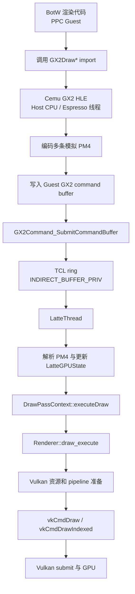
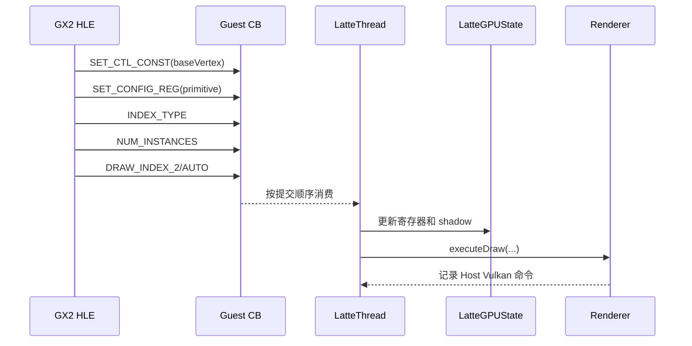
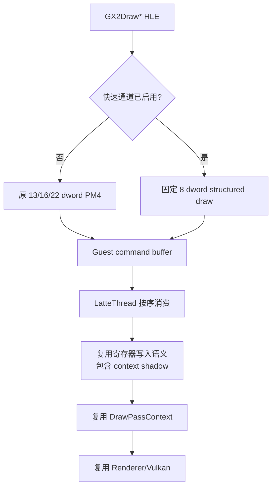
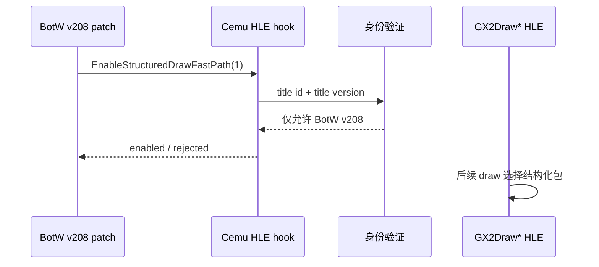
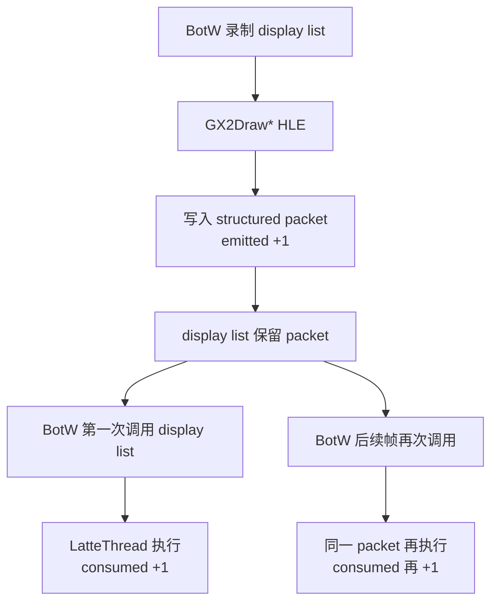
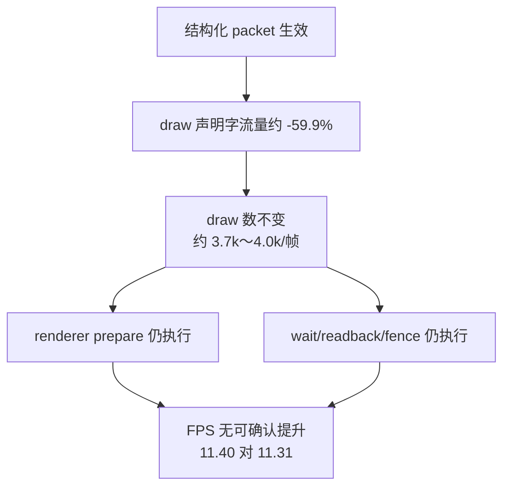

# Cemu Guest 到 Host 的结构化 Draw 快速通道

## 1. 目的与结论先行

本文分析 BotW Wii U v208 从 Guest `GX2Draw*` 到 Host Vulkan draw 的完整路径，并定义一个可回退的实验：让 Cemu 的 GX2 HLE 不再为每次普通 draw 生成多条模拟 PM4 命令，而是生成一条仅供 Cemu 使用的结构化 draw 包，由原有 `LatteThread` 按序消费。

这个实验能绕过的是：

- Host GX2 HLE 对 draw 参数的多包 PM4 编码；
- Latte command processor 对这些重复状态包的 header 分派和参数解码；
- 每个 draw 在 Guest command buffer 中多余的字流量。

这个实验不能绕过的是：

- Guest 游戏自身的可见性判断、渲染队列生成和约 3690 次 draw 调用；
- Cemu 的纹理、shader、render target、uniform、同步和 display list 状态处理；
- `Renderer::draw_execute()`、Vulkan pipeline/resource 准备以及 `vkCmdDraw*`；
- `WAIT_REG_MEM`、异步 readback、fence 等 Guest/Host/GPU 同步；
- Vulkan command buffer 的录制、提交与 GPU 执行。

因此它是一个“测量 PM4 draw 参数搬运上限”的低风险探针，不是 Guest 直接调用 Vulkan，也不是 BotW 专用 renderer 的最终形态。2026-08-07 的真机结果已经表明：它能显著减少命令字流量，但没有带来可确认的 FPS 提升，不能把 PM4 draw 声明解码继续当作当前约 11～12 FPS 的主要瓶颈。

## 2. 当前真实调用链

BotW 的 `GX2DrawEx`、`GX2DrawIndexedEx` 和 `GX2DrawIndexedEx2` 是 Wii U RPL import。Cemu 已经把这些 import 映射成 Host C++ HLE 函数，所以“Guest 直接进入 Host”其实已经发生在调用链前半段。

关键点是：当前多出来的层并不是“Guest 二进制 command buffer 再跨进程转换成 Host 队列”。Cemu 是单进程，GX2 HLE 和 Latte renderer 共享地址空间；额外工作主要是为了保持 Wii U GPU 命令语义而进行的模拟 PM4 编码、排队和解码。

## 3. 一次普通 draw 当前编码了什么

### 3.1 `GX2DrawIndexedEx`

当前会生成 16 个 dword：

| PM4 包 | 作用 | dword |
|---|---|---:|
| `IT_SET_CTL_CONST` | `baseVertex` | 3 |
| `IT_SET_CONFIG_REG` | primitive mode | 3 |
| `IT_INDEX_TYPE` | index type | 2 |
| `IT_NUM_INSTANCES` | instance count | 2 |
| `IT_DRAW_INDEX_2` | index 地址与 draw count | 6 |
| 合计 |  | 16 |

### 3.2 `GX2DrawIndexedEx2`

它还会在 draw 前设置 `baseInstance`，draw 后将其恢复为 0，共 22 个 dword。

### 3.3 `GX2DrawEx`

非 indexed draw 使用 `IT_DRAW_INDEX_AUTO`，实际共 13 个 dword。

### 3.4 这些包在 LatteThread 上的意义

这些状态写入不能简单删除。`DrawPassContext::executeDraw()` 会从 `LatteGPUState` 读取 `baseVertex`、`baseInstance`、instance count 和 index type；context shadow 也必须维持原行为，否则 context save/restore 或 display list 可能读到错误状态。

## 4. BotW v208 的 Guest 侧证据

当前 IDA 数据库绑定：

- RPX SHA-256：`ba58da5b95ce929e005d058ceb08b9b2788d1ab2bbc8a6c189bbadca0bb34d30`；
- Cemu module checksum：`0x6267BFD0`；
- 标题：BotW JP v208；
- IDB：`games/reverse/botw/wiiu-v208/ida-database/botw-jp-v208-u-king-ba58da5b95ce.i64`。

IDA 的 import xref 数量如下：

| import | 直接 xref 数 |
|---|---:|
| `GX2DrawEx` | 5 |
| `GX2DrawIndexedEx` | 10 |
| `GX2DrawIndexedEx2` | 231 |
| `GX2CallDisplayList` | 43 |
| `GX2DirectCallDisplayList` | 1 |

这说明逐一改写 BotW 的 246 个直接 draw callsite 不适合作为第一版：维护成本高、版本耦合强，而且无法覆盖 display list 内已有的 PM4。更稳妥的 patch 只负责在标题入口启用 Host 能力，实际 draw 收敛在 Cemu 的三个 GX2 HLE export 中。

## 5. Tracy 基线与可归因边界

基线文件：`_out/profiler/botw-structured-draw-baseline.tracy`。采集前完成了无实体手柄 warmup，BotW 已进入可玩场景。

### 5.1 场景概要

| 指标 | 基线 |
|---|---:|
| 采集时长 | 约 20 秒 |
| frame 数 | 225 |
| 平均 FPS | 11.40 |
| draw/帧 | 3687–3698 |
| fast draw/帧 | 2609–2614 |
| fast draw 比例 | 约 70.7% |
| full draw/帧 | 约 1085 |

### 5.2 聚合热点

| zone | 总时间 | 次数 | 解释 |
|---|---:|---:|---|
| `latte.command_buffer.decode` | 15725 ms | 13651 | 包围区，包含 renderer 与同步，不是纯 parser |
| `gx2.guest.draw_done` | 9466 ms | 454 | Guest 等待 GPU/Host 完成 |
| `latte.sync.wait_reg_mem` | 4951 ms | 227 | Guest fence 等待 |
| `latte.command_ring.wait_for_guest` | 4187 ms | 627 | LatteThread 等 Guest 供给 |
| `latte.sync.async_readback` | 4075 ms | 455 | readback/异步同步 |
| `vulkan.command_buffer.wait_for_fence` | 4073 ms | 1330 | Host Vulkan fence |
| `vulkan.draw.prepare` | 3497 ms | 841702 | 每次 draw 的 renderer 准备 |
| `latte.draw_pass.decode` | 2583 ms | 246402 | fast draw parser 的包围区 |
| `vulkan.draw.prepare.full` | 1935 ms | 246402 | 约 1085 次/帧 full prepare |
| `vulkan.draw.prepare.fast` | 688 ms | 595300 | 约 2610 次/帧 fast prepare |
| `gx2.guest.submit_command_buffer` | 73 ms | 13677 | Guest 提交 HLE 自身很轻 |

一个 84.225 ms 样本帧中：

- `vulkan.draw.prepare` 约 14.68 ms / 3759 次；
- `latte.draw_pass.decode` 约 10.58 ms / 1119 段；
- `WAIT_REG_MEM` 约 22.44 ms；
- async readback 约 13.18 ms；
- `latte.command_buffer.decode` 的主要实例 self time 合计约 6–8 ms。

由此得到两个边界：

1. 不能把 `latte.command_buffer.decode` 的 97 ms inclusive 时间当作纯 PM4 解码开销；
2. 即使结构化 draw 把解码 self time 全部消除，renderer prepare、同步等待和 Guest draw 数量仍然存在。

## 6. 实验设计：结构化 Draw 包

### 6.1 为什么仍然交给 LatteThread

Vulkan renderer、texture cache、command pool 和 draw sequence 生命周期归 `LatteThread` 所有。让执行 `GX2Draw*` 的 Guest/PPC 线程直接调用 `g_renderer->draw_execute()` 或 `vkCmdDraw*` 会产生：

- 与状态包、display list、surface sync 的顺序竞争；
- Vulkan command pool/thread ownership 违规；
- 纹理、shader、render target dirty 状态不一致；
- Guest CPU 提前修改资源时缺少原有栅栏边界；
- 难以回退和定位的跨线程竞态。

所以快速通道只压缩命令表达，不改变消费线程和 renderer 生命周期。

### 6.2 包格式

新增 Cemu-only opcode `IT_HLE_STRUCTURED_DRAW`。包固定为 1 个 header 加 7 个 payload dword：

| payload | 内容 |
|---:|---|
| 0 | control：低位 primitive，高位 indexed flag |
| 1 | draw count |
| 2 | index type |
| 3 | index physical address；auto draw 为 0 |
| 4 | base vertex |
| 5 | instance count |
| 6 | base instance |

预期字流量变化：

| 调用 | 原 dword | 新 dword | 减少 |
|---|---:|---:|---:|
| `GX2DrawEx` | 13 | 8 | 5 |
| `GX2DrawIndexedEx` | 16 | 8 | 8 |
| `GX2DrawIndexedEx2` | 22 | 8 | 14 |

### 6.3 必须保留的语义

消费端不能直接随意写 union 字段，而应复用原寄存器处理逻辑或等价 helper，以保留：

- `baseVertex`/`baseInstance` 的 control constant 映射；
- primitive、index type、instance count 的寄存器状态；
- `numInstances == 0` 时按现有逻辑归一为 1；
- context register shadow；
- `GX2DrawIndexedEx2` draw 后将 `baseInstance` 恢复为 0；
- draw pass 的 first/fast draw、dirty mask 和性能计数；
- command buffer 与 indirect display list 的严格顺序。

第一版不改 `GX2DrawIndexedImmediateEx` 和 compute dispatch，因为前者携带 inline index 数据，后者虽复用了 `DRAW_INDEX_AUTO`，语义不是普通图形 draw。

## 7. Patch 启用机制

快速通道默认关闭。BotW graphic pack 只在标题入口调用一次 Cemu HLE export：

同时由 graphic pack 的 `moduleMatches=0x6267BFD0` 绑定当前 JP v208 RPX。双重校验避免其他标题或版本误用。

重启标题、GX2 driver reset 或禁用 pack 后必须恢复默认关闭。任何不支持的 draw 类型继续走原 PM4 fallback。

## 8. A/B 验证方法

### 8.1 A：关闭快速通道

- `structured_draw_status` 必须显示 disabled；
- 完成 warmup 后采集同一 BotW 场景；
- 记录 FPS、draw/帧、command decode self、renderer prepare、同步等待和 GPU time。

### 8.2 B：启用快速通道

- 日志必须出现标题/version 验证通过；
- `structured_draw_status` 中 emitted 与 consumed 必须持续增长；二者不要求相等，见下节的 display-list 语义；
- 画面、输入、帧推进和 draw/帧必须与 A 基本一致；
- 同样完成 warmup 后采集同场景 Tracy。

### 8.3 `emitted` 与 `consumed` 为什么不相等

`emitted` 表示 GX2 HLE 把一个 structured draw 写入 command buffer；`consumed` 表示
LatteThread 实际执行一次该 packet。BotW 会先录制 display list，再在后续帧重复调用，
因此一个 packet 可以只 emitted 一次、却 consumed 多次。

直接命令、尚未消费的队列和计数采样粒度也会造成短时差值。因此判断条件是两端都增长、
`fallback` 符合预期、帧继续推进；不能用 `emitted == consumed` 作为正确性断言。进入本轮
gameplay 后，采集末尾的 sampled counter 约为 1,048,576 emitted、3,350,528 consumed，
约 3.20 次执行/生成，正是 display-list 重用证据。

## 9. 2026-08-07 实现与真机结果

### 9.1 已实现范围

- 新增 Cemu-only `IT_HLE_STRUCTURED_DRAW (0xF4)`，固定 7 payload dword；
- `GX2DrawEx`、`GX2DrawIndexedEx`、`GX2DrawIndexedEx2` 在启用后生成结构化包；
- LatteThread 在普通 command buffer、continuous draw pass、indirect/display-list 和
  top-level ring 路径识别该包，复用既有寄存器 helper、`DrawPassContext` 和 renderer；
- `GX2DrawIndexedImmediateEx` 保持 legacy 路径并计入 fallback；
- Host HLE 同时校验 BotW title id 与 v208，GX2 reset 时恢复默认关闭；
- `structured_draw_status` 暴露 enabled、emitted、consumed、fallback 和字流量；
- graphic pack 位于
  `tools/guest-mods/botw-v208-structured-draw-fast-path/`，并以
  `moduleMatches=0x6267BFD0` 绑定 JP v208；
- 无实体手柄 warmup 同时注入 controller override 与 VPADRead mirror，并报告
  `vpad_reads/vpad_a_reads`，避免只根据自动化线程 completed 推断 Guest 收到了 A。

### 9.2 有效样本边界

早期 `s2`、`s3`、`s4` 虽然 packet 正常工作，但画面仍在 BotW 启动/DLC 提示页，约
30 FPS、125 draws/帧，全部是无效性能样本，不参与 A/B。

正式采集 `s5` 的顺序是：先连接 Tracy，再执行 `open_last_game`，随后执行
`warmup_a 8 15000 5000 500 30000`。完成时 Guest 侧累计 1,448 次 VPADRead，其中
87 次样本包含 A；截图确认进入约 11 FPS、约 4k draws/帧的 gameplay。正式分析只取
trace-relative 120～156 秒的稳定窗口。

| 证据 | 路径 / 值 |
|---|---|
| APK | `src/android/app/build/outputs/apk/relWithDebInfo/app-relWithDebInfo.apk` |
| APK SHA-256 | `1a65cb02a4938fe475a8fc91bfd5f1c67b49e2f4cb40d708b556e90354c58f18` |
| baseline trace | `_out/profiler/botw-structured-draw-baseline.tracy` |
| baseline SHA-256 | `efe915c5dc7f92c9fef6aeaa0bb54eb9a0c946aa41c924f3fec9e1df18656242` |
| fast-path trace | `_out/profiler/botw-structured-draw-fast-path.tracy` |
| fast-path SHA-256 | `171f68ae66a2cc2c0f461072b50ae5ba41e2c7917f1d44ae4909d0b6a50fc916` |
| gameplay 截图 | `_out/profiler/structured-draw-fast-final-gameplay.png` |
| 构建 | Android `RelWithDebInfo`，Host commit `ab6e8f2b75c1` 加当前未提交实验改动 |

### 9.3 A/B 数据

两个样本都是真实 gameplay，但并非完全相同的相机位置；B 的 draw 数高 7.2%，所以该
表可以否定“性能会好很多”，不能用于声称亚毫秒级收益或回归。

| 指标 | A：legacy | B：structured | 解释 |
|---|---:|---:|---|
| 分析窗口 | 225 帧，约 20 秒 | 408 帧，36 秒 | 均为 warmup 后 gameplay |
| 平均 FPS | 11.40 | 11.31 | B 低 0.7%，属于场景/负载差异范围 |
| draws/帧 | 3693.4 | 3960.3 | B 高 7.2%，不是严格同负载 |
| fast draw 比例 | 70.67% | 69.87% | continuous draw 命中接近 |
| `latte.command_buffer.decode` / 帧 | 69.16 ms | 69.45 ms | inclusive，基本不变 |
| `latte.draw_pass.decode` / 帧 | 11.27 ms | 11.30 ms | 基本不变 |
| `vulkan.draw.prepare` / 帧 | 15.32 ms | 15.64 ms | 随 B 更高 draw 数略增 |
| `wait_reg_mem` / 帧 | 21.81 ms | 23.05 ms | 仍是主要同步成本 |
| async readback / 帧 | 17.89 ms | 16.58 ms | 仍然存在且数量级不变 |
| Vulkan fence wait / 帧 | 17.89 ms | 16.58 ms | 仍然存在且数量级不变 |
| `gx2.guest.draw_done` / 帧 | 41.72 ms | 41.53 ms | Guest/Host 完成等待基本不变 |

structured counter 的 capture 内末值为 1,048,576 emitted，按固定 8 dword 计算是
8,388,608 dword；同一批调用按 legacy 路径估算约 20,930,092 dword，减少
12,541,484 dword，即约 59.9%。这证明“压缩命令表达”已经生效，但省下的字流量没有
消除 renderer prepare、同步或 draw 本身。

### 9.4 结论与停止点

1. 原型在功能层面成立：Host 能以一个版本绑定、可回退的 Cemu-only packet 表达普通
   GX2 draw，display list 与 LatteThread 顺序仍然工作，`fallback=0`；
2. 原型在性能层面没有证明价值：减少约 60% draw 声明字流量后，FPS 与每帧 decode
   inclusive 时间均没有可确认改善；
3. 不应继续让 Guest 绕过 LatteThread、直接调用 Vulkan。那不会消除本轮看到的
   display/pacing dependency、Guest-memory visibility barrier、Host submission completion
   与 renderer prepare，反而破坏线程和资源顺序；各类同步的详细分层见
   [Guest / Host 同步与完成点架构](guest-host-synchronization.md)；
4. 后续优先级应转向约 1,190 次 full draw/帧为何终止 continuous sequence、约 3,960
   draws 的 pass/material 聚类，以及 `wait_reg_mem` 对应的 Guest producer/fence；
5. structured draw 保留为默认关闭的研究探针，除非后续在严格同 save、同相机、同输入
   replay 的 A/B 中证明稳定收益，否则不升级为默认产品路径。

### 9.5 判定表

| 结果 | 解释 | 后续 |
|---|---|---|
| decode self 明显下降且 FPS 上升 | PM4 draw 参数搬运是有效瓶颈 | 保留通道，继续扩大覆盖与校验 |
| decode self 下降、FPS 基本不变 | 优化生效但被 renderer/同步/Guest 限制 | 不继续扩大 patch，转向 full prepare、同步或 Guest batching |
| draw/帧、画面或状态异常 | 语义不等价 | 立即回退，检查 shadow/顺序/display list |
| emitted 增长但 consumed 不增长 | opcode 消费链不完整 | 停止性能结论，修 command processor |
| 发生 crash/GPU fault | 原型不安全 | 禁用 pack，保留证据，不自动扩大 fast path |

性能收益必须同时满足功能正确和可归因。只看到 FPS 波动、只看到 patch applied，或只看到 PM4 字数减少，都不能证明快速通道有效。

## 10. 更激进方向与停止点

如果该原型证明 PM4 self time 收益很小，就不应继续让 Guest 越过 Latte 状态机。更可能有空间的是：

1. 用 Guest profiler tag 找出 BotW 生成约 3690 draw 的具体队列、pass 和材质分组；
2. 识别可合并的重复 state/draw，做 BotW 专用 batching 或 indirect draw；
3. 降低每帧约 1085 次 `vulkan.draw.prepare.full` 的 pipeline/resource 失效；
4. 分离 `WAIT_REG_MEM` 中真实 Guest 生产依赖与 Host/GPU fence 等待；
5. 验证静态纹理 scale、render scale 与 draw-call-bound 的独立性。

真正的“Guest 直接提交 Host rendering 队列”只有在定义稳定的资源句柄、shader/pipeline ABI、同步协议和线程安全队列后才可行。那会从一个优化探针升级成新的 paravirtual GPU API，成本和兼容性风险远高于本阶段目标，不能由 BotW patch 隐式引入。

## 11. 代码入口

| 环节 | 代码 |
|---|---|
| Guest GX2 draw HLE | `src/Cafe/OS/libs/gx2/GX2_Draw.cpp` |
| Guest command buffer 提交 | `src/Cafe/OS/libs/gx2/GX2_Command.cpp` |
| TCL ring 提交 | `src/Cafe/OS/libs/TCL/TCL.cpp` |
| PM4 opcode | `src/Cafe/HW/Latte/Core/LattePM4.h` |
| Latte command decode | `src/Cafe/HW/Latte/Core/LatteCommandProcessor.cpp` |
| renderer 抽象 | `src/Cafe/HW/Latte/Renderer/Renderer.h` |
| Vulkan draw | `src/Cafe/HW/Latte/Renderer/Vulkan/VulkanRenderer.cpp` |
| Graphic pack/ASM 模型 | `docs/architecture/cemu-graphic-pack-asm.md` |
| BotW v208 启用 pack | `tools/guest-mods/botw-v208-structured-draw-fast-path/` |
| debugbus 状态与 warmup | `src/Cafe/Diagnostics/CemuDiagnostics.cpp`、`src/Cafe/Diagnostics/CemuWarmup.cpp` |
