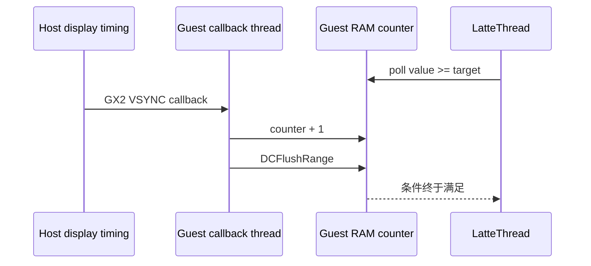
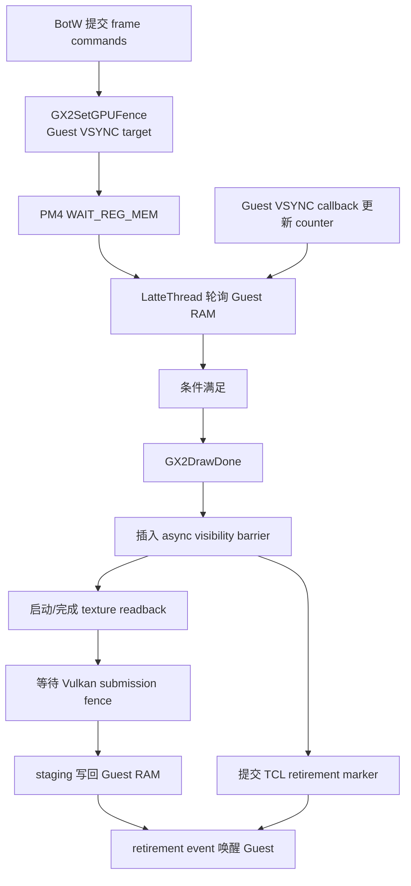
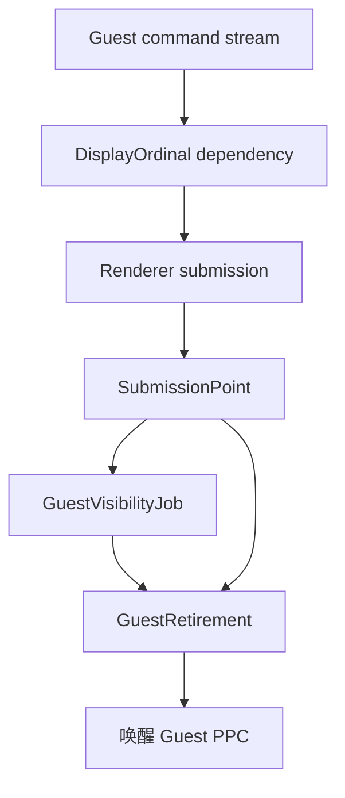
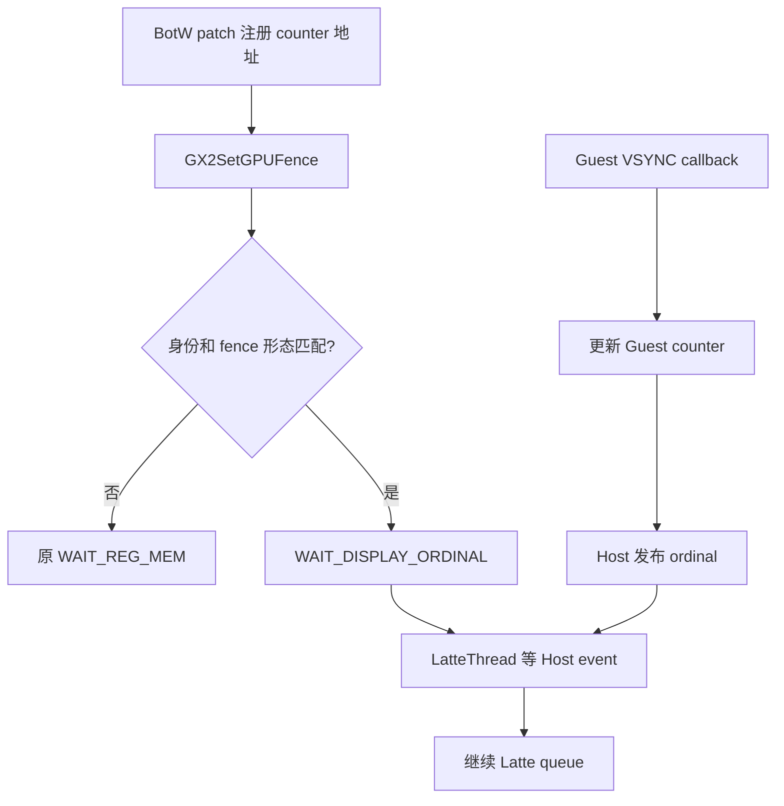

# Cemu Guest / Host 同步与完成点架构

> BotW 第一次 `GX2DrawDone` 的上一帧 GPU feedback 优化、批次签名、安全回退和真机 A/B
> 退出标准见 `docs/plans/botw-host-gpu-feedback-optimization-spec.md`。本文描述通用同步模型，
> spec 描述当前 BotW v208 专项实施边界。

## 1. 结论

Cemu 当前 Tracy 中的 `fence`、`readback`、`wait` 不是同一种开销，也不能直接相加。
它们应按“谁生产、谁消费、等待什么可见性”重组为四类 Host-like 语义：

| Host-like 语义 | 当前 Cemu 表达 | 生产者 | 消费者 | 当前问题 |
|---|---|---|---|---|
| Display/Pacing dependency | `WAIT_REG_MEM` | Host VSYNC 触发的 Guest callback | LatteThread | 用 Guest 内存 busy-poll 表达显示时序 |
| Submission retirement | `GX2DrawDone` + TCL timestamp | LatteThread / Host GPU | Guest PPC thread | 语义基本正确，但 profiler 把 Guest 阻塞时长误看成 Host 工作 |
| Guest-memory visibility | async texture/query readback | Host GPU + staging copy | Guest RAM / PPC | Vulkan 每次 DrawDone 强制完成，完成点与回写任务没有统一抽象 |
| Renderer completion | `VkFence` / command-buffer id | Host GPU | Vulkan renderer | backend-specific，调用原因没有区分 |

最有价值的第一步不是删除同步，而是把它们改成显式 dependency/completion point。这样既能
保持 Wii U 可见性和顺序，也能分清“CPU 在工作”“线程在睡眠”“模拟时序故意等待”和
“Guest 被 Host 反压”。

## 2. BotW v208 的实测证据

证据来自 `_out/profiler/botw-structured-draw-fast-path.tracy` 的稳定 gameplay 窗口
120～156 秒，共 408 帧。

### 2.1 `WAIT_REG_MEM` 实际是在等 VSYNC ordinal

本窗口 408 次 wait 全部具有同一形态：

| 字段 | 值 |
|---|---|
| Guest physical address | `0x1046D420` |
| compare | `GEQUAL` |
| mask | `0xFFFFFFFF` |
| Guest `GX2SetGPUFence` LR | `0x031FAB04` |
| 次数 | 408，恰好约每帧一次 |
| 初值/终值 | 初值通常落后 target 约 2；结束时等于 target |

IDA 中 `sub_31FA9E0` 在 `0x031FAB00` 调用：

```text
GX2SetGPUFence(&dword_1046D420, 0xFFFFFFFF, 6, target);
...
GX2DrawDone();
```

`sub_31FA220` 把 `sub_31FA1D8` 注册为 GX2 VSYNC callback。该 callback 每次执行：

```text
dword_1046D420 += 1;
DCFlushRange(&dword_1046D420, 4);
```

因此这条 wait 的真实含义是“Latte 命令流等到第 N 个显示时序点”，不是“Host GPU 等
某个 draw 数据上传完成”。目前 LatteThread 一边轮询 Guest RAM，一边触发 timed VSYNC，
再等待 Guest callback thread 被调度、更新内存并 flush；这是可以 Host 化的明确入口。



### 2.2 `GX2DrawDone` 是 Guest backpressure

`GX2DrawDone` 会：

1. 在 Vulkan 后端写入 `IT_HLE_SYNC_ASYNC_OPERATIONS`；
2. flush 当前 GX2 command buffer；
3. 取得最后提交的 TCL retirement timestamp；
4. Guest PPC thread 通过 `OSEvent` 等待 timestamp retirement。

最后一步已经是事件驱动，不是 Host CPU 自旋。Tracy 中
`gx2.guest.draw_done` 的约 41.5 ms/帧主要表示 Guest 被 Host/GPU 反压的 wall time，
不能当作 Host CPU 消耗。

### 2.3 readback 与 Vulkan fence 是可见性 barrier

Vulkan 的 texture readback 先把 `vkCmdCopyImageToBuffer` 录入当前 command buffer，并以
command-buffer id 作为完成点。DrawDone 的强制同步随后调用 `ForceFinish()`，最终落到
`vkWaitForFences()`；GPU 完成后才把 staging 数据写回 Guest RAM。

稳定窗口内：

| scope | 每帧 wall time | 说明 |
|---|---:|---|
| `latte.sync.async_readback` | 16.58 ms | Guest-memory visibility barrier |
| `vulkan.command_buffer.wait_for_fence` | 16.58 ms | 上述 barrier 内的 Host GPU completion wait |
| `latte.sync.wait_reg_mem` | 23.05 ms | Guest VSYNC/pacing dependency |
| `gx2.guest.draw_done` | 41.53 ms | Guest retirement backpressure，包含等待而非纯工作 |

这些 scope 存在包含和因果关系，不能相加成 97.7 ms。`vkWaitForFences` 通常让 Host 线程
睡眠，不持续占用一个 CPU 核；当前 `WAIT_REG_MEM` 才是 LatteThread 上的主动轮询。

## 3. 当前同步链



## 4. 目标模型：Host dependency graph

### 4.1 统一概念

目标架构只暴露四种 backend-neutral 对象：

- `DisplayOrdinal`：Host 显示/模拟时钟上的单调序号；
- `SubmissionPoint`：renderer 已提交工作上的单调完成点；
- `GuestVisibilityJob`：完成点满足后，把 staging/query 结果发布到 Guest RAM；
- `GuestRetirement`：所有必需完成点和可见性任务完成后，唤醒 Guest `OSEvent`。

Vulkan 可以用 timeline semaphore 或现有 submission serial/fence 实现
`SubmissionPoint`；Metal 可用 command-buffer completion handler。上层不能再根据
`RendererAPI::Vulkan` 决定是否需要语义 barrier，而应根据是否存在未完成的
`GuestVisibilityJob` 决定。



### 4.2 必须保持的约束

- 同一 Latte queue 中 barrier 之后的命令不能越过 barrier 执行；
- readback/query 数据必须在 retirement event 前对 Guest 可见；
- Host display ordinal 与 Guest 可见 VSYNC callback 都要继续推进；
- generic Cemu 代码不能硬编码 BotW 地址，地址与身份只能由版本绑定的 Guest patch 注册；
- renderer completion 抽象必须同时覆盖 Vulkan 和 Metal，不能新增 Android-only 路径；
- timeout、停止标题和 renderer reset 必须能取消所有 parked dependency。

## 5. 分阶段实施

### P0：语义化 profiler，低风险

保留旧标签用于历史 A/B，同时新增：

| 新标签 | 含义 |
|---|---|
| `gx2.guest.draw_done.enqueue_visibility_barrier` | Guest 请求 Host→Guest 可见性 |
| `gx2.guest.draw_done.submit` | Guest 命令真正提交 |
| `gx2.guest.draw_done.wait_retirement` | Guest 等 Host retirement |
| `latte.dependency.guest_memory.wait` | Latte 等 Guest memory producer |
| `latte.completion.guest_memory_visibility` | readback 发布 barrier |
| `latte.completion.guest_query_visibility` | query 发布 barrier |
| `vulkan.completion.wait.readback_visibility` | readback 引发的 GPU completion wait |
| `vulkan.completion.wait.command_buffer_recycle` | command-buffer pool 回收等待 |
| `vulkan.completion.wait.submission` | 等指定 submission point |

并记录 `guest_memory_dependency.polls_last` 与 `satisfied_immediately`。这一阶段不改变同步
语义，只让下一轮 Tracy 能回答“等待原因”和“线程归属”。

### P1：BotW v208 DisplayOrdinal 原型（已实施）

已新增一个默认关闭、版本绑定的 HLE 注册入口。Guest patch 只注册 VSYNC counter 的 Guest
地址；generic Cemu 代码不含 `0x1046D420`。后续 `GX2SetGPUFence` 只有同时满足：

- 当前标题与 v208 identity 匹配；
- 地址等于已注册 counter；
- mask 为 `0xFFFFFFFF`；
- compare 为 `GEQUAL`；

才生成 Cemu-only `IT_HLE_WAIT_DISPLAY_ORDINAL`。第一版没有提前模拟 Guest callback，也没有
直接用 Host VSYNC 替代 Guest 可见状态，而是采取更保守的完成顺序：

1. `GX2SetGPUFence` 在 Guest 提交线程单次采样当前 counter，避免已经满足的条件多等一帧；
2. 原 Guest VSYNC callback 正常执行并更新 counter；
3. callback 返回后，Host 单次读取已注册 counter 并发布 ordinal event；
4. LatteThread 以 1 ms condition-variable slice 等待 event，同时继续服务 timed VSYNC 和
   async commands；
5. 标题、版本、地址、mask 或 compare 任一不匹配，完整生成旧 `WAIT_REG_MEM`。

这仍保留 Guest callback 调度依赖，因为第一版优先保证“Guest 内存已经更新”发生在 Latte
queue 继续之前。它消除的是 LatteThread 对同一 Guest 地址的无界紧循环读取，而不是取消
BotW 的显示节奏。



#### P1 真机 A/B 结果

在同一 RelWithDebInfo APK、同一 BotW JP v208、同为约 3967 draw/帧且均完成默认 warmup 的
35 秒稳定窗口中，只切换 Host Display Dependency pack：

| 指标 | Legacy `WAIT_REG_MEM` | Host event dependency | 变化 |
|---|---:|---:|---:|
| 平均 FPS | 11.14 | 11.74 | +5.4% |
| 平均 frame time | 89.86 ms | 85.28 ms | -5.1% |
| 平均 Cemu CPU | 26.44% | 22.99% | -3.45 个百分点 |
| draw/帧 | 3967.88 | 3966.15 | -0.04% |
| pacing wait wall time | 23.94 ms | 23.08 ms | -3.6% |
| 每次条件检查 | 340570 次 Guest RAM poll | 22.53 次 Host wait wakeup | 约减少 1.5 万倍 |

运行时 `emitted == consumed`，`fallback == 0`，说明本场景所有目标 fence 都由新 opcode
完整消费。pacing wait 仍约 23 ms，证明它本来就是帧节奏的一部分；收益来自 LatteThread
不再持续读 Guest RAM。FPS/CPU 变化是一次顺序 A/B 的观测值，虽有几乎相同的 draw 数作
场景约束，仍需更长的交错 A/B 与温度控制后才能当作稳定收益承诺。完整验证与 artifact
入口见 `docs/verification/botw-host-display-dependency.md`。

### P2：Renderer completion 与 readback batch

- 把 Vulkan command-buffer id 提升为通用 `SubmissionPoint`；
- 一次 DrawDone 先收集所有 pending readback/query 的最大依赖点；
- 提交一次，等待最晚依赖点，而不是由每个 readback 分别触发 completion wait；
- completion 后批量发布 staging→Guest RAM，再 signal retirement；
- Metal 使用同一上层状态机，只替换完成点 backend。

这一阶段主要减少重复 wait/submit/回收开销并统一后端；GPU 真正执行和必要的数据回写
延迟仍然存在。

### P3：通用 Guest-memory dependency watcher

只有其他游戏也显示大量 generic `WAIT_REG_MEM` busy-poll 时，才考虑在 JIT/MMU store 路径
增加精确地址 watcher，把 Latte queue park 在 Host event 上。该方案会触碰所有 Guest store
的热路径，成本和风险高于 BotW 的明确 DisplayOrdinal 特化，不能作为第一步。

## 6. 验证和停止条件

| 检查 | 通过条件 |
|---|---|
| 语义 | Guest counter、VSYNC/FLIP callback 次数、target 序列与 legacy 完全对应 |
| 顺序 | readback/query 在 retirement 唤醒前已写回 Guest RAM |
| 功能 | 同 save、同场景至少 10 分钟无 hang、闪退或 GPU fault |
| 性能 | 同输入 replay 下分别比较 LatteThread on-CPU、wait wall time、FPS 和功耗 |
| 回退 | 禁用 pack 或不匹配 identity 时完全回到 legacy PM4 |

若 P1 只把 `wait_reg_mem` 改名为 display wait、FPS 不变，这是合法且有价值的结果：它证明
该段是 pacing，不应继续作为渲染瓶颈。若 P2 不能减少 submit/wait 次数或 Guest visibility
延迟，则保留统一抽象但停止扩大异步化，避免引入复杂的跨线程回写队列。

## 7. 代码入口

| 环节 | 文件 |
|---|---|
| Guest fence 与 DrawDone | `src/Cafe/OS/libs/gx2/GX2_Event.cpp` |
| Guest retirement event | `src/Cafe/OS/libs/TCL/TCL.cpp` |
| WAIT_REG_MEM / async barrier | `src/Cafe/HW/Latte/Core/LatteCommandProcessor.cpp` |
| texture readback queue | `src/Cafe/HW/Latte/Core/LatteTextureReadback.cpp` |
| Vulkan readback completion | `src/Cafe/HW/Latte/Renderer/Vulkan/TextureReadbackVk.cpp` |
| Vulkan submission/fence | `src/Cafe/HW/Latte/Renderer/Vulkan/VulkanRenderer.cpp` |
| BotW v208 IDA 入口 | `games/reverse/botw/wiiu-v208/ida-database/` |
| BotW P1 graphic pack | `tools/guest-mods/botw-v208-host-display-dependency/` |
| P1 运行时状态 | debugbus `display_dependency_status` |
