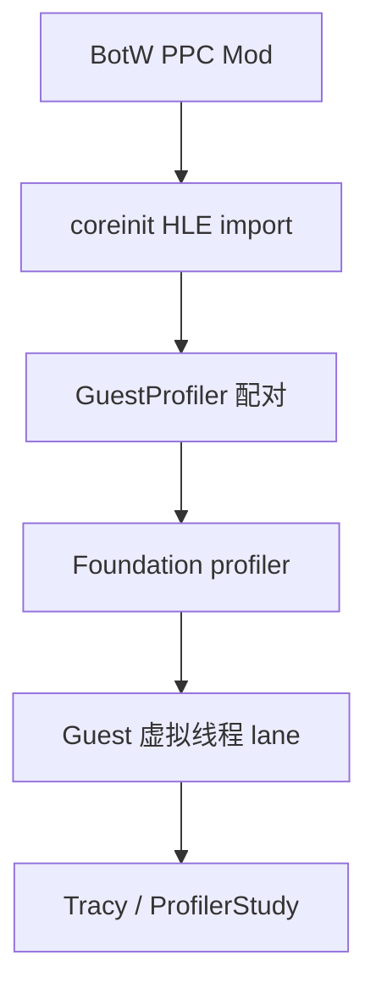
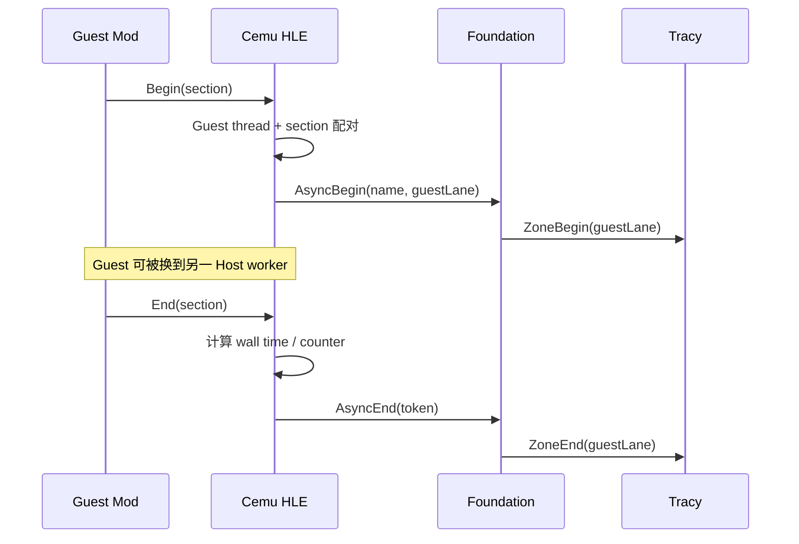
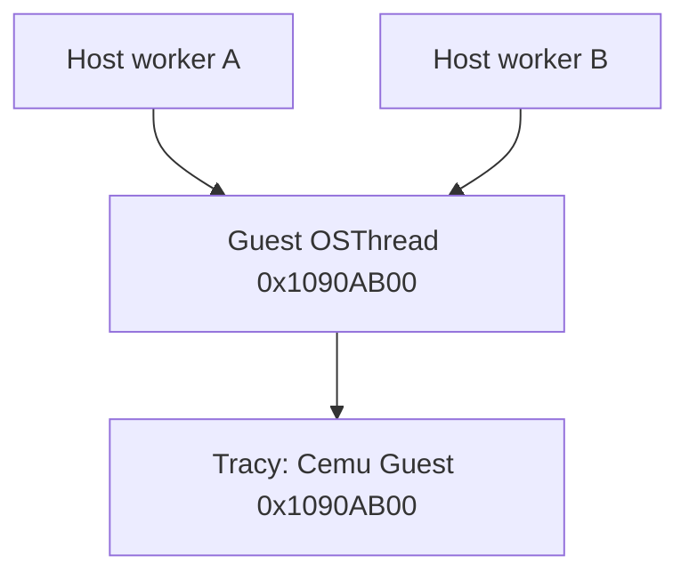

# Guest Profile Tag：Host HLE 桥接与时间线设计

## 1. 目标与结论

目标是让 Guest Mod 能用很小的 ABI 调用标记游戏内部阶段，并把标记送入 Cemu 已有的
Foundation profiler。采集端应同时看到：

- Host CPU/GPU scope；
- 按 Guest 线程组织的 Mod scope；
- 现有 `last_us`、`max_us`、`calls` 概要 counter。

这里选择 **`coreinit` HLE import + Foundation 外部线程异步 scope**。它不是 Android Binder
service，也不是 ARM/Linux 的 `svc` 指令：Guest 是 Wii U PowerPC 程序，最短且已有的边界是
Cemu 的 HLE export。`dumpsys`/debugbus 只负责启停、状态和取证，不进入每次 tag 的热路径。

该方案已经在 AYANEO Pocket DS 的 BotW v208 实际 gameplay 中验证通过；构建、warmup、
配对计数、Tracy Guest lane 与清理证据见
[`../verification/guest-profiler-tags-android.md`](../verification/guest-profiler-tags-android.md)。
BotW v208 的 20 个 PPC detour、codecave wrapper、绝对地址和版本保护见
[`../bettervr/botw-v208-guest-profiler-patch.md`](../bettervr/botw-v208-guest-profiler-patch.md)。



## 2. 可行性判断

### 2.1 已有基础

当前链路已经具备：

1. Guest Mod 调用 `coreinit.hook_ProfileSectionBegin/End(section_id)`；
2. Host 按 `(Guest thread ID, section ID)` 配对，可跨 Host worker；
3. Foundation counter 和 Host CPU/GPU profiler 已接入；
4. BotW v208 patch 已在真机命中，section 配对异常为零；
5. Foundation 底层已有 async event 和显式线程 ID 的数据模型。

因此无需新增 Guest 内存共享、Binder 服务或轮询线程。缺口主要在 Foundation：原有 async
event 只保存时间，没有真正通知 backend 开始；Tracy 的 custom sample 还是空实现。

### 2.2 不采用的方案

| 方案 | 问题 |
|---|---|
| 直接在 HLE 函数里使用 `ProfilerScope` | begin/end 可能落在不同 Host worker，线程归属和栈都会错 |
| End 时一次性补写历史 sample | 同一 Guest 线程存在嵌套；后完成的外层会倒序写入，破坏 Tracy 单线程时间顺序 |
| 每个 section 建一条线程 lane | 规避了部分嵌套，但丢失 Guest 线程上下文并制造大量 lane |
| Binder/dumpsys service | 跨 Java/IPC，热路径成本和平台耦合都不合适 |
| 只保留 counter | 能比较耗时，不能与 Host CPU/GPU 时间线对齐 |

## 3. 选定架构

### 3.1 Guest ABI

第一版保持已经部署的 ABI，不要求重新定义 Mod 接口：

```c
void hook_ProfileSectionBegin(uint32_t section_id);
void hook_ProfileSectionEnd(uint32_t section_id);
```

`section_id` 由 Host 的固定表解释。固定 ID 的优点是 Guest 不需要传字符串，也不需要读取
不可信 Guest 指针；每次调用只跨一次已有 HLE 边界。

### 3.2 Host 配对与 profiler token

每个 active span 保存：

- Guest `OSThread` 地址形式的稳定 ID；
- `section_id`；
- `steady_clock` 开始时间；
- profiler async token；
- reset generation。

Foundation 在 begin 当下向已连接 backend 发出开始事件，在 end 当下发出结束事件。token
只负责把两次 Host 调用关联起来；墙钟统计仍由 `GuestProfiler` 自己计算。



### 3.3 Guest 虚拟线程 lane

Tracy 的普通 zone 使用当前 OS thread。Guest tag 则使用显式 32 位虚拟 thread ID：

```text
0x80000000 | (guest_OSThread_address & 0x7fffffff)
```

高位命名空间让它与正常 Android/macOS Host TID 分开。lane 名称使用
`Cemu Guest 0xXXXXXXXX`。无 `OSThread` 时，继续使用 Espresso core fallback ID。

同一 Guest 线程的所有 section 都进入同一 lane，保留嵌套关系；Guest 从一个 Host worker
迁移到另一个 worker 时 lane 不变。



## 4. 时间语义

Guest tag 表示 begin/end 之间的 **Host 墙钟区间**，包括：

- Guest PPC/JIT 实际执行；
- Cemu 调度造成的停顿；
- Host 同步、队列等待；
- Mod 标记范围内发生的其他阻塞。

它不等于纯 Guest 指令 CPU time。分析时应同时看 Host worker、GPU scope 和 Guest lane：

| 现象 | 初步解释 |
|---|---|
| Guest tag 长，Host worker 同期持续忙 | Guest/JIT 或对应 Host 实现可能是 CPU 瓶颈 |
| Guest tag 长，中间 Host worker 空洞明显 | 调度、锁、队列或 GPU 等待可能占主导 |
| Guest tag 结束后 GPU scope 很长 | Guest 提交不是主要瓶颈，继续看 Host GPU 管线 |

`last_us/max_us/calls` 与时间线 tag 使用同一对 begin/end，但 counter 以微秒展示，时间线由
各 profiler backend 使用自己的时钟在调用当下记录。

## 5. 生命周期与异常处理

- profiler 未连接时，Guest 配对和 counter 继续工作，不创建 async token；
- reset、disable、title shutdown 会先关闭已开始的 backend scope，再清理 span；
- 非法 section、无匹配 End、嵌套溢出继续计数；
- profiler 在一个 span 中途断连时，本次 capture 可能只有半个 scope，下一次 begin 会恢复；
- 不从 Guest 接收动态字符串，避免非法指针、生命周期和高频分配问题。

## 6. 验收标准

1. Foundation 和 Cemu Android `RelWithDebInfo` 构建通过；
2. 未连接 profiler 时运行行为不变；
3. warmup 进入 BotW 实际场景后，`guest_profiler_status` 有 section 命中；
4. `invalid_section_count`、`unmatched_end_count`、`span_overflow_count` 为零；
5. Tracy 中出现 `Cemu Guest 0xXXXXXXXX` lane 和 section 名；
6. Guest lane 可与 Host CPU/GPU scope 在同一次采集里对齐；
7. reset/disable 后 `active_spans=0`，不会遗留开放 scope。

## 7. 后续扩展边界

固定 section 表适合已逆向、需要低成本采集的游戏。后续若要支持通用 Mod SDK，可在不改变
Foundation 外部 scope 模型的前提下增加“启动时注册 tag 名、运行时只传 ID”的控制面；不要
在每帧 HLE 调用里传任意字符串。XR、其他模拟器和 PC/Android 共用同一 Foundation API，
平台层只负责 profiler 连接与端口转发。

## 8. GPU command stream 语义标记

Guest CPU tag 的 begin/end 发生在 Espresso 执行线程，不能说明相应 GX2 命令何时被
`LatteThread` 消费。渲染相关 section `21..32` 因此会额外写入有序的 Cemu-only PM4 标记，
并在独立的 `Cemu Guest GPU Command Stream` lane 生成 `GpuCommand/<section>` scope。

现有 `coreinit.hook_ProfileSectionBegin/End` 会自动完成这层桥接；新 Mod 也可显式调用
`gx2.hook_GpuTagBegin/End`。分析时必须区分：

- `Cemu Guest 0xXXXXXXXX`：Guest CPU 墙钟区间；
- `Cemu Guest GPU Command Stream`：对应命令在 Host 消费端覆盖的区间；
- Vulkan GPU zone：Host 已录制命令在物理 GPU 上执行的区间。

三者允许重叠，不能直接相加。完整 packet、display-list 安全边界、真机数据和 FrameGraph
衔接方案见 [`guest-semantic-framegraph.md`](guest-semantic-framegraph.md)。
