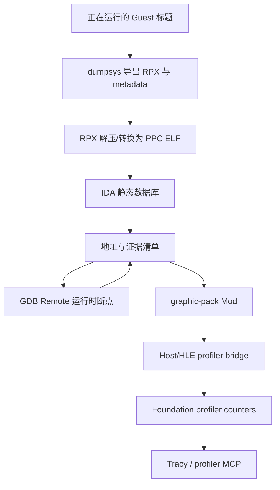
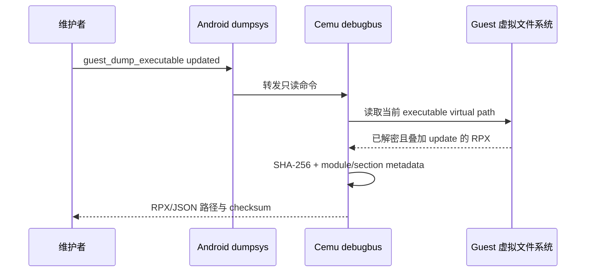
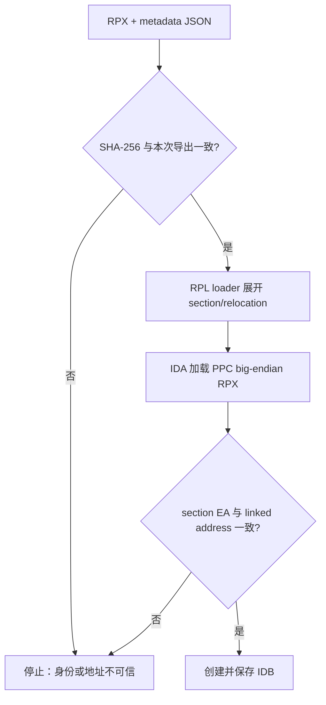
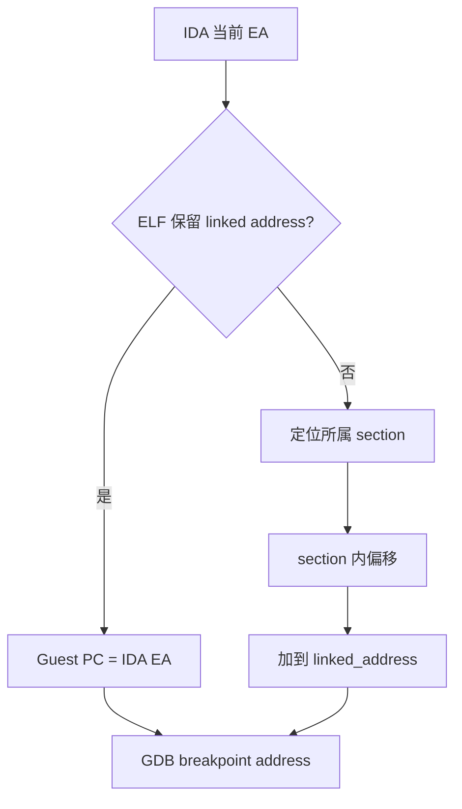
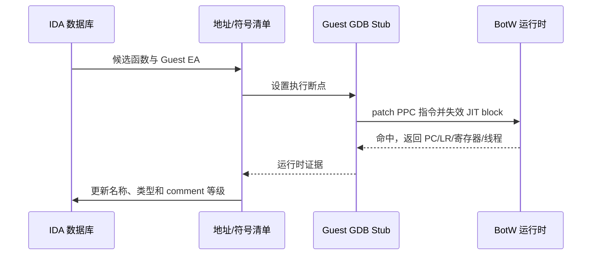
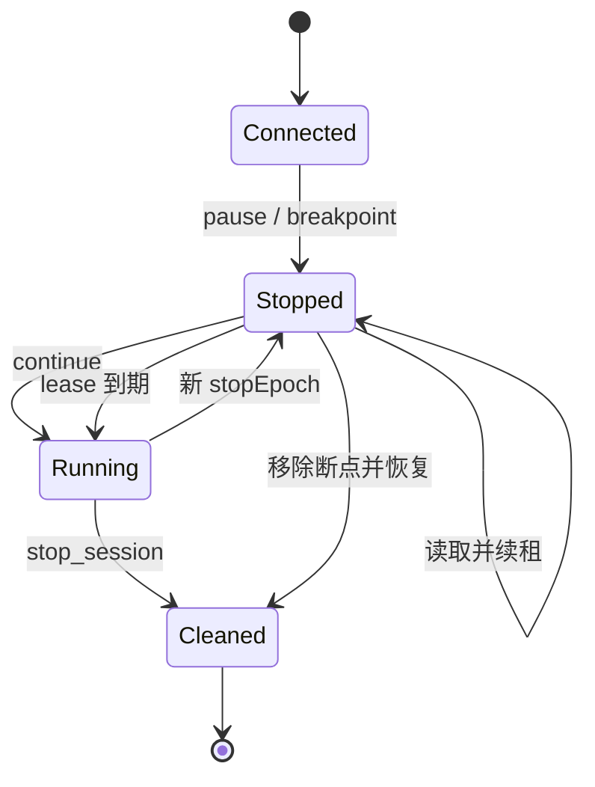
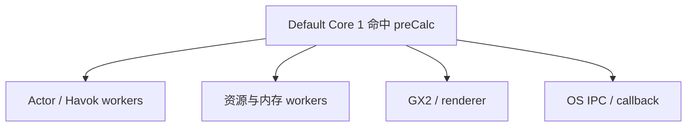
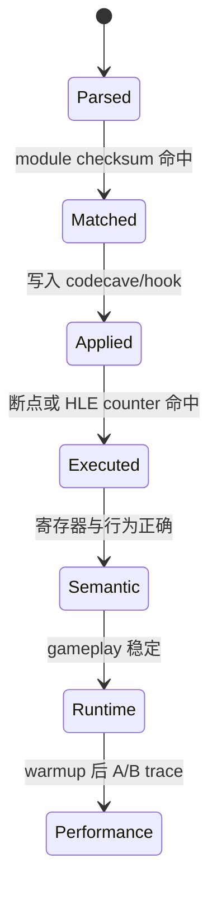
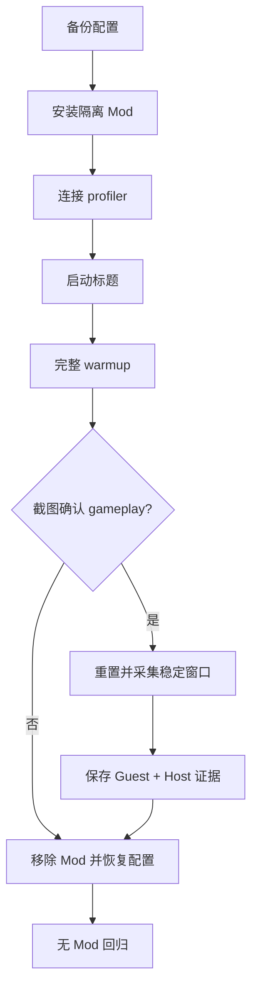
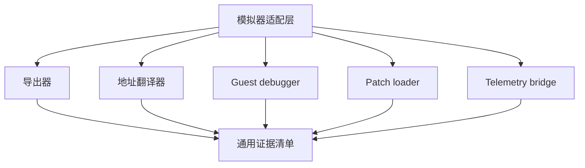

# Guest 二进制逆向、动态调试与 Mod 验证链路

## 1. 目标与边界

本文定义一条可复现的模拟器 Guest 研究链路：从正在运行的游戏提取**实际加载版本**的
Guest 可执行文件，建立 IDA 数据库，用运行时调试结果校准静态标注，再通过最小 Mod 和
Host/HLE bridge 采集 Guest 语义性能数据。BotW v208 是首个实例，但接口和证据规则刻意
按其他游戏、其他模拟器也能复用的方式组织。

这条链路不提交、不分发原始 RPX/RPL 或其他解密游戏文件。经维护者明确授权，本仓库把
可直接复用的派生 IDA 数据库放在独立 private 仓库并使用 Git LFS，再由
`games/reverse/<game>/<platform-version>/ida-database` SSH 子模块固定提交；父仓必须同时
提交身份 manifest、RPX SHA、工具版本和证据等级。这样避免 GitHub public fork 无法上传
新 LFS 对象，也避免数据库意外公开。Switch 版
`references/botw` 以及 BetterVR 的名字只能提供语义参考，不能替代 Wii U v208 的字节和
运行时验证。

## 2. 总体架构



链路中只有一个地址主键：**Guest effective address**。导出的 metadata、IDA EA、graphic
pack 的绝对地址和 GDB Remote 的 PC 都必须能回到这个主键；Host 指针、JIT code cache
地址和 Guest 地址不得混用。

## 3. 证据等级

| 等级 | 含义 | 不能替代它的结果 |
| --- | --- | --- |
| `exported` | 从当前已挂载标题重新读出可执行文件，并记录身份哈希 | 文件名、版本说明 |
| `parsed` | 工具或 Cemu 能解析 RPX/patch | 功能已运行 |
| `matched` | `moduleMatches` 命中实际模块 checksum | 只有 title version 相同 |
| `applied` | patch/codecave 已写入 Guest 地址空间 | HLE 已被调用 |
| `executed` | 断点、counter 或日志证明目标指令/HLE 被执行 | `Applying patch group` 日志 |
| `semantic` | 寄存器、内存和游戏行为符合设计 | 只命中一次断点 |
| `runtime` | 真机目标场景可稳定运行并可恢复 | 启动画面、菜单画面 |
| `performance` | 完整 warmup 后，在同场景获得可比较 CPU/GPU/帧数据 | 未进入 gameplay 的 trace |

IDA 名称也要带来源等级：

- `reference`：来自 BetterVR、其他平台逆向仓库或文档；
- `static`：Wii U v208 本体的控制流、字符串、调用关系支持；
- `runtime`：GDB 断点/寄存器/内存或 Guest profiler 命中；
- `semantic`：A/B Mod 结果与预期一致。

名称可以逐级提升，不能从 `reference` 直接写成“已确认”。

## 4. 身份清单是链路中心

每次提取都生成 RPX 和同名 JSON。JSON 使用 `cemu.guest-executable.v1` schema，至少记录：

| 字段 | 用途 |
| --- | --- |
| title ID / title version | 区分区域与 update |
| `base` 或 `updated` | 明确是否包含 update overlay |
| RPX SHA-256 | 绑定 IDB、patch 和运行时会话 |
| Cemu base/updated RPX hash | 对照 Cemu 日志与 game profile |
| module `patch_crc` | 对照 graphic pack `moduleMatches` |
| entry point | 静态入口和启动断点 |
| text/data 原地址、映射地址和大小 | 解释重定位和地址换算 |
| section 原地址、linked address | IDA EA 与 GDB PC 的逐段校验 |

BotW 当前目标基线为：

| 项 | 值 |
| --- | --- |
| JP title ID | `00050000101C9300` |
| update | `v208` |
| DLC | `v80` |
| main module | `u-king` |
| `moduleMatches` | `0x6267BFD0` |
| Cemu updated RPX hash | `0xFB7911AD` |
| Cemu base RPX hash | `0xDCAC9927` |

后四项必须由本次运行输出复核；表格不是未来版本的自动通行证。

## 5. 阶段 A：直接提取当前 Guest 主程序

### 5.1 为什么从运行中的 Cemu 提取

Cemu 加载主程序时已完成内容解密、base/update 挂载优先级合并和实际 RPX 选择。复用同一
虚拟路径重新读取，比另写一套 title key、content 和 update overlay 工具更接近“当前真正
运行的字节”。它也能避免把 base RPX 误当成 v208 updated RPX。



### 5.2 Android 命令

先正常启动目标标题，再执行：

```sh
adb shell dumpsys activity service \
  info.cemu.cemu/.utils.DebugDumpService guest_modules

adb shell dumpsys activity service \
  info.cemu.cemu/.utils.DebugDumpService guest_dump_executable updated
```

需要比较未叠加 update 的本体时才使用：

```sh
adb shell dumpsys activity service \
  info.cemu.cemu/.utils.DebugDumpService guest_dump_executable base
```

输出位于应用 user data 的 `debug/guest/<title-id>/`。命令返回绝对路径、SHA-256、文件大小、
模块名和 `patch_crc`。随后用返回的精确路径 `adb pull` 到 `_out/guest-analysis/...`。原始
RPX 只能留在本地分析目录；经标定的 IDA 数据库按第 6 节规则进入 `games/reverse/`。

### 5.3 成功判据

1. 命令返回 `evidence=exported`；
2. JSON 和 RPX stem 相同，JSON 中 SHA-256 与本地 `shasum -a 256` 相同；
3. `guest_modules`、JSON、Cemu log 的 `u-king` checksum 一致；
4. v208 BotW 应匹配 `0x6267BFD0`，否则立即停止 patch/标注；
5. base 与 updated 是两个独立产物，不允许靠名称推断它们相同或不同。

## 6. 阶段 B：RPX loader 与 IDA 数据库

RPX 是带 Wii U 扩展 section、压缩标志、imports/exports 和自定义 relocation 的大端 PPC
ELF 变体。当前首选路径是用 `decaf-emu/ida_rpl_loader` 直接让 IDA 加载原始 RPX；它会展开
section、建立 segment、处理 relocation 和导入导出。`wiiurpxtool -d` 只作为独立解析和
`readelf` 交叉检查，不是当前建库主路径。

本次验证发现：只把 RPX 解压并把 OS ABI/ELF type 改成普通 ELF，IDA 通用 ELF loader 会
得到零 segment，因为文件没有 program header；这种“成功打开”不能算 `parsed`。必须看到
`.text/.rodata/.data/.bss/.externs` 等有效 segment 后才能继续。



### 6.1 当前可复现 loader 基线

本次成功组合如下：

| 组件 | 版本/commit |
| --- | --- |
| IDA Professional | 9.1 arm64 macOS |
| `decaf-emu/ida_rpl_loader` | `c70dfdde9a98a0bce842e1f28cc551c3021cd5fc` |
| `HexRaysSA/ida-sdk` | v9.2 / `7acfc0f417a116775012f0f154deb43b62d5a43d` |
| 可选 `0CBH0/wiiurpxtool` | `6ff41a43201dcfa126b4b00379db39e94de64037` |

loader 原项目只声明测试过 IDA 7.1。本次构建需要三处机械适配：把 `idaldr.h`/`elf` 的父目录
加入 include path、把 `tinfl.c` 作为第二个 object 链接、把动态 format string 改成
`loader_failure("%s", ...)`。IDA SDK 9.2 产物在 IDA 9.1 上可用是本机实测结果，不代表任意
IDA/SDK 版本都 ABI 兼容；升级后必须重新执行 segment/函数数验证。

生成的 `wiiu_rpl.dylib` 放入 `~/.idapro/loaders/` 并做 ad-hoc codesign 后，可以直接打开
RPX。批处理首次建库命令如下；`-B` 会额外生成很大的 `.asm`，它只是本地中间产物，不提交：

```sh
"/Applications/IDA Professional 9.1.app/Contents/MacOS/ida" \
  -A -B -c \
  -obotw-jp-v208-u-king-ba58da5b95ce \
  00050000101C9300_v208_updated_ba58da5b95ce.rpx
```

### 6.2 标定与提交

IDA 数据库首次建立时按以下顺序：

1. 确认处理器为 32-bit big-endian PowerPC；
2. 对照 entry point、text/data ranges 和至少三个 patch 地址；
3. 运行自动分析并保存“未标定”基线 IDB；
4. 导入 `games/reverse/botw/wiiu-v208/symbols/botw-v208-profiler-symbols.csv`；
5. 每个导入名称的 comment 写入 `reference: BetterVR v208 profiler patch`；
6. 结合 `references/botw` 时只迁移类型和语义，不迁移 Switch 地址/ABI/offset；
7. 每轮动态命中后再把相应 comment 提升为 `runtime`。

IDB 文件名应包含 title/version/RPX SHA 前缀，例如
`botw-jp-v208-u-king-<sha12>.i64`。最终数据库、identity JSON、工具 manifest 和符号表统一
放在 `games/reverse/botw/wiiu-v208/`；`.i64` 位于其中的 private `ida-database` 子模块，
由子仓 Git LFS 管理。每次保存数据库后更新数据库自身 SHA-256 和子模块指针，但关联 Guest
身份的主键始终是源 RPX SHA-256。

当前已提交候选数据库验证结果：8 个 segment、109,352 个函数、55,991 个字符串；源 RPX
SHA-256 为 `ba58da5b...d30`。完整入口见 `games/reverse/botw/wiiu-v208/README.md`。

## 7. 地址换算与静态/动态关联

RPL loader 会把原始 section 重定位到 Guest text/data allocator。对 text section，概念公式是：

```text
linked = text_mapping_base + trampoline_adjustment
       + (section_original_address - text_original_base)
```

data section 同理使用 data mapping。实际换算必须以导出 JSON 的每段
`original_address -> linked_address` 为准。



反向关联同样适用：拿到 GDB 的 Guest PC 后，先在 JSON 找 linked section，减去 linked base，
再加到 IDA section base。任何 JIT Host PC 必须先由 Cemu 的 JIT block metadata 还原 Guest
PC，不能直接输入 IDA。

## 8. 阶段 C：运行时 Guest debugger

Cemu 复用现有 PowerPC GDB Remote stub。它读写 Guest 寄存器/内存，执行断点通过替换
Guest PPC 指令并使 JIT block 失效，不是 Android native LLDB。foundation debugbus 只负责
启动和状态控制，不另造 debugger 协议。

### 8.1 两种启动时机

需要入口断点时，在标题启动前：

```sh
adb shell dumpsys activity service \
  info.cemu.cemu/.utils.DebugDumpService guest_debugger_start 1337
adb shell dumpsys activity service \
  info.cemu.cemu/.utils.DebugDumpService open_last_game
adb forward tcp:1337 tcp:1337
```

需要 gameplay 场景时，先 `open_last_game` 和 `warmup_a`，截图确认进入游戏，再执行
`guest_debugger_start 1337`。这种方式没有入口断点，客户端连接后用 interrupt 停住 Guest，
再设置目标断点。

```sh
adb shell dumpsys activity service \
  info.cemu.cemu/.utils.DebugDumpService guest_debugger_status
```

`guest_debugger_stop` 只允许标题退出后调用，避免销毁仍持有已打补丁 Guest 指令的 debugger。

### 8.2 静态 IDA 与动态 debugger 的闭环



每个断点记录至少包括：RPX SHA、module checksum、Guest PC、LR、CTR、r1、r3-r10、Guest
thread ID、命中次数和场景。只有 PC 相同而身份不同的结果不能合并。

### 8.3 通过 Spatial Debug MCP 编排 Guest 会话

直接用 GDB 客户端可以验证协议，但不适合让 AI 长时间持有一个暂停的游戏。当前
`spatial_debug_tool` 提供一组与模拟器无关的 `guest_debug.*` MCP 工具，把 Cemu 的 RSP
端点包装成有所有权、有时限、可审计的会话：

| 工具 | 用途 | 关键约束 |
| --- | --- | --- |
| `start_session` | 握手并记录架构、字节序、寄存器 schema、RSP capability | 真连接需要 `allowNativeDebugControl`；ADB transport 还需要 `allowPortForward` |
| `get_session` / `wait_for_event` | 读取 revision、event cursor、状态和停止原因 | 等待使用 cursor，不轮询并消费旧事件 |
| `list_threads` / `list_modules` | 获取 Guest 线程和模块基址 | 不能用 Android Host 线程/ELF 模块替代 |
| `read_registers` / `read_memory` | 读取精确停止点的寄存器和 Guest VA 字节 | 必须携带当前 `stopEpoch`；读内存还需要 `allowNativeMemoryRead` |
| `manage_breakpoints` / `control` | 管理会话自有断点，暂停、继续或单步 | 修改和继续都要求当前 `stopEpoch`，过期 epoch fail closed |
| `bind_ida_database` | 绑定数据库、源 RPX 和 identity manifest 哈希 | 三类身份任一不符都停止关联 |
| `correlate_addresses` | 生成 Guest EA 到 IDA EA 的逐地址 proof | 只按显式基址公式换算，不按符号名猜测 |
| `stop_session` | 移除自有断点、恢复 Guest、删除精确 ADB forward | 无论成功或失败都应进入清理路径 |

一次停止会令 `stopEpoch` 加一。寄存器、内存和断点操作只接受该 epoch；Guest 恢复后旧
epoch 立即失效。每次停止还带 `stopLeaseMs`，默认 30 秒：控制端未在租约内继续操作时会
自动恢复 Guest。长分析可以显式选择更长但仍有界的租约，本次验证使用 300 秒。IDA 的
反汇编和反编译应在 Guest 恢复后进行，不能靠无限续租把游戏当静态文件。



Android 会话优先让 MCP 创建并拥有精确 `adb forward tcp:<host> tcp:<device>`；清理时只删除
这条映射，不使用 `adb forward --remove-all`。Cemu 端也必须把客户端 EOF 当成清理事件：
暂停 Guest、恢复该客户端写入的原指令、清除 watchpoint 和 pending context，再恢复游戏。
这使正常 `stop_session`、MCP 异常退出和网络断开都不会永久留下 trap 指令或冻结 Guest。

### 8.4 BotW v208 真机静态/动态联合证据

2026-08-01 在 AYANEO Pocket DS 上使用 Android `relWithDebInfo` 完成完整 warmup，并由截图
确认进入初始神庙 gameplay 后，才启动 Guest debugger。联合分析绑定了以下三个身份：

| 资产 | SHA-256 / 身份 |
| --- | --- |
| updated `u-king` RPX | `ba58da5b95ce929e005d058ceb08b9b2788d1ab2bbc8a6c189bbadca0bb34d30` |
| IDA `.i64` | `eb760b807a92dc688b80a22a228ed5cb292ca0d9094e1472f9ffadb5b4c97b69` |
| 本次绑定的 executable identity manifest | `013067db417af060975d321271f78095120b2d030e7387bac187949a3f71101c` |
| title / module | `00050000101C9300` / `u-king` / `0x6267BFD0` |

MCP 从 RSP 得到 `powerpc:common`、big-endian 和 `u-king` text base `0x02000000`。该数据库
保留 Guest effective address，故本次映射为 identity：

```text
ida_ea = ida_image_base + (guest_address - guest_image_base)
guest_image_base = 0x02000000
ida_image_base   = 0x02000000
```

`0x02C57E50`、`0x03A146E4`、`0x037A5DB0` 三个地址都生成了逐地址 proof，Guest EA 与
IDA EA 相等。对 `0x02C57E50` 的进一步验证如下：

| 观测 | 结果 |
| --- | --- |
| IDA 函数 | `ref_bettervr_v208__uking_frm_System_preCalc`，起点 `0x02C57E4C`，大小 `0x30` |
| 断点位置 | 函数 `+0x4`，Guest EA `0x02C57E50` |
| IDA 16 字节 | `900100049421ffe88004000080630008` |
| 真机 Guest 内存 | `900100049421ffe88004000080630008`，断点前与命中后均一致 |
| 首四条指令 | `stw r0,4(r1)`；`stwu r1,-24(r1)`；`lwz r0,0(r4)`；`lwz r3,8(r3)` |
| 命中 | 设置软件断点并继续后约 159 ms，`reason=swbreak` |
| 停止点 | `stopEpoch=2`，PC `0x02C57E50`，Guest thread `0e192e80` / `Default Core 1` |

命中时的最小寄存器证据：

| 寄存器 | 值 | 寄存器 | 值 |
| --- | --- | --- | --- |
| PC | `0x02C57E50` | LR | `0x02C4BFE4` |
| CTR | `0x02C4ACA8` | r1 | `0x0E393780` |
| r3 | `0x41CC25A0` | r4 | `0x0E393798` |
| r5 | `0x00000000` | r6 | `0x37B2B828` |
| r7 | `0x00000024` | r8 | `0x109F05AC` |
| r9 | `0x00000009` | r10 | `0x101C5EE4` |

这组结果把 BetterVR 提供的 `reference` 名称提升为“该函数入口路径在此版本、此场景实际
执行”的 `runtime` 证据；它仍不能单独证明完整 C++ 原型或业务语义。若要提升到
`semantic`，应继续结合调用者、参数指向的 Guest 结构和最小 A/B Mod 行为验证。

### 8.5 停点时的关键 Guest 线程

`list_threads` 在 `stopEpoch=2` 返回 50 条 Guest OSThread。这里的线程是 Wii U/Cafe OS
Guest 线程，不是 Android Java、Cemu Host worker 或 Vulkan driver 线程。此次断点命中
`Default Core 1`，与 BotW 主系统更新路径运行在 Guest core 1 的预期一致；其余线程用于
解释停点时谁可能持有资源、提交渲染或等待任务：

| 类别 | 本次出现的名称 | 主要作用 |
| --- | --- | --- |
| 主循环/系统 | `Default Core 1`、`ProcUI Core0/1/2` | 游戏主更新与 Cafe ProcUI 生命周期协调 |
| 图形 | `GX2 event callback`、`ClusteredRenderer`、`ImageResourceMgr` | GX2 完成回调、渲染任务和图像资源管理 |
| OS 通信 | `SYS terminator`、各 core `IPC`、`Callback`、`Alarm` | 系统退出、IPC、异步回调与定时器 |
| 音频/输入 | `nw::snd::TaskThread`、`aal low-prio`、`rumble`、`NFP` | 音频任务、低优先级音频、震动与 NFC |
| 物理 | Havok entity/sensor workers（core0/core2） | 实体与传感器物理任务 |
| Actor/场景 | `ActorCreate core0/core2`、`GameScen TaskMgr`、`WorkerSupport0/1` | Actor 创建、场景任务与通用工作支持 |
| 资源/内存 | `Prepare Thread`、`OverlayArena Prepare`、`DecompThread`、`Resource Loading/Control/Memory`、`MovableMemory`、`res::Compaction` | 资源准备、解压、加载和 Guest 堆整理 |
| 世界系统 | `PlacementMgr`、`AutoPlacementMgr`、`NavMesh`、`RadarMgr` | 放置、导航和雷达/世界查询 |
| 存档/UI/杂项 | `SaveMgr`、`uiLowPrio`、`Sleeper`、`report` | 存档、低优先级 UI、休眠和诊断上报 |



后续若在其他线程命中同一地址，必须同时记录 `stopEpoch`、线程 ID/name、寄存器和场景，
不能把不同 Guest 调度上下文的样本静默合并。

## 9. 阶段 D：Mod 制作与加载

### 9.1 最小化顺序



首次 probe 应只包含一个低风险 hook 和只读 counter。确认 ABI 后再扩展函数数目，最后才接
renderer、XR、输入或物理状态。每个 hook 必须记录：

- 精确 `moduleMatches`；
- 被覆盖的原始 PPC 指令及条数；
- LR/CTR/r1 和保存/恢复的 GPR/FPR；
- continuation 地址；
- codecave 返回路径；
- Host import 名和返回寄存器约定；
- 关闭/删除该 pack 的回退方式。

### 9.2 BotW v208 profiler 包

仓库不复制 BetterVR 整套 Mod。暂存脚本只提取其已验证的 profiler PPC patch，并配上独立
`rules.txt`：

```sh
stage_dir="$(mktemp -d)/BotW_v208_Guest_Profiler"
skills/cemu-guest-game-patching/scripts/stage_botw_v208_profiler_pack.sh "$stage_dir"
skills/cemu-guest-game-patching/scripts/audit_graphic_pack.py \
  "$stage_dir" --cemu-root . \
  --expected-title 00050000101C9300 \
  --expected-module 0x6267BFD0
```

它覆盖 20 个 BotW frame/system/actor job 入口，调用：

```text
coreinit.hook_ProfileSectionBegin(section_id)
coreinit.hook_ProfileSectionEnd(section_id)
```

Host bridge 以 `(Guest thread ID, section ID)` 保存 begin/end。这样 Guest fiber 即使迁移到另一
Host worker，仍可正确配对。它不会把跨 Guest 调度的工作包装成普通 Host RAII profiler
scope，因为那会错误归属 Host 线程。

begin/end 还会进入 Foundation 的外部线程 tag API，在 Tracy 中按 Guest `OSThread` 显示为
`Cemu Guest 0xXXXXXXXX` 虚拟 lane。它在 begin/end 当下写入 backend，不使用普通 Host
RAII scope，也不在 End 时倒序补写嵌套历史 span。完整设计见
[`guest-profiler-tags.md`](guest-profiler-tags.md)，Android 真机证据见
[`guest-profiler-tags-android.md`](../verification/guest-profiler-tags-android.md)。

counter 语义仍是 begin/end 之间的**墙钟时间**，包含 Guest 调度、Host 等待和可能的
GPU/队列阻塞，不等于纯 PPC 执行时间。Foundation 输出：

```text
cemu.guest.mod.<section>.last_us
cemu.guest.mod.<section>.max_us
cemu.guest.mod.<section>.calls
```

debugbus 提供：

```sh
adb shell dumpsys activity service \
  info.cemu.cemu/.utils.DebugDumpService guest_profiler_reset
adb shell dumpsys activity service \
  info.cemu.cemu/.utils.DebugDumpService guest_profiler_status
adb shell dumpsys activity service \
  info.cemu.cemu/.utils.DebugDumpService guest_profiler_status all
```

`unmatched_end_count`、`invalid_section_count` 或 `span_overflow_count` 非零时，先修 patch/ABI，
不要解释性能数字。

`timeline_tag_begin_count - timeline_tag_end_count` 应等于查询瞬间的 `active_spans`；如果差值
更大，先检查 reset/disable/断连边界，不要把残缺 scope 当作性能结论。

## 10. 真机加载、warmup 与 A/B

统一构建 native `RelWithDebInfo` 且 APK `android:debuggable=true`，只覆盖安装：

```sh
cd src/android
./gradlew assembleRelWithDebInfo
adb install -r app/build/outputs/apk/relWithDebInfo/app-relWithDebInfo.apk
```

### 10.1 AYANEO Pocket DS 的 xsu 部署

该设备的 Android scoped storage 会拒绝普通 `adb push` 直接写应用的 `Android/data`，但厂商
固件提供经验证的 ADB root 通道 `xsu`。它不是 Magisk。每次先复核设备与权限：

```sh
adb -s 01108YHE01017563 get-state
adb -s 01108YHE01017563 shell xsu id
```

预期是 `uid=0(root)` 和 `context=u:r:xsud:s0`。先把已经审计的两个文件推到精确临时目录，
再停应用并由 `xsu` 复制；不要把网络下载内容直接管道到 root shell：

```sh
adb -s 01108YHE01017563 push rules.txt \
  /data/local/tmp/cemu_botw_profiler_probe/rules.txt
adb -s 01108YHE01017563 push patch_guest_profiler.asm \
  /data/local/tmp/cemu_botw_profiler_probe/patch_guest_profiler.asm

adb -s 01108YHE01017563 shell am force-stop info.cemu.cemu
adb -s 01108YHE01017563 shell xsu mkdir -p \
  /sdcard/Android/data/info.cemu.cemu/files/graphicPacks/customGraphicPacks/BotW_v208_Guest_Profiler
adb -s 01108YHE01017563 shell xsu cp \
  /data/local/tmp/cemu_botw_profiler_probe/rules.txt \
  /sdcard/Android/data/info.cemu.cemu/files/graphicPacks/customGraphicPacks/BotW_v208_Guest_Profiler/rules.txt
adb -s 01108YHE01017563 shell xsu cp \
  /data/local/tmp/cemu_botw_profiler_probe/patch_guest_profiler.asm \
  /sdcard/Android/data/info.cemu.cemu/files/graphicPacks/customGraphicPacks/BotW_v208_Guest_Profiler/patch_guest_profiler.asm
```

复制后先用 `xsu stat/ls -lZ` 核对应用目录现有 uid/gid 与新文件；如不一致，只对上述精确
probe 目录执行 `chown/chmod`。验证结束必须先停应用，再只删除
`.../customGraphicPacks/BotW_v208_Guest_Profiler` 和 `/data/local/tmp/cemu_botw_profiler_probe`，
随后恢复配置并做无 Mod 回归。不得对 `graphicPacks`、应用数据根或 `/sdcard` 做宽范围删除。

### 10.2 本次 v208 runtime 证据

2026-08-01 在 AYANEO Pocket DS 上完成 35 秒初始等待、6 次 A、10 秒间隔和 60 秒 settle，
截图确认位于初始神庙 gameplay。`unmatched/invalid/overflow` 均为 0。以下计数覆盖标题加载与
warmup，用于证明路径执行和比较量级，**没有在 warmup 后 reset，因此不是正式性能基线**：

| section | calls | average µs | max µs |
| --- | ---: | ---: | ---: |
| 12 `PPCSystemPreCalc` | 3,444 | 513 | 393,981 |
| 13 `PPCSystemStateMachine` | 3,444 | 8,565 | 74,026 |
| 14 `PPCSystemPostCalc` | 3,444 | 152 | 9,113 |
| 15 `PPCCalcPlacementMgr` | 2,852 | 51 | 14,303 |
| 16 `PPCPhysicsPostBgBaseProcMgr` | 2,852 | 1,749 | 33,512 |
| 17 `PPCActorUpdateJobs` | 3,445 | 31 | 1,582 |
| 18 `PPCGraphicsCalc` | 3,444 | 111 | 2,244 |
| 19 `PPCSystemTaskPreCalc` | 3,446 | 29 | 1,613 |
| 20 `PPCSystemTaskPostCalc` | 3,447 | 12,800 | 402,218 |
| 21 `PPCSystemTaskDrawTV` | 3,449 | 52 | 216 |
| 22 `PPCSystemTaskDrawDRC` | 3,449 | 32 | 145 |
| 23 `PPCSystemTaskPostDrawTV` | 3,449 | 2 | 72 |
| 24 `PPCSystemTaskPostDrawDRC` | 3,449 | 2 | 154 |
| 33 `PPCActorJob0_1` | 95,646 | 178 | 15,065 |
| 35 `PPCActorJob1_1` | 65,334 | 126 | 32,264 |
| 36 `PPCActorJob1_2` | 35,118 | 6 | 446 |
| 37 `PPCActorJob2_1Ragdoll` | 59,103 | 32 | 7,398 |
| 39 `PPCActorJob4` | 79,127 | 29 | 2,490 |

section 34、38 在该场景未命中；不能写成失败，也不能提升为 runtime。当前最显著的长区间是
section 20，但其 wall-time 包含 Host 调度/等待，正式定位必须在 reset 后用同一稳定窗口的
Host Tracy、GPU trace 和 Guest counter 关联。

验证过程：

1. 备份 `settings.xml`、controller profiles、title cache 和相关 graphic-pack 目录；
2. 把 profiler 放入独立 `customGraphicPacks/BotW_v208_Guest_Profiler`；
3. 启动 Tracy/profiler MCP，确认 `profiler_connected=true`；
4. `open_last_game`；
5. 执行保守的无参数 `warmup_a`；
6. `warmup_status=completed` 后仍要截图确认是可操作 gameplay；
7. `guest_profiler_reset`，只采集稳定窗口；
8. 保存 Host CPU/GPU trace 与 `guest_profiler_status`；
9. 停止应用，删除本次创建的精确 pack 目录，恢复配置；
10. 再次无 Mod 启动，确认日志没有该 pack 且 gameplay 正常。



Guest counter 用来回答“BotW 哪个语义阶段变长”，Host Tracy/GPU 数据用来回答“这个阶段
在模拟器/JIT/driver/GPU 的哪一侧消耗”。两者必须用同一个稳定采集窗口关联，但不能把
Guest wall time 简单相加当作 Host CPU 总耗时。

## 11. 推广到其他模拟器的最小接口

其他模拟器要复用这套机制，不需要采用 Cemu graphic pack 语法，但应提供六个等价组件：

| 组件 | 必须提供的能力 |
| --- | --- |
| Executable exporter | 导出当前实际运行、已解密/已 overlay 的 Guest 模块 |
| Identity manifest | 内容哈希、版本、模块 checksum、section 映射、entry point |
| Static loader | 转成 IDA/Ghidra 可识别格式且不丢 Guest VA |
| Runtime debugger | Guest 寄存器/内存/线程/断点；明确 JIT invalidation |
| Patch loader | version gate、codecave、原指令恢复和可回退加载 |
| Telemetry bridge | Guest thread/section 身份稳定，输出到跨平台 Host profiler |



ROM 解密方式、ISA、patch 格式和 debugger transport 可以变化；身份、地址、证据分层和
回退要求不能省略。

## 12. 常见失败与停止条件

| 现象 | 最可能原因 | 处理 |
| --- | --- | --- |
| v208 但 checksum 不同 | 区域、汉化 overlay 或实际 RPX 不同 | 重新导出；不得套用地址 |
| IDA 地址与 patch 地址错位 | 转换器重排 section 或加载基址错误 | 用 JSON 逐段换算 |
| patch applied 但 counter 为零 | 目标路径未执行或 import 落入 unsupported trampoline | GDB 断点 + HLE 注册日志 |
| unmatched end 增长 | begin/end 控制流、Guest thread 或栈恢复错误 | 缩到单 hook，检查 LR/r1 |
| GDB 断点命中旧代码 | JIT block 未失效或地址不是 Guest EA | 检查 stub 的 patch/invalidation 路径 |
| warmup completed 但数据异常 | 仍在启动图/菜单或资源加载 | 截图和延长 settle，不采纳该 trace |
| Mod 移除后仍有影响 | 配置未恢复、pack cache 或持久 patch | 停应用、恢复精确备份并无 Mod 回归 |

遇到版本/checksum 不一致、地址映射无法证明、原始指令不一致、HLE ABI 不明确或无法恢复
用户配置时必须停下来，不用推断补齐。

## 13. 当前实现状态

| 能力 | 代码入口 | 当前最高证据 |
| --- | --- | --- |
| 当前主程序导出 | `GuestExecutableDump` / `guest_dump_executable` | Android 真机导出 updated RPX，SHA/大小复核通过（`exported`） |
| 模块/section 映射 | `guest_modules` + JSON metadata | BotW v208 `u-king` 模块、entry、text/data section 真机输出已固化 |
| Guest GDB 控制 | `GuestDebugger` / `guest_debugger_*` | Android RSP attach、线程/模块/寄存器/内存、软件断点命中和安全恢复已验证 |
| Guest debugger MCP | `spatial_debug_tool` `guest_debug.*` | 12 个工具；真机 stop epoch、IDA binding、断点与 owned-forward cleanup 闭环 |
| Guest profiler HLE | `GuestProfiler` | 真机 18 个 section 命中，配对异常计数为 0（`executed` / `runtime`） |
| BotW profiler pack | stage script + BetterVR 固定源 | `matched`、`applied`、18 个 section `executed`，独立 pack 可移除 |
| IDA v208 数据库 | `games/reverse/botw/wiiu-v208/ida-database/` | private 子模块 Git LFS 资产；静态字节与真机 Guest 内存/PC 交叉验证 |

所有“待验证”项在得到命令输出、日志、截图或 trace 前都保持待验证，不因代码存在而升级。
