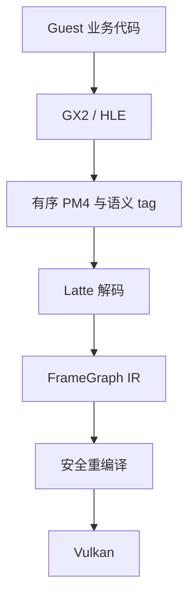
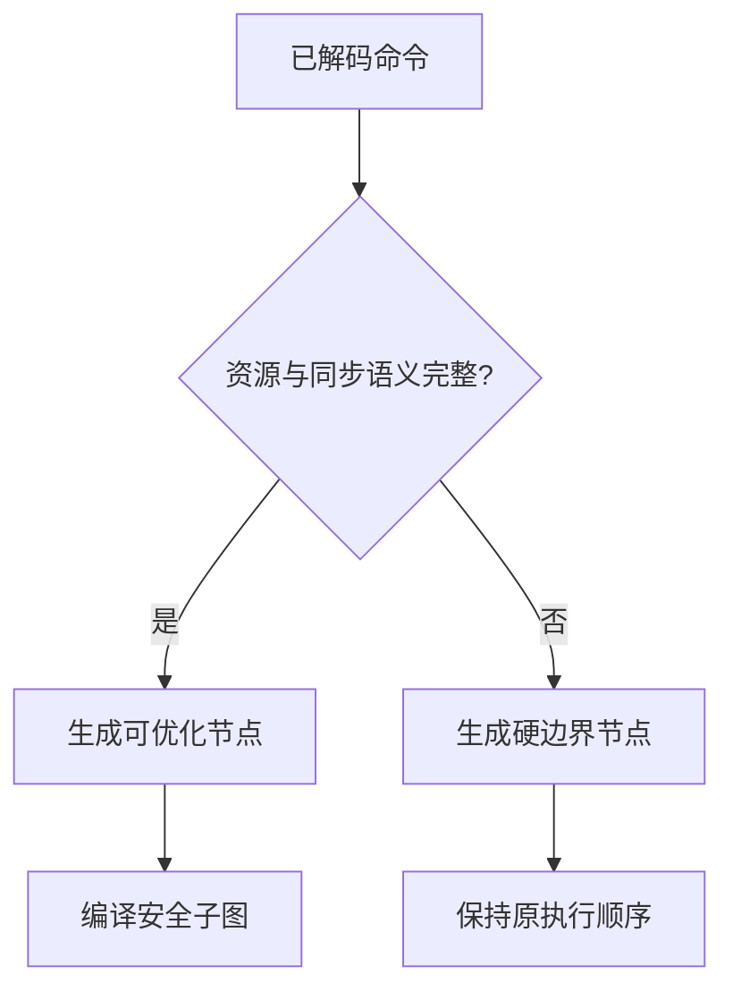
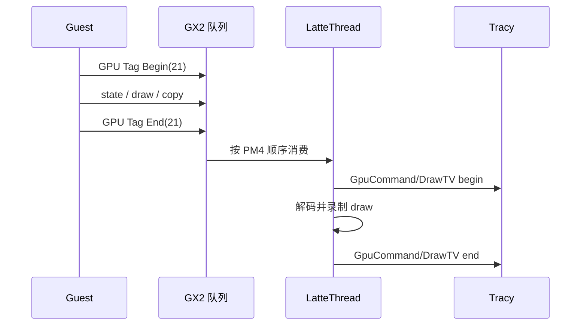
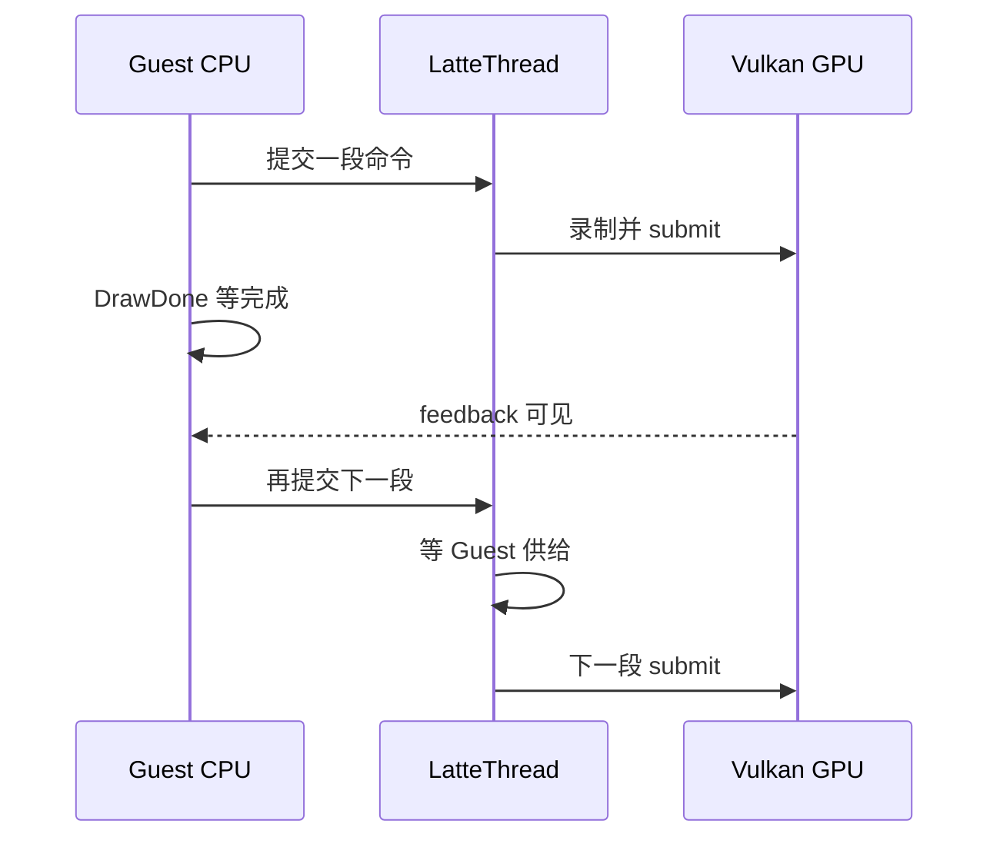
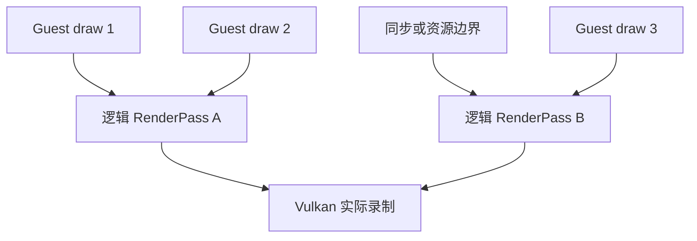
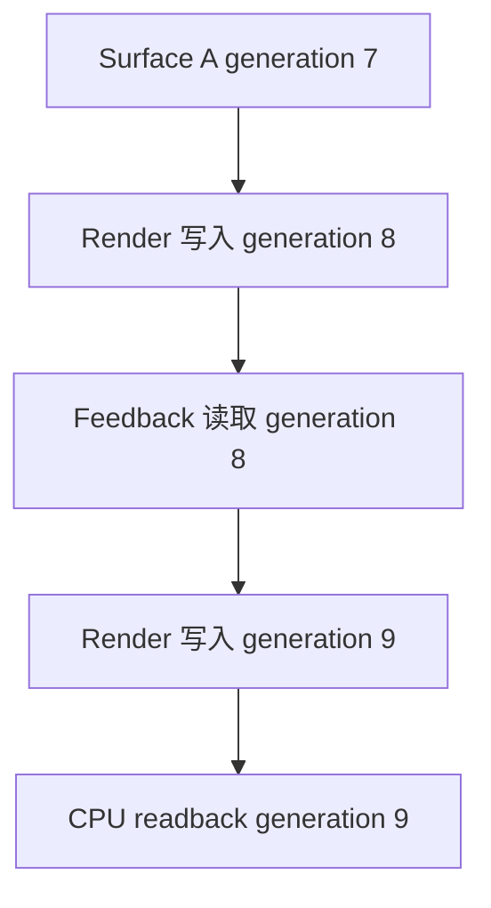

# Guest 语义标记与 Host FrameGraph 重编译设计

## 结论

引入 FrameGraph 比继续在 PM4 packet、Vulkan render pass 和单个 draw 上堆叠局部特判更适合
Cemu 的下一阶段优化，但它必须位于 **PM4 解码之后、Vulkan 命令录制之前**。它不是让 BotW
Guest 直接调用 Vulkan，也不是不经验证地重新排列 Wii U 命令。

推荐把链路拆成两部分：

1. Guest Mod/HLE 注入低频业务边界，例如 `PPCSystemTaskDrawTV`；该标记与真实 GX2 命令一起
   进入 command stream，保留严格顺序；
2. Host 把 PM4 解码成带资源读写、同步和 Guest 业务归属的 FrameGraph IR，再对能够证明安全的
   子图做重编译。

第一部分已经实现并在 BotW Wii U JP v208 gameplay 中验证。第二部分应先以 shadow mode
只建图、不改变执行，再逐步接管状态翻译、render-pass 合并和 submit 组织。



## 为什么不是直接替换现有执行器

Cemu 当前 PM4 流同时表达：

- render state、shader、texture、buffer 与 framebuffer；
- draw、copy、clear、query 与 display；
- `DrawDone`、`WAIT_REG_MEM`、readback 等 Guest 可观察完成语义；
- display list、间接 command buffer 与 context shadow；
- Guest CPU 可能立即读取或改写的内存。

这些信息不是普通 PC 游戏 FrameGraph 的高层 pass 声明。若只按“相邻 draw 使用同一 FBO”合并，
会破坏 attachment feedback、CPU visibility 或 query 结果。FrameGraph 必须从实际解码状态恢复
依赖，遇到未知 packet 或无法证明的 alias 时回退到原执行顺序。



## 当前 Guest 语义标记实现

### 两条 ABI

已有 BotW profiler patch 继续调用：

```c
void coreinit.hook_ProfileSectionBegin(uint32_t section_id);
void coreinit.hook_ProfileSectionEnd(uint32_t section_id);
```

其中渲染相关的 section `21..32` 会自动向 GX2 主 command stream 写入同序 GPU 语义标记。
这样不需要改动已经部署的 patch。

后续 Mod 也可以只表达 GPU 工作归属：

```c
uint32_t gx2.hook_GpuTagBegin(uint32_t section_id);
uint32_t gx2.hook_GpuTagEnd(uint32_t section_id);
```

返回 `1` 表示标记已写入，`0` 表示当前没有主 command buffer、处于 display list 录制期，或
profiler 未启用。固定 ID 避免每帧传 Guest 字符串，也避免在约 4000 次 draw 上逐次跨 HLE。

### PM4 中的有序表示

Cemu-only packet `IT_HLE_GUEST_GPU_TAG` 使用固定五个 payload dword：

| word | 含义 |
| ---: | --- |
| 0 | control；最高位表示 begin，0 表示 end |
| 1 | section ID |
| 2 | Guest `OSThread` ID |
| 3 | Guest LR，用于回到静态 callsite |
| 4 | reset generation，拒绝跨标题/重置的旧 packet |

标记必须与命令一起排队，而不能在 Guest HLE 调用当下直接给 `LatteThread` 改一个共享变量。
后者会丢失两个线程之间的先后关系。



display list 使用 Guest 提供的固定大小内存。向正在录制的 list 追加 Cemu metadata 可能越界，
所以当前不会在 list 内写标记；包围 `GX2CallDisplayList` 的主 command stream 标记仍会覆盖
该 list 的消费。状态命令 `guest_profiler_status` 会报告 display-list skip，不能静默丢失。

### Host 侧归属

`LatteThread` 消费 begin/end 后维护一个严格嵌套栈。当前 section ID 被记录到独立的
`Cemu Guest GPU Command Stream` profiler lane；zone 使用 `GpuCommand/` 前缀，避免与 Guest
CPU lane 上同名的 `PPCSystemTaskDrawTV` 聚合在一起。

`DrawPassContext` 在 draw batch 边界读取当前 section，并按 section 统计：

- Host command-stream wall time；
- draw fragment 数；
- draw 总数；
- fast/full draw 数。

它只在归属变化或 batch 结束时累加，不为每个 draw 增加一次原子操作。

## 真机证据：20 ms 工作为什么会扩成约 60 ms

样本为 AYN Thor / Kalama / Adreno 740、BotW JP v208 神庙 gameplay、Vulkan、
`1920x1080`、internal/static scale 均为 `1.0`。采集前完成无实体手柄 warmup，并截图确认已经
进入可操作场景。

运行时配对结果：

| 指标 | 结果 |
| --- | ---: |
| section 21 tag emitted | begin/end `1467 / 1467` |
| section 21 tag consumed | begin/end `1467 / 1466` |
| 查询瞬间 active depth | `1`，所以少一个 end 符合预期 |
| invalid / overflow / unmatched / stale | 全部 `0` |
| no-command-buffer / display-list skip | 全部 `0` |
| section 21 draw | `1,991,932` |
| section 21 fast draw | `1,335,621` |

稳定区间 frame `1000..1341` 中：

| 区间 | 累计时间 | 解释 |
| --- | ---: | --- |
| Host `GpuCommand/PPCSystemTaskDrawTV` | 约 `13.30 s` | 342 帧的有序命令消费区间 |
| `DrawDone` | 约 `11.85 s` | 包含 retirement wait |
| post-feedback `DrawDone` wait | 约 `8.55 s` | Guest feedback 后完成等待 |
| display ordinal wait | 约 `7.30 s` | display 生产/消费边界 |
| command ring wait for Guest | 约 `6.44 s` | Host consumer 等 Guest producer |
| Vulkan draw prepare | 约 `6.71 s` | 约 126 万次 draw prepare |

frame `1100` 是更直观的例子：

| 指标 | 时间 |
| --- | ---: |
| CPU frame | `82.305 ms` |
| Host command-stream DrawTV | `40.670 ms` |
| Guest CPU DrawTV | 约 `0.393 ms` |
| GPU covered time | `56.948 ms` |
| 三次 `DrawDone` | `77.991 ms` inclusive |
| display ordinal wait | `24.683 ms` |
| command ring wait for Guest | `14.967 ms` |
| Vulkan draw prepare | `20.121 ms / 3573 calls` |

因此不能把约 40 ms 的 Host tag 解释成 BotW Guest 自己花了 40 ms 发 draw。Guest CPU 的
业务函数本身约 0.4 ms；长区间主要覆盖 Host 对对应命令的解码、状态准备、Vulkan 录制和同步。

同时，`40.670 + 56.948 > 82.305`，说明 CPU 与 GPU 确实有重叠，不是完全串行。问题是三次
`DrawDone`、display wait 和 command-ring wait 把流水线反复切成 producer/consumer
乒乓：整体表现为 **串行为主、局部重叠，并存在跨帧工作**。



这也是 FrameGraph 有价值的地方：它不仅能合并 render pass，还能显式表示“哪些完成点真的
要求当帧 CPU 可见”，避免把历史实现中的每个切点都机械地变成 Host submit/wait。

### `GpuCommand/` 独立命名后的复核

最新 `RelWithDebInfo` 覆盖安装后重新按“Tracy 先连接、open last game、warmup、截图”的顺序
采集。截图确认 BotW v208 神庙 gameplay、`1920x1080` 输出、约 3959 draws；它只用于场景与
状态校验，不把 Tracy 连接时的瞬时 18.7 FPS 当作无 profiler 性能基线。

复核产物：

- trace：`_out/profiler/botw-guest-gpu-tags-framegraph-shadow-seed.tracy`，SHA-256
  `c51a852d5474656dc8e868189a587c255fdf619e870c250dff4ec728944d9e5f`；
- screenshot：`_out/profiler/botw-guest-gpu-tags-framegraph-shadow-seed.png`，SHA-256
  `ca0d6a422809a58359d9f355bbf1f3696a1bb621b2a9503edeb287e927a38b2b`。

稳定尾段 frame `1350..1594` 的同名区间已经正确分开：

| zone | 245 帧累计 | p50 | p90 |
| --- | ---: | ---: | ---: |
| Guest CPU `PPCSystemTaskDrawTV` | `54.031 ms` | `0.205 ms` | `0.252 ms` |
| Host `GpuCommand/PPCSystemTaskDrawTV` | `8010.598 ms` | `33.597 ms` | `38.047 ms` |

同一尾段中，`DrawDone` 累计 `8488.283 ms`、display ordinal wait `4881.859 ms`、command-ring
wait `3434.415 ms`、Vulkan draw prepare `4149.453 ms`。GPU 硬件时间覆盖约
`6503.691 ms / 145 帧`，但每帧约 529 个 GPU zone，instrumentation density 为 high；它适合
判断组成，不用于宣称绝对 GPU 性能。

frame `1500` 为 `66.530 ms`，其中 Host `GpuCommand/DrawTV` `35.957 ms`、三次 `DrawDone`
`40.152 ms`、draw prepare `19.336 ms / 4081 draws`、display wait `12.998 ms`、command-ring
wait `10.341 ms`、readback `4.700 ms`。这些区间跨线程嵌套和重叠，仍不能相加；它们再次证明
主要问题是分段完成点造成的 pipeline ping-pong，而不是 Guest 发出 draw 调用本身。

## FrameGraph IR

### RenderPass 在图中的位置

RenderPass 不在 FrameGraph 之外，也不能直接等同于 FrameGraph 节点。一个 `Render` 节点表示
一次 Guest draw 的资源访问；编译器把一串 attachment 集合相同、且中间没有可见性或同步硬边界
的 `Render` 节点归并成一个 **逻辑 RenderPass 候选**。Vulkan 后端再决定这个候选最终对应一个
dynamic-rendering 区间、传统 `VkRenderPass`，还是因为驱动/资源约束继续拆分。



因此约 4000 个 Guest draw、FrameGraph 的约 4000 个 Render 节点、逻辑 RenderPass 候选和
现有约 200 个 Vulkan pass 是四种不同粒度。P1 会同时报告前三者及实际 Vulkan pass 数，
但不会用候选数直接替换现有 pass。

### 节点类型

第一版 IR 至少需要以下节点：

| 节点 | 主要内容 |
| --- | --- |
| Render | attachment、shader、pipeline state、draw range、Guest tag |
| Transfer | buffer/image copy、resolve、clear、layout intent |
| Query | begin/end、result destination、Guest 可见策略 |
| Readback | source surface、staging destination、CPU consumer |
| Feedback | 上一代 GPU 结果到下一代 Guest/Host consumer |
| Present | scanbuffer、display ordinal、最终输出依赖 |
| HardBarrier | `DrawDone`、未知 PM4、CPU visibility、无法证明的 alias |

### 资源版本

不能只用 Vulkan image handle 建边。Cemu surface 可能 alias 同一段 Guest 内存，CPU 也可能
更新其中一部分。每次写入产生新的逻辑 generation，读依赖具体 generation：



每个资源访问至少包含：Guest 地址范围、surface/buffer identity、mip/slice/aspect、读写类型、
attachment/sample/transfer 用途和 CPU visibility。范围或 alias 不确定时建立保守边，而不是猜测。

### Guest tag 的作用

Guest tag 是调试与策略提示，不是资源依赖本身：

- 用于把 FrameGraph 节点映射回 BotW `DrawTV`、`RenderDisplay` 等业务阶段；
- 用于识别跨业务区间重复出现的固定 command pattern；
- 用于 Tracy/RenderDoc 中按业务聚合 compile 前后结果；
- 不能仅因为两个节点属于同一个 tag 就合并，也不能仅因 tag 不同就强制 barrier。

## 分阶段实施

### P0：有序语义标记

已完成：Guest profiler section 自动桥接和显式 `GpuTagBegin/End` ABI；Latte 消费栈、draw
归属、异常计数和独立 Tracy lane。显式新 ABI 尚未由独立 Mod 真机调用，现有 profiler ABI
到 PM4 的自动桥接已完成 gameplay 验证。

### P1：shadow graph

已实现第一版 shadow graph，默认关闭；开启后默认每 60 帧完整采样一帧，只在现有路径旁边
生成 IR，不改变 Vulkan 输出：

1. 每个 draw 生成一个 Render 节点，并采集当前 color/depth attachment、sampled texture、
   vertex/uniform/index buffer 和 Guest tag；
2. copy/clear、query、readback、present 与 Guest 可观察同步生成独立节点；
3. 每次资源写入推进 generation，生成 RAW、WAR、WAW、保守读序和 hard-barrier 边；
4. 按 attachment signature、非 Render 节点和硬边界生成逻辑 RenderPass 候选；
5. 同时记录现有 Vulkan render-pass/submit 次数，便于检查候选模型是否过度切分；
6. Foundation reflection 统一输出 debugbus 字段，Foundation Tracy 输出逐帧 counter。

实现入口：

- `LatteFrameGraphShadow.cpp/.h`：IR、资源版本、依赖边、候选 pass 编译与快照；
- `LatteCommandProcessor.cpp`：draw、copy、clear、query、present 和同步语义；
- `LatteTextureLegacy.cpp` / `LatteBufferData.cpp`：draw 使用的 surface/buffer；
- `LatteTextureReadback.cpp`：真正入队的 readback；
- `LattePerformanceMonitor.cpp`：帧边界、实际 Vulkan pass/submit 与 Tracy counter。

使用 debugbus 开启、查询或清零：

```sh
adb shell dumpsys activity service \
  info.cemu.cemu/.utils.DebugDumpService framegraph_shadow_status on
adb shell dumpsys activity service \
  info.cemu.cemu/.utils.DebugDumpService framegraph_shadow_status
adb shell dumpsys activity service \
  info.cemu.cemu/.utils.DebugDumpService framegraph_shadow_status reset
adb shell dumpsys activity service \
  info.cemu.cemu/.utils.DebugDumpService framegraph_shadow_status off
```

重点字段：

| 字段 | 含义 |
| --- | --- |
| `render_nodes` | 本帧 Guest draw 对应的 Render 节点数 |
| `frames_observed` / `sample_period_frames` | 开启后经过的帧数 / 完整建图采样周期 |
| `render_pass_candidates` | shadow 编译器认为可形成的逻辑 RenderPass 数 |
| `render_nodes_merged_into_candidates` | 被归入已打开候选、未单独开 pass 的 Render 节点数 |
| `actual_vulkan_render_passes` | 现有执行器实际结束的 Vulkan render pass 数 |
| `raw/war/waw/read_order/hard_barrier_edges` | 各类依赖边数 |
| `hard_barrier_nodes` / `hard_boundary_nodes` | 显式同步节点数 / 含 alias、feedback 等保守切点的总节点数 |
| `*_barriers` | 导致 pass/调度不能跨越的具体 Guest/Host 同步类型 |
| `*_fallbacks` | surface alias、缺 identity、raw address 或容量上限等保守回退 |
| `build_us` | 帧末扫描节点并编译候选所需的 Host CPU 时间；不含逐 draw 收集 |

Tracy counter 使用 `cemu.framegraph.shadow.*` 前缀。shadow 默认关闭，且开启时采用低频整帧
采样，因为对约 4000 draw 的资源收集本身有成本；性能 A/B 必须把“关闭时的原路径”与
“开启时的观测成本”分开。`build_us` 只计算帧末候选编译扫描，不包含逐 draw 收集成本。

这一阶段的价值是先验证编译器看到的依赖是否完整。它不应该改变 FPS 或画面。

第一版仍有明确限制：buffer/Guest memory 目前按起始地址建 key，并保留大小作为访问元数据，
尚未完成重叠区间合并；
copy/clear/present 仍以 raw address 表达，尚未全部解析回 surface identity；surface compatible
relation 一律形成保守硬边界；尚未计算带权 critical path。这些 fallback 必须先通过 BotW、
RenderDoc 和实际 pass 统计逐步收紧，不能为了减少候选数而直接忽略。

BotW v208 Android 的 P1 真机验证、完整字段快照和判断边界见
`docs/verification/botw-framegraph-shadow-p1.md`。

### P2：只重编译 Host 状态

先做不改变 GPU 顺序的优化：

- 合并冗余 `SET_*` 状态；
- 缓存相同 pipeline/descriptor/vertex binding 翻译；
- 按 dirty domain 只重新准备受影响状态；
- 保持 draw、copy、barrier 和 submit 原顺序。

### P3：编译安全岛

只在两个硬边界之间、资源版本完整的子图内：

- 合并兼容 render pass；
- 集中小型 transfer/readback staging copy；
- 在不延迟 Guest feedback 的前提下重组 submit；
- 对 attachment feedback 使用显式 ping-pong generation，而不是未定义的同 image 读写。

### P4：BotW v208 pattern fast path

对已经由 RPX identity、Guest tag、PM4 pattern 和 RenderDoc 共同证明稳定的子图，允许注册
title-scoped 编译规则。未匹配、checksum 不符或运行时资源形态变化时自动回退通用路径。

## 明确不能优化穿越的边界

以下节点默认是硬边界，除非有单独的等价性证明：

- Guest CPU 当帧读取的 query/readback/fence；
- attachment sampled-read 与 write feedback；
- surface/buffer alias 不确定；
- 未知或尚未建模的 PM4 packet；
- display list/context shadow 生命周期；
- title reset、frame boundary 与 scanbuffer/present 可见性；
- Vulkan validation 或驱动能力不足时需要的兼容路径。

FrameGraph 的第一目标不是“让图尽可能少”，而是把现有隐含顺序变成可检查的依赖。只有边被
证明多余时才删除。

## 验收标准

1. `RelWithDebInfo` 构建通过，覆盖安装不清用户数据；
2. warmup 后截图确认同一 BotW gameplay，draw/patch/resolution 状态一致；
3. Guest CPU tag 与 `GpuCommand/*` tag 分 lane，emitted/consumed 配对且异常为零；
4. shadow graph 的 draw、copy、query、readback 与现有执行统计一致；
5. RenderDoc 对照 attachment、resource history、pass/draw/copy 和最终画面；
6. Tracy 同时比较 Guest tag、Host compile/execute、Vulkan submit 与 GPU timeline；
7. 不出现 validation error、device lost、KGSL/SMMU fault 或 GPU page fault；
8. 每个接管阶段都可单独关闭并回退到上一已验证路径；
9. 正确性测试至少三分钟，性能结论使用相同场景的多窗口统计。

相关背景：

- [`guest-profiler-tags.md`](guest-profiler-tags.md)：Guest CPU profiler lane 与 HLE ABI；
- [`guest-host-structured-draw-fast-path.md`](guest-host-structured-draw-fast-path.md)：结构化 draw 的收益边界；
- [`guest-host-synchronization.md`](guest-host-synchronization.md)：Guest/Host 完成点；
- [`vulkan-render-pass-optimization.md`](vulkan-render-pass-optimization.md)：BotW render-pass/feedback 实证；
- [`cemu-frame-performance.md`](cemu-frame-performance.md)：整帧线程、CPU/GPU 与长帧基线。
