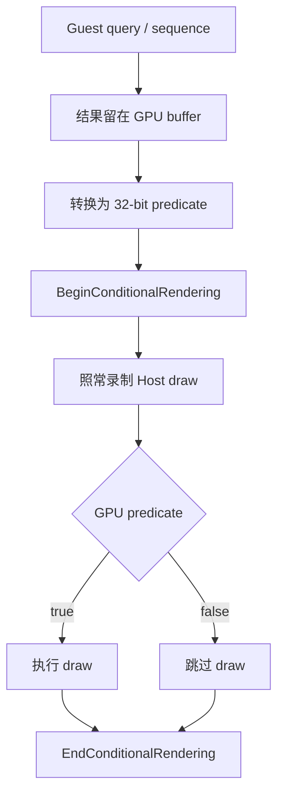
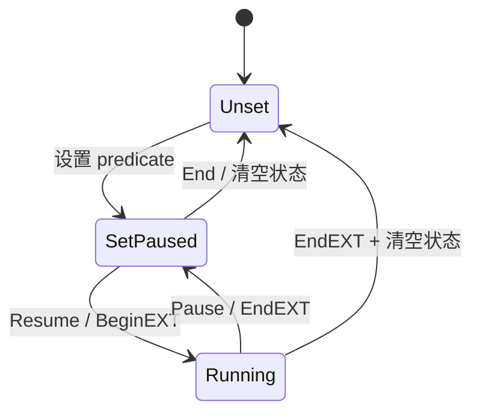
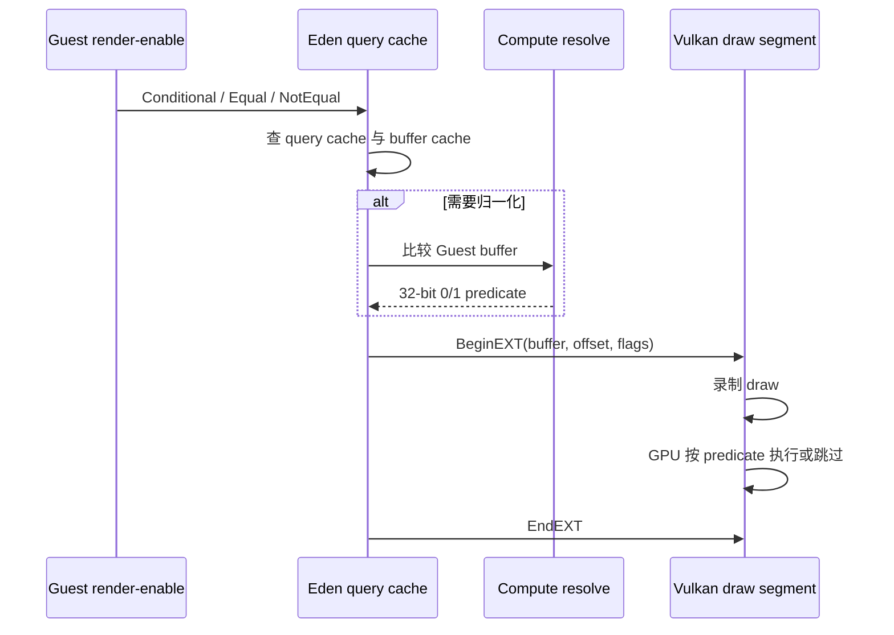
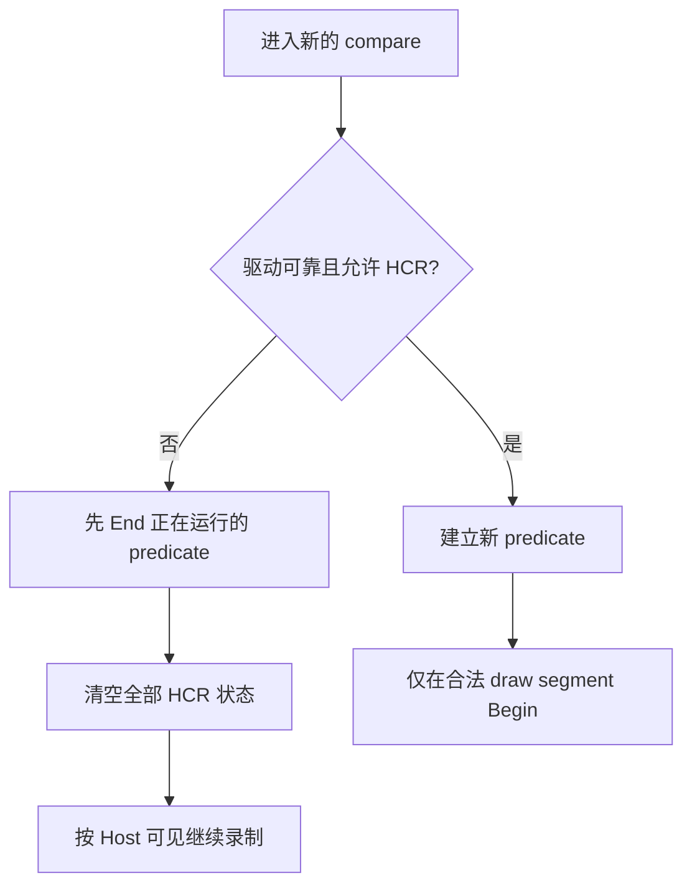
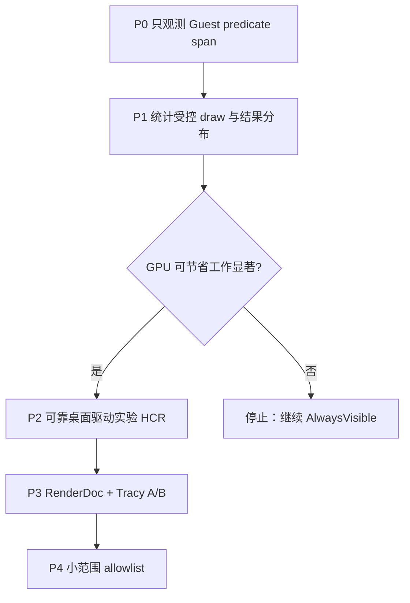

# Host Conditional Rendering：机制、Eden 实现与 Cemu 引入评估

本文说明 Host Conditional Rendering（HCR）解决什么问题、Eden 如何把 Switch Guest 的
render-enable/query 语义映射到 Vulkan，以及这套机制对 Cemu/BotW 的实际价值和引入边界。

结论先行：**HCR 是一种避免 Guest query 结果回到 Host CPU 的 GPU 侧 draw gate，不是 PM4
翻译器，也不是 Host HSR。** 它可以减少 predicate 为 false 时 Host GPU 真正执行的
vertex/raster/fragment 工作，但 Cemu 仍然要解析 Guest command、准备 pipeline/descriptor 并录制
draw。当前 Android 目标使用 Qualcomm proprietary 或 Turnip，Eden 对这两类驱动明确禁用
HCR；因此不建议把它作为当前移动端 FPS 优化主线。

## 1. 它处理的是什么

Guest 游戏常见的条件渲染流程是：

1. 先绘制一个边界体或执行 occlusion query；
2. GPU 把 sample count、sequence 或比较值写入 Guest-visible memory；
3. Guest 设置 predicate，声明后续 draw 仅在比较成立时执行；
4. Guest 结束 predicate，后续 draw 恢复无条件执行。

直接模拟有两种低效做法：

- 把 query 结果同步到 Host CPU，再由模拟器决定是否录制 draw；
- 每次 predicate 都等待 Guest memory 完全可见，放大为 command-buffer submit/fence wait。

Vulkan `VK_EXT_conditional_rendering` 提供第三种方式：把一个 Host buffer 的 32-bit 值交给
GPU，由 `vkCmdBeginConditionalRenderingEXT` 和 `vkCmdEndConditionalRenderingEXT` 包住 draw。
值为零时，GPU 跳过范围内受条件控制的绘制命令；Host CPU 无需等待结果。



这里的“跳过”发生在 Host GPU 执行阶段。Host 侧仍然发生：

- Guest command/PM4 decode；
- register dirty routing；
- pipeline、descriptor、buffer 和 texture 准备；
- Vulkan draw command 录制；
- predicate buffer 的同步与可能的 compute resolve。

因此 HCR 与 Adreno HSR 的作用层不同：

| 机制 | 决策位置 | 主要减少 | 不会减少 |
|---|---|---|---|
| Guest predication | Guest GPU command model | Guest 期望跳过的整批 draw | query/predicate 管理 |
| Vulkan HCR | Host GPU command execution | vertex、raster、fragment 等实际 draw 工作 | Cemu PM4 decode 与 draw prepare |
| Host HSR/Hi-Z | Host raster/depth 阶段 | 被遮挡 fragment、部分带宽 | draw translate、vertex/tiler |

## 2. Eden 的完整状态机

Eden 不是简单地在 compare 入口调用一次 Begin。它维护以下状态：

| 状态 | 含义 |
|---|---|
| `hcr_setup` | 当前 `VkConditionalRenderingBeginInfoEXT`，包含 predicate buffer、offset、flags |
| `hcr_buffer` / `hcr_offset` | 当前 predicate 的物理来源 |
| `hcr_is_set` | 已经有一个可恢复的 predicate 配置 |
| `is_hcr_running` | 当前 command recording segment 内已经录制 Begin、尚未录制 End |
| `hcr_resolve_buffer` | 单值/双值比较被归一化后的 32-bit predicate buffer |

这两个布尔值不能合并：一个 predicate 可以在跨越非 draw 操作时仍然“已设置”，但必须暂时
结束 Vulkan conditional rendering，等回到合法 draw segment 后再恢复。

### 2.1 四个核心动作



- `ResumeHostConditionalRendering()`：当 `hcr_is_set=true` 且尚未运行时录制 Begin；
- `PauseHostConditionalRendering()`：当已经运行时录制 End，但保留 predicate 配置；
- `EndHostConditionalRendering()`：先 Pause，再无条件清空 set/running/buffer/offset；
- compare helper：必要时先 Pause，更新 predicate 来源，保持 paused，等下一段 draw 再 Resume。

Pause/Resume 用来满足 Vulkan 的 recording scope：predicate 不能无边界地跨过 resolve、copy、
display 或 command-buffer 提交。Eden 在 draw prepare 前恢复，在 display、scheduler segment
结束等边界暂停。

### 2.2 单值和双值比较

Eden 的 Guest 是 Switch Maxwell，源语义来自 `render_enable`，不是 Wii U Latte 的地址或 ABI。
两者只能复用“query/内存比较控制后续 draw”这一抽象。

单值 `Conditional` 与双值 `IfEqual/IfNotEqual` 最终都需要一个 Vulkan 可消费的 32-bit
predicate：

- predicate 已经能映射到合适 Host buffer 时，直接保存 buffer + offset；
- Guest 布局或双值比较不能直接作为 Vulkan predicate 时，运行一个 compute resolve；
- compute shader 把 Guest 的 8/24-byte 比较结构归一化为 `0/1`；
- compute write 后使用 barrier，把结果转为
  `VK_ACCESS_CONDITIONAL_RENDERING_READ_BIT_EXT` 可见。



### 2.3 CPU fallback

如果 backend/驱动不能加速，Eden 回到 `Maxwell3D::ProcessQueryCondition()`：读取 Guest memory，
计算 `execute_on`，再由 Guest engine 决定是否提交后续工作。这个 fallback 语义更直观，但可能
引入 Guest GPU memory 到 Host CPU 的同步。

HCR 快速路径返回成功后，Eden 把 `execute_on` 保持为 true：这不代表 predicate 恒真，而是
告诉 CPU 侧“继续录制，真正的条件已经交给 Host GPU”。

## 3. 为什么必须 End 后再短路

Eden 对以下 driver ID 禁用 HCR：

- `VK_DRIVER_ID_QUALCOMM_PROPRIETARY`；
- `VK_DRIVER_ID_ARM_PROPRIETARY`；
- `VK_DRIVER_ID_MESA_TURNIP`；
- Intel proprietary Windows 在低 GPU 精度配置下也走清理短路。

关键不只是“不再 Begin”。如果上一段 predicate 已经开始，直接 `return true` 会让旧 predicate
继续控制后续 draw。后续 draw 可能被错误吞掉，表现为漏绘、黑屏、静止画面或 0 FPS。

正确短路必须是：

```text
EndHostConditionalRendering()
  -> 正在运行时录制 vkCmdEndConditionalRenderingEXT
  -> hcr_is_set = false
  -> is_hcr_running = false
  -> hcr_buffer = VK_NULL_HANDLE
  -> hcr_offset = 0
return true
```

Eden 的 `b027dc42ce` 同时修正单值和双值入口；`742cadde1d` 又约束 Begin/End 必须落在同一
render-pass recording segment，避免 clear/draw-texture/resolve 或 pass teardown 把 predicate
悬挂到 submit。



## 4. Cemu 当前状态与差异

Cemu 当前没有启用或调用 `VK_EXT_conditional_rendering`：

- `LatteCP_itSetPredication()` 只记录 Guest conditional active/inactive；
- Vulkan draw 路径不读取该状态，也没有 Begin/End EXT；
- 默认 `AlwaysVisible` 在 Guest query end 写回保守可见值 1；
- Host occlusion query、query resolve 和由此产生的 render-pass split 被跳过；
- `accurate` 仅作为 debug/兼容路径，仍不根据结果做 Host draw culling。

所以 Eden 的“旧 Host predicate 遗留”在当前 Cemu 中没有可触发对象。本次系统 Qualcomm
驱动闪烁而 Turnip T29 正常，也不能归因于这条 HCR 路径。当前 Cemu 不应机械复制
`EndHostConditionalRendering()`；没有 Begin 的状态机只会形成无消费者代码。

另外，Eden 针对 Switch Maxwell 的 `render_enable` 比较结构不能直接套到 BotW Wii U v208：

- Guest packet、query memory layout 和比较规则不同；
- Cemu 需要以 `IT_SET_PREDICATION`、GX2 query memory 和 Latte event ordering 重新建模；
- 只能参考 Host 生命周期、buffer resolve 和 driver denylist。

## 5. 对 Cemu 引入的价值评估

### 5.1 能获得什么

若 Cemu 未来实现完整、可靠的 HCR，predicate 为 false 的 draw 仍会被录制，但 Host GPU 可以
跳过其实际执行。这可能减少：

- vertex fetch / vertex shader；
- primitive assembly、tiler/binning；
- raster、fragment 和 attachment 访问；
- GPU-bound 场景中的 command-buffer 完成时间。

BotW accurate 证据中 11,484 个 query 有 11,478 个结果为 0，说明 Guest 确实大量使用
occlusion 结果；但这还不能推导可跳过多少 draw。需要把每个 predicate 的作用区间与 draw
数量关联后，才能估算真实上限。

### 5.2 当前不能解决什么

当前 BotW 约有 3,800～4,200 draws/帧，Host draw translate/prepare 已测约 17～23 ms/帧。
HCR 不会消除这些 CPU 工作，因为 Vulkan 仍要求应用录制受条件控制的 draw。它也不会直接
解决：

- PM4 decode 与寄存器状态翻译；
- pipeline/descriptor cache miss；
- readback、display ordinal、fence/retirement；
- Guest 与 Host 串行依赖；
- 不属于 predicate 区间的 draw。

### 5.3 平台价值

| 平台/场景 | 预期价值 | 主要原因 |
|---|---|---|
| 当前 Android + Qualcomm proprietary | 低 / 不应启用 | Eden 已禁用，query/sync 条件下不可靠 |
| 当前 Android + Turnip T29 | 低 / 不应启用 | 同样在 Eden denylist；当前产品设备正使用该路径 |
| Mali Android | 低 / 不应启用 | ARM proprietary 同样存在可靠性规避 |
| 可靠桌面 Vulkan、明显 GPU-bound | 中 | 可能省掉 predicate-false draw 的 GPU 执行 |
| CPU translate-bound | 低 | 仍需完整 decode、prepare 和 draw recording |
| 需要准确 Guest CPU sample count | 无替代价值 | HCR 只控制 draw，不能替代 CPU 可观察结果 |

### 5.4 实现成本

完整引入成本为中高，不是增加两个 Vulkan 调用：

1. 建立 Latte predicate 状态与 query memory identity；
2. 判断结果位于 Guest CPU memory、Host query cache 还是 buffer cache；
3. 为 GX2 单值/比较语义实现 32-bit resolve；
4. 管理 compute-to-conditional-read barrier；
5. 在 render-pass/command-buffer/submit/copy/display 边界正确 Pause/Resume；
6. 在 disable、fallback、title reset、device lost 等路径统一 End + clear；
7. 建立可靠驱动 allowlist/denylist；
8. 增加 predicate span、受控 draw、true/false 和 GPU saved-work 指标；
9. 对场景正确性、黑屏/漏绘和性能做逐驱动回归。

## 6. 推荐推进顺序

当前建议是：**不把 HCR 合入 Android 产品默认路径，先把它作为有证据门槛的桌面实验项。**



建议先补以下指标，而不是先写 Vulkan 状态机：

- `predication_begin/end` 数量与嵌套/失配；
- 每个 predicate span 覆盖的 draw 数；
- predicate true/false 分布；
- false span 对应的 vertex/index 数和估算像素面积；
- CPU consumer 是否读取精确 query result；
- query/resolve/pass split 成本；
- Host GPU 是否真正在 predicate-false 区间节省时间。

只有在“受控 draw 占比高、false 比例高、GPU 明显受限、驱动可靠”同时成立时，HCR 才值得
进入 P2。当前 Android 与 BotW FPS 优化仍应优先推进 PM4/state dedup、draw prepare cache、
readback/fence 去串行和连续 render-pass/framegraph。

## 7. 参考实现与相关文档

本次分析基于本地只读 Eden 仓库：

- `src/video_core/query_cache/query_cache.h`：Guest mode 分派和 predicate lookup；
- `src/video_core/renderer_vulkan/vk_query_cache.cpp`：HCR 状态与 driver workaround；
- `src/video_core/renderer_vulkan/vk_compute_pass.cpp`：predicate compute resolve 与 barrier；
- `src/video_core/host_shaders/resolve_conditional_render.comp`：8/24-byte 比较转 32-bit 结果；
- `src/video_core/renderer_vulkan/vk_rasterizer.cpp`：draw/display segment 的 Resume/Pause；
- `src/video_core/renderer_vulkan/vk_scheduler.cpp`：recording segment 边界；
- commit `5ea12207f3`：Vulkan query cache 与 HCR 主体；
- commit `b027dc42ce`：恢复 Qualcomm/Mali/Turnip workaround；
- commit `742cadde1d`：约束 Begin/End 位于同一 render-pass instance。

Cemu 相关入口：

- `src/Cafe/HW/Latte/Core/LatteCommandProcessor.cpp`：`IT_SET_PREDICATION`；
- `src/Cafe/HW/Latte/Core/LatteQuery.cpp`：accurate/always-visible policy；
- `src/Cafe/HW/Latte/Renderer/Vulkan/VulkanQuery.cpp`：Vulkan occlusion query；
- [移动 GPU HSR 与 Cemu Occlusion Query 策略](mobile-occlusion-query-hsr.md)；
- [Cemu 帧性能结构](cemu-frame-performance.md)。
