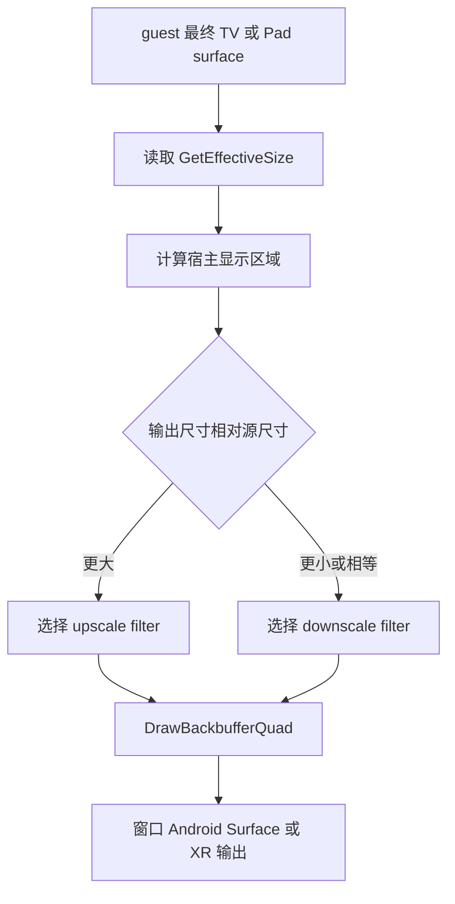
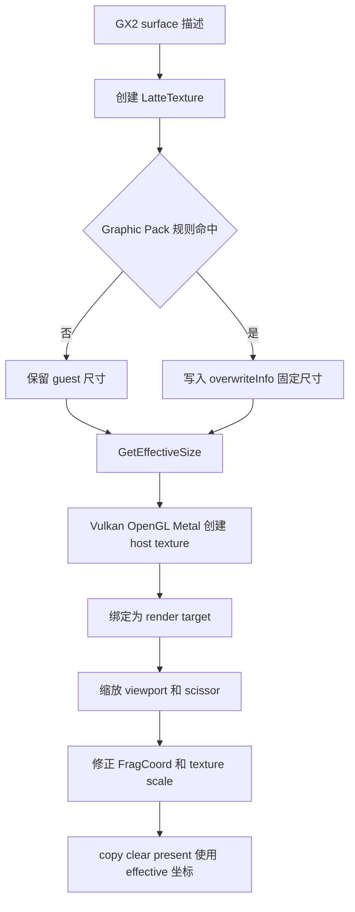
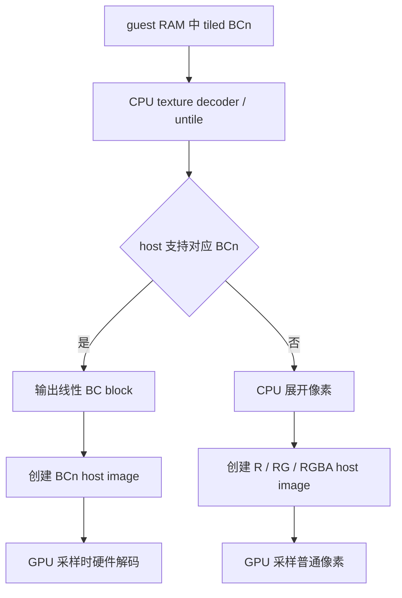
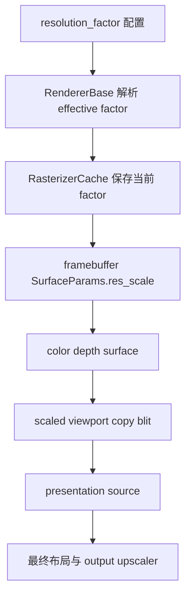
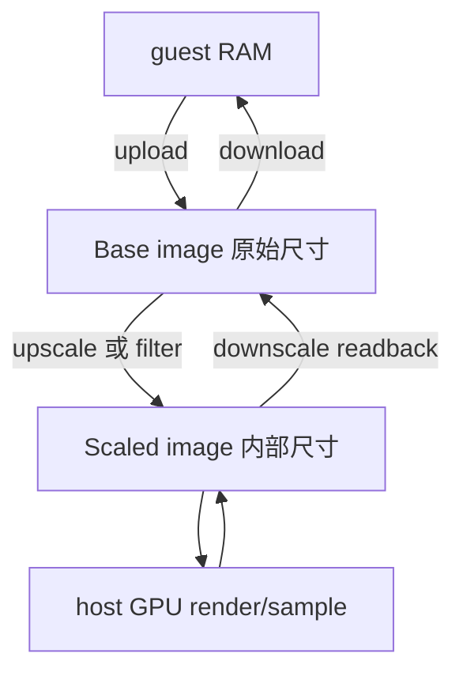
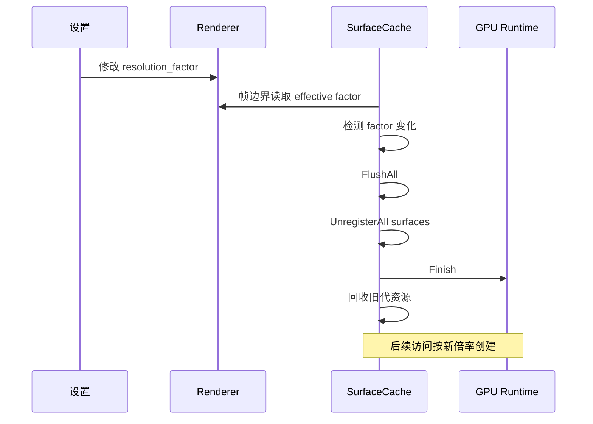
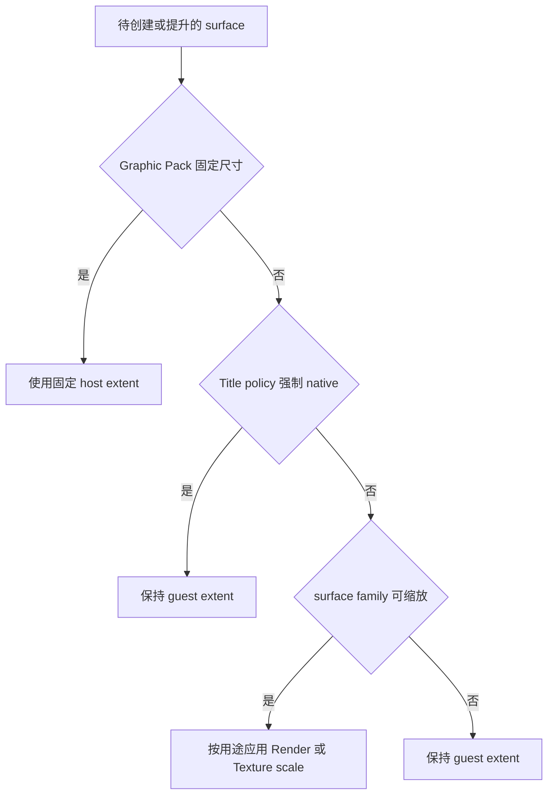
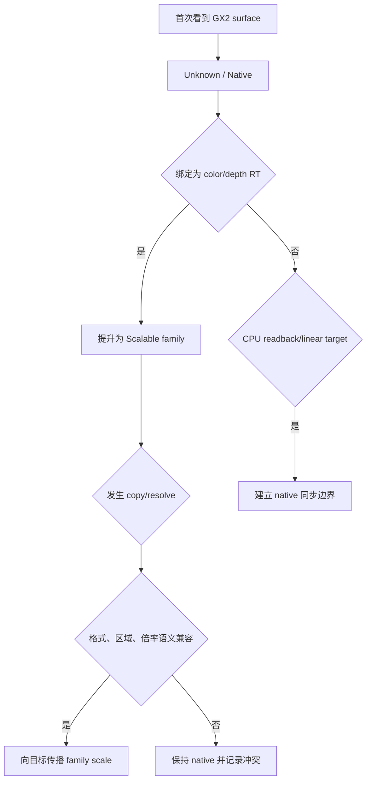
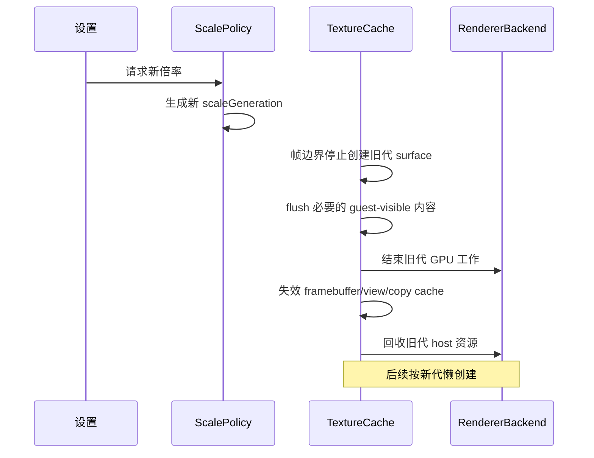
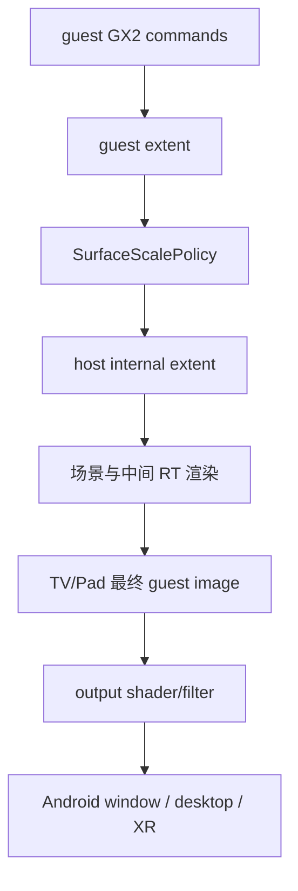

# Cemu 内部分辨率缩放架构梳理

> 后续实施规格见 `docs/plans/2026-08-02-internal-resolution-scaling-spec.md`。
> Android Vulkan gameplay 的真实 viewport、MRT/depth 与 swapchain 证据见
> `docs/architecture/renderdoc-graphics-analysis.md`。
> 2026-08-02 已确定先移除 Cemu OpenGL 后端；本文中关于 OpenGL 的内容仅保留为
> 现状分析和历史缺口，后续架构与验收只覆盖 Vulkan、Metal，并以实施 spec 为准。

本文梳理 Cemu 当前与“分辨率缩放”有关的真实实现，并以 Azahar 的内部渲染倍率为参照，给出后续调整 Cemu 时应采用的概念边界、资源模型和分阶段落地建议。

## 结论

Cemu 目前没有 Azahar 意义上的全局 `internal resolution`：

- `Upscale filter`、`Downscale filter` 和 `Fullscreen scaling` 只作用于最终画面合成到窗口或 Android Surface 的阶段。
- guest 侧 GX2 surface 的 host 分配尺寸默认仍是游戏声明的尺寸。
- Cemu 确实能通过 Graphic Pack 的 `[TextureRedefine]` 把特定纹理改成另一个尺寸，并联动 viewport、scissor、采样坐标和部分 copy 路径；这是一套“按规则重定义个别表面”的机制，不是一等的全局内部渲染倍率。
- 现有 resized-texture 路径还有明确缺口：普通纹理回读不支持改分辨率的纹理，部分 OpenGL upload 路径也不支持，copy 兼容判断较宽松且不完整。因此不能只把一个全局倍率写进 `overwriteInfo`。

后续实现应把以下四件事分开：

1. **guest surface 尺寸**：GX2 和游戏认为的逻辑尺寸。
2. **static texture extent/filter**：素材纹理的 host 尺寸及其增强策略。
3. **render-surface extent**：color/depth 和中间目标的实际 raster 尺寸。
4. **presentation extent/filter**：最终窗口、Android Surface 或 XR 输出尺寸及其滤镜。

移动设备的重点候选不是无条件提高 internal resolution，而是独立组合：静态素材
Texture 2x、Render Surface 0.5x，最后 upscale 到物理屏。这能否优于原生只由游戏内
实测决定；Texture scale、Render scale 与 output scale 不得通过一个全局倍率联动。

Azahar 最值得借鉴的不是设置页面，而是 `guest 原始映像 + host 放大映像`、surface cache 的倍率语义，以及倍率变化时统一失效和重建的资源生命周期。

## 术语约定

| 术语 | 本文定义 | Cemu 当前对应物 |
| --- | --- | --- |
| guest extent | 游戏通过 GX2 声明、参与 guest 内存布局和寄存器语义的尺寸 | `LatteTexture::width/height/depth` |
| effective/internal extent | host GPU 实际用于渲染、采样的尺寸 | `GetEffectiveSize()`；当前只受 Graphic Pack override 影响 |
| internal scale | 从 guest extent 到 internal extent 的集中式倍率策略 | 当前没有全局实现 |
| presentation extent | TV/Pad 画面最终绘制到宿主 surface 的区域 | `LatteRenderTarget_getScreenImageArea()` 的结果 |
| output filter | internal image 到 presentation extent 的采样方式 | linear、bicubic、Hermite、nearest 或 Graphic Pack output shader |
| surface family | 因 render、resolve、copy、alias 或 readback 共享内容语义的一组 surface | 当前主要靠 texture cache、地址范围和事件计数隐式维护 |

“2x internal resolution”和“把 720p 画面拉伸到 1080p”不是同一件事。前者会增加 guest draw 对应的 rasterization 像素数、深度缓冲和中间 render target 成本；后者只增加最终一次合成的输出成本。

## Cemu 当前链路

### 最终输出缩放

Android 图形设置当前只暴露：

- fullscreen scaling：保持比例或拉伸；
- upscale filter；
- downscale filter。

配置定义位于 `src/config/CemuConfig.h`，Android UI 和 JNI 分别位于：

- `src/android/app/src/main/java/info/cemu/cemu/settings/graphics/GraphicsSettingsScreen.kt`
- `src/android/app/src/main/cpp/NativeSettings.cpp`

最终输出由 `LatteRenderTarget_copyToBackbuffer()` 完成。它先读取源纹理的 effective size，再根据宿主窗口区域判断本次是放大还是缩小，选择输出 shader/filter，最后调用 `DrawBackbufferQuad()`。



这条链路不会回头改变前面场景、阴影、深度或后处理 render target 的 rasterization 分辨率，所以它不是 internal scaling。

### Graphic Pack 的 TextureRedefine

`src/Cafe/GraphicPack/GraphicPack2.cpp` 解析 `[TextureRedefine]`。规则可以按以下属性筛选纹理：

- width、height、depth；
- format 白名单或黑名单；
- tile mode 白名单或黑名单；
- 是否位于 MEM1。

命中后可指定固定的 `overwriteWidth`、`overwriteHeight`、`overwriteDepth`，还可改 format、LOD bias 和 anisotropy。`LatteTexture` 构造时遍历当前生效的 Graphic Pack，把结果写入 `overwriteInfo`。

这里有两个关键语义：

1. override 是**按纹理规则匹配**的，不是自动作用于所有 render target。
2. override 保存的是**绝对目标尺寸**，不是统一的倍率。

### effective size 如何传播

当前传播路径如下：



具体已有能力包括：

- `LatteTexture::GetEffectiveSize()` 在 guest 尺寸和 Graphic Pack 固定尺寸之间选择。
- Vulkan、OpenGL、Metal 的纹理创建路径都使用 effective extent 分配 host texture。
- `LatteMRT::UpdateCurrentFBO()` 同时记录 real size 和 effective size，并标记当前 render target 是否被放大。
- `LatteRenderTarget_updateViewport()` 和 `LatteRenderTarget_updateScissorBox()` 按 effective/real 比例换算坐标。
- `LatteMRT::GetCurrentFragCoordScale()` 向 shader 修正路径提供 real/effective 比例和 guest viewport。
- 纹理绑定时设置 effective texture scale，避免 guest shader 直接把 host 放大尺寸当作新的逻辑纹理范围。
- clear、surface copy 和 texture copy 的若干路径会把 guest 坐标换算到 effective 坐标。

这说明 Cemu 已有一部分 internal scaling 所需的坐标修正基础，但其入口和一致性仍围绕 Graphic Pack 特例设计。

### 当前明确缺口

#### 1. 没有全局策略对象

不存在类似 Azahar `resolution_factor` 的集中配置，也没有“configured factor”和“当前 effective factor”的区分。每个纹理只知道自己有没有固定的 Graphic Pack override。

#### 2. 没有 surface 可缩放性分类

Wii U 游戏会创建大量用途不同的 GX2 surface。当前 Graphic Pack 规则实际同时承担了两项工作：

- 识别哪些 surface 应该放大；
- 指定它们要放到多大。

如果要增加全局倍率，必须先把“是否可缩放”和“缩放到多大”拆开。

#### 3. resized texture 不是完整双向同步模型

`LatteTextureReadback_Initate()` 明确拒绝 `hasResolutionOverwrite` 的纹理；guest 读取这类 GPU 结果时，当前机制不能保证按 guest 原始尺寸正确回写。

Azahar 会先把 scaled image 缩回 base image，再从 base image 下载。Cemu 当前通常只创建一张 effective-size host texture，没有等价的原始尺寸映像作为稳定同步边界。

#### 4. copy 的倍率兼容判断不够严格

`LatteTexture_doesEffectiveRescaleRatioMatch()` 当前只根据宽度计算倍率，未独立核对高度，并允许 5% 误差；不兼容时部分 copy 路径直接跳过。这对少量精心编写的 Graphic Pack 规则可以工作，但不能作为全局倍率的一致性保证。

#### 5. 后端覆盖仍有缺口

例如 OpenGL `_loadSlice` 路径明确断言不支持 resolution overwrite。直接扩大 override 的覆盖面，会把原本很少触发的限制变成常见路径。

#### 6. 缺少倍率变更的资源代际

纹理在构造时决定 override 和 host allocation。运行中改变一个未来的全局倍率时，目前没有统一的 generation、flush、recreate 和状态迁移协议。

## Host GPU 纹理压缩现状

### 结论

Cemu 不是固定把 guest 压缩纹理全部展开后再交给 host GPU，而是按 host 格式能力选择：

- host 支持对应 BCn 格式时：保留 BC1–BC5 块压缩，CPU 主要把 Wii U tiled/swizzled 布局解排成线性 BC block 流，然后上传到压缩格式的 host image；host GPU 在采样时硬件解码。
- host 不支持对应 BCn 格式时：Cemu 在 CPU 侧把 BC block 展开为 R8、RG8 或 RGBA8，再上传到非压缩 host image。
- render target 通常是可渲染的 color/depth 格式，不会转成 BCn。驱动可能在物理显存中使用 UBWC 等厂商内部无损压缩，但这对 Cemu/Vulkan 是透明的，不能当成 Cemu 可控制的 texture compression 策略。

BC 数据不是由 host GPU 临时重新压缩。游戏资源本来就是 BC block；Cemu 在能力允许时尽量保存这种表示。



### Vulkan 路径

`VulkanRenderer::QueryAvailableFormats()` 查询 BC1–BC5 的 Vulkan format properties，结果进入 `m_supportedFormatInfo.fmt_bc*`。`GetTextureFormatInfoVK()` 再选择 host format 和 CPU decoder：

| guest 格式 | host 支持时 | host 不支持时 |
| --- | --- | --- |
| BC1 | `VK_FORMAT_BC1_*_BLOCK` + 保留 block 的 decoder | `VK_FORMAT_R8G8B8A8_*` + BC1 展开 |
| BC2 | `VK_FORMAT_BC2_*_BLOCK` + 保留 block 的 decoder | `VK_FORMAT_R8G8B8A8_*` + BC2 展开 |
| BC3 | `VK_FORMAT_BC3_*_BLOCK` + 保留 block 的 decoder | `VK_FORMAT_R8G8B8A8_*` + BC3 展开 |
| BC4 | `VK_FORMAT_BC4_*_BLOCK` + 保留 block 的 decoder | `VK_FORMAT_R8_*` + BC4 展开 |
| BC5 | `VK_FORMAT_BC5_*_BLOCK` + 保留 block 的 decoder | `VK_FORMAT_R8G8_*` + BC5 展开 |

`TextureDecoder_BC1/2/3/4/5` 的输出仍按 4x4 block 计数；例如 BC1 每块 8 字节，BC3/BC5 每块 16 字节。名字中的 `decode` 在这里包含 untile/重排，不代表一定解压成逐像素 RGBA。只有 `*_To_R8*`、`*_To_R8G8*`、`*_To_R8G8B8A8` 等 fallback decoder 才真正展开。

展开后的 host 显存量相对 BC 数据大致为：

| 格式 | BC 存储 | fallback 存储 | 约增加 |
| --- | ---: | ---: | ---: |
| BC1 | 8 B / 4x4 | RGBA8，64 B / 4x4 | 8x |
| BC2/BC3 | 16 B / 4x4 | RGBA8，64 B / 4x4 | 4x |
| BC4 | 8 B / 4x4 | R8，16 B / 4x4 | 2x |
| BC5 | 16 B / 4x4 | RG8，32 B / 4x4 | 2x |

### 当前 Android 设备

2026-08-02 对连接的 AYANEO Pocket DS 只读查询结果：

- GPU：Adreno 740；
- Android Vulkan：`textureCompressionBC = true`；
- Vulkan BC1–BC5 format 均报告非零 optimal-tiling features；
- Android native 入口在 `NativeEmulation.cpp` 直接创建 `VulkanRenderer`。

因此当前设备运行 Cemu Android 时，BC1–BC5 会走压缩 host image 路径，而不是统一展开为 RGBA。这个结论来自设备能力与 Cemu format resolver 的共同结果，不是只按 GPU 型号推断。

### OpenGL 与 Metal

- OpenGL 对 BC1、BC3、常规 2D/array BC4 和 BC5 使用 S3TC/RGTC 压缩 texture；BC2 当前走 `RGBA16F` 替代格式，特殊维度的 BC4 也会展开。
- Metal format table 直接把 BC1–BC5 映射到对应 `MTL::PixelFormatBC*`，上传仍按 block bytes-per-row 计算。

### 与 internal scaling 的关系

资源纹理压缩和 internal resolution 是两条不同轴线：

- BCn 主要用于静态 sampled texture，通常不应随 internal factor 放大。
- internal factor 主要放大 color/depth render target；这类 image 需要作为 attachment 写入，不能直接改成 BCn。
- 2x internal resolution 对主要 render target 的像素和带宽成本通常接近 4x，不能因为静态 BC 纹理仍压缩就低估其显存压力。
- Graphic Pack resolution override 的 texture upload 当前会清空目标而不是把原数据缩放上传，这进一步说明不能把全局倍率无条件应用到压缩资源纹理。

Azahar 另有可选的 ASTC surface-cache 压缩：只处理符合条件、且不是 render target/storage/video/shadow 等用途的放大 sampled surface。这可以作为未来“纹理增强后的缓存压缩”参考，但不属于 Cemu internal resolution 的第一阶段，也不应代替 color/depth RT 的资源预算。

## Azahar 的 internal resolution 模型

参考仓库：`/Users/bytedance/workspace/emulations/3ds/azahar`。

### 配置与 effective factor

Azahar 在 `src/common/settings.h` 中定义 `resolution_factor`：

- `1..10`：手动整数倍率；
- `0`：Auto；
- software renderer 强制 1x。

`RendererBase::GetResolutionScaleFactor()` 负责把配置值解析成当前 effective factor。Auto 会结合输出区域；使用 FSR 1 时还会结合质量档位计算所需的内部倍率。状态层同时显示 configured 状态和 effective 结果，例如 `Auto -> 3x`。

FSR/output upscaling 与 internal resolution 仍是两个独立概念。Azahar 的 Android 描述也明确写明：内部渲染分辨率独立于最终 upscaling。

### 倍率进入 surface cache

Azahar 的 `SurfaceParams` 同时保存：

- guest width/height；
- `res_scale`；
- `GetScaledWidth/Height()`。

framebuffer color/depth surface 创建时直接采用当前全局 `resolution_scale_factor`。普通 sampled texture 默认保持 1x，只有纹理滤镜或视频放大策略要求时才使用 internal factor。这避免了无条件放大所有静态纹理。



### base/scaled 双映像

Azahar 的 Vulkan `Surface` 在倍率大于 1 时维护原始和放大两类 image handle：

- `Base`：guest 原始尺寸，作为 CPU upload/download 和 guest 内存语义边界；
- `Scaled`：host internal extent，用于 framebuffer、采样和呈现；
- `Current`：当前有效内容所在的表示。



这个模型会增加显存和同步成本，但它把 guest 内存尺寸与 host rasterization 尺寸隔离开，显著降低 readback、CPU invalidation 和格式转换的歧义。

### 倍率切换

`RasterizerCache::TickFrame()` 在帧边界重新解析 factor。变化时调用 `UnregisterAll()`：

1. flush GPU 修改过的 surface；
2. 注销 surface 和 framebuffer cache；
3. 等待 runtime 完成；
4. 回收旧资源；
5. 后续访问按新 factor 重建。



它采用了偏重但清晰的全量失效策略，没有尝试在旧 framebuffer 上原地切换尺寸。

## Cemu 与 Azahar 对比

| 维度 | Cemu 当前 | Azahar | 对 Cemu 后续实现的含义 |
| --- | --- | --- | --- |
| 全局 internal factor | 无 | 0=Auto，1..10 手动 | 需要新增独立配置和 effective resolver |
| native 基准 | 每个 GX2 surface 尺寸不同 | 3DS 屏幕和 PICA framebuffer 体系更固定 | Cemu 不能用单一 1280x720 基准推导所有 surface |
| 可缩放性 | Graphic Pack 按 title/纹理规则指定 | framebuffer 全局缩放；普通纹理由 filter 决定 | Cemu 仍需要 surface 分类或 title policy |
| host 表示 | 通常只有一张 effective-size texture | Base + Scaled 双映像 | readback/alias 要么引入双映像，要么提供同等严格的转换边界 |
| viewport/scissor | 已支持 effective/real 换算 | scaled rect 贯穿 rasterizer cache | Cemu 可复用现有换算，但需集中化 |
| copy/resolve | 多处分散处理，倍率不匹配时可能跳过 | `res_scale` 是 cache 匹配和 copy 的一等属性 | 需要把 scale 纳入 cache key/family 约束 |
| readback | resized texture 当前不支持 | scaled -> base -> guest | 属于全局 internal scaling 的阻塞项 |
| 动态切换 | 无统一生命周期 | 帧边界 flush/unregister/recreate | 初版应先要求重启，之后再实现统一 generation |
| 最终输出 | output shader/filter | presentation + 可选 FSR | 两边都应与 internal factor 解耦 |
| 后端 | Vulkan/OpenGL/Metal | 当前参考实现重点是 Vulkan | Cemu 的核心策略必须 backend-independent |

## 为什么不能直接照搬一个全局乘法

3DS 的 framebuffer 体系相对规则；Wii U 的 GX2 surface 更接近通用主机 GPU 资源。游戏可能把看似普通的 2D surface 用于：

- 主场景 color/depth；
- 阴影图；
- bloom、AO、曝光和 temporal history 等后处理；
- UI 合成；
- 视频解码或摄像头数据；
- LUT、噪声、查找表或打包数据；
- CPU 可读结果；
- 地址别名、格式重解释、resolve 或中间 copy。

无条件执行 `hostWidth = guestWidth * factor` 会带来以下问题：

- 静态纹理和数据纹理被错误放大，浪费显存且改变采样含义；
- color/depth 或 source/destination 的倍率不一致，FBO 或 copy 失败；
- guest shader 使用硬编码 texel size、像素坐标或 `FragCoord` 时出现错位；
- alias 到同一段 guest 内存的不同 view 产生相互矛盾的 host extent；
- readback 无法确定应直接截取还是缩小后回写；
- MSAA、mip chain、array/3D texture 和压缩格式需要不同处理；
- Android 上显存占用按面积增长，2x 通常意味着约 4 倍像素，多个中间 RT 会迅速放大峰值。

因此 Cemu 需要的是“内部尺寸策略 + surface family 一致性”，不是在 backend allocation 处增加一个乘法。

## 建议的目标架构

### 1. 先建立统一的数据模型

建议引入 backend-independent 的 surface resolution 描述，概念上至少包含：

```cpp
enum class SurfaceScaleSource
{
    Native,
    RenderSurfaceScale,
    StaticTextureScale,
    TitlePolicy,
    GraphicPackFixed,
};

struct SurfaceResolutionInfo
{
    Extent3D guestExtent;
    Extent3D hostExtent;
    SurfaceScaleSource source;
    uint32 scaleGeneration;
    bool scalable;
    bool cpuReadable;
};
```

名称可以按 Cemu 现有风格调整，但应满足这些约束：

- guest extent 永不因宿主配置改变；
- host extent 只能由一个集中 resolver 计算；
- source/原因必须可诊断，不能只留下一个 `hasResolutionOverwrite`；
- scale generation 能进入 cache/resource 生命周期；
- Graphic Pack 固定尺寸作为 resolver 的一种输入继续保留。

### 2. 配置优先级

建议使用以下优先级，不叠加固定 Graphic Pack 尺寸和全局倍率：



优先级可概括为：

1. Graphic Pack 显式固定尺寸；
2. title/profile 的 `ForceNative` 或特定 surface 策略；
3. 已确认可缩放的 render family 应用 Render scale，静态候选应用 Texture scale；
4. 未知用途保守保持 1x。

Graphic Pack 是现有兼容性知识库，不应被全局开关绕过或删除。

### 3. surface 分类与传播

Render scale 初版只把以下对象标为 `ScalableRenderFamily`：

- 明确绑定为 color render target 的 surface；
- 与其配对的 depth/stencil surface；
- 从可缩放 render target 产生、且 copy/resolve 语义兼容的后继 surface。

Static Texture scale 另外只接受未压缩、非 CPU-readable、首次用途为 GuestUpload 或
Sampled 的 2D/2D-array 候选；它们后续成为 attachment 时必须迁移到 Render scale，
不能继续保留 Texture scale。仅凭 usage 仍无法百分之百区分素材和数据纹理，因此
Static 2x 默认关闭，并在更精细的格式/title policy 完成前视为实验功能。

以下对象默认 `ForceNative`：

- 压缩资源纹理、已识别的 LUT 和明显的数据纹理；
- 视频 surface；
- CPU readback 或 linear staging 目标；
- 无法证明 family 一致性的 alias/reinterpret view。

阴影、后处理 history 和 storage-like 用途应作为 `Conditional`，先通过 title profile 或诊断数据验证，不能只按尺寸猜测。



当前 `LatteTexture_CreateMapping()` 没有明确的“本次因 render target 使用而创建”参数。后续应把 usage reason 或 scale policy 传入 texture cache，而不是根据 `allowCreateNewDataTexture` 等无关布尔量推断。

### 4. host 资源表示

有两个可选方向：

#### 方向 A：采用 Azahar 式 Base + Scaled

优点：

- guest 内存、upload、download 的边界清晰；
- CPU readback 和倍率切换更容易定义；
- 同一 surface 在 native/scaled 用途中切换时更稳健。

代价：

- 显存增加；
- 需要三套后端都实现映像所有权和同步；
- 频繁 base/scaled 转换可能成为移动端热点。

#### 方向 B：保留单一 effective image，按需建立 native staging

优点是改动较小、常驻显存较低；缺点是 alias、回读和多用途 surface 的状态机更复杂，容易把转换散落到各 backend。

建议长期目标采用方向 A，但首个可运行版本可采用折中方案：只为 `cpuReadable`、倍率冲突或 alias 冲突的 surface 懒创建 native companion；其余纯 GPU render family 保持单一 scaled image。无论采用哪种方案，同步状态机都应位于 backend-independent texture cache 层，backend 只执行 create/copy/blit。

### 5. 倍率变更生命周期

初版建议把 internal factor 标为“重启游戏后生效”。这是在 Cemu 尚无统一资源 generation 时最安全的约束。

支持运行时切换时，再引入类似 Azahar 的帧边界协议：



不要尝试只替换某张 texture 的宽高而继续复用旧 framebuffer、view 或 descriptor。

### 6. 与 output scaling 的关系

目标链路应明确为：



`upscale_filter`、`downscale_filter` 和未来的 FSR 等只属于 `F -> H`；internal factor 属于 `B -> D`。两类设置可以组合，但不应共享一个枚举或隐式修改对方。

## 分阶段实施建议

### P0：可观测性与基线

不改变画面行为，先增加：

- 每帧 render target 的 guest/effective extent、format、tile mode、地址、用途；
- surface 首次成为 RT、copy source/destination、readback target 的事件；
- alias/reinterpret、倍率不匹配 copy、resized readback 拒绝计数；
- guest format、实际 host format、是否保留 block compression、upload bytes 和 fallback 展开次数；
- StatusLayer 显示 `Internal: Native/1x`、最终 source extent 和 presentation extent。

退出标准：以 BotW gameplay 为例，能从日志或 profiler 还原主要 color/depth/post-process surface family，不再仅靠尺寸猜测。

状态：已完成。P0 debugbus/Tracy 基线见 `docs/verification/internal-resolution-p0-android.md`；
RenderDoc remote replay 进一步确认主 pass 为 `1280x720` viewport、4 color + 1 depth，
并明确把 `1920x1080` swapchain 的存在与“最终写入 event 已定位”区分开。

### P1：统一模型，保持 1x 行为不变

- 引入 `SurfaceResolutionInfo`/resolver 和 scale generation；
- 把 Graphic Pack override 接到 resolver，保持原有优先级和结果；
- 将散落的 `hasResolutionOverwrite` 判断逐步收敛到统一的 guest/effective extent API；
- 补齐宽、高独立倍率校验和 mip-aware copy 校验。

退出标准：1x 与现有 Graphic Pack 行为无回归，Vulkan/Metal 得到相同 resolution decision。

状态：已完成。统一 `LatteSurfaceResolutionInfo`/resolver 已接入 Vulkan、Metal、MRT、
sample、copy、scissor、cache、readback 判断与诊断；宽高/mip/rect 规则已收紧。Android
BotW 1x gameplay 与 Graphic Pack fixture 回归见
`docs/verification/internal-resolution-p1-android.md`。

### P2：表示与同步完整性，production 仍固定 1x

- 建立 mip/slice 粒度的 guest、render、guest-native 内容序号；
- Vulkan/Metal 实现 scaled image 与 lazy guest-native companion；
- 补齐 upload、downsample/readback、同倍率和跨倍率 copy/resolve；
- 处理 alias、format reinterpret、MSAA、mip、array/3D 的明确策略；
- 对无法安全传播的 family 记录原因并回退 native，不静默跳过 copy；
- 用独立 test harness 注入 2x descriptor，不增加 production 隐藏倍率开关。

退出标准：GPU->CPU->GPU 往返、跨 surface copy 和 backend failure fallback 有自动化
验证；1x 不额外创建 companion，两后端 Core decision 一致。

状态：已完成。Core 现按 mip/slice 跟踪 guest RAM、GuestNative 和 Render serial；
Vulkan/Metal 实现可失败的 companion、resample、native boundary copy 与 readback 合约，
并由独立 harness 覆盖往返、row pitch、color/depth、mip/slice、copy 路由和 failure
fallback。Android BotW v208 1x gameplay 下 companion 创建与 bytes 均为 0。证据和明确
不支持边界见 `docs/verification/internal-resolution-p2.md`。

### P3：启用独立 Render/Texture scale，重启 title 生效

- 增加 `RenderSurfaceScalePercent=50/100/200` 与
  `StaticTextureScaleFactor=1/2`，默认 100/1；
- title 启动时同时冻结两类 active scale，不支持运行中资源重建；
- Render scale 只作用于已确认的 color/depth family；Texture scale 只作用于合格的
  静态候选，并在用途提升时切换到 Render scale；
- Graphic Pack 固定尺寸优先，不与全局倍率相乘；
- 对显存预算和最大 texture dimension 做硬限制，失败时整组回退 1x；
- 完成 BotW Vulkan Android、Metal macOS 和非 BotW 回归后，最后开放设置与 StatusLayer。

退出标准：BotW 主场景 color/depth 能成对运行于 0.5x/1x/2x，重点组合
`Texture 2x + Render 0.5x` 的 readback/copy/output 正确，两类 family 没有互相串用，
并完成至少一个 readback/video title 和一个特殊 Graphic Pack title 的验证。

### P4：首版之后的运行时切换、Auto 与更多倍率

- 若后续支持运行时切换，在帧边界切换 generation，并统一失效 texture/framebuffer/view/
  descriptor cache；
- Auto 根据 presentation extent、GPU 能力和显存预算解析 effective factor；
- 再考虑 3x/4x、分数倍率或动态分辨率；
- FSR 等仍作为独立 output upscaler；
- XR 复用同一 internal scale policy，不再创建另一套 Cemu 专用 surface 逻辑。

运行时切换和 Auto 不属于首版；首版修改倍率必须重启当前 title。

分数倍率和动态分辨率不应进入首版。整数倍率能复用现有坐标换算，并显著降低 copy、mip 和对齐问题。

## 验证矩阵

| 场景 | 必须验证的结果 |
| --- | --- |
| 1x | 与当前画面、guest 内存和性能基线一致 |
| Texture 2x + Render 0.5x | 静态候选放大、RT 降到半宽高、最终独立 upscale 到物理屏 |
| 2x color + depth | extent、viewport、scissor、FragCoord 同步放大 |
| sampled RT | 纹理坐标仍使用 guest 逻辑范围，不出现四分之一画面或边缘错位 |
| RT copy/resolve | source/destination family 倍率一致，区域换算正确 |
| GPU readback | 先恢复 guest 尺寸，再写回 guest RAM |
| compressed/data texture | 默认保持 native，不被 Texture scale 误伤 |
| Graphic Pack | 固定 override 保持最高优先级，结果不与 Render/Texture scale 叠乘 |
| Android | 显存超限有可诊断回退，不因 surface 创建失败直接崩溃 |
| Vulkan/Metal | resolution decision 一致，差异仅存在于 backend 执行层 |
| 运行时切换 | 旧 generation 资源完全失效后才使用新倍率 |

建议 BotW 作为首个复杂 title 基线，但至少再选择一个大量 readback/视频 surface 的 title 和一个依赖特殊 Graphic Pack 的 title，避免只针对 BotW 的 surface 图谱做出全局假设。

## 代码阅读入口

### Cemu

- 配置：`src/config/CemuConfig.h`
- Android 图形设置：`src/android/app/src/main/java/info/cemu/cemu/settings/graphics/GraphicsSettingsScreen.kt`
- Graphic Pack 规则：`src/Cafe/GraphicPack/GraphicPack2.cpp`
- texture 规则应用和 copy：`src/Cafe/HW/Latte/Core/LatteTexture.cpp`
- resolution model/resolver：`src/Cafe/HW/Latte/Core/LatteSurfaceScale.h`
- guest/host extent API：`src/Cafe/HW/Latte/Core/LatteTexture.h`
- texture scale 和倍率兼容判断：`src/Cafe/HW/Latte/Core/LatteTextureLegacy.cpp`
- render target、viewport、scissor、present：`src/Cafe/HW/Latte/Core/LatteRenderTarget.cpp`
- readback 限制：`src/Cafe/HW/Latte/Core/LatteTextureReadback.cpp`
- guest untile/BC decoder：`src/Cafe/HW/Latte/Core/LatteTextureLoader.cpp/.h`
- Vulkan 分配：`src/Cafe/HW/Latte/Renderer/Vulkan/LatteTextureVk.cpp`
- Vulkan format 能力和 fallback：`src/Cafe/HW/Latte/Renderer/Vulkan/VulkanRenderer.cpp`
- Metal 分配：`src/Cafe/HW/Latte/Renderer/Metal/LatteTextureMtl.cpp`

### Azahar

- 配置：`src/common/settings.h`
- effective factor：`src/video_core/renderer_base.cpp`
- Auto/FSR factor：`src/video_core/fsr1_upscaling.cpp`
- surface 参数：`src/video_core/rasterizer_cache/surface_params.h`
- framebuffer 分类、cache 匹配和倍率切换：`src/video_core/rasterizer_cache/rasterizer_cache.h`
- Base/Scaled image 与 upload/download：`src/video_core/renderer_vulkan/vk_texture_runtime.h/.cpp`
- 最终 presentation source：`src/video_core/renderer_vulkan/vk_rasterizer.cpp`
- 状态显示：`src/video_core/status_layer/status_layer_content.cpp`

## 推荐的下一步

P0～P2 已完成，P3 正在实现双尺度域，但仍不要先增加 Android 倍率下拉框。先完成
Render/Texture 两组 title snapshot/generation、Vulkan/Metal capability、MSAA/stencil、
最大尺寸和显存预算 preflight；只有 BotW Vulkan Android、Metal macOS 与非 BotW 回归
通过后才开放 UI。

P3 应直接复用 P2 的 native/scaled 同步边界，把倍率作为 cache/family 的一等属性，并让
倍率变化严格跟随 title 生命周期；不建立环境变量、debugbus 或 XML 隐藏入口。
