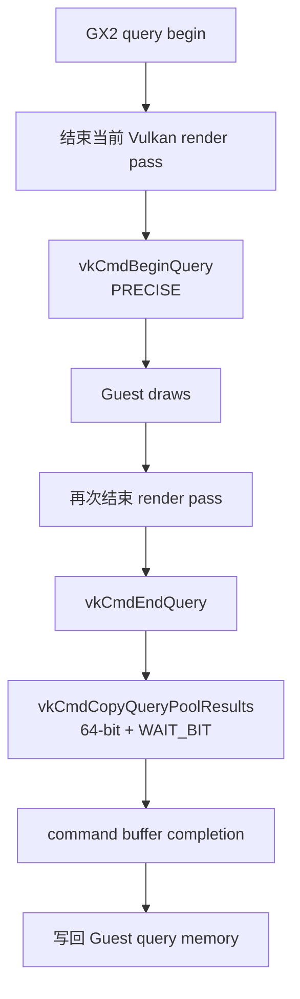
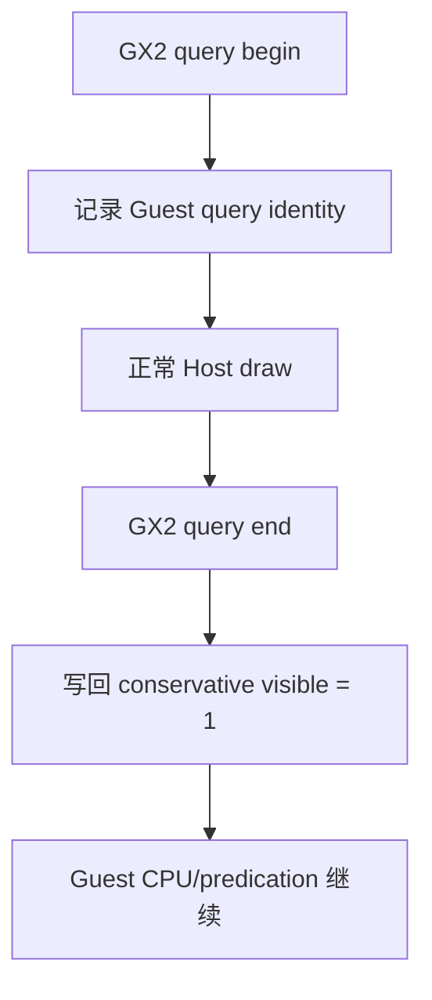
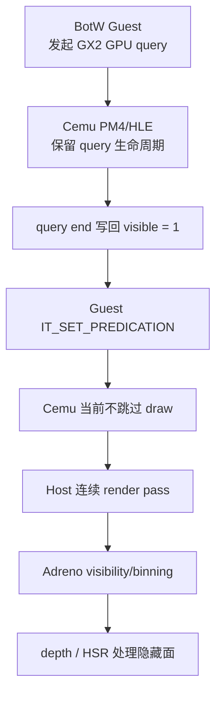
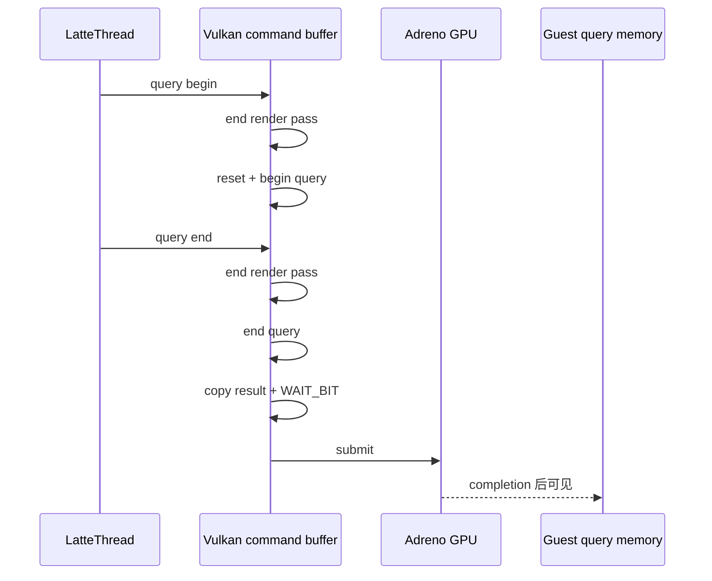
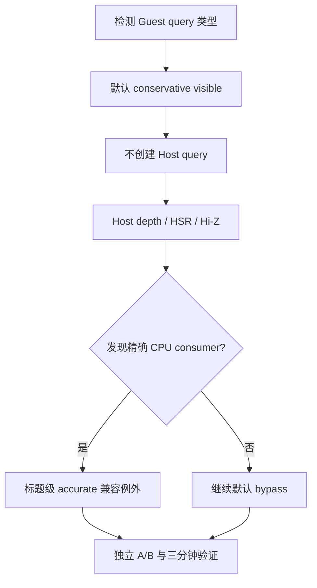

# 移动 GPU HSR 与 Cemu Occlusion Query 策略

本文记录 Wii U GX2 occlusion/predication API 到现代 Host GPU 的语义转换、BotW v208 在
AYN Thor（Qualcomm/Adreno、Vulkan）上的运行时证据，以及 Cemu 的默认处理策略。

产品策略已经从“逐条模拟 Wii U hardware query”调整为：**默认移除 Host occlusion query，
在 Guest query 结束时直接发布保守可见结果 1，让现代 Host GPU 使用自身的 depth test、
Hi-Z/HSR、binning 和 tile visibility 完成实际遮挡处理。** `accurate` 路径仍保留为 debugbus
兼容/归因对照，不再是正常运行默认值。

## 1. 结论

当前 BotW 场景中的硬件 occlusion query **不是必要的 Host 工作**：

1. 10 秒稳定窗口内新增 1,089 个 query，约为 `9.1 query/帧`；累计观测到的 11,484 个
   query 全部来自 `GX2_QUERY_TYPE_OCCLUSION_GPU`，没有 CPU query；
2. 11,478 个结果为 0，仅 6 个非零；
3. Cemu 当前 `IT_SET_PREDICATION` 只记录 conditional-render active/inactive，尚未根据
   query result 跳过 Host draw；
4. 完整 warmup 与随后 3 分 25 秒 gameplay 中，`GX2QueryGetOcclusionResult` 调用始终为
   0，当前场景没有发现 Guest CPU consumer；
5. Vulkan backend 仍在每个 query begin/end 主动结束 render pass，并在 end 录制
   `vkCmdCopyQueryPoolResults(..., VK_QUERY_RESULT_WAIT_BIT)`；
6. 改为 `always_visible` 后 draws 保持约 3,968 不变，断开 Tracy 的同场景读数由
   `11.6 FPS / 85.84 ms` 提升到 `16.0 FPS / 62.65 ms`。

因此本次收益不是“新增 draw 被 Adreno HSR 抵消”，而是更直接：**Cemu 原本没有利用 query
结果执行 Host draw culling，却完整承担了 query pass、resolve 和 Guest 可见性等待成本。**
Adreno 的 binning/visibility stream 与 HSR 进一步降低了 always-visible 的 raster 风险，但
不能替代 vertex/tiler/draw-recording 成本；未来若真正实现 Host conditional rendering，仍需
重新比较 query 剔除收益。Eden 的完整状态机、驱动规避和 Cemu 引入评估见
[Host Conditional Rendering：机制、Eden 实现与 Cemu 引入评估](host-conditional-rendering.md)。

## 2. GX2、PM4 与 Host API 类型

### 2.1 Guest 可见 API

| API / packet | 类型 | Guest 原始语义 | Cemu 默认转换 |
|---|---|---|---|
| `GX2QueryBegin/End(0)` | `GX2_QUERY_TYPE_OCCLUSION_CPU` | 结束后允许 Guest CPU 读取 sample count | End 时立即写回 1，标记 ready |
| `GX2QueryBegin/End(2)` | `GX2_QUERY_TYPE_OCCLUSION_GPU` | 结果主要供 GPU predication 使用 | End 时立即写回 1，不创建 Host query |
| `GX2QueryGetOcclusionResult` | CPU consumer | 轮询 ready，并读取 `end-start` | bypass 结果立即可用；保留调用计数 |
| `GX2QueryBeginConditionalRender` | GPU consumer | 发出 `IT_SET_PREDICATION`，控制后续 draw | 记录调用；当前 Host 按 always-visible 执行 draw |
| `GX2QueryEndConditionalRender` | GPU consumer | 关闭 predication | 维持 PM4 状态边界，不产生 Host query 工作 |
| `IT_HLE_BEGIN/END_OCCLUSION_QUERY` | Cemu 内部 HLE packet | 将 GX2 query 生命周期送到 LatteThread | 默认只维护 Guest ready/event 语义 |
| `IT_SET_PREDICATION` | Latte PM4 packet | 根据 query 结果允许/禁止后续 draw | 当前只记录 active/inactive，不抑制 draw |

CPU/GPU query 的区别是“结果由谁消费”，不是 query 在 CPU 还是 GPU 上计算：两者原本都对应
遮挡采样，只是 CPU 类型用 `OCPU` marker 表示尚未 ready，GPU 类型使用 Guest command
初始化 query memory。默认 bypass 仍保留 begin/end 和 Guest memory ready 时序，不再保留
精确 sample count。

### 2.2 Accurate debug 路径

`accurate` 模式仍按下列方式映射 Vulkan：



这条路径适合做兼容性对照，但它把一个 Guest 时代的硬件优化提示扩张成 Host pass break、
query pool、copy、submit 和 completion dependency，成本远高于 query result 的 8 字节。

### 2.3 默认 bypass 路径



bypass 模式不创建 `LatteQueryObject`，不触发 `vkCmdBeginQuery/vkCmdEndQuery`，不切 render
pass，也不请求 query 原因的 submit。当前实现还把活跃 query 改为 value vector，移除了
每 query 的 `malloc/free`；累计 profiler counter 只在一秒状态刷新时发布，避免每帧约 9 个
query 产生大量观测事件。

## 3. Guest、Cemu 与 Host GPU 的三层语义



Wii U Guest 使用 occlusion query 的原始目的，是让后续 CPU 或 conditional render 根据可见性
减少工作。Adreno 则在 tile-based rendering 内通过 binning 和 visibility stream 避免无效
片元进入 GMEM 渲染。两者不是严格等价：

| 机制 | 能减少的工作 | 不能自动减少的工作 |
|---|---|---|
| Guest occlusion culling | 后续 Guest/Host draw、vertex、tiler、fragment | query 自身与等待 |
| Adreno HSR | tile 内被遮挡的 fragment/带宽 | Guest draw、Host translate、vertex/tiler |
| Cemu accurate debug query | 提供准确 sample count | 当前没有据此剔除 Host draw |
| Cemu 默认 bypass | 消除 query/pass/wait 开销 | 不减少 Host draw/vertex/translate |

旧默认实现恰好处于最差组合：Host 不消费结果做剔除，但 Vulkan query 会显式切物理 pass、
复制结果并在第一次 `GX2DrawDone` 建立完整可见性；新默认 bypass 已移除这部分工作。

## 4. Wii U Latte 与现代 Host GPU 的硬件差异

### 4.1 Wii U / Latte 侧可观测特点

这里不把未经公开验证的 Wii U 芯片框图当成事实，只记录 Cemu 必须模拟的可观测编程模型：

- shader ISA 是 R600/R700 的混合体；Cemu 源码在
  `LatteDecompilerInstructions.h` 中明确记录这一点；
- Guest 通过有序 PM4 command stream 设置寄存器、发 draw、query、predication、copy 和
  synchronization；
- surface 地址、pitch、micro/macro tile mode 和 swizzle 是 Guest 内存语义的一部分；
- query result 与 `IT_SET_PREDICATION` 是当时用于减少后续 draw/raster 工作的显式机制；
- Guest 能直接观察 query memory、readback surface 和 retirement，因此模拟器需要保留
  **可观察结果**，但不必逐项复刻底层硬件实现。

AMD 的 R700 ISA 文档可以辅助理解 shader/predicate 术语，但 Latte 是定制 GPU，不能把 R700
文档里的寄存器、功能或时序未经 Cemu 源码/真机证据就直接视为 Wii U 精确规格。

### 4.2 Qualcomm / Adreno 侧特点

当前 AYN Thor 的 `vkjson` 实测为 Adreno 740，`vendorID=0x5143`：支持
`occlusionQueryPrecise`，但没有公布 `VK_EXT_conditional_rendering`。因此“能够做精确
occlusion query”不等于“适合用它复刻 GX2 predication”。

Adreno 的 Vulkan render pass 会由驱动组织成 visibility/binning 与 tile rendering；tile 内
颜色/深度数据优先驻留片上 GMEM。连续、边界明确的 render pass 能让驱动更好地完成 visibility
和隐藏面处理；频繁为 Guest query 强行结束 pass，反而破坏这一 Host 优势。

| 维度 | Wii U Guest 假设 | Adreno/现代 Host | Cemu 转换原则 |
|---|---|---|---|
| 遮挡 | Guest 显式 query + predication | depth/Hi-Z、visibility/HSR 由硬件和驱动处理 | 默认返回可见，不建立 Host query |
| render target 布局 | Guest micro/macro tiled + swizzle | Vulkan optimal tiling / Adreno GMEM | 保留 Guest 地址语义，Host 使用原生布局 |
| pass 边界 | PM4 状态/操作自然串行 | pass 边界直接影响 tile/GMEM 合并 | 只按真实 attachment/dependency 切 pass |
| 完成语义 | `DrawDone`、query/readback 可见 | queue submit、timeline/fence、GPU completion | 转成 generation/retirement，不默认 queue idle |
| CPU 回读 | Guest 内存是 API 结果面 | device-local image 回 Host 很昂贵 | 只为真实 CPU consumer 保留 readback |
| draw 数量 | query 可能减少老硬件负载 | Wii U 规模通常能被现代 GPU覆盖 | 优先消除 translate/sync；保留正确 draw |

### 4.3 “依赖 Host 硬件”不代表 draw 免费

默认可见会让所有 Guest draw 继续进入 Cemu/Host。现代 GPU 的 depth/HSR 能降低被遮挡 fragment
和外存带宽，但不能自动消除：

- Guest command decode；
- Cemu pipeline/state translation；
- vertex fetch/vertex shader；
- Adreno binning/tiler；
- Vulkan draw recording 与 submit。

本次 BotW draw 数在 accurate/bypass 下均约 3,968，说明当前没有新增 draw；后续约 3,800～
4,200 draws 的优化仍应放在 Host state cache、冗余 register packet 和高频 command pattern，
不能把它们错误归因给 HSR。

## 5. Cemu 当前实现证据

### 5.1 Guest query 类型

`GX2QueryBegin` 对 CPU query 写入 `OCPU` marker；GPU query 则用 PM4 `IT_MEM_WRITE` 初始化
query memory。LatteThread 在 HLE begin packet 到达时据此分类。稳定场景结果：

| 指标 | accurate 累计值 |
|---|---:|
| CPU query | 0 |
| GPU query | 11,484 |
| 结果为 0 | 11,478 |
| 结果非 0 | 6 |
| 10 秒增量 | 1,089 |

“GPU query”只说明 Guest 创建时的 GX2 类型；它不证明 Host 已执行 conditional culling。

### 5.2 Host predication 未完成

`LatteCP_itSetPredication()` 当前只更新 `conditionalRenderActive`，没有在
`LatteCP_itDrawIndex*()` 或 renderer draw 路径读取 query result 并抑制 draw。因此 accurate 与
always-visible 两组的 draw 数分别为 3,969 与 3,968，可视为相同。

### 5.3 Vulkan query 会切 pass



准确模式的 formal Tracy 中，每帧约有 9 个 query resolve、10 个 query 导致的物理 render-pass
结束。resolve 命令本身只有约 `0.016 ms/帧` GPU 时间；真正代价来自 pass fragmentation、
submit/completion 链和 Guest 等待，而不是复制 8 字节结果。

## 6. 同场景 A/B

设备与基线：

- AYN Thor，8 核，Qualcomm/Adreno，Android 13；
- BotW JP v208，神庙可操作场景；
- Android `relWithDebInfo`，Vulkan；
- Internal 1x、Texture 1x、Source `1280x720 -> 1280x720`、Output `1920x1080`；
- `warmup_a 10 15000 5000 250 60000` 完成，`vpad_reads=2133`、`vpad_a_reads=58`。

### 6.1 断开 Tracy 的产品读数

| 策略 | FPS | Frame | Draws | 画面 |
|---|---:|---:|---:|---|
| accurate | 11.6 | 85.84 ms | 3,969（2,778 fast） | 正常 |
| always-visible | 16.0 | 62.65 ms | 3,968（2,778 fast） | 正常 |

截图：

- `_out/profiler/botw-feedback-p1/ayn-thor-query-accurate-baseline.png`
- `_out/profiler/botw-feedback-p1/ayn-thor-query-always-visible.png`

### 6.2 Tracy critical path

| 指标 | accurate | always-visible | 变化 |
|---|---:|---:|---:|
| capture 平均帧时 | 83.16 ms | 74.16 ms | -9.00 ms |
| GPU command-buffer root/帧 | 46.04 ms | 45.78 ms | 基本不变 |
| query resolve/帧 | 9 | 0 | 移除 |
| query render-pass end/帧 | 10 | 0 | 移除 |
| feedback-boundary query wait | 11.93 ms | ~0 ms | 移除 |
| 第一次 DrawDone | 19.90 ms | 10.30 ms | -9.60 ms |
| 第二次 DrawDone | 22.68 ms | 25.32 ms | 仍由 display pacing 主导 |

always-visible capture：

- artifact：`20260807-135002-566-tracy-tracy-live-normalized-only-b17e53e7`
- normalized：`~/.profilerstudy/traces/captures/20260807-135002-566-tracy-tracy-live-normalized-only-b17e53e7/normalized`
- 131 帧、1,322,397 CPU zones、2,153 GPU zones，其中 2,142 个有真实 GPU timestamp；
- `vulkan.occlusion_query.resolve=0`，`cemu.sync.query.wait_us≈0`；
- GPU root 几乎不变，证明主要收益来自 Host/Guest 同步与 pass 结构，不是减少 shader 工作。

Tracy 连接会降低绝对 FPS，所以产品帧率以断开 profiler 的 StatusLayer 为准；Tracy 只用于
比较 critical path 和 GPU/CPU 归属。

### 6.3 三分钟稳定性与 Guest consumer 观测

同一神庙 gameplay 场景在断开 Tracy 后连续运行 3 分 25 秒，超过本项目规定的 3 分钟长稳
门槛。进程 PID 始终为 `4479`，最终状态如下：

| 指标 | 结果 |
|---|---:|
| active policy | `always_visible` |
| GPU query | 48,732 |
| completed query | 48,732 |
| bypassed query | 29,538 |
| `GX2QueryGetOcclusionResult` calls | 0 |
| Guest CPU/GPU/unknown getter calls | 0 / 0 / 0 |
| 最终 StatusLayer | 15.9 FPS / 63.00 ms |
| 最终 draws | 3,977（2,783 fast） |

`completed_queries == gpu_queries`，没有发现 query 堆积。期间 logcat 未出现 native fatal、
`VK_ERROR_DEVICE_LOST`、KGSL/SMMU fault 或 GPU page fault；进程内存从约 2,457 MB 到
2,468 MB，单次 3 分钟观测未显示持续 query 泄漏。最终截图：

```text
_out/profiler/botw-feedback-p1/ayn-thor-query-always-visible-soak-3min.png
```

这里的 `zero_results=19,191` 与 3 个非 bypass 的 nonzero result 是切换前 accurate 阶段的
累计数据；切换后 bypass 结果固定写为 1。Getter 为 0 只证明本次 BotW v208 神庙场景未走
公开的 CPU result API，不能替代室外、菜单、传送等场景矩阵。

### 6.4 默认 bypass 实现复验

把 bypass 从手工策略改成跨平台默认，并将 active query 从 heap object binding 改为 value
vector 后，重新构建、覆盖安装 `relWithDebInfo`。新进程未执行策略命令即报告：

```text
requested=always_visible
active=always_visible
default=always_visible
host_query_bypassed=true
conservative_visible_result=1
```

完整执行 `warmup_a 10 15000 5000 250 60000`，最终 `completed=10`、
`vpad_reads=2931`、`vpad_a_reads=54`，截图确认处于同一神庙可操作场景。随后从
`22:25:11` 到 `22:28:42` 连续运行 3 分 31 秒：

| 指标 | 结束值 |
|---|---:|
| PID | 12,250（全程未变） |
| GPU query | 45,996 |
| completed / bypassed | 45,996 / 45,996 |
| CPU query / getter | 0 / 0 |
| conditional begin / end | 46,005 / 46,005 |
| conditional GPU / CPU | 46,005 / 0 |
| `pixelsMustPass=true` | 46,005 |
| `dontWait=true` | 0 |
| PSS | 约 2,358 MB → 2,365 MB |

这补齐了 consumer 证据：BotW 没有调用 CPU getter，但确实几乎为每个 GPU query 建立
`pixelsMustPass` predication；Cemu 当前 Host draw 路径不消费 predication，所以 bypass 与
旧 Host 实际执行的 draw 集合一致。期间无 native fatal、device lost、KGSL/SMMU fault 或
GPU page fault。

默认实现截图：

```text
_out/profiler/botw-feedback-p1/ayn-thor-query-default-bypass-warmup.png
_out/profiler/botw-feedback-p1/ayn-thor-query-default-bypass-soak-3min.png
```

本轮绝对 FPS 低于上一轮，因此额外做了一次同进程短 A/B：

| 同进程策略 | FPS | Frame | Draws |
|---|---:|---:|---:|
| accurate debug | 12.0 | 83.15 ms | 3,967（2,779 fast） |
| 切回默认 bypass | 13.0 | 76.64 ms | 3,975（2,782 fast） |

本轮相对提升约 8.3%，仍证明 bypass 有收益，但不能复用上一轮 16.0 FPS 作为本次绝对结果。
当时 Android Thermal Status 为 0，CPU 频率正常，Adreno 频率为 401 MHz；绝对变化可能包含
设备 DVFS、长时间运行和场景微差。正式回归只比较同进程、同场景交错样本。

## 7. 默认策略与 debug 对照

debugbus 命令：

```sh
adb shell dumpsys activity service \
  info.cemu.cemu/.utils.DebugDumpService occlusion_query_policy

adb shell dumpsys activity service \
  info.cemu.cemu/.utils.DebugDumpService occlusion_query_policy always_visible

adb shell dumpsys activity service \
  info.cemu.cemu/.utils.DebugDumpService occlusion_query_policy accurate

adb shell dumpsys activity service \
  info.cemu.cemu/.utils.DebugDumpService occlusion_query_consumer_status
```

默认值是 `always_visible`。策略切换只写入 requested policy；LatteThread 仅在 renderer query、
in-flight query 和 Guest query 列表都为空时更新 active policy。状态中的 `pending=true` 表示
尚未越过安全点。StatusLayer 的 `Occlusion` 行显示 `bypassed / visible` 或
`accurate (debug)`，不能只凭命令返回的 requested 值判断。

always-visible 对每个 Guest query 写回可用且非零的结果 `1`，不创建 Host query object。
这保留了“可见”语义并避免 Guest 永久等待，但不保留准确 sample count。`accurate` 命令只用于
兼容问题定位和正式 A/B；重启标题后恢复默认 bypass。

## 8. 转换边界与后续优化

默认移除 Host query 是明确的产品取舍：优先连续 Host render pass 和现代硬件自身的可见性
处理，不再为精确 sample count 牺牲帧时间。仍需保留以下边界：

1. 室内、室外、植被、敌人、粒子、菜单和传送场景分别完成至少 3 分钟验证，检查对象常驻、
   LOD 或逻辑差异，同时记录 CPU getter 与 GPU predication 调用；
2. 某个标题若明确依赖精确 sample count 参与 CPU gameplay 逻辑，可建立标题级 accurate
   兼容例外；不能为一个例外恢复全局默认硬件 query；
3. 若未来真正实现 Host conditional rendering，必须独立证明其节省的 draw/vertex/fragment
   工作大于 pass break、query resolve 和同步成本；状态机必须在所有 disable/fallback 路径
   先结束正在运行的 Host predicate，再清空 buffer/offset/set/running 状态；
4. Metal、桌面 Vulkan 与移动 Vulkan 使用同一默认语义；各 backend 只实现 accurate debug
   路径，不再维护不同产品默认值。



## 9. 可复用的 Guest → Host GPU 转换准则

后续处理其他 Wii U GPU 特性时，先按语义而不是 API 名称分类：

| 分类 | 判断 | 处理 |
|---|---|---|
| Guest 可观察结果 | CPU 会读取具体数值、地址或错误码 | 保留结果；底层实现可替换 |
| Guest ordering | 只要求 A 在 B 前可见 | 用 barrier/generation/retirement，不扩大为 queue idle |
| Guest 性能提示 | query、predication、旧硬件 fast path | Host 已有等价能力时转换或移除 |
| Guest memory layout | tile/swizzle/pitch 影响地址计算 | Guest 侧保留；Host image 使用原生布局 |
| Host 私有优化 | HSR、Hi-Z、GMEM、driver binning | 不伪装成 Guest API；通过连续 pass 和正确 dependency 让驱动生效 |
| 调试/兼容路径 | 需要证明语义差异 | 保留显式开关，不作为产品默认 |

核心原则是：**模拟 Guest 能观察到的语义，不模拟 Guest 看不到的旧硬件实现细节。**

## 10. 参考资料

- Cemu 本仓 `src/Cafe/OS/libs/gx2/GX2_Query.cpp`、
  `src/Cafe/HW/Latte/Core/LatteQuery.cpp`、
  `src/Cafe/HW/Latte/Core/LatteCommandProcessor.cpp` 与
  `src/Cafe/HW/Latte/Renderer/Vulkan/VulkanQuery.cpp`；
- [Khronos Vulkan：Queries](https://docs.vulkan.org/spec/latest/chapters/queries.html)；
- [Khronos Vulkan：Tile Based Rendering Best Practices](https://docs.vulkan.org/guide/latest/tile_based_rendering_best_practices.html)；
- [Khronos `VK_QCOM_tile_shading`](https://docs.vulkan.org/refpages/latest/refpages/source/VK_QCOM_tile_shading.html)；
- [Khronos Vulkan Conditional Rendering Sample](https://docs.vulkan.org/samples/latest/samples/extensions/conditional_rendering/README.html)；
- [AMD R700 Family ISA](https://docs.amd.com/v/u/en-US/R700-Family_Instruction_Set_Architecture)。
