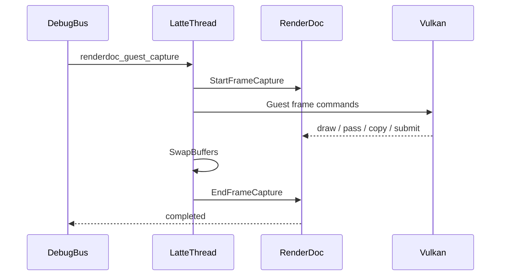
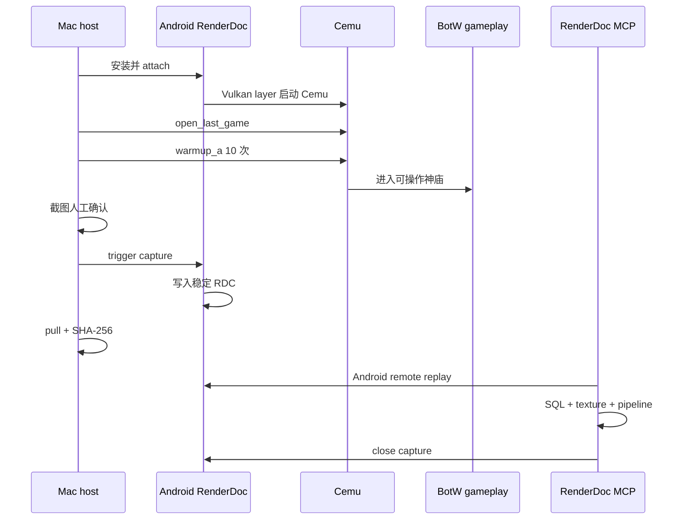
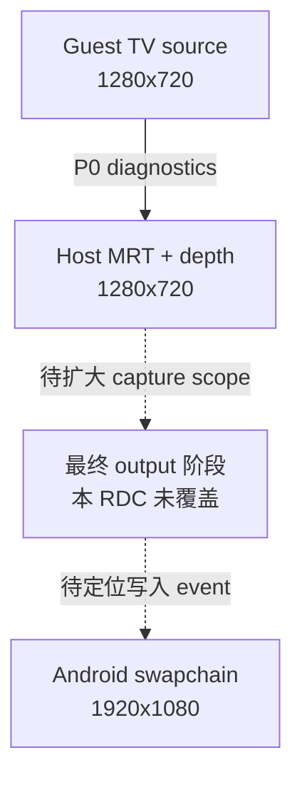

# Cemu Android RenderDoc 图形分析

## 当前结论：抓取边界必须对齐 Guest 帧

Android WSI 的 `vkQueuePresentKHR` 与 Cemu 的 Guest GPU 帧不是同一个生命周期边界。
普通 `RENDERDOC_CaptureFrame` 在 BotW gameplay 中只得到一个 submit 片段：93 个 draw、
61 次 copy、33 个 render pass。连续抓第二个 present 帧甚至只有一个
`vkQueuePresentKHR`，没有 draw。这两份 RDC 都是合法的 Android present capture，但不
适合回答“BotW 一整帧如何变成 Host Vulkan 工作”。

当前 Cemu 增加了 debugbus 命令：

```text
renderdoc_guest_capture
renderdoc_guest_capture_status
```

请求在 `LattePerformanceMonitor_frameBegin()` 之后调用 RenderDoc
`StartFrameCapture`，在下一次 Guest `SwapBuffers()` 后调用 `EndFrameCapture`：



2026-08-07 的 BotW v208 warmup 样本从 Guest frame `2278` 捕获到 `2279`，得到一份
326,785,835-byte 的完整 RDC：

| 指标 | 数量 |
| --- | ---: |
| Root actions | 4994 |
| Vulkan draws | 4241 |
| Begin/End render pass | 255 / 255 |
| Copies | 216 |
| Queue submits | 12 |
| Present | 1 |
| Resources / native textures | 5550 / 731 |
| Debug/validation messages | 0 |

其中 169 个 pass 只有一个 draw，210 个 pass 不超过四个 draw；后者合计只承载 280 个
draw。完整纹理表还显示 resource 851～856 共 **6 张** `1920x1080` swapchain image，
每张 8,294,400 bytes。旧 submit 片段里看到的 5 张不能再作为当前 image count 基线。

完整性能归因、12 个 submit 的 draw/copy/pass 分布和 Tracy submit reason 交叉验证见
[BotW Guest 命令翻译与 Host Vulkan 提交基线](../verification/botw-command-translation-baseline.md)。

## 旧 submit 片段结论

2026-08-02 在 AYANEO Pocket DS 上成功抓取并远程回放了一帧 BotW v208 神庙 gameplay
的 Vulkan RDC。该 submit 片段直接证明：Cemu 当前 1x 主渲染链使用 `1280x720` viewport，并同时绑定
4 张 `1280x720` color target 和 1 张 `1280x720` depth target；capture 中还存在
`640x360`、`320x192` 等中间资源，以及当时在片段清单中可见的 5 张 `1920x1080`
Android swapchain image。完整 Guest 帧的新样本已确认当前实际为 6 张。

这与 StatusLayer 的 `Source 1280x720 -> 1280x720 / Output 1920x1080` 互相吻合，但本次
RDC 的 action 范围没有出现写入 swapchain image 的 draw/copy。因此可以把它作为
internal-resolution P0 的真实 GPU 资源证据，不能把它写成“已经定位最终 1280x720 到
1920x1080 缩放 event”。最终 output/present 阶段需要扩大或调整 capture scope 后另行验证。

## 抓帧身份

| 项目 | 实测值 |
| --- | --- |
| 分支 | `feature/malos/basic_version` |
| APK | `relWithDebInfo` / Native `RelWithDebInfo` / debuggable |
| 设备 | AYANEO Pocket DS，`01108YHE01017563` |
| 游戏 | BotW Wii U JP v208 / DLC v80 |
| 场景 | 初始神庙内、Link 可操作的 gameplay |
| Renderer | Vulkan |
| warmup | `10 15000 5000 250 60000` |
| RDC size | 76,497,306 bytes |
| SHA-256 | `53d372fe53cc286a6fdb0922b9218c352a578bc01e0c64423ceb9511dc55fc5d` |

本机证据：

```text
_out/renderdoc/20260802-internal-resolution-gameplay/
├── capture-manifest.json
├── gameplay-before-capture.png
└── info.cemu.cemu_2026.08.02_17.26_frame2518_0xB4000076FE0FDD30.rdc
```

设备 replay 路径：

```text
/sdcard/Android/media/info.cemu.cemu/files/RenderDocForPico/
info.cemu.cemu_2026.08.02_17.26_frame2518_0xB4000076FE0FDD30.rdc
```

首次 6 次 A 的抓帧仍停在标题菜单，只保留作失败样本；正式结论使用 10 次 A、截图确认
gameplay 后的第二轮。这个差异说明 `warmup_state=completed` 只证明按键序列执行完，不能
证明游戏菜单语义已经走到目标场景。

## 抓取与分析链路



Mac 本地 replay Adreno Vulkan RDC 会返回 `APIHardwareUnsupported`。这不是 RDC 损坏，
而是 host GPU/API 不兼容。当前 MCP 通过 `RENDERDOC_OpenAndroidCapture` 使用 Android
driver 远程回放，Mac 只负责 MCP/SQLite 和结果组织。

## 帧级概览

RenderDoc MCP 返回：

| 指标 | 值 |
| --- | ---: |
| Graphics API | Vulkan |
| root actions | 157 |
| action-level events | 157 |
| host draw actions | 134 |
| present/end action | 1 |
| capture resources | 80 |
| native textures | 17 |
| validation/debug messages | 0 |

Event ID 最大到 400，是因为 action-level event 不是所有 Vulkan API call 的连续列表。
StatusLayer 同帧附近显示 `Draws 3850 (2833 fast)`，这是 Cemu guest/renderer 侧统计；RDC 的
134 是本 capture scope 内 materialized host Vulkan draw action。两者不是同一计数边界，
不能用差值直接推导“丢失 draw”或单一 batching 比例。

本帧 event 分组：

| 范围 | 结构 | 观察 |
| --- | --- | --- |
| 19–59 | 5 组 begin/draw/end | `320x180` viewport，depth-only |
| 67–377 | 主 pass，125 draws | `1280x720` viewport，4 color + depth |
| 379–398 | 4 组单 draw pass | 继续使用同一组 `1280x720` MRT/depth |
| 400 | End of Capture | capture 结束 |

`pass_list` 在本帧返回空表，因为这些 begin/end/draw 都被 Android remote replay 暴露为
root action，现有 MCP 的层级 pass 派生器无法成组。上表来自 event flags 边界与逐 draw
`pipeline_outputs` 的组合，不是把空 pass 表解释为“没有 render pass”。

## 纹理与 render target

### 主 1280x720 集合

| Resource ID | Extent | 格式摘要 | Category | Byte size | 本帧用途 |
| ---: | --- | --- | --- | ---: | --- |
| 13391 | `1280x720` | R11G11B10 Float | ShaderRead + ColorTarget | 3,686,400 | color 3 |
| 13395 | `1280x720` | R32 Depth | ShaderRead + DepthTarget | 3,686,400 | depth |
| 13406 | `1280x720` | R32 Float | ShaderRead + ColorTarget | 3,686,400 | 当前抽查未绑定 |
| 13418 | `1280x720` | RG8 UNorm | ShaderRead + ColorTarget | 1,843,200 | color 0 |
| 13493 | `1280x720` | RGBA8 UNorm | ShaderRead + ColorTarget | 3,686,400 | color 2 |
| 13518 | `1280x720` | RGBA8 sRGB | ShaderRead + ColorTarget | 3,686,400 | color 1 |

主 pass event 71、375 以及尾部 event 381、386、391、397 均返回：

```text
viewport = (x=0, y=720, width=1280, height=-720)
depth    = 13395
colors   = [13418, 13518, 13493, 13391]
```

Vulkan 的负 viewport height 表示 Y 翻转，不代表负尺寸。四个 color target 与 depth target
extent 完全一致，直接支持 P1/P2 的“color/depth family 成对解析倍率”约束。

### 中间与资源纹理

| Resource ID | Extent | 说明 |
| ---: | --- | --- |
| 13453 | `320x192` | R32 depth；抽查 viewport 实际为 `320x180` |
| 13958 | `640x360`, array 2 | R11G11B10 color/read 中间资源 |
| 14747 | `1024x1024`, 4 mips, array 8 | R16 UNorm，22,282,240 bytes |
| 14949 | `256x256`, array 8 | RGBA16 UNorm，4,194,304 bytes |
| 26150 | `512x512`, 10 mips, array 8 | BC5，2,796,416 bytes |
| 26151 | `512x512`, 10 mips, array 8 | BC4，1,398,208 bytes |

BC4/BC5 在真实 RDC 中仍以 block-compressed texture 出现，为“静态压缩资源默认保持 native，
不跟随 internal factor 放大”提供了第二路实机证据。

### Swapchain

Resource 716–720 均为：

```text
1920x1080, RGBA8 UNorm, ShaderRead + ColorTarget + SwapBuffer,
8,294,400 bytes, sample count 1
```

它们证明 Android output swapchain 的物理 extent 为 `1920x1080`。但 event 表没有 copy/blit
action，抽查 draw 的 output target 也都不是 716–720，所以本 RDC 不能回答：

- 哪个 event 把 1280x720 source 送入 1920x1080 swapchain；
- 使用 output shader、blit 还是后续 queue/compositor；
- StatusLayer 是否在本 capture scope 后合成。

### Swapchain image 数量是否是 BotW 渲染压力来源

旧片段里的 5 张对应约 39.55 MiB；当前完整 Guest 帧确认 6 张，对应约 47.46 MiB。
但现有证据仍不支持“每帧渲染 6 张 1920x1080，所以导致 BotW 变慢”。Swapchain image
是 present 队列轮转使用的缓冲池；
正常一帧只 acquire 其中一张作为本次 present 目标，其余 image 等待复用或仍由 compositor
持有。image count 增加的是缓冲深度和常驻分配，不会把单帧 shader/raster 工作自动乘 6。

```text
单张 swapchain = 1920 * 1080 * 4 = 8,294,400 bytes
6 张合计        = 49,766,400 bytes = 47.46 MiB
```

最终 output 若确实由 Cemu 写入 swapchain，预期成本是一轮 `1280x720 -> 1920x1080` 的
全屏 pass/blit，加上 barrier、acquire/present 与 Android compositor；这项成本可能有意义，
但仍是“每帧写当前 acquire image 一次”，不是把 6 张全部重绘。六张缓冲只可能通过更高
显存占用、工作集/cache 压力和更深的 in-flight 队列间接影响性能。

与之相比，本 RDC 已直接看到主 pass 每个 draw 同时绑定 4 张 color target 和 1 张 depth
target。这组实际绑定 target 在 1x 合计约 15.82 MiB，且会随 pass 产生真实的 MRT/depth
读写流量；若宽高都升到 2x，仅这组像素量和理论分配就接近 4 倍。Tracy 还显示当前稳定
长帧包含约 17.17 ms draw prepare、24.80 ms async readback 和 20.65 ms `wait_reg_mem`，
因此现阶段应优先量化 Host 命令/同步与主 1280x720 render family，而不是把 12 FPS 归因
于 swapchain image 数量。

当前 RDC 没有 materialize 任何 716–720 的写入，甚至无法量出单次最终 output pass；后续
需要捕获 `vulkan.present_blit`，记录 acquire image ID、pass GPU time 和 present wait，才
能判断 1080p output 在总 GPU 帧中的实际占比。

## Guest、host 与 output 的证据边界



| 结论 | 证据 | 可信边界 |
| --- | --- | --- |
| Guest TV source 为 1280x720 | P0 debugbus/StatusLayer | 已验证 |
| Host 主渲染为 1280x720 | RDC viewport + MRT/depth texture | 已验证 |
| Output swapchain 为 1920x1080 | RDC native texture inventory | 已验证资源存在 |
| 本帧完成 1280→1920 缩放 | 无目标写入 event | **未验证** |

这一区分对 internal resolution 很关键：P1 resolver 应改变 B 的 host extent，同时保持 A 的
guest 语义；C/D 仍属于 presentation，不应被误纳入 surface internal factor。

## 对后续实施的输入

1. P1 的 1x resolver 回归应把 event 71/375 这组 MRT/depth 作为 BotW 代表 family；所有
   target 必须解析为相同 factor。
2. P2 2x 时，预期上述 1280x720 host target 变为 2560x1440，而 guest/debugbus source
   仍报告 1280x720；BC4/BC5 与非 render-family 资源保持 native。
3. 2x 显存预算不能只算单 color target。当前主集合至少包含 5 个实际绑定 target，1x
   约 15.82 MiB，按未压缩像素 2x 接近 63.28 MiB，尚未计其他 color/mip/staging。
4. 在 P2 前补一轮覆盖最终 present 的 RDC；若仍不见 swapchain 写入，应在
   `vulkan.present_blit` 前后显式加 RenderDoc debug marker/capture boundary，而不是猜测。
5. 保持 RenderDoc texture/pipeline 工具与 Cemu StatusLayer、surface diagnostics 双证据；
   一路数据异常时不能用另一路直接替代。

可复用抓帧和 MCP 分析流程见
`skills/cemu-renderdoc-analysis/SKILL.md`。

完整 Guest 帧的 attachment 连续性、pass 结束原因、pixel feedback shader 与 submit 阈值
A/B 见 [Cemu Vulkan RenderPass 碎片与优化边界](vulkan-render-pass-optimization.md)。该文档
明确区分 RenderDoc action duration 与 Tracy pass/command-buffer wall time，不能把前者未覆盖
的 load/store/barrier 区间解释成“GPU 空闲”。
