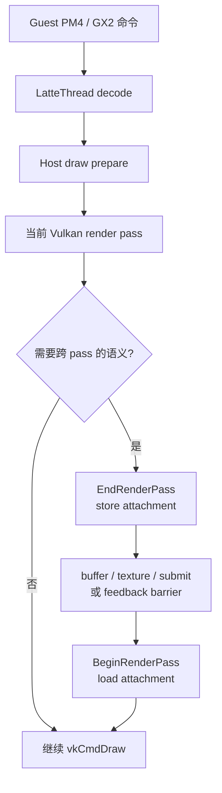
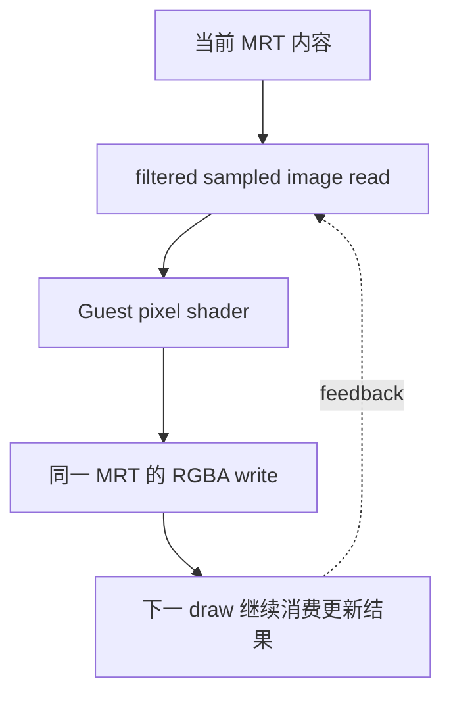
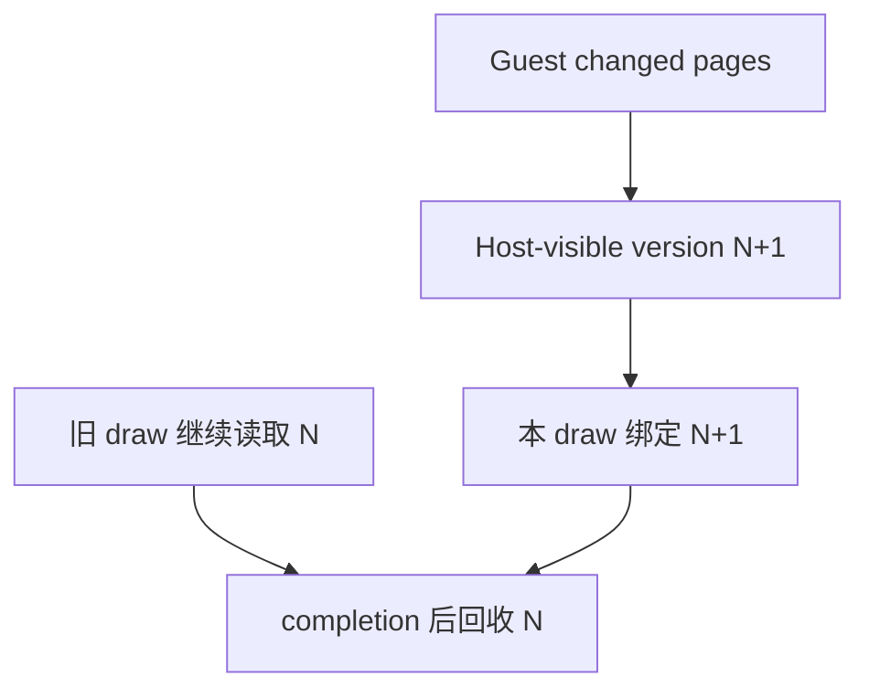
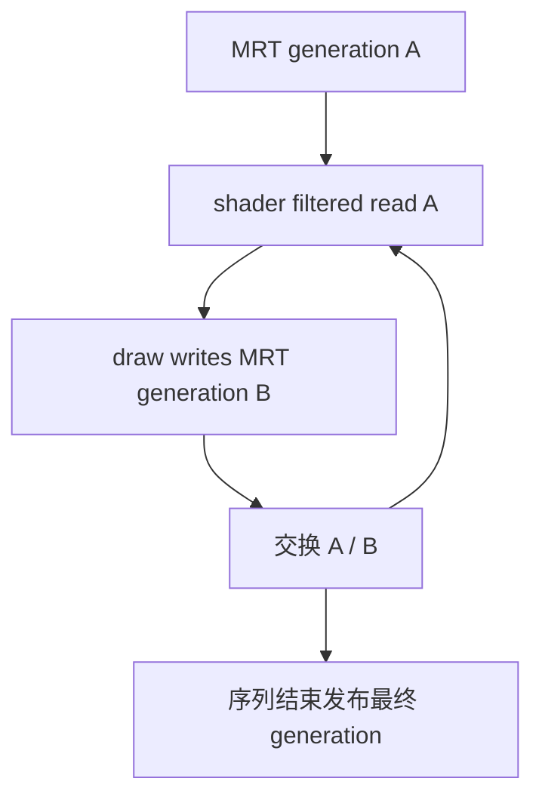

# Cemu Vulkan RenderPass 碎片与优化边界

## 结论

BotW v208 的完整 Guest 帧不是单纯“约四千次 draw 太多”，而是约四千次 draw 被切成两百余个
Host Vulkan render pass，并穿插 buffer upload、texture copy、readback、submit 和真实的
framebuffer feedback。当前 AYN Thor / Adreno 740 样本中，最重要的结论是：

1. 42 次 `self_dependency` 全部来自真实的像素着色器 attachment 读写重叠，不是 Cemu 的
   base-texture 保守误判；
2. 42 次中有 40 次在结束后继续使用完全相同的 attachment 与 viewport；这类切段会让移动
   TBDR 反复面对 store/load，但不能直接删除；
3. 反馈 shader 使用带过滤语义的 `ImageSampleImplicitLod`，坐标来自插值 varying，不是可以
   无条件替换为 input attachment 的 `FragCoord`/texelFetch；
4. 当前驱动没有 attachment feedback loop、dynamic-rendering local read、fragment interlock
   或 raster-order 扩展，不能在同一 image 上安全构造通用的 tile-local feedback；
5. 已验证并保留的低风险优化是 uniform host-visible ring、vertex upload batching、无深度写入
   pass 的 `STORE_OP_NONE`；submit draw-pass 阈值保留 300。

因此，本轮没有用未定义的同 attachment 读写换取表面 FPS。RenderPass 后续优化应拆成：
Host 翻译状态复用、带 in-flight 版本的 vertex cache、以及保留 filtered sampling 的 BotW 专用
MRT ping-pong。三者的正确性边界不同，不应合并为一个“少开 pass”的开关。

## 样本身份

| 项目 | 值 |
| --- | --- |
| 游戏 | BotW Wii U JP v208 / DLC v80 |
| 场景 | 初始神庙内可操作 gameplay |
| 设备 | AYN Thor，Kalama / Adreno 740，`1920x1080` |
| Renderer | Vulkan，internal/static texture scale 均为 `1.0` |
| APK | `relWithDebInfo`，Native `RelWithDebInfo`，debuggable |
| warmup | 进入场景后再采集；StatusLayer 约 3958～3970 draws |
| RDC | `_out/renderdoc/botw-uniform-ring-gameplay-vulkan-20260808/info.cemu.cemu_2026.08.08_02.35_capture.rdc` |
| RDC SHA-256 | `c4a3395896df89d01f2cc132efbaa17627b8c1d2b1cb648e6988861fecf8e609` |

该 RDC 对齐 `LattePerformanceMonitor_frameBegin()` 到下一次 Guest `SwapBuffers()`，不是普通
Android present 片段。后续 vertex upload batching 在这份 RDC 之后完成，所以 attachment/
shader 结论可以复用，RDC 中 buffer copy 数量不能代表 batching 后最终数量。

## 一帧如何被切开

完整 Guest 帧的 RenderDoc 动作统计：

| 指标 | 数量 |
| --- | ---: |
| draw | 3970 |
| render pass | 228 |
| copy/blit/resolve | 161 |
| queue-submit action | 22 |
| 单 draw pass | 146 |
| 不超过 4 draw 的 pass | 180 |

按 pass 结束原因拆分：

| 结束原因 | pass | draw | 单 draw | ≤4 draw |
| --- | ---: | ---: | ---: | ---: |
| framebuffer change | 84 | 1604 | 41 | 59 |
| texture operation | 50 | 441 | 43 | 47 |
| self dependency | 42 | 972 | 27 | 34 |
| buffer operation | 26 | 261 | 21 | 22 |
| submit | 4 | 594 | 0 | 1 |
| readback | 5 | 40 | 0 | 2 |
| surface copy | 5 | 5 | 5 | 5 |
| 其他 | 12 | 53 | 10 | 10 |

## Attachment 连续性

RenderDoc helper 会在每个 legacy render pass 的第一个 draw 读取 pipeline、viewport、color/
depth target、write mask、pixel read-only resource 和相交的 feedback target。这样只需 228 次
远程 `SetFrameEvent`，不需要逐个回放约 4000 个 draw。

| 当前 pass 的结束原因 | 下一 pass 仍为同 attachment | viewport 也相同 |
| --- | ---: | ---: |
| self dependency | 40 / 42 | 40 / 42 |
| buffer operation | 21 / 26 | 21 / 26 |
| readback | 3 / 5 | 3 / 5 |
| submit | 3 / 4 | 3 / 4 |
| depth-store upgrade | 1 / 1 | 1 / 1 |

另有 33 组 attachment 呈现 `A -> B -> A` 回切。最常见 attachment signature 是
`1280x720` 的 3 color + depth，43 个 pass 承载 1761 个 draw；次常见是 4 color + depth，
29 个 pass 承载 223 个 draw。这说明碎片主要发生在 BotW 的主 MRT 链，不是 1920×1080
swapchain image 数量造成的重复渲染。

## Self-dependency 为什么不能直接合并

`CachedFBOVk::CheckForSelfDependency()` 会找出既在 descriptor set 中被 shader 读取、又属于
当前 FBO 的 texture。真机状态导出进一步验证了它不是只按 base texture 得出的假阳性：

| 验证项 | 结果 |
| --- | ---: |
| self-dependency 后首 draw | 42 |
| 实际存在 attachment/read-only 交集 | 42 / 42 |
| 涉及 pixel shader | 10 个 |
| vertex/geometry feedback | 0 |
| 反馈 attachment write mask | 均为 `0x0f` |

主要反馈组合：

| 次数 | 被读取并继续写入的 attachment |
| ---: | --- |
| 26 | 主 MRT slot 1 + slot 3 |
| 14 | 主 MRT slot 0 |
| 2 | 主 MRT slot 1 + slot 3 + slot 7 |

这 10 个 pixel shader 的 RenderDoc 反汇编均使用 `ImageSampleImplicitLod`。采样坐标由 Guest
shader varying 和运算得到，未直接使用 `FragCoord`。因此：

- 删除 pass split 会形成驱动未声明支持的 attachment feedback loop；
- 改为 input attachment 会丢失普通 sampler 的过滤、坐标和 LOD 语义；
- 仅检查 mip/slice 也没有收益：实验记录到 150 个 same-resource pair，150 个都真实重叠，
  没有可剔除的 disjoint pair；
- color write mask 也不能排除：反馈目标在对应 draw 上都开启 RGBA write。

关闭 `vkAccurateBarriers` 只能作为不正确的性能上界，不能作为产品路径。

## GPU 时间如何解读

RenderDoc `EventGPUDuration` 对 draw/copy action 的总和是 `22.228 ms`：draw `19.772 ms`、
copy `2.445 ms`。同场景 Tracy 的 `vulkan.command_buffer.gpu` 则约 `47.15 ms/帧`。差值不是
“Tracy 多算了 25 ms”，而是 RenderDoc action duration 不覆盖 attachment load/store、barrier
以及动作之间的 GPU 区间。

阈值 300 的 Tracy 样本按“上一 pass 为什么结束”给下一 pass 归类：

| 下一 pass 来源 | GPU 时间/帧 | 注意 |
| --- | ---: | --- |
| framebuffer change | 19.92 ms | 包含实际 draw，不等于纯切换成本 |
| self dependency | 7.85 ms | feedback 后的 pass wall time，不是 barrier 独占时间 |
| texture operation | 6.35 ms | texture 命令之后的 pass |
| other | 3.82 ms | 主要含 clear/present 周边 |
| buffer operation | 2.99 ms | upload 后的 pass |
| submit | 2.39 ms | command-buffer 边界后的 pass |

这些分类不能相加到 CPU frame interval，也不能把某一行全部视作可消除开销。它们的用途是
确定深入抓取顺序：主 MRT feedback、framebuffer alternation、buffer upload，最后才是 submit。

## 已完成的低风险优化

### Uniform ring

shader uniform bank 改为 host-visible synchronized ring，并用 generation + content cache 复用
相同 bank。它移除了 uniform bank 经全局 Latte buffer cache 的 transfer copy，不改变 Guest
资源身份。

### Vertex upload batching

同一次 `LatteBufferCache_Sync()` 中的 changed page 先收集，再按 staging source buffer 合并成
一次 `vkCmdCopyBuffer` 的多个 region。典型帧约 72 个 upload region 合并为约 21 个 copy
command，命令数下降约 69.7%。真实上传只有约 35 KiB/帧，而逻辑 vertex binding 约
125 MiB/帧，所以不能用“每次 dirty 就把完整 vertex range 放进 host-visible ring”的方式替代。

### Depth store omission

不写 depth/stencil 的 legacy pass 在支持 `VK_EXT_load_store_op_none` 或
`VK_QCOM_render_pass_store_ops` 时使用 `STORE_OP_NONE`。它避免无修改 depth 的 tile store，
同时保留内存中的既有内容。

## Submit 阈值 A/B

| draw-pass 阈值 | FPS | submit/帧 | 结果 |
| ---: | ---: | ---: | --- |
| 300 | 13.016 | 约 10.4 | 保留基线 |
| 1200 | 11.810 | 约 7.4 | GPU feedback 延迟，readback/fence wait 明显变差 |
| 150 | 13.054 | 约 13.9 | FPS 与 300 等价，pass/submit churn 增加 |

1200 不是“减少 submit 就一定更快”：它让 Guest 需要的 GPU feedback 排在更大的 command
buffer 尾部。150 的小幅数值差落在场景/调度噪声内，没有形成可复现收益。因此默认值恢复并
固定为 300。

## 下一阶段优化设计

### P1：shader/fetch 切换后的 Host 状态复用

CPU 侧约 1186 个 full draw 中，约 1126 个由 changed context register 结束 draw sequence，
其中 fetch shader program block 占累计 break 的约 68%。下一步应把“Guest draw sequence
结束”和“Host 所有状态失效”拆开：显式传播 framebuffer、texture、shader、viewport、buffer
等 dirty domain，只重做受影响阶段。不能只凭 register 地址跳过完整初始化；必须覆盖该次
draw 前其余 PM4 packet 的累计变化。

### P2：带版本的 host-visible vertex cache

目标不是上传 125 MiB 逻辑绑定，而是给约 35 KiB changed page 分配新的 in-flight generation：

只有解决旧 draw 与 Host 写入的竞争，才能移除 buffer transfer 引起的 render-pass end。把全局
171,966,464-byte cache 直接 map 后原地写入会与 in-flight GPU read 竞争，不可采用。

### P3：BotW filtered-feedback MRT ping-pong

在驱动没有 feedback-loop 扩展时，保留采样语义的方向是 title-scoped 双版本 attachment：

这需要同时解决 descriptor remap、color/depth attachment identity、blend/load/store、部分
attachment 不参与 feedback、Cemu texture cache 最终可见性和 RenderDoc 验证。它应由 BotW
v208 identity/Graphic Pack 注册 pattern，通用 renderer 只提供版本化 surface 能力；在正确性
矩阵完成前不得推广到其他游戏。

## 验收要求

每项优化至少同时满足：

1. 完整 warmup 后截图确认同一 gameplay 场景；
2. StatusLayer 确认 patch、resolution 和 draw 数未意外改变；
3. Tracy 同时比较 CPU frame、Host translate、GPU command-buffer 与分原因 pass；
4. RenderDoc Guest-frame capture 比较 attachment、write mask、feedback resource、pass/draw/copy；
5. 无 Vulkan validation、device-lost、KGSL/SMMU page fault；
6. 与阈值 300 的已获益版本比较，不回退到最原始分支作为日常基线。

可复用命令见 `skills/cemu-renderdoc-analysis/SKILL.md`，整体帧关键路径见
`docs/architecture/cemu-frame-performance.md`。下一阶段不应继续仅靠相邻 Vulkan pass 特判；
Guest 有序业务 tag、资源版本和 shadow FrameGraph 重编译设计见
`docs/architecture/guest-semantic-framegraph.md`。
