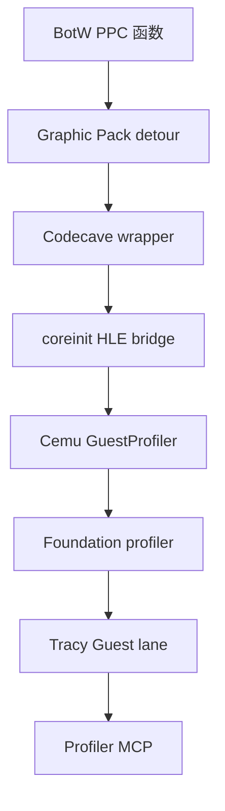
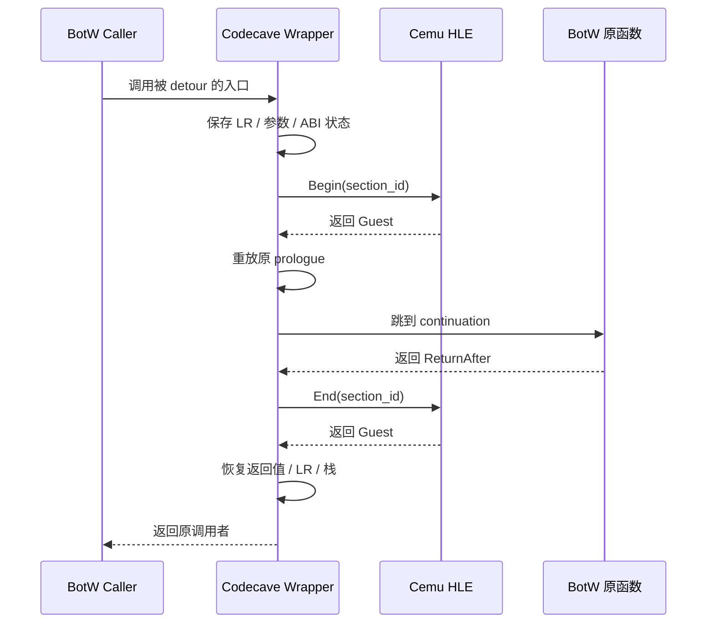

# BotW v208 Guest Profiler PPC Patch 机制

## 1. 目标与结论

`patch_guest_profiler.asm` 是一份面向 Wii U 版 BotW update v208 的 PowerPC Graphic Pack
补丁。它在 20 个游戏内部函数入口安装 detour，在原函数执行前后分别调用 Cemu 提供的
`coreinit.hook_ProfileSectionBegin/End(section_id)` HLE import，再由 Host
`GuestProfiler` 转换成 Foundation profiler tag 和 counter。

它不是独立 profiler backend，也不直接实现 Tracy 协议。职责边界是：

- Guest ASM：定位 BotW 函数，保存 ABI 状态，包住原函数；
- Cemu HLE：接收 section ID，识别 Guest `OSThread`，配对 Begin/End；
- Foundation profiler：把显式 Guest lane 和 counter 送入 Tracy 等 backend；
- Profiler MCP：连接 Tracy、保存 trace 并执行 Host/Guest/GPU 关联分析。



通用 Guest tag ABI、线程 lane 和时间语义见
[`../architecture/guest-profiler-tags.md`](../architecture/guest-profiler-tags.md)。本文只展开
BotW v208 ASM 的具体内容和生效过程。

Cemu `patch_*.asm` 的通用声明语法、codecave/origin、label、preset、data directive、
`.callback entry`、import/relocation、能力边界和金手指差异见
[`../architecture/cemu-graphic-pack-asm.md`](../architecture/cemu-graphic-pack-asm.md)。

## 2. 文件来源与身份

仓库不会维护另一份手工分叉的 ASM。暂存脚本直接复制固定 BetterVR 子模块中的原文件：

| 项目 | 值 |
|---|---|
| 固定来源 | `references/BotW-BetterVR/resources/BreathOfTheWild_BetterVR/patch_debug_PPC_Profiling.asm` |
| BetterVR 提交 | `0e1053d58cdfbd592522dc892b1770418a1af009` |
| 暂存名称 | `patch_guest_profiler.asm` |
| ASM SHA-256 | `fb239305fb67f61ab197b03a18af171e501e1d48f6431b679f7bfec35212892f` |
| 代码行数 | 635 |
| 许可证来源 | BetterVR MIT Licensed PPC profiling patch |

复制逻辑位于
[`stage_botw_v208_profiler_pack.sh`](../../skills/cemu-guest-game-patching/scripts/stage_botw_v208_profiler_pack.sh)：

```text
BetterVR 固定 ASM
  + tools/guest-mods/botw-v208-profiler/rules.txt
  -> 独立 BotW_v208_Guest_Profiler 目录
```

因此 `patch_guest_profiler.asm` 与 BetterVR 固定文件内容相同；本仓只另配一个隔离的
`rules.txt`，不引入 BetterVR 的 renderer、XR、输入或 Windows 生命周期。

## 3. 版本与加载保护

ASM 第一段声明：

```asm
[BetterVR_PPC_Profiling_V208]
moduleMatches = 0x6267BFD0
.origin = codecave
```

配套 [`rules.txt`](../../tools/guest-mods/botw-v208-profiler/rules.txt) 声明三个 BotW Wii U
区域 Title ID，并设置 `default = 1`：

```text
00050000101C9300
00050000101C9400
00050000101C9500
```

生效需要同时满足：

1. 当前标题命中上述 Title ID；
2. 当前 `u-king` RPX 的 Graphic Pack checksum 为 `0x6267BFD0`；
3. Graphic Pack 位于 Cemu 扫描目录且处于启用状态；
4. Host 已注册 `coreinit.hook_ProfileSectionBegin/End`；
5. ASM 中的绝对地址和原函数 prologue 与该 v208 模块一致。

`moduleMatches` 是主要的防误写保护。checksum 不匹配时整个 patch group 不应用，避免把
v208 的绝对 PPC 地址写入其他版本。DLC v80 不直接参与 ASM 匹配；决定代码兼容性的是
update v208 的 `u-king` 可执行模块。

## 4. Section 表

ASM 定义 section ID 12–39。实际安装 detour 的是 12–24 和 33–39，共 20 个：

| ID | Tracy/Host 名称 | Guest 语义 |
|---:|---|---|
| 12 | `PPCSystemPreCalc` | 游戏系统帧前计算 |
| 13 | `PPCSystemStateMachine` | 游戏系统状态机 |
| 14 | `PPCSystemPostCalc` | 游戏系统帧后计算 |
| 15 | `PPCCalcPlacementMgr` | placement 管理计算 |
| 16 | `PPCPhysicsPostBgBaseProcMgr` | 物理/背景处理阶段 |
| 17 | `PPCActorUpdateJobs` | Actor 更新任务调度 |
| 18 | `PPCGraphicsCalc` | 场景图形计算 |
| 19 | `PPCSystemTaskPreCalc` | SystemTask 帧前计算 |
| 20 | `PPCSystemTaskPostCalc` | SystemTask 帧后计算 |
| 21 | `PPCSystemTaskDrawTV` | TV draw |
| 22 | `PPCSystemTaskDrawDRC` | GamePad/DRC draw |
| 23 | `PPCSystemTaskPostDrawTV` | TV post-draw |
| 24 | `PPCSystemTaskPostDrawDRC` | DRC post-draw |
| 33 | `PPCActorJob0_1` | Actor job 0 第一阶段 |
| 34 | `PPCActorJob0_2` | Actor job 0 第二阶段 |
| 35 | `PPCActorJob1_1` | Actor job 1 第一阶段 |
| 36 | `PPCActorJob1_2` | Actor job 1 第二阶段 |
| 37 | `PPCActorJob2_1Ragdoll` | Actor job 2 ragdoll 相关阶段 |
| 38 | `PPCActorJob2_2` | Actor job 2 第二阶段 |
| 39 | `PPCActorJob4` | Actor job 4 |

ID 25–32 的 `PPCLayer3D*` 名称也在 ASM 和 Host 固定表中保留，但当前文件没有对应入口
detour，因此不会由这个 pack 产生这些 tag。后续若要启用，必须重新标定 v208 地址和每个
函数的 prologue，不能只补末尾一条 branch。

## 5. 入口与 continuation 地址

补丁共有 20 个入口 detour 和 20 个 continuation 绝对地址。审计工具因此报告 40 个绝对
地址：

| ID | Guest 函数 | detour 地址 | continuation |
|---:|---|---:|---:|
| 12 | `uking::frm::System::preCalc` | `0x02C57E50` | `0x02C57E54` |
| 13 | `uking::frm::System::calcAndRunStateMachine` | `0x02C57E80` | `0x02C57E84` |
| 14 | `uking::frm::System::postCalc` | `0x02C57EDC` | `0x02C57EE0` |
| 15 | `ksys::CalcPlacementMgr` | `0x0340EEE0` | `0x0340EEE4` |
| 16 | `MCMgr::calcPostBgBaseProcMgr` | `0x031FCE6C` | `0x031FCE74` |
| 17 | `runActorUpdateStuff` | `0x03414D78` | `0x03414D7C` |
| 18 | `gameScene::CalcGraphicsStuff` | `0x03416594` | `0x03416598` |
| 19 | `gsys::SystemTask::preCalc` | `0x03A128D4` | `0x03A128DC` |
| 20 | `gsys::SystemTask::postCalc` | `0x03A135A0` | `0x03A135A8` |
| 21 | `gsys::SystemTask::drawTV` | `0x03A146E4` | `0x03A146E8` |
| 22 | `gsys::SystemTask::drawDRC` | `0x03A14808` | `0x03A1480C` |
| 23 | `gsys::SystemTask::postDrawTV` | `0x03A148D8` | `0x03A148DC` |
| 24 | `gsys::SystemTask::postDrawDRC` | `0x03A14974` | `0x03A14978` |
| 33 | `Actor::job0_1` | `0x037A5DB0` | `0x037A5DB8` |
| 34 | `Actor::job0_2` | `0x037A7D40` | `0x037A7D44` |
| 35 | `Actor::job1_1` | `0x037A6EC8` | `0x037A6ECC` |
| 36 | `Actor::job1_2` | `0x037A7CBC` | `0x037A7CC0` |
| 37 | `Actor::job2_1_ragdoll_related` | `0x037A7438` | `0x037A7448` |
| 38 | `Actor::job2_2` | `0x037A7E30` | `0x037A7E34` |
| 39 | `Actor::job4` | `0x037A7C04` | `0x037A7C08` |

continuation 不一定是入口加 4。某些 wrapper 需要重放多条被覆盖的 prologue，例如 ID 16、
19、20、33 和 37。continuation 必须指向最后一条已重放指令之后，否则会重复执行或跳过原
函数初始化。

## 6. 单个 detour 的执行过程

文件末尾用 `ba` 把 Guest 函数入口改到 codecave wrapper，例如：

```asm
0x02C57E50 = ba Profile_uking__frm__System__preCalc
```

以 `SystemPreCalc` 为例，wrapper 的结构是：

```asm
Profile_uking__frm__System__preCalc:
    ; 建立额外栈帧，保存返回地址和原参数
    stwu r1, -0x20(r1)
    stw r0, 0x1C(r1)
    stw r3, 0x08(r1)
    stw r4, 0x0C(r1)

    ; r3 是 Wii U PPC ABI 的第一个整数参数
    li r3, PPC_SystemPreCalc
    bla import.coreinit.hook_ProfileSectionBegin

    ; 恢复原参数，安排原函数返回到 ReturnAfter
    ; 重放被 detour 覆盖的原始 prologue
    ; 跳到 preCalc_continue

ReturnAfter_uking__frm__System__preCalc:
    li r3, PPC_SystemPreCalc
    bla import.coreinit.hook_ProfileSectionEnd

    ; 恢复原调用者 LR 和栈，再返回
    blr
```

真实 wrapper 会针对每个函数精确处理：

- `r1` 栈帧大小；
- LR 保存位置；
- `r3/r4` 参数和 `r3` 返回值；
- `r11/r12` 临时寄存器；
- CTR 间接跳转；
- `stmw` 保存的非易失 GPR；
- Ragdoll 路径的 FPR/paired-single 指令；
- 被覆盖的原 prologue 指令条数。

不能用一个通用 ASM trampoline 机械替换这些 wrapper。任何寄存器、栈偏移或返回地址错误，
都可能表现为进入场景后随机崩溃，而不是加载时立即失败。



## 7. `import.coreinit` 如何进入 Host

ASM 中的：

```asm
bla import.coreinit.hook_ProfileSectionBegin
bla import.coreinit.hook_ProfileSectionEnd
```

不是 BotW 或 Wii U 系统原生导出。Graphic Pack assembler 会把 `import.<library>.<name>`
解析为 Cemu HLE import；Guest 执行该调用时，Cemu HLE dispatcher 转入 Host C++。

[`GuestProfiler::Initialize()`](../../src/Cafe/Diagnostics/GuestProfiler.cpp) 注册两个入口：

```cpp
osLib_addFunction("coreinit", "hook_ProfileSectionBegin", HookProfileSectionBegin);
osLib_addFunction("coreinit", "hook_ProfileSectionEnd", HookProfileSectionEnd);
```

HLE handler 从 `PPCInterpreter_t::gpr[3]` 读取 section ID。这个 ABI 刻意只传整数，不从
Guest 读取动态字符串，从而避免 Guest 指针校验、字符串生命周期和每帧分配开销。

## 8. Host 配对、线程 lane 与 counter

Host `BeginSection` 首先通过 `OSGetCurrentThread()` 获取当前 Guest `OSThread` 地址，并用：

```text
(guest_OSThread_address, section_id)
```

作为 active span key。每个 key 使用 LIFO 容器，允许同一个 Guest 线程中同一 section
嵌套；每个 key 最多保留 16 层。

Foundation 使用独立的虚拟 profiler thread ID：

```text
0x80000000 | (guest_OSThread_address & 0x7fffffff)
```

Tracy lane 命名为：

```text
Cemu Guest 0xXXXXXXXX
```

因此 Guest `OSThread` 即使在执行过程中迁移到另一条 Host PPC worker，Begin 和 End 仍能
进入同一 Guest lane，不会被错误归到 `PPC Core 0/1/2` 的普通 Host 栈。

End 时同时更新：

```text
cemu.guest.mod.<section>.last_us
cemu.guest.mod.<section>.max_us
cemu.guest.mod.<section>.calls
```

`guest_profiler_status` 还会用累计总时间计算 `average_us`，并输出：

- `active_spans`；
- `invalid_section_count`；
- `unmatched_end_count`；
- `span_overflow_count`；
- `timeline_tag_begin_count/end_count`。

Host bridge 还会在 GX2 HLE 边界把运行时事件归属到当前 active section，并输出：

- `gx2_submissions`、`gx2_words` 与未归属数量；
- 每个 section 的 `gx2_submits`、`gx2_words`、last/max submission LR；
- `gpu_fences` 与 `gpu_fence_last_lr`；
- `gx2_draw_done`、`gx2_draw_done_last_lr`；
- `gx2_swap_scan_buffers`、`gx2_swap_scan_buffers_last_lr`。

这些字段不是额外 ASM hook。它们在 Guest 调用现有 Cemu HLE export 时读取当前 Guest LR，
再与 ASM 已打开的 section 做关联。这样可先回答“哪个 Guest 阶段发布了命令、帧尾同步从
哪个 callsite 进入 Host”，避免为了找一个地址就在 `postCalc` 内盲目增加大量 detour。

`gx2_words` 表示 indirect command buffer 的 `uint32` 长度。buffer 位于 Guest/Host 共享
模拟内存，提交过程发布地址和长度；该数字不能解释为每帧 memcpy 到 Host 的流量。

BotW v208 稳定 gameplay 已验证三组固定 LR：

| HLE export | Guest LR | 说明 |
| --- | --- | --- |
| `GX2SetGPUFence` | `0x031FAB04` | 每帧一次，生成 Host `WAIT_REG_MEM` |
| `GX2DrawDone` | `0x031FAA14`、`0x031FAB24` | 两处 callsite，各每帧一次 |
| `GX2SwapScanBuffers` | `0x031FAB20` | 每帧一次 |

LR 指向 call 后一条指令，不是函数入口。完整动态证据和 BetterVR 优化补丁的地址对齐见
[`../architecture/cemu-frame-performance.md`](../architecture/cemu-frame-performance.md)。

## 9. 时间语义

section duration 使用 Host `steady_clock` 测量 Begin HLE 到 End HLE 之间的墙钟时间。它包含：

- Guest PPC/JIT 实际执行；
- Espresso/Cafe HLE 工作；
- Guest 调度和 Host worker 迁移；
- 锁、队列、GPU 或 command processor 等待；
- Host 线程被系统抢占的时间。

所以 Guest lane 表示“由 Guest 语义定义的端到端区间”，不等于纯 Guest 指令 CPU time。
判断瓶颈时必须与同一绝对时间上的 Host CPU 和 GPU zone 对齐。

| 现象 | 解释方向 |
|---|---|
| Guest scope 长，Host worker 持续运行 | Guest/JIT 或对应 HLE 计算可能繁重 |
| Guest scope 长，Host worker 中间有空洞 | 调度、锁、队列或同步等待可能主导 |
| Guest 帧尾和 Latte wait 同周期变长 | Guest/Host 交接或 GPU 同步值得优先调查 |
| Guest scope 已结束但 GPU 仍长 | 瓶颈更偏 Host renderer/GPU |

## 10. 生命周期与错误保护

Host bridge 具备以下保护：

- section ID 必须小于 40；
- 单个 `(thread, section)` 最多嵌套 16 层；
- 无匹配 End 会增加 `unmatched_end_count`；
- reset 使用 generation 隔离 reset 前尚未返回的 span；
- reset、disable 和 shutdown 会先关闭 backend 中仍打开的 tag；
- profiler 未连接时 Guest wall-time stats 仍可工作，timeline token 可以为空；
- 不信任 Guest 动态名称，只使用 Host 固定 section 表。

验收时必须满足：

```text
invalid_section_count=0
unmatched_end_count=0
span_overflow_count=0
timeline_tag_begin_count - timeline_tag_end_count = active_spans
```

如果不满足，先修 ABI、hook 配对或生命周期，不应继续解释性能数字。

## 11. 暂存、审计与验证

先在新的临时目录暂存，不覆盖已有路径：

```sh
stage_dir="$(mktemp -d)/BotW_v208_Guest_Profiler"
skills/cemu-guest-game-patching/scripts/stage_botw_v208_profiler_pack.sh \
  "$stage_dir"
```

再执行静态审计：

```sh
skills/cemu-guest-game-patching/scripts/audit_graphic_pack.py \
  "$stage_dir" \
  --cemu-root . \
  --expected-title 00050000101C9300 \
  --expected-module 0x6267BFD0
```

当前基线的预期结果是：

```text
patch_files=1
patch_groups=1
absolute_addresses=40
custom_imports=2
missing_evidence=0
unresolved_templates=0
```

部署后先核对运行身份：

```sh
adb shell dumpsys activity service \
  info.cemu.cemu/.utils.DebugDumpService guest_modules

adb shell dumpsys activity service \
  info.cemu.cemu/.utils.DebugDumpService guest_profiler_status all
```

预期至少包含：

```text
title_id=00050000101C9300
title_version=208
patch_crc=0x6267BFD0
hle_registered=true
```

性能采集必须先完成 warmup 并截图确认进入实际 gameplay。完整 AYANEO 真机结果见
[`../verification/guest-profiler-tags-android.md`](../verification/guest-profiler-tags-android.md)。

## 12. 修改或扩展时的停止条件

遇到以下情况必须停止继续加 hook，先回到 IDA/runtime debugger 验证：

- `moduleMatches` 不一致；
- 入口处原始 PPC 指令与 wrapper 重放内容不一致；
- continuation 没有落在完整指令边界；
- LR、CTR、r1、GPR/FPR 保存规则不明确；
- section Begin/End 不能证明在同一语义范围配对；
- gameplay 出现只在高并发 Actor 场景触发的崩溃；
- `unmatched_end_count` 或 `span_overflow_count` 非零；
- 只有菜单/加载画面证据，没有真实 gameplay 证据。

绝对地址、ABI 和 prologue 都不能从其他 BotW 版本或 Switch 逆向仓库直接套用。符号语义可以
参考 `references/botw`，但 Wii U v208 的地址与指令必须重新验证。

## 13. 源码索引

| 内容 | 路径 |
|---|---|
| BetterVR PPC profiler ASM | `references/BotW-BetterVR/resources/BreathOfTheWild_BetterVR/patch_debug_PPC_Profiling.asm` |
| 独立 Graphic Pack 规则 | `tools/guest-mods/botw-v208-profiler/rules.txt` |
| Pack 使用说明 | `tools/guest-mods/botw-v208-profiler/README.md` |
| 暂存脚本 | `skills/cemu-guest-game-patching/scripts/stage_botw_v208_profiler_pack.sh` |
| 静态审计脚本 | `skills/cemu-guest-game-patching/scripts/audit_graphic_pack.py` |
| Host HLE bridge | `src/Cafe/Diagnostics/GuestProfiler.cpp` |
| 通用 Guest tag 架构 | `docs/architecture/guest-profiler-tags.md` |
| Guest 逆向/调试/Mod 全链路 | `docs/architecture/guest-reverse-debug-mod-pipeline.md` |
| Android 真机验证 | `docs/verification/guest-profiler-tags-android.md` |
