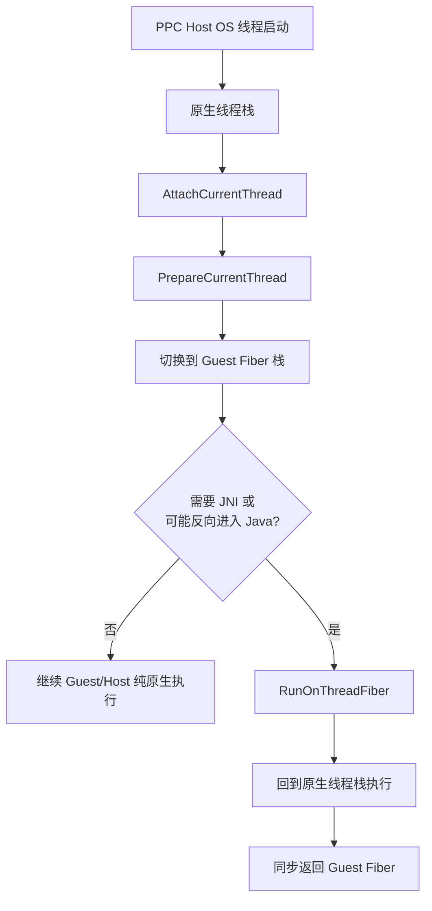
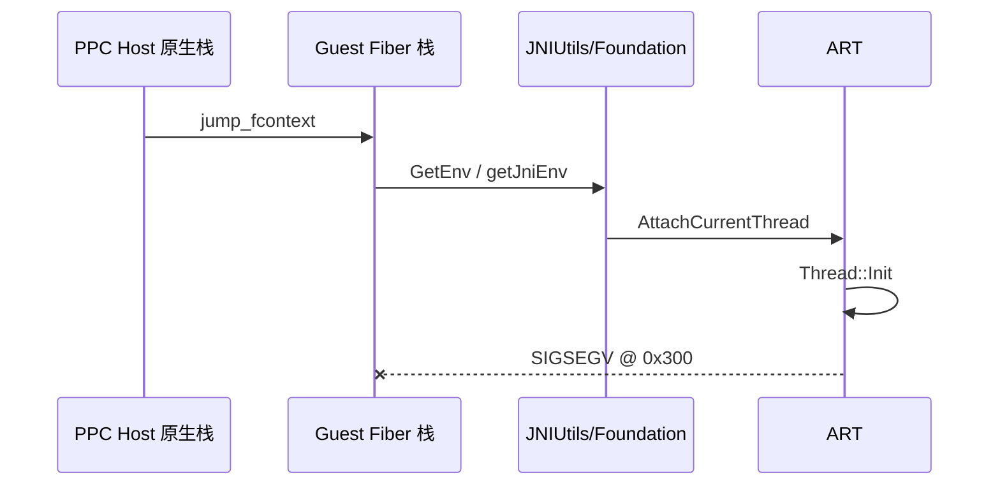
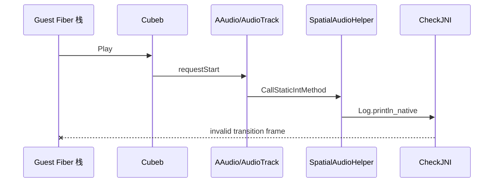
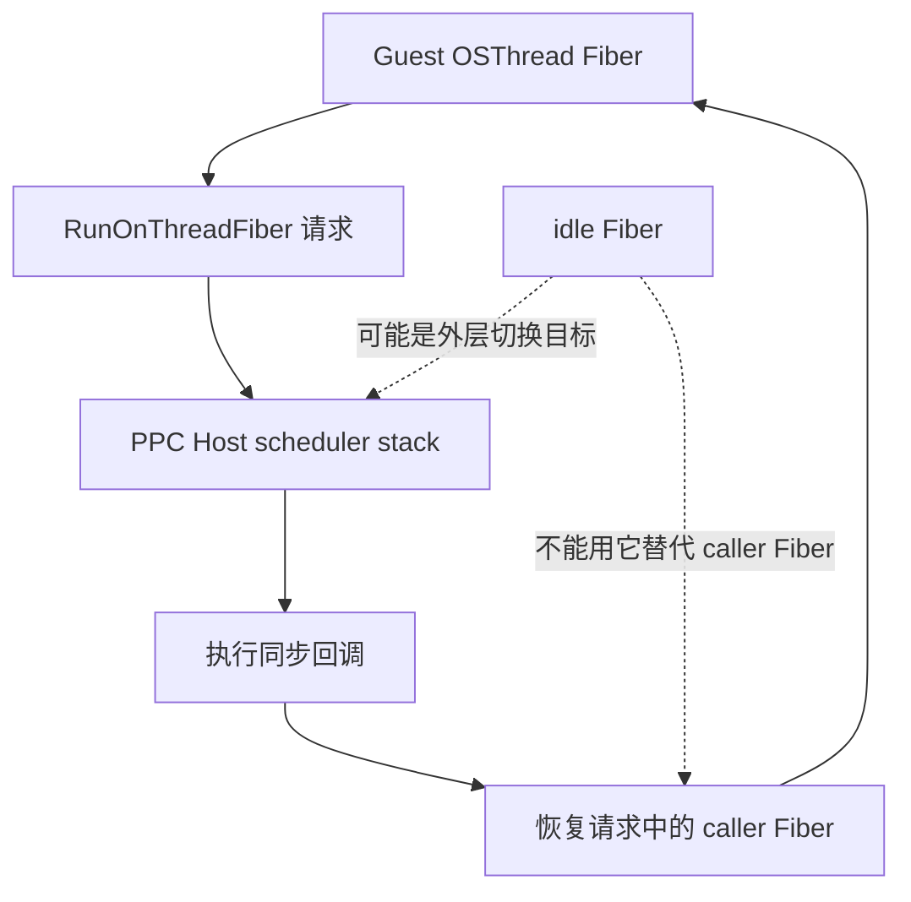

# Android PPC Fiber 上的 ART/JNI 崩溃

## 状态

- 状态：已修复，并完成无 controller 的 BotW gameplay warmup 回归
- 平台：Swan / Android API 36 / Adreno 840
- 场景：BotW JP v208 + DLC v80，`relWithDebInfo` APK，多核重编译器
- 修复前影响：标题已完成 Vulkan 初始化并开始 Guest 执行后，进程会在 PPC Host 线程上崩溃或被 CheckJNI 主动终止
- 关联问题：[Android Vulkan 首帧 Fence 永久等待](android-vulkan-first-frame-fence-stall.md) 是另一条故障链，不能与本问题合并归因

## 结论

Cemu Android 使用 fcontext 在三个 PPC Host 线程上调度 Guest Fiber。Guest Fiber 使用独立的 2 MiB 栈，并可能在不同 PPC Host 线程之间恢复。ART/JNI 的线程附着和 JNI transition frame 不能在这条替代栈上随意建立或反向进入。

本问题包含连续暴露的两个故障：

1. 未附着的 PPC Host 线程第一次从 Guest Fiber 调用 Foundation/JNI 时，会在替代栈上执行 `AttachCurrentThread`，最终于 ART `Thread::Init` 内崩溃。
2. 提前附着 JVM 后，`CubebAPI::Play` 仍从 Guest Fiber 栈进入 AAudio；设备的音频扩展会反向调用 Java `SpatialAudioHelper`，CheckJNI 因无效的 JNI transition frame 引用主动 abort。

因此修复不能只是“提前 Attach JVM”。完整约束是：

- PPC Host OS 线程必须在第一次 Fiber 切换前、仍位于原生线程栈时完成 JVM 附着。
- Cemu 显式 JNI 调用，以及可能通过 Android framework 反向进入 Java 的平台调用，必须同步切回该 Host 线程的原生栈执行。



## 故障一：在 Guest Fiber 栈附着 JVM

### 原生调试证据

在 `PPC Core 1` 捕获到确定的 `SIGSEGV`：

| 项目 | 观测值 |
|---|---|
| signal | `SIGSEGV` |
| fault address | `0x300` |
| 顶部栈帧 | `__set_errno_internal` |
| 上层 ART 栈帧 | `art::Thread::Init(art::ThreadList*, art::JavaVMExt*, art::JNIEnvExt*)` |
| 当前 SP | Cemu 分配的 Fiber 栈，而非 pthread 原生栈 |
| 触发阶段 | `Run title` 之后，日志接近 `IOSU_ACT: using account default in first slot` |

停止时 `tpidr_el0` 有效，因此不能把根因简化成“TLS base 为零”。可以确认的是：ART 正在为尚未附着的 PPC Host 线程执行 `AttachCurrentThread`，而调用发生在 Cemu 的替代 Fiber 栈上；将附着动作移到首次 Fiber 切换之前后，这个崩溃不再出现。



## 故障二：AAudio 从 Guest Fiber 反向进入 Java

提前附着三个 PPC Host 线程后，第一处 `SIGSEGV` 消失，程序继续执行到音频启动。随后 CheckJNI 给出更明确的错误：

```text
JNI DETECTED ERROR IN APPLICATION:
jstring is an invalid JNI transition frame reference
in call to GetStringUTFChars
from android.util.Log.println_native
```

关键调用链为：

```text
coreinit::__OSThreadCoreIdle
  -> snd_core::AXOut_update
  -> snd_core::AXOut_updateDevicePlayState
  -> CubebAPI::Play
  -> cubeb_stream_start
  -> AAudioStream_requestStart
  -> AudioTrack::start
  -> SpatialAudioHelperDelegate::createPlayerAdaptor
  -> Java SpatialAudioHelper.createPlayerAdaptor
  -> CheckJNI abort
```

这条证据说明，即使 Host 线程已经附着 JVM，也不能从 Guest Fiber 栈调用可能反向进入 Java 的 Android framework 路径。



## 实现方案

### 1. PPC Host 线程初始化回调

`JNI_OnLoad` 注册 Fiber 线程初始化回调。每个 PPC Host 线程在 `PrepareCurrentThread()` 创建 scheduler Fiber 之前调用 `JNIUtils::GetEnv()`，从而在 pthread 原生栈完成 JVM 附着。

Foundation 的 `JniHelper::cacheEnv()` 随后会得到 `JNI_OK` 并缓存现有 `JNIEnv*`，不需要修改 Foundation 子模块。

### 2. 同 Host 线程原生栈回调

fcontext Fiber 恢复了同步的 `RunOnThreadFiber()` 通道：

1. Guest Fiber 提交栈上有效期内的同步回调。
2. fcontext 回跳当前 PPC Host 线程的 scheduler/original stack。
3. scheduler stack 执行回调。
4. fcontext 立即恢复发起调用的 Guest Fiber。

回调请求显式携带发起者 Fiber，不能假设 scheduler 最初切入的目标就是当前 Guest Fiber，因为 idle Fiber 与 Guest OSThread Fiber 之间还可能存在嵌套切换。



### 3. 当前接入点

- `JNIUtils::FiberSafeJNICall()`：不再为每次调用创建临时 `std::jthread`，改为同步回到当前 Host 原生栈。
- `NativeSwkbd`：回调内只使用已传入的 `JNIEnv*`，不再次获取环境。
- `snd_core::AXOut_updateDevicePlayState()`：Android 上的 Cubeb Play/Stop 在 Host 原生栈执行。
- `snd_core::AXOut_reset()`：Android 上的 Cubeb Stop/销毁也在 Host 原生栈执行。
- Fiber 与 coreinit 的关键 TLS 访问通过 `TLS_WORKAROUND_NOINLINE` 边界完成，避免 Guest Fiber 跨 PPC Host 线程恢复后继续使用旧线程的 TLS 地址。

## 验证结果

### 构建与安装

```sh
cd src/android
./gradlew assembleRelWithDebInfo
adb install -r app/build/outputs/apk/relWithDebInfo/app-relWithDebInfo.apk
```

结果：`assembleRelWithDebInfo` 成功，覆盖安装成功；APK 使用正式包名、Native `RelWithDebInfo`、`android:debuggable` 配置。

### 真机启动

使用同一份 WUA 直接启动：

```text
Base:  00050000101c9300 v0
Update: 0005000e101c9300 v208
DLC:   0005000c101c9300 v80
Region: JP
RPX updated hash: fb7911ad
GPU: Adreno 840
```

本轮观测：

| 项目 | 结果 |
|---|---|
| Android 初始化管线 | 成功，约 2.64 秒释放初始化对话框 |
| Vulkan/标题加载 | 成功，进入 `Run title` |
| AAudio | 成功进入 started |
| pause / resume | DebugDumpService 均返回 succeeded，恢复后标题继续运行 |
| 进程存活 | 连续超过 2 分钟 |
| StatusLayer | 持续刷新，启动场景约 30 FPS |
| 无手柄 warmup | `controller_ready=false`，通过 `input_mode=diagnostic_vpad` 完成 6 次 A 和 60 秒稳定等待；截图确认进入 gameplay |
| 原 `SIGSEGV` | 未复现 |
| CheckJNI abort | 未复现 |
| KGSL/SMMU page fault | 本轮未发现与 Cemu 关联的记录 |

后续回归新增了无 controller 的诊断 VPAD 回退：`title_running=true`、
`controller_ready=false` 时，warmup 报告 `input_mode=diagnostic_vpad`，按 15 秒延迟、
每 5 秒一次 A、共 6 次、最后稳定 60 秒的流程进入 `completed`。完成后的真机截图确认
已经进入 BotW gameplay；进程仍存活，未发现 JNI/native signal 或 KGSL/SMMU page fault。
该回退只向 VPAD channel 0 原本的空样本补充 A 的 hold/trig/release，不创建手柄配置，
也不依赖 Android/adb 输入。

## 后续约束

- 不得从 Guest Fiber 直接执行 `AttachCurrentThread` 或 `DetachCurrentThread`。
- 不得因为 API 表面上是“Native”就假设它不会进入 Java；Android 音频、窗口、输入法和部分厂商扩展都可能通过 JNI 反向调用 Java。
- 新增 Android framework 调用若可能从 PPC/Guest 路径触发，应复用 `RunOnThreadFiber()`，并用 CheckJNI 真机验证。
- `RunOnThreadFiber()` 是同步调度，不应用来承载无界阻塞工作；长任务应有独立、生命周期明确的 Host 工作线程。
- 不得用“进程仍存活”替代 gameplay 验证；必须同时满足 warmup 完成、截图确认实际场景和错误日志检查。
