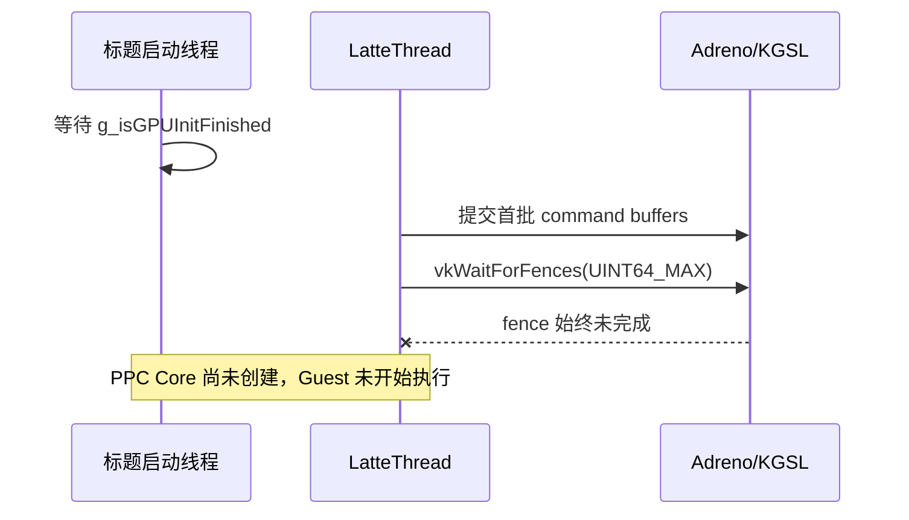
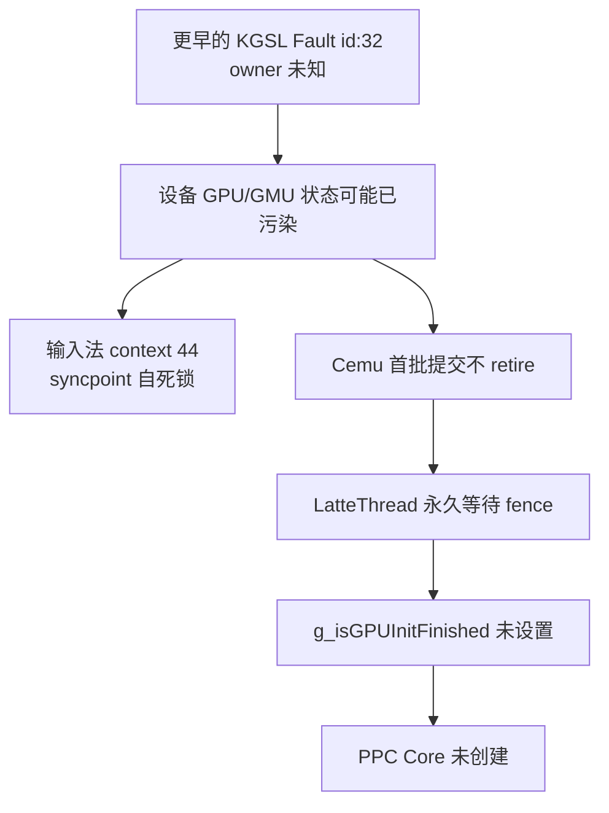
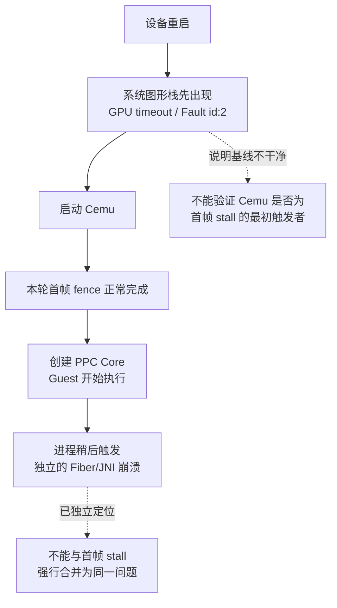

# Android Vulkan 首帧 Fence 永久等待

## 状态

- 状态：待深入排查；等待点已确认，但尚未确认 Cemu 侧根因，且重启后未稳定复现
- 平台：Swan / Android 16 / Adreno 840
- 场景：BotW JP v208 + DLC v80，`relWithDebInfo` APK
- 影响：标题初始化界面释放后没有进入 Guest，表现为长时间停留在 initializing；窗口随后消失已拆分并定位为 [PPC Fiber 上的 ART/JNI 崩溃](android-ppc-fiber-jni-stack-crash.md)，不属于本问题的已知因果链

## 已确认现象

在一次受污染设备状态下，原生调试器暂停活进程后确认：

1. `LatteThread` 停在 `VulkanRenderer::WaitForNextFinishedCommandBuffer()`。
2. 具体阻塞点是 `vkWaitForFences(..., UINT64_MAX)`，调用链为：

   ```text
   Latte_ThreadEntry
     -> DrawEmptyFrame(true)
     -> SwapBuffers
     -> SwapBuffer
     -> WaitCommandBufferFinished
     -> WaitForNextFinishedCommandBuffer
     -> vkWaitForFences
     -> Adreno gsl_syncobj_wait / ppoll
   ```

3. 同一时刻 renderer 状态为：

   | 项目 | 观测值 |
   |---|---:|
   | 主 swapchain extent | 1920 × 1080 |
   | swapchain image 数量 | 6 |
   | `m_numSubmittedCmdBuffers` | 3 |
   | `m_countCommandBufferFinished` | 0 |
   | `m_commandBufferIndex` | 3 |
   | `m_commandBufferSyncIndex` | 0 |
   | `m_commandBufferIDOfPrevFrame` | 0 |

4. CPU 启动线程尚未创建三个 `PPC Core` 线程。它在 `cemu_initForGame()` 中等待 `g_isGPUInitFinished`；该标志只有在首张空帧、graphic-pack 等待和 shader cache 加载之后才会由 `LatteThread` 设置。
5. 因此这次停滞不是 shader cache 编译，也不是 Guest/PPC 执行阶段的卡住。



## 后续发现的设备侧污染因素

上述原生栈准确描述了 Cemu 的等待位置，但不足以证明 Cemu 的 acquire/submit/present 实现就是根因。随后从 Android kernel log 中发现：

- 在被调试的 Cemu PID 创建之前，KGSL 已报告一次 `Fault id:32`，并记录 GMU suspend；该条日志没有给出 owner，不能可靠归因于 Cemu 或其他图形客户端。
- 随后 KGSL 多次报告 GPU syncpoint deadlock，明确指向 `com.bytedance.pico.inputmethod` 的 context 44：`submit=1, start=0, retire=0`，并提示该 context 可能被自身阻塞。
- 输入法 context 死锁时 GPU busy 约为 98%～99%。停止输入法进程后，它被系统重新拉起并在同一个 context 上再次报告死锁；已有 Cemu fence 没有恢复。

所以当前证据链应理解为：



这说明“首帧 fence 永久等待”是已确认故障表现；“Cemu swapchain 同步错误”目前仅是假设，必须在干净 GPU 状态下复现后才能成立。

## 重启后的对照结果

设备重启后得到了一组重要的反证，说明本问题不能直接归因于 Cemu：

1. 在 Cemu 尚未启动、设备 uptime 约 22.44 秒时，kernel 已经报告：

   ```text
   adreno-gen8-gmu: gpu timeout ctx 4294967295 ts 65
   kgsl: Fault id:2
   ```

   当时 ring read/write pointer 没有显示有效的 Cemu IB。也就是说，本次重启没有提供真正干净的 GPU 基线，系统图形栈自身已经出现超时或 fault。
2. 在同一次重启之后启动 Cemu，`LatteThread` 成功越过首帧 fence，完成 GPU 初始化并创建了三个 `PPC Core` 线程。这证明首帧永久等待不是当前启动流程上的确定性错误。
3. 该进程随后仍然消失，但消失发生在 PPC 已执行数秒之后。后续原生调试已把这条退出定位到 PPC Host 线程从替代 Fiber 栈执行 ART/JNI 与 Android 音频反向 Java 调用，详见独立故障文档；它不能反推为首帧 fence 等待导致。

当前更合理的故障模型是：首帧 fence 等待可能是设备 GPU/GMU 已处于异常状态时的级联表现；Cemu 的 acquire/submit/present 同步是否会触发、放大或无法恢复这种异常，仍然需要专门实验。



## 与 Azahar 的初步对照

Azahar 的 Android Vulkan present 路径采用更直接的一帧同步模型：

- `vkAcquireNextImageKHR` 只使用 acquire semaphore，不同时传入 fence。
- present copy 使用单次 submit：等待 acquire/render-ready semaphore，提交完成后 signal present-ready semaphore，并由 per-frame fence 管理资源复用。
- surface 改变时先等待并重建 surface/swapchain，再恢复 acquire 循环。

Cemu 当前路径会将一次空帧拆为多次相互串联的 submit，并额外维护 acquire fence、command-buffer semaphore 链和 previous-frame fence。这个差异值得审计，但不能仅凭结构更复杂就判定为 bug。

## 后续验证计划

1. 重启设备，确认在启动 Cemu 前没有新的 KGSL fault、SMMU/IOMMU fault 或 syncpoint deadlock；若系统图形栈在 Cemu 启动前已经 fault，本轮只记录为环境证据，不用于判定 Cemu 修复有效性。
2. 只启动 Cemu 和同一个 BotW WUA，不注入按键；记录 PID、启动时间和 kernel log 时间边界。
3. 若首帧再次卡住，采集：
   - `LatteThread` 原生栈；
   - command buffer submit/finish 计数；
   - acquire result、image index、acquire fence/semaphore 状态；
   - Cemu 对应 KGSL context 的 submit/retire/fault 事件；
   - surface 生命周期与 ANativeWindow identity。
4. 只有在干净状态仍可复现时，才分别做以下单变量实验：
   - 取消 acquire fence，仅保留 acquire semaphore（对齐 Azahar）；
   - 合并空帧的冗余 submit；
   - 给 `vkWaitForFences` 增加有界诊断超时和 device-lost/fault 报告，但不能把超时后强行继续当作修复。
5. 若干净启动能够进入 Guest，则把本问题标为“设备 GPU fault 后的级联卡死”，另行追查最初 `Fault id:32` 的 owner 和触发提交。
6. 将“首帧 stall”和“进入 Guest 数秒后进程消失”拆成两个故障编号和两套时间线；只有拿到相同 fatal signal、GPU fault context 或提交序列后，才允许合并根因。

## 判断约束

- 不得用“没有在普通 app log 中看到 page fault”替代 kernel/KGSL 证据。
- 不得把 `vkWaitForFences` 的等待位置直接等同于产生错误命令的代码位置。
- 不得在已有 GPU fault 或其他 context deadlock 的设备状态下评价 Cemu swapchain 修复是否有效。
- 不得用跳过 fence、伪造完成计数或强行设置 `g_isGPUInitFinished` 掩盖问题。
