# Wii U 游戏 Top 100

> 生成时间：2026-09-19　|　数据源：Cemu 官方 Wiki、GameTDB、Wikipedia、社区汉化目录
> 
> 本表面向 **Cemu 模拟器用户**：热度以「模拟器社区关注度」为主，而非单纯的当年销量。

## 一眼概览

- **兼容性**：完美 27 · 可玩 41 · 可运行 24 · 仅加载 6 · 无法运行 2
- **中文支持**：官方中文 2 · 民间汉化 35 · 未见中文 63
- **可放心玩**（完美/可玩 且 有中文）：30 款

> **关于中文的重要事实**：Wii U 从未在中国大陆、台湾、香港正式发售，主机本身锁区。
> GameTDB 全库 2860 条 Wii U 记录中，仅 YouTube 应用带中文语言标记——**没有任何一款 Wii U 游戏原生内置中文**。
> 表中「官方中文」指该作在欧美版中自带简/繁中文（多为第三方独立游戏），其余中文均来自民间汉化组。

## 完整榜单

| # | 封面 | 游戏 | 热度 | Cemu 兼容性 | 中文 | 类型 | 发行 | 年份 |
|--:|:--:|:--|:--|:--|:--|:--|:--|--:|
| 1 |  | **瑪利歐賽車8** Mario Kart 8 | `████████` 100.0 | 🟢 完美 | 🈶 汉化 简体汉化 v64 + DLC 91WII汉化组 | 竞速 | Nintendo | 2014 |
| 2 |  | **超級瑪利歐3D世界** Super Mario 3D World | `████████` 97.1 | 🟡 可运行 | 🈶 汉化 简体汉化 咸鱼汉化组 | 动作 / 平台 / 3D平台 | Nintendo | 2013 |
| 3 |  | **任天堂明星大亂鬥 for Wii U** Super Smash Bros. for Wii U | `███████` 91.4 | 🟢 完美 | — | 动作 / 格斗 | Nintendo | 2014 |
| 4 |  | **新超级马力欧兄弟U** New Super Mario Bros. U | `███████` 91.3 | 🟢 完美 | 🈶 汉化 简体汉化v20190223 v64 + DLC 91wii+无名汉化组 | 动作 / 2D平台 | Nintendo | 2012 |
| 5 | 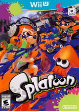 | **斯普拉遁** Splatoon | `███████` 89.5 | 🔵 可玩 | 🈶 汉化 简体汉化 v272 91WII汉化组 | 动作 / TPS | Nintendo | 2015 |
| 6 | 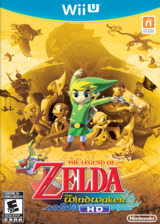 | **薩爾達傳說 風之律動** The Legend of Zelda: The Wind Waker HD | `███████` 87.8 | 🟢 完美 | 🈶 汉化 简体汉化v1.01 v1.01/v1.02 汉化版 91WII汉化组 | 动作 / 冒险 | Nintendo | 2013 |
| 7 | 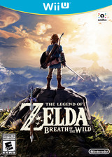 | **塞尔达传说 旷野之息** The Legend of Zelda: Breath of the Wild | `███████` 85.3 | 🟢 完美 | 🈶 汉化 简繁体汉化 v208 + DLC 91WII汉化组 | 动作 / 冒险 / 角色扮演 | Nintendo | 2017 |
| 8 |  | **超級瑪利歐創作家** Super Mario Maker | `███████` 85.2 | 🟢 完美 | 🈶 汉化 简体汉化v1.4 v272 91WII汉化组 | 动作 / 平台 | Nintendo | 2015 |
| 9 |  | **森喜刚 热带寒流** Donkey Kong Country: Tropical Freeze | `██████` 76.9 | 🟢 完美 | — | 动作 / 平台 / 2D平台 | Nintendo | 2014 |
| 10 | 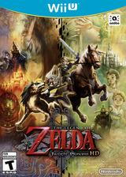 | **薩爾達傳說 黃昏公主** The Legend of Zelda: Twilight Princess HD | `██████` 75.2 | 🟢 完美 | 🈶 汉化 简体汉化 ACG汉化组 | 动作 / 冒险 | Nintendo | 2014 |
| 11 | 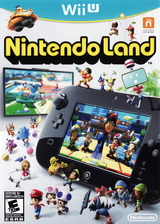 | **任天堂大陆** Nintendo Land | `██████` 74.4 | 🟡 可运行 | 🈶 汉化 简体汉化 v32 91WII汉化组 | 聚会 | Nintendo | 2012 |
| 12 | 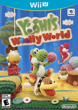 | **耀西的毛線世界** Yoshi's Woolly World | `██████` 70.9 | 🟢 完美 | 🈶 汉化 简体汉化 v48 91WII汉化组 | 动作 / 平台 | Nintendo | 2015 |
| 13 |  | **瑪利歐派對10** Mario Party 10 | `██████` 69.5 | 🔵 可玩 | 🈶 汉化 简繁体汉化 v16 91WII汉化组 | 聚会 | Nintendo | 2015 |
| 14 | 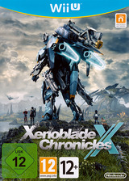 | **异度神剑X** Xenoblade Chronicles X | `█████` 68.4 | 🔵 可玩 | 🈶 汉化 简体汉化 v48 + DLC 游侠LMAO汉化组 | 角色扮演 / 动作RPG | Nintendo | 2015 |
| 15 | 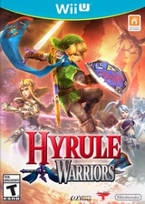 | **薩爾達無雙** Hyrule Warriors | `█████` 67.9 | 🟢 完美 | — | 动作 / 格斗 | Nintendo | 2014 |
| 16 |  | **前进！奇诺比奥队长** Captain Toad: Treasure Tracker | `█████` 67.0 | 🟢 完美 | 🈶 汉化 简体汉化 v16 猫星汉化组 | 动作 / 解谜 / 平台 | Nintendo | 2014 |
| 17 |  | **魔兵驚天錄** Bayonetta | `█████` 64.7 | 🔵 可玩 | — | 动作 / 格斗 | Nintendo | 2014 |
| 18 |  | **零～濡鸦之巫女～** Project Zero: Maiden of Black Water | `█████` 63.4 | 🔵 可玩 | 🈶 汉化 简体汉化v2 ACG汉化组 | 冒险 / 恐怖 | Nintendo | 2015 |
| 19 | 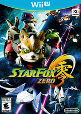 | **星际火狐 零** Star Fox Zero | `█████` 63.1 | 🟢 完美 | — | 动作 / FPS | Nintendo | 2016 |
| 20 | 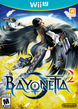 | **魔兵驚天錄2** Bayonetta 2 | `█████` 62.7 | 🟢 完美 | 🈶 汉化 简体汉化v2.0 游侠LMAO汉化组 | 动作 / 格斗 | Nintendo | 2014 |
| 21 | 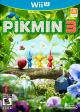 | **皮克敏3** Pikmin 3 | `█████` 62.7 | 🔵 可玩 | 🈶 汉化 简体汉化 v96 + DLC 猫星汉化组 | 策略 | Nintendo | 2013 |
| 22 |  | **樂高小城：臥底密探** LEGO City: Undercover | `█████` 60.6 | 🟡 可运行 | 🈶 汉化 简体汉化 v16 91WII汉化组 | 动作 / 冒险 / 3D平台 | Nintendo | 2013 |
| 23 |  | **決勝時刻：黑色行動II** Call of Duty: Black Ops II | `█████` 58.8 | 🟡 可运行 | — | 动作 / FPS | Activision | 2012 |
| 24 | 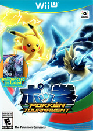 | **寶可拳** Pokkén Tournament | `█████` 58.3 | 🔵 可玩 | — | 格斗 | The Pokémon | — |
| 25 | 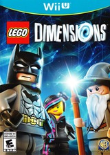 | **樂高次元** LEGO Dimensions | `█████` 58.3 | 🔵 可玩 | — | 动作 / 冒险 | Warner Bros | 2015 |
| 26 |  | **紙片瑪利歐 色彩噴濺** Paper Mario: Color Splash | `█████` 57.7 | 🔵 可玩 | 🈶 汉化 简体汉化 v16 漫游汉化组+91Wii汉化组 | 动作 / 冒险 | Nintendo | 2016 |
| 27 | 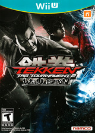 | **鐵拳 TT2 Wii U版** Tekken Tag Tournament 2 | `█████` 57.2 | 🔵 可玩 | — | 格斗 | Bandai Nam | — |
| 28 |  | **新超級路易吉U** New Super Luigi U | `████` 56.1 | 🟢 完美 | 🈶 汉化 简体汉化v20190223 91wii+无名汉化组 | 动作 / 冒险 / 2D平台 | Nintendo | 2013 |
| 29 | 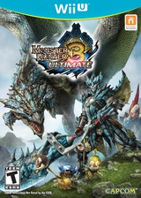 | **魔物獵人3G HD（终极版）** Monster Hunter 3 Ultimate | `████` 55.8 | 🟢 完美 | 🈶 汉化 简体汉化 v96 3DS汉化吧汉化组+ACG汉化组 | 角色扮演 | Capcom | 2013 |
| 30 |  | **看門狗** Watch Dogs | `████` 55.6 | 🟠 仅加载 | 🈶 汉化 繁体汉化 91WII汉化组 | 动作 / 冒险 / 射击 | Ubi Soft | 2014 |
| 31 | 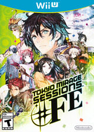 | **幻影异闻录♯FE** Tokyo Mirage Sessions | `████` 55.3 | 🔵 可玩 | 🈶 汉化 简体汉化 v32 + DLC 91WII汉化组 | 角色扮演 | Nintendo | — |
| 32 | 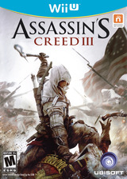 | **刺客信条III** Assassin's Creed III | `████` 55.1 | 🟡 可运行 | 🈶 汉化 繁体汉化 v80 + DLC 91WII汉化组 | 动作 / 冒险 | Ubisoft | 2012 |
| 33 |  | **索尼克 失落的世界** Sonic Lost World | `████` 53.1 | 🟡 可运行 | — | 动作 / 冒险 / 平台 | Sega | 2013 |
| 34 | 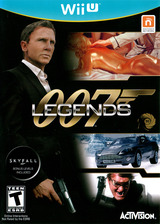 | **007初露锋芒** 007 Legends | `████` 53.0 | 🟡 可运行 | — | 动作 | Activision | 2012 |
| 35 |  | **恶魔三人组** Devil's Third | `████` 51.7 | 🔵 可玩 | — | 动作 / FPS | Nintendo | 2015 |
| 36 | 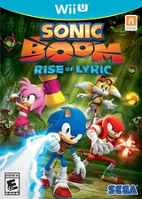 | **音速小子 繚亂衝鋒** Sonic Boom: Rise of Lyric | `████` 48.8 | 🔵 可玩 | — | 动作 / 冒险 | SEGA | 2014 |
| 37 | 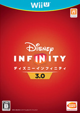 | **迪士尼無限世界3.0** Disney Infinity 3.0 | `████` 47.3 | 🟠 仅加载 | — | 动作 / 冒险 | Disney | 2015 |
| 38 | 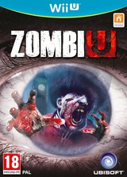 | **僵尸U** ZombiU | `████` 46.8 | 🔵 可玩 | — | 动作 / 恐怖 | Ubisoft | 2012 |
| 39 |  | **蝙蝠侠：阿卡姆起源** Batman: Arkham Origins | `████` 46.6 | 🟡 可运行 | — | 动作 | Warner Bros | 2013 |
| 40 |  | **決勝時刻：魅影** Call of Duty: Ghosts | `████` 46.3 | 🔵 可玩 | — | 动作 / 格斗 / 策略 | Activision | 2013 |
| 41 | 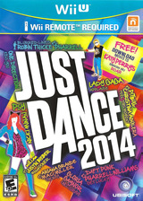 | **舞力全开** Just Dance 2014 | `████` 45.5 | 🔵 可玩 | — | 动作 / 音乐 / 3D平台 | Ubisoft | 2013 |
| 42 | 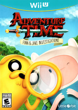 | **探險活寶** Adventure Time: Finn And Jake Investigations | `████` 45.3 | 🔵 可玩 | — | 角色扮演 | Little Orbit | — |
| 43 | 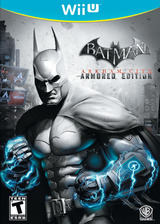 | **蝙蝠侠：阿卡姆之城** Batman: Arkham City Armored Edition | `████` 45.1 | 🔵 可玩 | — | 动作 / 冒险 | Warner Bros | 2012 |
| 44 |  | **星之卡比 彩虹诅咒** Kirby and the Rainbow Curse | `████` 44.7 | 🟡 可运行 | 🈶 汉化 简体汉化 v16 猫星汉化组 | 动作 | Nintendo | 2015 |
| 45 | 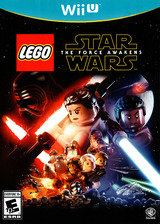 | **樂高星際大戰：原力覺醒** LEGO Star Wars: The Force Awakens | `████` 44.2 | 🔵 可玩 | — | 冒险 | Warner Bros | 2016 |
| 46 | 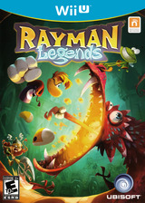 | **雷曼 传奇** Rayman Legends | `████` 43.8 | 🟢 完美 | 🈶 汉化 简体汉化 91WII汉化组 | 动作 / 平台 | Ubi Soft | 2013 |
| 47 | 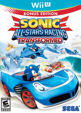 | **索尼克和全明星赛车：变形** Sonic & All-Stars Racing Transformed | `███` 43.2 | 🔵 可玩 | — | 竞速 | Sega Japan | 2012 |
| 48 | 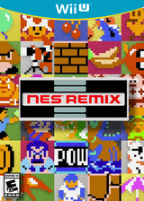 | **FC红白机复古游戏合集** NES Remix 1 | `███` 42.6 | 🔵 可玩 | 🈶 汉化 简体汉化 91WII汉化组 | 动作 / 街机 | Nintendo | — |
| 49 |  | **極速賽車 NEO** Fast Racing Neo | `███` 42.2 | 🔵 可玩 | — | 竞速 / 街机 | Shin'en Multimedia | 2016 |
| 50 |  | **动物森友会 amiibo节日** Animal Crossing: Amiibo Festival | `███` 42.0 | 🔴 无法运行 | — | 聚会 | Nintendo | 2015 |
| 51 | 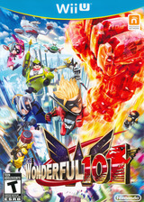 | **神奇101** The Wonderful 101 | `███` 41.4 | 🔵 可玩 | — | 动作 / 格斗 | Nintendo | 2013 |
| 52 | 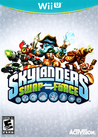 | **小龍斯派羅 交換力量** Skylanders: Swap Force | `███` 41.1 | 🟡 可运行 | — | 动作 / 冒险 | Activision | 2013 |
| 53 |  | **瑪利歐與索尼克 AT 里約奧運** Mario & Sonic at the Rio 2016 Olympic Games | `███` 40.0 | 🟡 可运行 | — | 体育 | Nintendo | 2016 |
| 54 |  | **樂高玩電影** The LEGO Movie Videogame | `███` 39.2 | 🟢 完美 | — | 动作 | Warner Bros | 2014 |
| 55 | 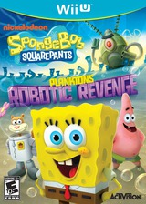 | **海綿寶寶 痞老闆的機器人復仇** Spongebob Squarepants: Plankton's Robotic Revenge | `███` 39.2 | 🟡 可运行 | — | 动作 | Activision | 2013 |
| 56 | 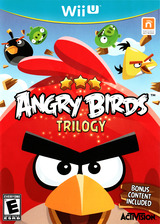 | **憤怒鳥 三部曲** Angry Birds Trilogy | `███` 38.9 | 🟡 可运行 | — | 街机 / 解谜 | Activision | 2013 |
| 57 | 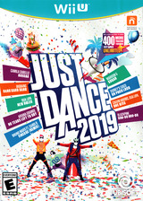 | **舞力全开** Just Dance 2019 | `███` 38.5 | 🔵 可玩 | — | 音乐 / 聚会 | Ubi Soft | 2018 |
| 58 | 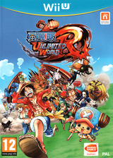 | **航海王 無限世界 紅** One Piece: Unlimited World Red | `███` 37.3 | 🟢 完美 | — | 动作 / 冒险 | Nam | 2014 |
| 59 | 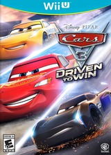 | **汽車總動員3 全力奪冠** Cars 3: Driven to Win | `███` 37.2 | 🟠 仅加载 | — | 竞速 | Warner Bros | 2017 |
| 60 | 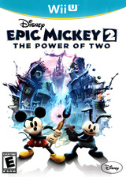 | **迪士尼 米奇傳奇2 雙重力量** Disney Epic Mickey 2: The Power of Two | `███` 35.7 | 🔵 可玩 | — | 动作 | Disney | 2012 |
| 61 | 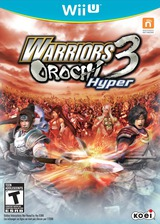 | **無雙OROCHI 蛇魔2** Warriors Orochi 3 Hyper | `███` 35.2 | 🟢 完美 | — | 动作 / 冒险 | Koei | 2012 |
| 62 | 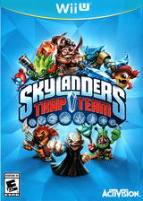 | **小龍斯派羅 陷阱隊** Skylanders: Trap Team | `███` 35.0 | 🔵 可玩 | — | 动作 / 冒险 | Activision | 2014 |
| 63 |  | **舞力全開 2017** Just Dance 2017 | `███` 34.7 | 🟠 仅加载 | — | 音乐 / 聚会 | Ubi Soft | 2016 |
| 64 | 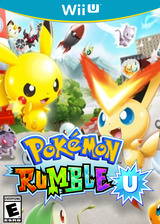 | **宝可梦大乱战U** Pokémon Rumble U | `███` 34.0 | 🟡 可运行 | — | 动作 | Nintendo | 2013 |
| 65 |  | **乐高侏罗纪世界** LEGO Jurassic World | `███` 33.2 | 🔵 可玩 | 🈶 汉化 简体汉化 91WII汉化组 | 动作 / 冒险 | Warner Bros | 2015 |
| 66 | 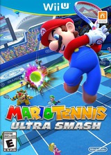 | **瑪利歐網球 終極殺球** Mario Tennis: Ultra Smash | `██` 31.0 | 🟢 完美 | — | 体育 / 网球 | Nintendo | 2015 |
| 67 | 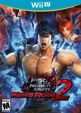 | **北斗神拳 真救世主傳說 拳王無双2** Fist of the North Star: Ken's Rage 2 | `██` 30.9 | 🟢 完美 | — | 动作 / 冒险 / 格斗 | TECMO KOEI AMERICA CORP | 2013 |
| 68 | 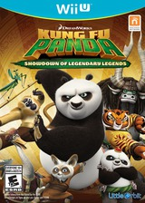 | **功夫熊貓 傳奇對決** Kung Fu Panda: Showdown of Legendary Legends | `██` 29.6 | 🟢 完美 | — | 格斗 | Little Orbit | 2015 |
| 69 | 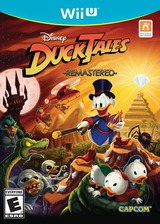 | **唐老鴨俱樂部** DuckTales: Remastered | `██` 29.4 | 🟢 完美 | — | 动作 / 冒险 / 平台 | Capcom | 2013 |
| 70 |  | **迷你瑪利歐與朋友們 amiibo挑戰** Mini Mario & Friends: Amiibo Challenge | `██` 29.4 | 🟡 可运行 | — | 动作 / 解谜 | Nintendo | 2016 |
| 71 | 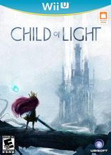 | **光明之子** Child of Light | `██` 27.9 | 🔵 可玩 | 🈶 汉化 简体汉化 91WII汉化组 | 冒险 / 角色扮演 | Ubisoft | 2014 |
| 72 |  | **质量效应3** Mass Effect 3: Special Edition | `██` 27.8 | 🟡 可运行 | — | 动作 / 射击 | Electronic Arts | 2012 |
| 73 | 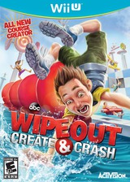 | **勇敢向前衝 (遊戲節目)** Wipeout: Create & Crash | `██` 27.1 | 🟢 完美 | — | 动作 | Activision | — |
| 74 | 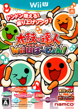 | **太鼓之達人 Wii U版** Taiko no Tatsujin: Wii U Version | `██` 26.4 | 🟡 可运行 | — | 音乐 / 节奏 | Nam | 2013 |
| 75 | 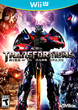 | **變形金剛 黑火之崛起** Transformers: Rise of the Dark Spark | `██` 26.3 | 🟡 可运行 | — | 动作 / TPS | Activision | 2014 |
| 76 | 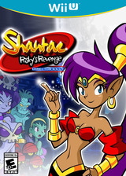 | **桑塔：里絲琦的逆襲** Shantae: Risky's Revenge Director's Cut | `██` 26.2 | 🟠 仅加载 | — | 动作 / 冒险 / 平台 | WayForward | 2016 |
| 77 | 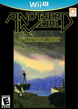 | **另一个世界** Another World 20th Anniversary Edition | `██` 25.7 | 🔵 可玩 | 🈶 汉化 简体汉化 91WII汉化组 | 动作 / 冒险 / 平台 | Digital Lounge | 2014 |
| 78 |  | **蒸汽世界 挖掘** Steamworld Dig | `██` 25.6 | 🔵 可玩 | — | 动作 / 冒险 / 2D平台 | Image & Form | 2014 |
| 79 |  | **Wii U** Wii Party U | `██` 23.9 | 🟡 可运行 | 🈶 汉化 简体汉化 91WII汉化组 | 聚会 | Nintendo | 2013 |
| 80 | 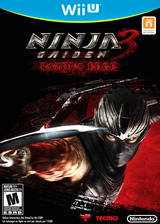 | **忍者外傳3** Ninja Gaiden 3: Razor's Edge | `██` 23.2 | 🔵 可玩 | — | 动作 | Koei | 2012 |
| 81 |  | **桑塔：半精靈英雄** Shantae: Half-Genie Hero | `██` 22.9 | 🔵 可玩 | — | 动作 / 冒险 / 角色扮演 | XSEED | 2016 |
| 82 |  | **瑪利歐vs.咚奇剛** Mario vs. Donkey Kong: Tipping Stars | `██` 22.9 | 🔵 可玩 | 🈶 汉化 繁体汉化 91WII汉化组 | 解谜 | Nintendo | 2015 |
| 83 |  | **暗黑血统II** Darksiders II | `██` 21.9 | 🔵 可玩 | ✅ 官方 官方简中 | 动作 / 冒险 | THQ | 2012 |
| 84 |  | **迪士尼無限世界2.0** Disney Infinity 2.0 Marvel Super Heroes | `██` 21.4 | 🟠 仅加载 | — | 沙盒 | Disney | — |
| 85 |  | **魔法气泡噗哟噗哟俄罗斯方块** Puyo Puyo Tetris | `██` 20.8 | 🔵 可玩 | 🈶 汉化 官中移植简体汉化 | 解谜 | Sega Japan | 2014 |
| 86 |  | **小龍斯派羅 創想家** Skylanders: Imaginators | `██` 20.6 | 🟢 完美 | — | 动作 / 冒险 | Activision | 2016 |
| 87 |  | **樂高漫威復仇者聯盟** LEGO Marvel's Avengers | `██` 19.3 | 🟡 可运行 | — | 动作 / 冒险 | Warner Bros | — |
| 88 |  | **怪物獵人 Frontier G** Monster Hunter: Frontier G | `██` 18.9 | 🔵 可玩 | — | Rpg | Capcom | — |
| 89 |  | **戰車** Chariot | `█` 18.6 | 🔵 可玩 | — | 动作 / 冒险 / 平台 | Frima | 2015 |
| 90 |  | **鏟子騎士** Shovel Knight | `█` 17.1 | 🔵 可玩 | 🈶 汉化 简体汉化 91WII汉化组 | 动作 / 冒险 | Yacht Club | 2015 |
| 91 |  | **FIFA 13** FIFA 13 | `█` 16.1 | 🟡 可运行 | — | 体育 | Electronic Arts | 2012 |
| 92 |  | **麦登橄榄球 13** Madden NFL 13 | `█` 15.9 | 🟡 可运行 | — | 体育 | EA Sports | 2012 |
| 93 |  | **刺客教條IV：黑旗** Assassin's Creed IV: Black Flag | `█` 14.9 | 🔵 可玩 | 🈶 汉化 繁体汉化 v32 91WII汉化组 | 动作 / 冒险 | Ubisoft | 2013 |
| 94 |  | **蜘蛛人驚奇再起 終極版** The Amazing Spider-Man: Ultimate Edition | `█` 13.6 | 🔴 无法运行 | — | 动作 / 冒险 | Activision | 2013 |
| 95 |  | **小龍斯派羅 巨人** Skylanders: Giants | `█` 12.0 | 🔵 可玩 | — | 动作 / 冒险 / 平台 | Activision | 2012 |
| 96 |  | **乐高漫威超级英雄** LEGO Marvel Super Heroes | `█` 11.7 | 🔵 可玩 | 🈶 汉化 简体汉化 91WII汉化组 | 动作 / 冒险 | Warner Bros | 2013 |
| 97 |  | **我的世界** Minecraft: Wii U Edition | `█` 11.4 | 🟢 完美 | ✅ 官方 官方简中 v528 + DLC | 动作 / 冒险 | Mojang AB | 2016 |
| 98 |  | **平價太空冒險** Affordable Space Adventures | `█` 11.2 | 🟢 完美 | — | 冒险 / 模拟 | KnapNok | 2015 |
| 99 |  | **永不孤單** Never Alone | `█` 11.1 | 🟡 可运行 | — | 动作 / 冒险 / 平台 | E-line Media | 2015 |
| 100 |  | **140** | `█` 10.0 | 🟡 可运行 | — | 动作 / 策略 / 平台 | Double Fine Productions | 2016 |

## 按中文支持分组

### ✅ 官方 官方中文（2 款）

| # | 游戏 | Cemu 兼容性 | 中文类型 | 对应版本 | 汉化组 |
|--:|:--|:--|:--|:--|:--|
| 83 | 暗黑血统II | 🔵 可玩 | 官方简中 | — | — |
| 97 | 我的世界 | 🟢 完美 | 官方简中 | v528 + DLC | — |

### 🈶 汉化 民间汉化（35 款）

| # | 游戏 | Cemu 兼容性 | 中文类型 | 对应版本 | 汉化组 |
|--:|:--|:--|:--|:--|:--|
| 1 | 瑪利歐賽車8 | 🟢 完美 | 简体汉化 | v64 + DLC | 91WII汉化组 |
| 2 | 超級瑪利歐3D世界 | 🟡 可运行 | 简体汉化 | — | 咸鱼汉化组 |
| 4 | 新超级马力欧兄弟U | 🟢 完美 | 简体汉化v20190223 | v64 + DLC | 91wii+无名汉化组 |
| 5 | 斯普拉遁 | 🔵 可玩 | 简体汉化 | v272 | 91WII汉化组 |
| 6 | 薩爾達傳說 風之律動 | 🟢 完美 | 简体汉化v1.01 | v1.01/v1.02 汉化版 | 91WII汉化组 |
| 7 | 塞尔达传说 旷野之息 | 🟢 完美 | 简繁体汉化 | v208 + DLC | 91WII汉化组 |
| 8 | 超級瑪利歐創作家 | 🟢 完美 | 简体汉化v1.4 | v272 | 91WII汉化组 |
| 10 | 薩爾達傳說 黃昏公主 | 🟢 完美 | 简体汉化 | — | ACG汉化组 |
| 11 | 任天堂大陆 | 🟡 可运行 | 简体汉化 | v32 | 91WII汉化组 |
| 12 | 耀西的毛線世界 | 🟢 完美 | 简体汉化 | v48 | 91WII汉化组 |
| 13 | 瑪利歐派對10 | 🔵 可玩 | 简繁体汉化 | v16 | 91WII汉化组 |
| 14 | 异度神剑X | 🔵 可玩 | 简体汉化 | v48 + DLC | 游侠LMAO汉化组 |
| 16 | 前进！奇诺比奥队长 | 🟢 完美 | 简体汉化 | v16 | 猫星汉化组 |
| 18 | 零～濡鸦之巫女～ | 🔵 可玩 | 简体汉化v2 | — | ACG汉化组 |
| 20 | 魔兵驚天錄2 | 🟢 完美 | 简体汉化v2.0 | — | 游侠LMAO汉化组 |
| 21 | 皮克敏3 | 🔵 可玩 | 简体汉化 | v96 + DLC | 猫星汉化组 |
| 22 | 樂高小城：臥底密探 | 🟡 可运行 | 简体汉化 | v16 | 91WII汉化组 |
| 26 | 紙片瑪利歐 色彩噴濺 | 🔵 可玩 | 简体汉化 | v16 | 漫游汉化组+91Wii汉化组 |
| 28 | 新超級路易吉U | 🟢 完美 | 简体汉化v20190223 | — | 91wii+无名汉化组 |
| 29 | 魔物獵人3G HD（终极版） | 🟢 完美 | 简体汉化 | v96 | 3DS汉化吧汉化组+ACG汉化组 |
| 30 | 看門狗 | 🟠 仅加载 | 繁体汉化 | — | 91WII汉化组 |
| 31 | 幻影异闻录♯FE | 🔵 可玩 | 简体汉化 | v32 + DLC | 91WII汉化组 |
| 32 | 刺客信条III | 🟡 可运行 | 繁体汉化 | v80 + DLC | 91WII汉化组 |
| 44 | 星之卡比 彩虹诅咒 | 🟡 可运行 | 简体汉化 | v16 | 猫星汉化组 |
| 46 | 雷曼 传奇 | 🟢 完美 | 简体汉化 | — | 91WII汉化组 |
| 48 | FC红白机复古游戏合集 | 🔵 可玩 | 简体汉化 | — | 91WII汉化组 |
| 65 | 乐高侏罗纪世界 | 🔵 可玩 | 简体汉化 | — | 91WII汉化组 |
| 71 | 光明之子 | 🔵 可玩 | 简体汉化 | — | 91WII汉化组 |
| 77 | 另一个世界 | 🔵 可玩 | 简体汉化 | — | 91WII汉化组 |
| 79 | Wii U | 🟡 可运行 | 简体汉化 | — | 91WII汉化组 |
| 82 | 瑪利歐vs.咚奇剛 | 🔵 可玩 | 繁体汉化 | — | 91WII汉化组 |
| 85 | 魔法气泡噗哟噗哟俄罗斯方块 | 🔵 可玩 | 官中移植简体汉化 | — | — |
| 90 | 鏟子騎士 | 🔵 可玩 | 简体汉化 | — | 91WII汉化组 |
| 93 | 刺客教條IV：黑旗 | 🔵 可玩 | 繁体汉化 | v32 | 91WII汉化组 |
| 96 | 乐高漫威超级英雄 | 🔵 可玩 | 简体汉化 | — | 91WII汉化组 |

## 按 Cemu 兼容性分组

### 🟢 完美：可全程通关，无已知影响体验的问题（27 款）

1. 瑪利歐賽車8　3. 任天堂明星大亂鬥 for Wii U　4. 新超级马力欧兄弟U　6. 薩爾達傳說 風之律動　7. 塞尔达传说 旷野之息　8. 超級瑪利歐創作家　9. 森喜刚 热带寒流　10. 薩爾達傳說 黃昏公主　12. 耀西的毛線世界　15. 薩爾達無雙　16. 前进！奇诺比奥队长　19. 星际火狐 零　20. 魔兵驚天錄2　28. 新超級路易吉U　29. 魔物獵人3G HD（终极版）　46. 雷曼 传奇　54. 樂高玩電影　58. 航海王 無限世界 紅　61. 無雙OROCHI 蛇魔2　66. 瑪利歐網球 終極殺球　67. 北斗神拳 真救世主傳說 拳王無双2　68. 功夫熊貓 傳奇對決　69. 唐老鴨俱樂部　73. 勇敢向前衝 (遊戲節目)　86. 小龍斯派羅 創想家　97. 我的世界　98. 平價太空冒險

### 🔵 可玩：可通关，存在轻微图形/音频瑕疵（41 款）

5. 斯普拉遁　13. 瑪利歐派對10　14. 异度神剑X　17. 魔兵驚天錄　18. 零～濡鸦之巫女～　21. 皮克敏3　24. 寶可拳　25. 樂高次元　26. 紙片瑪利歐 色彩噴濺　27. 鐵拳 TT2 Wii U版　31. 幻影异闻录♯FE　35. 恶魔三人组　36. 音速小子 繚亂衝鋒　38. 僵尸U　40. 決勝時刻：魅影　41. 舞力全开　42. 探險活寶　43. 蝙蝠侠：阿卡姆之城　45. 樂高星際大戰：原力覺醒　47. 索尼克和全明星赛车：变形　48. FC红白机复古游戏合集　49. 極速賽車 NEO　51. 神奇101　57. 舞力全开　60. 迪士尼 米奇傳奇2 雙重力量　62. 小龍斯派羅 陷阱隊　65. 乐高侏罗纪世界　71. 光明之子　77. 另一个世界　78. 蒸汽世界 挖掘　80. 忍者外傳3　81. 桑塔：半精靈英雄　82. 瑪利歐vs.咚奇剛　83. 暗黑血统II　85. 魔法气泡噗哟噗哟俄罗斯方块　88. 怪物獵人 Frontier G　89. 戰車　90. 鏟子騎士　93. 刺客教條IV：黑旗　95. 小龍斯派羅 巨人　96. 乐高漫威超级英雄

### 🟡 可运行：能进入游戏，但有明显问题或需额外设置（24 款）

2. 超級瑪利歐3D世界　11. 任天堂大陆　22. 樂高小城：臥底密探　23. 決勝時刻：黑色行動II　32. 刺客信条III　33. 索尼克 失落的世界　34. 007初露锋芒　39. 蝙蝠侠：阿卡姆起源　44. 星之卡比 彩虹诅咒　52. 小龍斯派羅 交換力量　53. 瑪利歐與索尼克 AT 里約奧運　55. 海綿寶寶 痞老闆的機器人復仇　56. 憤怒鳥 三部曲　64. 宝可梦大乱战U　70. 迷你瑪利歐與朋友們 amiibo挑戰　72. 质量效应3　74. 太鼓之達人 Wii U版　75. 變形金剛 黑火之崛起　79. Wii U　87. 樂高漫威復仇者聯盟　91. FIFA 13　92. 麦登橄榄球 13　99. 永不孤單　100. 140

### 🟠 仅加载：能启动到标题/菜单，无法正常游玩（6 款）

30. 看門狗　37. 迪士尼無限世界3.0　59. 汽車總動員3 全力奪冠　63. 舞力全開 2017　76. 桑塔：里絲琦的逆襲　84. 迪士尼無限世界2.0

### 🔴 无法运行：崩溃或黑屏（2 款）

50. 动物森友会 amiibo节日　94. 蜘蛛人驚奇再起 終極版

## 数据来源与口径

### 热度指数（0–100）

三个来源按百分位秩加权，而非直接数值相加（避免量纲差异与长尾失真）：

| 权重 | 指标 | 含义 | 为何这样取 |
|--:|:--|:--|:--|
| 60% | Cemu Wiki 条目信息量 | 模拟器社区关注度 | 本表读者是 Cemu 用户。该指标天然排除「在 PS/PC 很火但没人用 Cemu 玩」的多平台大作偏差 |
| 22% | en.wikipedia 近 12 个月浏览量 | 大众知名度 | 客观、可复现；匹配到同名概念页的条目按 0 计，不倒扣 |
| 18% | 官方累计销量 | 当年市场表现 | 仅 20 款破百万。权重低于关注度，因 Wii U 总销量仅 1356 万台，销量更多反映平台规模而非作品地位 |

### 各字段来源

| 字段 | 来源 | 说明 |
|:--|:--|:--|
| Cemu 兼容性 | [Cemu 官方 Wiki](https://wiki.cemu.info) `Infobox VG` 的 `rating` | 五档：Perfect / Playable / Runs / Loads / Unplayable |
| 中文支持 | 社区「WIIU中文游戏全集」目录（133 条，去重 62 个标题） | 区分官方中文与民间汉化，并保留汉化组署名 |
| 中文名 | Wikipedia 跨语言链接（en→zh）+ 汉化目录译名 | 只采用可验证的对应条目；指向「系列」「列表」页的模糊结果已剔除 |
| 封面 / 类型 / 发行 / 年份 | [GameTDB](https://www.gametdb.com) Wii U 数据库（2860 条） | 按 6 位游戏 ID 取封面，区域目录依 ID 第 4 位推导 |

### 候选池与筛选

1. 取 Cemu Wiki 主命名空间全部 1924 个页面，保留含 `Infobox VG` 的 1215 个游戏页；
2. 剔除 Virtual Console 复刻页（437 个，非原生 Wii U 作品）与系统应用/流媒体，得 **582 款原生 Wii U 游戏**；
3. 要求兼容性评级有效（五档之一），按热度指数取前 100。

> **口径说明**：入榜不以 Wikipedia 命中为前提——以 Cemu Wiki 为主库，Wikipedia 仅作增强。
> 早期版本曾因此漏掉《异度之刃X》《耀西的毛线世界》《幻影异闻录♯FE》等重要作品，已修正。

### 已知局限

- 热度指数是**相对排序**工具，不是绝对权威；靠后名次之间的差异不具统计显著性。
- 中文支持以上述社区目录为准，该目录已通过知乎、gamer520、精英模拟网等多个独立快照交叉核对，编号 WIIUCH001–133 一致。
  目录未收录 ≠ 一定没有汉化。romhacking.net 的 Wii U 条目以波兰语等欧洲语言补丁为主，未见中文补丁收录，故不作为中文判据。
- Cemu 兼容性评级由 Wiki 社区维护，可能滞后于最新版本；Android 端（本仓库移植目标）实际表现可能与桌面端不同。
- 仅《140》未取到中文译名（抽象音游，本身无通行译名），表中保留英文原名。

### 封面图来源与版权

`covers/` 下 100 张封面来自 [GameTDB](https://www.gametdb.com) 社区数据库，按各作 6 位游戏 ID 取回
（`https://art.gametdb.com/wiiu/cover/<区域>/<ID>.jpg`）。封面美术版权归各游戏发行商所有，
此处仅作本表识别用途的缩略引用；GameTDB 的元数据本身按其站点条款开放取用。
如需重新拉取或更换尺寸，见 [scripts/fetch_covers.py](scripts/fetch_covers.py) 与 [DATA-SOURCES.md](DATA-SOURCES.md#封面图)。
