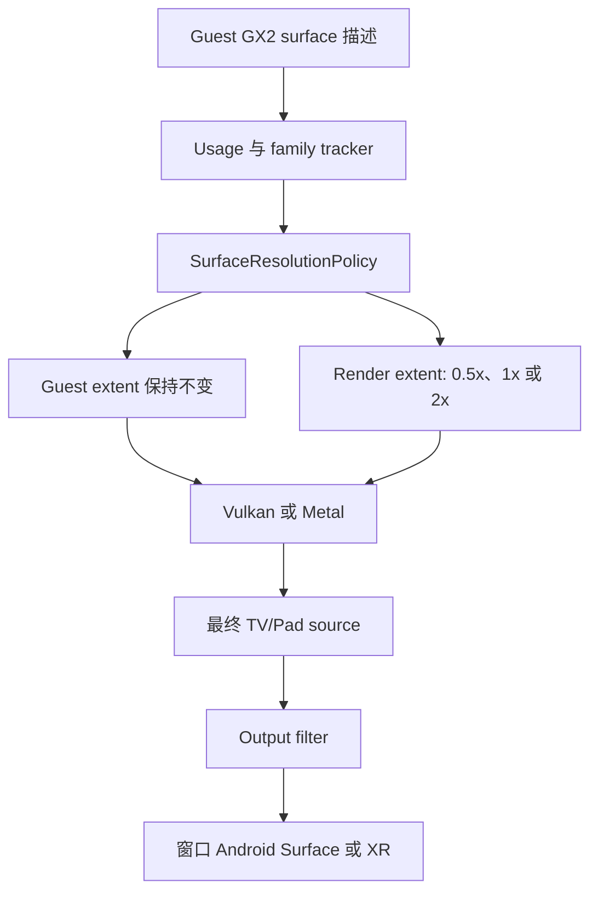
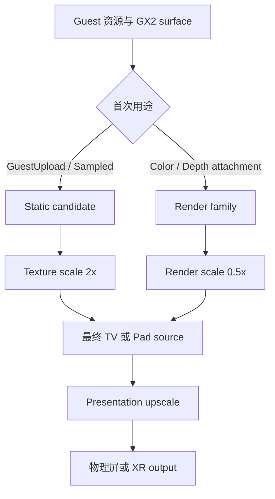
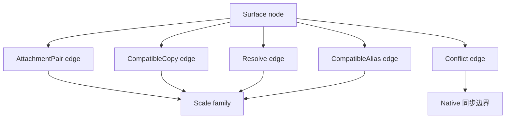
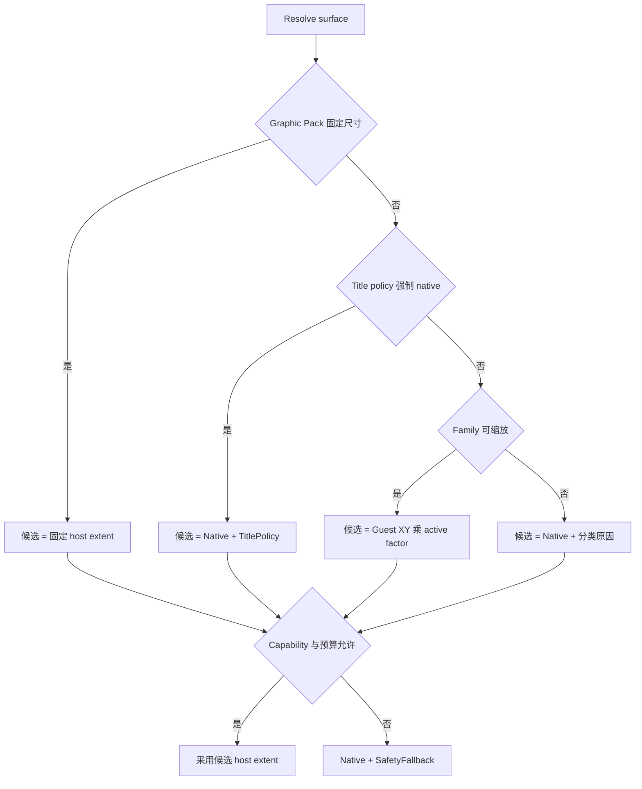
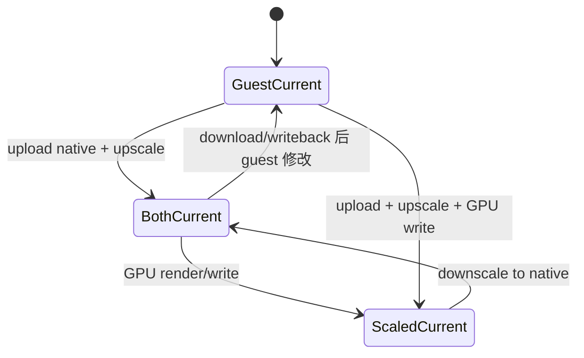
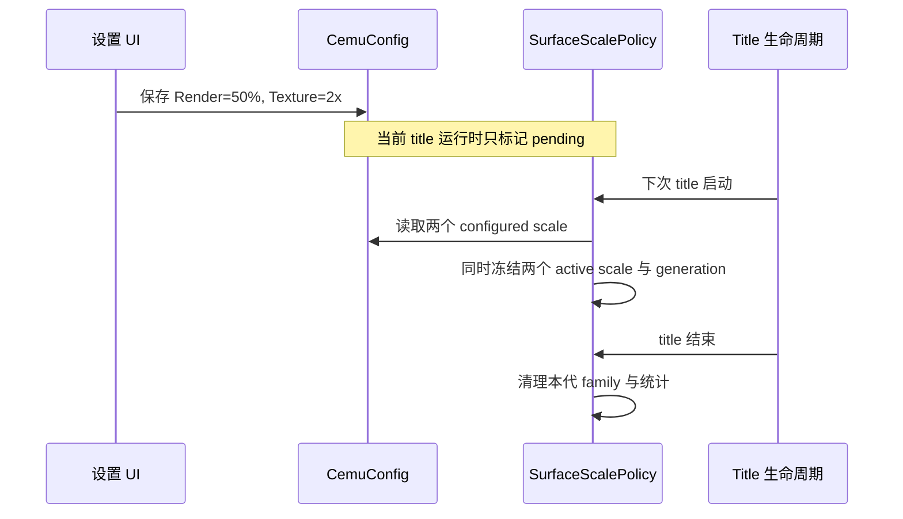

# Cemu 内部分辨率缩放实施 Spec

- 日期：2026-08-02
- 状态：**实施中（O0、P0、P1、P2 已完成；P3 双尺度域实现与实机验证中）**
- 事实与架构基线：`docs/architecture/internal-resolution-scaling.md`
- Android RenderDoc 实帧基线：`docs/architecture/renderdoc-graphics-analysis.md`
- 首个复杂游戏基线：BotW v208 / DLC v80
- 目标后端：Vulkan、Metal
- 前置决定：**先移除 Cemu OpenGL 后端，再实施 internal resolution**

本文把现有分析收敛成可直接执行的实施规格。实施已获授权，当前严格按 O0 → P0 →
P1 → P2 → P3 推进；P1 Android/Graphic Pack 证据见
`docs/verification/internal-resolution-p1-android.md`，P2 双表示与 Android/Metal 证据见
`docs/verification/internal-resolution-p2.md`，后续继续按阶段退出标准推进。

---

## 1. 一句话目标

在保持 guest GX2 surface 尺寸和最终输出缩放语义不变的前提下，为 Cemu 建立一套
Vulkan/Metal 共用、可诊断、可安全回读的独立尺度系统：render surface 支持
0.5x/1x/2x，静态纹理独立支持 1x/2x，最终 output 继续服从物理屏；修改后重启当前
title 生效，Graphic Pack 固定尺寸继续拥有最高优先级。

---

## 2. 本次交付范围

### 2.1 必须交付

1. 移除 Cemu 自身的 OpenGL renderer、构建选项、UI 入口和运行时分支。
2. 建立 surface usage、family、guest extent、host extent、fallback 原因的诊断基线。
3. 引入 backend-independent 的 resolution policy，先在 1x 下替代散落的尺寸判断。
4. 建立 guest-native 与 host-scaled 的同步状态机。
5. Vulkan 和 Metal 实现同一组表示创建、缩放、copy、readback 合约。
6. 增加独立的 render-surface 与 static-texture 配置；前者支持 0.5x/1x/2x，后者
   支持 1x/2x，默认分别为 1x/1x。
7. Android、桌面设置和 StatusLayer 分别显示两类 configured/active scale、最终
   source extent 与 presentation extent。
8. BotW 主场景 color/depth 按 render scale 成对缩放；合格的未压缩静态纹理可按
   static scale 放大，BCn/video/data 等风险资源保持 native。
9. 无法安全缩放时回退到 native，并提供稳定的 debugbus、日志、profiler 证据；
   不允许静默跳过 copy 或 readback。

### 2.2 明确不做

- 不保留 OpenGL compatibility shim，也不为它扩展 internal-resolution 接口。
- 不支持运行中无重启切换倍率。
- 不支持 Auto、除 0.5x 外的任意分数倍率、动态分辨率、3x/4x。
- 不把 FSR、bicubic、Hermite 等 output filter 混入 internal-resolution policy。
- 不对 BCn、LUT、视频或数据纹理做无分类放大；首版 static 2x 只建立正确的尺寸、
  表示和重采样路径，高质量纹理增强滤镜另行设计。
- 不以 BotW 地址或固定尺寸写死一套全局规则。
- 不在本阶段建立另一套 XR surface scale；XR 后续复用本文的 policy。
- 不修改 `dependencies/foundation` 子模块内容；只消费现有 profiler、debugbus、
  ImGui layer 能力。

### 2.3 首版完成的定义

只有以下全部满足，才能称为“首版 internal resolution 完成”：

- OpenGL 前置清理完成且 Vulkan/Metal 基线无回归；
- 默认 Render 1x / Texture 1x 行为通过回归；
- Render 0.5x/2x 与 Texture 2x 的 sample、copy、resolve、readback 都有明确语义；
- Vulkan Android 和 Metal macOS 完成实际游戏验证；
- BotW 进入 gameplay 后完成 warmup，再获得画面、显存和 profiler 数据；
- 无 resized readback 拒绝、无倍率不匹配 copy 静默跳过；
- UI 才在最后一阶段对普通用户显示两组尺度选项。

---

## 3. 已核对的代码事实

| 事实 | 当前入口 | 对设计的约束 |
| --- | --- | --- |
| output upscale/downscale 只发生在最终呈现 | `LatteRenderTarget_copyToBackbuffer()` | 不得复用为 internal factor |
| guest 尺寸保存在 texture 本体 | `LatteTexture::width/height/depth` | 配置不得修改这些字段 |
| Graphic Pack 在 texture 构造时写固定覆盖尺寸 | `LatteTexture::overwriteInfo` | 固定尺寸必须接入统一 resolver，不能删除 |
| Vulkan/Metal 当前按 effective extent 分配 | `LatteTextureVk.cpp`、`LatteTextureMtl.cpp` | backend 改为消费已解析的 host extent |
| viewport/scissor/FragCoord 已有部分比例换算 | `LatteRenderTarget.cpp`、`LatteTextureLegacy.cpp` | 复用能力，但统一比例来源和边界舍入 |
| copy 比例只检查宽度且允许 5% 偏差 | `LatteTexture_doesEffectiveRescaleRatioMatch()` | 必须改为宽高、mip-aware、精确有理数比较 |
| resized texture readback 被明确拒绝 | `LatteTextureReadback_Initate()` | 2x 对外开放前必须补齐 native 同步边界 |
| Metal format-conversion copy 仍有简化路径 | `MetalRenderer::surfaceCopy_copySurfaceWithFormatConversion()` | Metal 不能靠“与 Vulkan 应该一样”完成验收 |
| StatusLayer 当前 `Resolution` 是宿主物理窗口尺寸 | `LatteOverlay_renderStatusLayer()` | 必须拆成 Internal、Source、Output 三个概念 |
| texture cache 已有 mip/slice、地址占用和 overlap 数据 | `LatteTextureSliceMipInfo`、`list_compatibleRelations` | family tracker 应复用，不另建第二套 texture cache |

### 3.1 OpenGL 移除边界

“移除 OpenGL”指移除 Cemu 的运行后端，不等于删除所有带 `GL` 或 `GLSL` 字样的
代码。Vulkan shader 路径仍会生成 GLSL 再编译为 SPIR-V，以下内容不能按名字盲删：

- `LatteDecompilerEmitGLSL*` 中仍由 Vulkan 使用的生成逻辑；
- 描述 Wii U/GL 风格坐标或 shader 语义的通用代码；
- 被 Vulkan shader 编译链真实引用的常量和数据结构。

需要删除的是 backend 实现与选择面：

- `src/Cafe/HW/Latte/Renderer/OpenGL/`；
- `src/gui/wxgui/canvas/OpenGLCanvas.*`；
- `src/imgui/imgui_impl_opengl3.*`；
- `ENABLE_OPENGL`、`find_package(OpenGL)` 和对应 target source；
- `GraphicAPI::kOpenGL`、`RendererAPI::OpenGL` 的运行分支；
- OpenGL 设置项、日志选项、canvas 创建和 driver cache 配置。

---

## 4. 不可违反的架构约束

1. **Guest extent 永远是 guest 语义。** 地址计算、pitch、tile mode、mip/slice
   布局和 guest RAM 写回都以 guest extent 为准。
2. **Host extent 只有一个 resolver。** Vulkan、Metal、StatusLayer、copy 和
   readback 不得各自乘一次倍率。
3. **Internal 与 presentation 分离。** `upscale_filter`、`downscale_filter`、
   fullscreen scaling 和 XR output 不得修改 surface internal factor。
4. **Graphic Pack 固定尺寸优先。** 不删除现有新增项，不与 Render/Texture scale 叠乘。
5. **未知用途默认 native。** 不以尺寸、格式名称或 BotW 单个样本推断可缩放。
6. **静态纹理放大必须显式分类。** 未压缩且只经过 GuestUpload/Sampled 的 2D 资源
   才能进入首版 static scale；BC1–BC5、video、LUT/data、CPU-readable 与未知用途
   默认 native，不因 2x 展开。
7. **倍率一致性按 family 判断。** color/depth、copy/resolve 后继和兼容 alias 不能
   各自独立决定倍率。
8. **同步状态在 Core。** Vulkan/Metal 只执行 create/upload/blit/copy/download，
   不自行决定哪个表示更新。
9. **所有降级必须有原因。** 不能用空指针、assert、清空纹理或跳过 copy 代替
   native fallback。
10. **首版倍率在 title 启动时冻结。** 设置变化只标记 pending，不能让新旧尺寸
    resource 在同一 title 中无协议混用。
11. **坐标换算使用 64 位整数边界。** 不依赖浮点近似或 5% 容差决定兼容性。
12. **先观测再启用。** P3 实机退出标准未满足前，不增加可见的尺度下拉框。
13. **三类 scale 独立。** 静态资源 Texture、用于绘制的 render surface、最终物理
    output 不共享一个隐式倍率。Texture 1x/2x 与 Render 0.5x/1x/2x 分别冻结；output
    继续由窗口、Android Surface 或 XR swapchain 决定。

---

## 5. 目标链路



最终要能同时回答四个问题：

| 问题 | 示例答案 |
| --- | --- |
| Guest 认为多大 | `1280x720` |
| Host 实际渲染多大 | `2560x1440` |
| 为什么使用这个尺寸 | `RenderSurfaceScale / 0.5x` |
| 最终显示区域多大 | `1920x1080` |

### 5.1 三个独立的 scale 域

| 域 | 首版控制源 | P3 行为 | 禁止的耦合 |
| --- | --- | --- | --- |
| 静态/素材 Texture | `Graphic/StaticTextureScaleFactor`、usage policy、Graphic Pack TextureRedefine | 默认 1x；合格的未压缩静态资源可用 2x；压缩/数据纹理继续 native | 不因 render scale 自动变化；scale 与未来增强滤镜分开 |
| Render surface | `Graphic/RenderSurfaceScalePercent`、family policy | 只对已证明可缩放的 color/depth family 使用 0.5x/1x/2x | 不反向修改静态 Texture 或 output extent |
| 物理 output | Android Surface、桌面窗口、未来 XR swapchain | 独立选择呈现尺寸；接收最终 TV/Pad source 后再做 presentation filter | 不写回 render-surface factor，不把 swapchain 尺寸当 internal extent |

旧 `InternalResolutionFactor` 只作为向 `RenderSurfaceScalePercent` 迁移的兼容输入，
不再是权威配置。Static Texture、Render Surface 与 XR/output 必须使用独立配置、独立
title snapshot 和独立诊断。推荐移动设备先验证 `Texture 2x + Render 0.5x`：素材细节
在允许范围内提高，而主 color/depth raster 成本降为原生约 1/4，最后由 presentation
upscale 到物理屏。该性能收益是理论值，必须由 BotW 实帧验证，不得用推断代替。



若 static candidate 后续被绑定为 attachment，它从 `C` 迁移到 `D`，整组重建为
Render scale；不得同时保留 2x Texture 语义和 0.5x Render 语义。

---

## 6. Core 数据模型

名称可在实现时按现有风格微调，但字段和语义不得缩水。

### 6.1 基础类型

建议新增 `src/Cafe/HW/Latte/Core/LatteSurfaceScale.h/.cpp`：

```cpp
struct LatteSurfaceExtent
{
    uint32 width;
    uint32 height;
    uint32 depth;
};

enum class LatteSurfaceUsage : uint8
{
    Unknown,
    Sampled,
    ColorAttachment,
    DepthStencilAttachment,
    CopySource,
    CopyDestination,
    ResolveSource,
    ResolveDestination,
    PresentSource,
    GuestUpload,
    CpuReadback,
    LinearStaging,
};

enum class LatteSurfaceScaleClass : uint8
{
    Unknown,
    ScalableRenderFamily,
    Conditional,
    ForceNative,
};

enum class LatteSurfaceScaleSource : uint8
{
    Native,
    RenderSurfaceScale,
    StaticTextureScale,
    TitlePolicy,
    GraphicPackFixed,
    SafetyFallback,
};

enum class LatteSurfaceFallbackReason : uint8
{
    None,
    UnknownUsage,
    StaticSampledTexture,
    CompressedFormat,
    CpuReadable,
    LinearLayout,
    VideoSurface,
    AliasConflict,
    FormatReinterpret,
    CopyScaleConflict,
    GraphicPackConflict,
    MsaaUnsupported,
    DimensionUnsupported,
    FormatUnsupported,
    MemoryBudgetExceeded,
    AllocationFailed,
    BackendOperationUnsupported,
};

struct LatteSurfaceResolutionInfo
{
    LatteSurfaceExtent guestExtent;
    LatteSurfaceExtent requestedHostExtent;
    LatteSurfaceExtent hostExtent;
    LatteSurfaceScaleClass scaleClass;
    LatteSurfaceScaleSource requestedSource;
    LatteSurfaceScaleSource source;
    LatteSurfaceFallbackReason fallbackReason;
    uint64 familyId;
    uint32 scaleGeneration;
    uint32 configuredScalePercent;
    uint32 activeScalePercent;
    bool cpuReadable;
};
```

### 6.2 字段语义

- `guestExtent`：来自 GX2 surface，永不因 host 配置变化。
- `requestedHostExtent/requestedSource`：应用 capability/budget fallback 前的候选，
  用于解释 Graphic Pack 或 global scale 为什么没有成为最终结果。
- `hostExtent`：当前 host render representation 的 base mip 尺寸。
- `depth`：XY scale **不缩放**；对 array 表示 layer count，对 3D
  表示 Z extent。只有既有 Graphic Pack 固定规则可保留历史 depth override。
- `configuredScalePercent`：该 surface 所属域在设置文件中的当前值。
- `activeScalePercent`：title 启动时冻结的值；render 为 50/100/200，static 为
  100/200。
- `scaleGeneration`：首版在每次 title 开始时递增；P4 前不用于运行中切换。
- `fallbackReason`：只有 `SafetyFallback` 或 native 分类时才非 `None`。

### 6.3 对 `LatteTexture` 的 API 收敛

新增并逐步替代含糊的 `GetEffectiveSize()`：

```cpp
LatteSurfaceExtent GetGuestExtent(uint32 mipLevel) const;
LatteSurfaceExtent GetHostExtent(uint32 mipLevel) const;
LatteSurfaceResolutionInfo GetResolutionInfo() const;
LatteSurfaceRect ScaleGuestRectToHost(const LatteSurfaceRect& rect,
                                      uint32 mipLevel) const;
bool HasSameHostScale(const LatteTexture& other,
                      uint32 thisMip,
                      uint32 otherMip) const;
```

迁移期间允许 `GetEffectiveSize()` 作为只读适配器调用 `GetHostExtent()`，但业务代码
不得再直接读取 `overwriteInfo.width/height` 判断倍率。完成 P2 后移除 resolution
相关的 `hasResolutionOverwrite` 分支；format、LOD、anisotropy 等 Graphic Pack
字段继续保留。

### 6.4 mip 与坐标规则

host mip 尺寸统一定义为：

```text
hostMipWidth  = max(1, hostBaseWidth  >> mip)
hostMipHeight = max(1, hostBaseHeight >> mip)
```

不能用 `guestMip * factor` 重新计算尾部 mip，因为它可能与真实 image mip chain
不同。矩形换算按边界而不是分别缩放宽高：

```text
hostStart = floor(guestStart * hostExtent / guestExtent)
hostEnd   = ceil((guestStart + guestSize) * hostExtent / guestExtent)
hostSize  = hostEnd - hostStart
```

所有乘法使用 `uint64`/`sint64` 并在转换前检查溢出。scissor 先处理负坐标和裁剪，
再映射左右/上下边界，避免相邻 rect 因截断产生一像素缝隙。

倍率兼容使用交叉相乘，同时比较 X/Y：

```text
a.hostWidth  * b.guestWidth  == b.hostWidth  * a.guestWidth
a.hostHeight * b.guestHeight == b.hostHeight * a.guestHeight
```

比较基于对应 mip 的真实 extent，不再保留 5% 容差。

---

## 7. Usage 与 surface family

### 7.1 创建入口必须携带用途

`LatteTexture_CreateMapping()` 当前最后一个布尔参数不能表达 surface 用途。P0 要求
增加一个无默认值的 `LatteSurfaceUsage usage` 参数，并让编译器强制所有调用点分类：

| 调用路径 | usage |
| --- | --- |
| shader texture binding | `Sampled` |
| color RT 创建/查找 | `ColorAttachment` |
| depth RT 创建/查找 | `DepthStencilAttachment` |
| surface copy source/destination | `CopySource` / `CopyDestination` |
| resolve | `ResolveSource` / `ResolveDestination` |
| 最终 TV/Pad source | `PresentSource` |
| guest RAM upload | `GuestUpload` |
| texture readback | `CpuReadback` |

同一个 surface 会累积 usage mask；参数表示“本次访问原因”，不能覆盖历史用途。

### 7.2 family 图

family 不是“宽高相同的 texture 集合”，而是通过真实关系形成的图：



需要记录的 edge：

- `AttachmentPair`：同一 FBO 使用的 color/depth，要求 host scale 一致；
- `CompatibleCopy`：格式、区域、mip/slice 和语义允许直接传播 scaled 内容；
- `Resolve`：MSAA/resolve 关系；首版 MSAA 默认 native，但仍记录关系；
- `CompatibleAlias`：同 guest 内存、view-compatible，可共享 scale 决策；
- `Conflict`：format reinterpret、部分 overlap、倍率不一致或 CPU-visible 用途，必须
  经过 guest-native 边界。

不得只用 union-find 丢失 edge 类型。可以用 union-find 维护兼容 family ID，但原始
edge 与 conflict 原因必须保留给诊断和同步决策。

### 7.3 分类规则

首版允许缩放：

- 明确作为 color attachment 使用的 2D surface；
- 与其同一 attachment group、尺寸语义兼容的 depth/stencil；
- 从 scalable family 产生的兼容 copy/resolve 后继；
- 后续作为 sampled texture 使用的已缩放 render result。

首版先保持 `Unknown/native`、以后可因 attachment 证据提升：

- 目前只从 guest RAM 上传并 sampled 的普通纹理；
- 尚未证明用途的 2D non-compressed surface。

首版硬性 `ForceNative`：

- BCn 和其他压缩资源；
- LUT、数据纹理、视频 surface；
- linear staging 与已知 CPU readback 目标；
- 3D texture；
- MSAA surface；
- 无法证明兼容的 alias/reinterpret；
- backend capability 不支持的 format/dimension。

2D array 只缩放 X/Y，不缩放 layer；但必须实际作为 attachment 使用。mip chain 可以
随 base host extent 建立，copy/readback 必须逐 mip 验证。

`Conditional` 初始包含 shadow、temporal history、storage-like surface。P0 证据或
title policy 明确允许前保持 native，不能按常见分辨率猜测。

### 7.4 晚发现用途与分类迁移

first-use 不能永久锁死错误分类：

| 当前状态 | 新证据 | 处理 |
| --- | --- | --- |
| `Unknown`，目前只 sampled/upload | 首次绑定 attachment | 若无硬阻塞，提升为 scalable 并懒建 render 表示 |
| `Unknown` | compressed/3D/video/linear 等硬阻塞 | 进入 `ForceNative`，本 generation 内保持 |
| `ScalableRenderFamily` | 普通 CPU readback | 保持 scalable，懒建 native companion 并同步 |
| `ScalableRenderFamily` | format reinterpret、不可兼容 alias 等硬冲突 | family 降为 `ForceNative`，scaled→native 后继续 |
| `ForceNative` | 后续又绑定 attachment | 不自行重新提升；记录 blocked promotion，等待下一 generation/title |

“只 sampled”表示目前证据不足，默认用 native image，但不等于不可缩放；因此
`StaticSampledTexture` 是当前 native 决策原因，不是永久硬阻塞。压缩格式、3D、视频、
linear staging 和无法安全同步的 alias 才是 sticky blocker。单次 readback 也不能让
已经可安全同步的 render family 永久降级。

---

## 8. Resolution policy

### 8.1 输入

`LatteSurfaceResolutionPolicy::Resolve()` 至少接收：

- guest extent、format、dimension、samples、mips、layers；
- 累积 usage 与 family 决策；
- active internal factor；
- title policy；
- Graphic Pack 固定 extent；
- Vulkan/Metal capability 与当前 scale budget；
- cpu-readable、linear、alias/reinterpret 标记。

### 8.2 优先级



严格优先级：

1. Graphic Pack 固定 extent；
2. title policy 的 `ForceNative`；
3. scalable render family 的 active render scale，或静态候选的 active texture scale；
4. unknown/conditional 保持 native；
5. capability、预算或分配失败产生 `SafetyFallback`。

Graphic Pack 固定尺寸不乘任一 scale。若固定 surface 与同 FBO 其他 attachment
倍率不一致，不自动修改未命中的 surface；记录 `GraphicPackConflict`，render scale
不介入该 attachment group，保持既有 Graphic Pack 语义并在验证中单独处理。

Graphic Pack fixed 仍必须通过 backend 的硬 format/dimension capability 检查。固定
extent 无法创建时，回退到该 surface 的 guest extent，source 记为
`SafetyFallback`，同时保留“原候选来自 Graphic Pack”的诊断字段；不能再尝试给它
乘 render/static scale，也不能因固定规则无效直接崩溃。

### 8.3 family 级 fallback

分配前必须对同一 attachment group 一次性预检。color 2x 成功、depth 2x 失败时，
不能绑定混合倍率 FBO。处理顺序为：

1. 对组内所有 attachment 计算候选 host descriptor；
2. backend 做 format/dimension/sample capability 检查；
3. Core 做累计额外显存预算检查；
4. 任一失败时，整组本次绑定选择 native representation；
5. 已有 scaled 内容先同步到 native，再绑定；
6. family 记录第一个失败原因和累计次数。

实际 allocation 返回失败时也执行同一流程，不得直接触发不可恢复错误。

---

## 9. Guest-native / host-scaled 表示模型

### 9.1 选择

目标采用“**逻辑双表示、native companion 懒分配**”：

- `Render`：factor > 1 时是 scaled image，供 attachment、sample 和呈现使用；
- `GuestNative`：guest 原始尺寸，供 RAM upload/download、倍率冲突、alias 和
  readback 使用；
- factor = 1 时两种角色指向同一物理 image；
- 纯 GPU render family 不因 2x 无条件常驻第二张 native image；只有发生同步边界时
  才创建 companion。

这保留了 Azahar `Base + Scaled` 的正确性边界，又控制 Android 常驻显存。

### 9.2 Core 状态机

状态按 mip/slice 维护，建议扩展 `LatteTextureSliceMipInfo`。不要只在整个 texture 上
放一个 `isScaledCurrent` 布尔值。

建议为每个 subresource 维护内容序号：

```cpp
struct LatteSurfaceContentSerials
{
    uint64 guestRam;
    uint64 guestNativeImage;
    uint64 hostScaledImage;
};
```

最大序号表示最新内容；相同序号表示两个表示已同步。序号复用现有单调递增的 texture
update event，不引入独立时钟。



这里的状态是序号关系的便捷视图，不应额外存一份可能失真的 enum。

### 9.3 同步规则

| 请求 | 前置 | 操作 | 结果 |
| --- | --- | --- | --- |
| guest RAM 上传后作为 RT/sample | guest 最新 | upload 到 native，再 upscale 到 render | native/scaled 同序号 |
| GPU 写 scalable RT | render 可用 | 写 scaled | scaled 最新 |
| CPU readback | scaled 最新 | 懒建 native，downscale，再 download | guest/native/scaled 同序号 |
| 1x surface readback | native 最新 | 直接 download | guest/native 同序号 |
| 同倍率 copy | 两端 render 比例相同 | render → render 直接 copy | destination render 最新 |
| 不同倍率 copy | 比例不兼容 | source render → native；native → destination native；必要时 upscale | destination 对应表示最新 |
| compatible alias 访问 | family 一致 | 按既有 relation 同步最新 subresource | 不丢 GPU 更新 |
| reinterpret/conflict alias | 不能直接 scaled copy | 先回到 guest-native 语义，再走已有格式转换 | 有明确 profiler/fallback 记录 |

内容序号更新规则：

- 未定义位置的序号为 0；
- 同一 surface 内 representation 同步时，destination 复制 source 序号；
- guest 写、GPU render/write 会取得新的全局 texture event 序号；
- 跨 surface copy/resolve 完成后，为 destination 分配新的全局序号，不能简单复用
  source 序号；
- recreate、family merge、relation copy 必须显式迁移或清零各 subresource 序号，
  不能继承整张 texture 的模糊布尔状态。

### 9.4 缩放采样规则

首版固定以下规则，不能由 backend 自行选择：

| 方向/格式 | 采样 |
| --- | --- |
| guest-native → scaled color | nearest，避免凭空改变 guest 初始数据 |
| scaled → guest-native normalized/float color | linear；utility pass 可使用等价 box filter |
| integer/data color 任意缩放 | nearest |
| depth/stencil 任意缩放 | guest pixel center 的 nearest，禁止 linear |
| 同倍率 render → render copy | 不采样，直接 copy |

若 backend 对某 format 不支持规定的 filter，优先使用已验证的 utility shader；没有
等价路径时 family native fallback。深度 readback 的空间降采样天然会丢失 2x 子像素
信息，因此必须单独计数；依赖逐样本深度回读的 title 可通过 title policy 强制 native。

### 9.5 禁止的捷径

- resized readback 直接截取左上角；
- 把 scaled bytes 按 guest row pitch 写回；
- copy 比例不匹配时 `return`；
- guest upload 到 scaled RT 时先清空目标代替缩放；
- 在 Vulkan/Metal 内自行修改 Core 的 authoritative state；
- 用 presentation shader 代替 depth/native resample。

---

## 10. Renderer 合约

### 10.1 通用接口

`Renderer` 增加能力查询和表示操作。接口名称可调整，但返回值必须可失败、可诊断：

```cpp
enum class LatteTextureRepresentation : uint8
{
    Render,
    GuestNative,
};

struct LatteSurfaceAllocationCheck
{
    bool supported;
    LatteSurfaceFallbackReason reason;
    uint64 estimatedBytes;
};

virtual LatteSurfaceAllocationCheck CheckSurfaceAllocation(
    const LatteSurfaceHostDescriptor& descriptor) const = 0;

virtual bool EnsureTextureRepresentation(
    LatteTexture* texture,
    LatteTextureRepresentation representation) = 0;

virtual bool ResampleTextureRepresentation(
    LatteTexture* texture,
    LatteTextureRepresentation source,
    LatteTextureRepresentation destination,
    const LatteSubresourceRange& range) = 0;
```

现有 `texture_loadSlice`、`texture_createReadback`、`texture_copyImageSubData` 和
format-conversion copy 需要显式接受 representation 或由 Core 在调用前解析成明确
的 backend operation；不能继续隐式假定 `LatteTexture` 只有一张 image。

### 10.2 Vulkan

必须覆盖：

- `VkPhysicalDeviceLimits::maxImageDimension2D` 和 format/image capability 查询；
- scaled/native image、memory、view 与 layout 生命周期；
- color 的 point/linear resample 策略；
- depth/stencil 使用不改变深度值语义的 point/专用 pass，禁止 linear filter；
- transfer usage、attachment usage、sampled usage 与 format feature 校验；
- 同倍率 `vkCmdCopyImage`，缩放 `vkCmdBlitImage` 或 utility shader fallback；
- readback 前 layout/barrier 和 scaled → native；
- profiler GPU zone 覆盖 resample/copy/readback；
- allocation 失败返回 Core，不能在内部直接终止进程。

Android 首轮只使用 Vulkan；自定义驱动和系统驱动必须得到相同 policy 结果，差异只能
体现在 capability/fallback 原因。

### 10.3 Metal

必须覆盖：

- device 支持的 texture dimension、format usage 和 recommended working set；
- native/scaled `MTL::Texture` 与 view 生命周期；
- render/blit/compute 中可用的缩放路径；
- depth/stencil 的专用 point/resolve 路径；
- upload/download bytes-per-row 始终按目标 representation 计算；
- 补齐 format-conversion copy，不保留当前等同普通 copy 的占位语义；
- profiler GPU zone 与 Vulkan 使用同名上层分类；
- allocation 失败回到 Core family fallback。

### 10.4 两后端一致性的定义

一致的是：usage、分类、family、host extent、同步方向、fallback reason。

允许不同的是：具体 API、barrier、temporary resource、blit 或 shader 的选择。

Core 单元测试必须在不创建 Vulkan/Metal device 的情况下验证 policy；backend 测试只
验证执行结果。不得以复制两份 policy 代码换取短期通过。

---

## 11. 配置、UI 与生命周期

### 11.1 配置模型

使用两个独立配置：

```cpp
ConfigValueBounds<uint32> render_surface_scale_percent{50, 100, 200};
ConfigValueBounds<uint32> static_texture_scale_factor{1, 1, 2};
```

- XML key 分别为 `Graphic/RenderSurfaceScalePercent` 与
  `Graphic/StaticTextureScaleFactor`；
- render 只接受 50/100/200，static 只接受 1/2；其他值回到默认 100/1；
- 50 表示宽高各 0.5x，200 表示宽高各 2x，不表示像素数倍率；
- 旧 `Graphic/InternalResolutionFactor=2` 在新 key 缺失时迁移为 render 200，保存时
  保留兼容 key，但新 key 始终是本版本权威值；
- 不复用 `UpscaleFilter`、`DownscaleFilter` 或 Graphic Pack preset；
- static scale 首版只提供正确的 nearest/linear resample 基础路径，不把纹理增强算法
  暗藏在倍率 key 中；
- 两个 key 都不控制物理 output/swapchain；
- 首版不增加 per-game factor，title policy 只作为兼容性规则入口。

### 11.2 configured 与 active



设置页必须写明“重启游戏后生效”。更改任一 scale 不卸载 App、不清配置，只需要正常
退出并重启 title。任一 configured != active 时，StatusLayer 对应行显示 pending。

### 11.3 Android UI

在 P3 完整验收前不显示普通用户入口。最终在 `GraphicsSettingsScreen.kt` 增加两组：

- Render Surface：`0.5x / Native (1x) / 2x`；
- Static Texture：`Native (1x) / 2x`；
- Render 描述说明 0.5x 约为 1/4 raster 像素、2x 约为 4 倍；Texture 描述说明只
  影响合格的静态素材，不承诺 BCn 或数据纹理增强；两者均重启游戏后生效。

JNI setter 必须 clamp；Kotlin 常量不能成为唯一校验层。

### 11.4 桌面 UI

在 `GeneralSettings2.cpp` 图形设置中增加同一选项和描述。运行 title 时可允许修改
configured 值，但必须显示 pending；也可以沿现有 Graphics API 行为禁用控件，
实现前统一选择一种交互，不能让用户误以为当前资源已重建。

### 11.5 StatusLayer

当前 `GPU / Resolution` 只显示物理窗口，会把 output extent 误当 internal extent。
改为：

```text
GPU        Vulkan
Internal   0.5x
Texture    2x
Source     1280x720 -> 640x360
Output     1920x1080
Draws      ...
```

规则：

- `Internal` 显示 active render scale；pending 时显示 `1x (0.5x pending)`；
- `Texture` 显示 active static scale；pending 时显示 `1x (2x pending)`；
- `Source` 使用当前 TV/Pad 最终 source texture 的 guest/host extent，不从窗口推断；
- `Output` 才显示 Android Surface 或桌面窗口物理尺寸；
- Graphic Pack 固定 source 可显示 `Fixed`，例如
  `1280x720 -> 2560x1440 (Pack)`；
- final source 发生 family fallback 时显示实际 1x，并能从 debugbus 查到原因；
- StatusLayer 继续常显，不在本任务增加动态显隐逻辑。

---

## 12. 可观测性

### 12.1 P0 事件

默认只聚合，不逐 draw 打日志。每个 surface/family 至少记录：

- phys/mip address、guest/host extent、pitch、format、host format；
- dimension、mip、slice/layer、sample count、tile mode；
- usage 首次出现和累计 mask；
- first-use 顺序；
- family ID 与 edge 类型；
- compressed 是否保留、upload bytes；
- Graphic Pack 命中规则与固定 extent；
- native/scaled allocation bytes；
- copy/resolve/readback 次数；
- fallback reason 与首次 frame/drawcall；
- final TV/Pad source 标记。

### 12.2 debugbus 命令

建议新增 `SurfaceResolutionDiagnostics` 并在 `CemuDiagnostics` 注册：

| 命令 | 作用 |
| --- | --- |
| `surface_scale_status` | configured/active/generation、family 和显存汇总 |
| `surface_scale_families [limit]` | 按重要度列出 family、extent、usage、edge、fallback |
| `surface_scale_surface <family-or-address>` | 展开一个 surface/family 的 subresource 状态 |
| `surface_scale_reset_stats` | 只清统计，不改变资源和倍率 |

输出采用稳定的 `key=value` 与固定 section 名，便于 dumpsys/MCP 解析。示例：

```text
surface_scale_status:
configured_factor=2
active_factor=2
pending_restart=false
generation=7
families_total=184
families_scaled=23
families_native=161
families_fallback=2
scaled_bytes=734003200
native_companion_bytes=50331648
copy_scale_conflicts=0
resized_readbacks=3
readback_failures=0
```

### 12.3 profiler tags 与 counters

CPU zone：

- `SurfaceScale.ResolvePolicy`
- `SurfaceScale.BuildFamily`
- `SurfaceScale.EnsureNative`
- `SurfaceScale.EnsureScaled`
- `SurfaceScale.CopyBoundary`
- `SurfaceScale.ReadbackBoundary`
- `SurfaceScale.FamilyFallback`

GPU zone（Vulkan/Metal 使用相同逻辑名）：

- `SurfaceScale.Upscale`
- `SurfaceScale.Downscale`
- `SurfaceScale.CopyScaled`
- `SurfaceScale.CopyNative`
- `SurfaceScale.Readback`

聚合 counters：

- scaled/native/fallback family 数；
- scaled 与 native companion bytes；
- upscale/downscale bytes 和次数；
- copy scale conflict、alias conflict、allocation fallback；
- 最终 TV/Pad guest/host extent；
- configured/active factor。

P0 的 instrumentation 默认开销目标低于 CPU frame time 的 1%；详细 edge/surface
快照只在 debugbus 请求时序列化。

---

## 13. 显存预算与失败策略

### 13.1 估算

每个候选表示按实际 host format、mip、layer、sample count 估算：

```text
estimatedBytes = sum(each mip block-or-pixel bytes * depth/layers * samples)
additionalBytes = scaledBytes + lazyNativeCompanionBytes - nativeOnlyBytes
```

BCn 用 block size 估算；但首版 BCn 不进入 scaled 候选。不能固定按 RGBA8 估算所有
format。

### 13.2 首版预算建议

建议统一使用 backend 报告的可用 local/working-set budget：

- scaled 表示的**额外**预算默认不超过
  `min(total usable budget * 20%, currently available budget)`；
- backend 无法提供可信 budget 时，只做硬 dimension/format 检查，并依赖可恢复的
  allocation fallback；
- companion 按需创建，但仍计入同一统计；
- 不为 Android、Vulkan、Metal 各写一套分类 policy。

20% 是待审核参数，见 D4。P0 必须先记录 BotW 1x 峰值和 2x 估算值，再决定是否
调整；不能为了让单次测试通过静默放宽。

### 13.3 失败处理

| 失败 | 行为 |
| --- | --- |
| dimension/format 不支持 | family native，记录具体 capability |
| 预算超限 | family native，记录 estimate/budget |
| scaled allocation 返回失败 | 同 attachment group 切 native，已有 scaled 内容同步回 native |
| native companion 分配失败 | 本次 guest-visible 操作返回失败并高优先级日志；不得写错 guest RAM |
| resample shader/blit 不支持 | family native 或使用已验证 fallback pass |
| copy/alias 无安全路径 | 不执行有损 copy；记录阻塞并保持 native 路径 |

“回退 native”必须是可验证行为，不是吞掉错误后继续使用未初始化 image。

---

## 14. 分阶段任务

严格按 O0 → P0 → P1 → P2 → P3 执行。每阶段单独提交、单独验证；退出标准未满足
不得进入下一阶段。

### O0：移除 OpenGL 前置

#### O0-T0：冻结基线

记录：

- 当前 branch、HEAD、submodule 指针、dirty files；
- macOS Vulkan 与 Metal 的 RelWithDebInfo 配置/构建/启动结果；
- Android `assembleRelWithDebInfo` 结果；
- 当前 Graphics API 配置值和一个含 OpenGL=0 的兼容样本。

基线失败是合法结果，但必须记录，不能在移除过程中顺手修无关问题。

#### O0-T1：删除 backend 与构建入口

- 删除 OpenGL renderer 目录、wx canvas、Cemu ImGui OpenGL backend；
- 删除 `ENABLE_OPENGL` option、OpenGL package 和 CMake source 条件；
- 非 Apple 默认 Vulkan；Apple 保留 Vulkan + Metal；
- CMake 在 Vulkan/Metal 都关闭时明确失败；
- 不修改 foundation 子模块内的 OpenGL 能力。

#### O0-T2：迁移配置和 UI

- `GraphicAPI` 保留稳定序列化值：Vulkan=1、Metal=2；0 只作为 legacy invalid
  输入，不保留 `kOpenGL` 运行枚举；
- config/game profile 读到 0 或不可用 API 时归一到平台默认；
- UI 使用显式 choice → enum map，删除 `selection - 1` 这类依赖连续枚举的逻辑；
- 保存后只写 Vulkan/Metal；
- 删除 OpenGL 日志选项、driver cache 配置和 renderer 名称分支。

#### O0-T3：清理 core 分支

- 删除 `RendererAPI::OpenGL` 和 `catchOpenGLError` 的 backend 行为；
- shared `OpenGL || Vulkan` 条件改成真实的 Vulkan 条件；
- 保留 Vulkan 仍需要的 GLSL emitter；
- 对 `Common/GLInclude` 做 consumer 审计，只有零真实引用时才删除；
- 更新受影响构建/架构文档，历史验证文档不改写结论。

#### O0 退出标准

- Vulkan/Metal 都能配置时，CMake 不再出现 `ENABLE_OPENGL`；
- Cemu source/build/UI 没有可创建 OpenGL renderer 的路径；
- legacy `api=0` 能启动到 Vulkan 或 Metal，并在正常保存配置后写回有效值；
- Android RelWithDebInfo 构建通过；
- macOS Vulkan、Metal RelWithDebInfo 构建并启动通过；
- `LatteDecompilerEmitGLSL*` 的 Vulkan 编译链未被误删；
- 记录删除文件、残留 `OpenGL` 字符串 allowlist 和实际验证结果。

### P0：可观测性，不改变分辨率

#### P0-T0：增加 usage/family 事件模型

- 为所有 `LatteTexture_CreateMapping()` 调用点传明确 usage；
- 复用 mip/slice occupancy、compatible relation 和 data overlap；
- 记录 attachment/copy/resolve/alias edge；
- 所有 policy 结果仍固定 native/Graphic Pack 现状。

#### P0-T1：增加聚合诊断

- 增加 §12 debugbus 命令；
- 增加 profiler zones/counters，但不增加 2x；
- surface 列表请求采用 GPU/texture-cache 线程安全快照，不能让 dumpsys 与 cache
  迭代竞态。

#### P0-T2：修正 StatusLayer 术语

- `Resolution` 拆成 `Internal`、`Source`、`Output`；
- 当前固定显示 `Internal: Native (1x)`；
- Source 使用最终 texture 的实际 guest/effective extent；
- Output 使用窗口/Surface 物理尺寸。

#### P0-T3：BotW family 基线

- Android 覆盖安装 RelWithDebInfo，不清配置；
- 执行 `open_last_game`；若双屏焦点导致失效，先明确当前 Activity/display focus，
  不用重复启动掩盖问题；
- warmup 总计至少 15 秒，每 5 秒按一次 A；确认进入 gameplay 后再采集；
- 抓取主要 color/depth/post-process/final TV source 的 family 与 edge；
- 记录 compressed/static texture、readback、copy conflict、host format 和估算 bytes。

#### P0 退出标准

- 画面和分配尺寸与改动前一致；
- 能从一份快照还原 BotW 主场景 family，不只看到孤立 texture；
- 能明确最终 TV source 的 guest/host/output 三个 extent；
- 能列出 first-use 为 Sampled 后转 RT 的 surface；
- 能列出 readback、alias/reinterpret 和 Graphic Pack 冲突；
- instrumentation 对 1x CPU frame time 的影响低于 1%，或给出可复现的阻塞证据。

### P1：统一 resolution model，仍保持 1x

#### P1-T0：引入 policy 与数据结构

- 新增 `LatteSurfaceScale` 类型、resolver、family tracker；
- active factor 固定 1；
- Graphic Pack 固定 extent 作为 resolver 输入；
- backend 从 `LatteSurfaceResolutionInfo.hostExtent` 分配。

#### P1-T1：迁移 extent 消费者

- texture allocation；
- MRT guest/host render size；
- viewport、scissor、FragCoord；
- sampled texture scale；
- clear、copy、resolve、present；
- cache query 和 StatusLayer。

#### P1-T2：收紧比例与 rect 规则

- 宽高独立、mip-aware、交叉相乘；
- 使用边界 floor/ceil 映射；
- 不兼容路径返回结构化结果，不再静默跳过；
- 修正 MRT 中只有宽高同时不匹配才报告的 `&&` 类判断，测试分别覆盖只变宽、
  只变高。

#### P1-T3：Graphic Pack 回归

- 固定 width/height/depth 行为保持；
- format/LOD/anisotropy 不受影响；
- production scale 尚未出现；
- fixed extent 与 family 冲突可诊断。

#### P1 退出标准

- 不开放 scale UI 时行为仍等价当前 1x；
- Vulkan/Metal 对同一输入得到逐字段相同的 `ResolutionInfo`；
- 业务路径不直接读取 resolution overwrite 宽高；
- 只变宽、只变高、非整数 Graphic Pack 固定尺寸、尾部 mip 均有单元测试；
- BotW 1x 与 Graphic Pack 回归通过。

### P2：表示与同步完整性，功能仍不对普通用户开放

P2 的 production policy 仍固定 1x。2x descriptor 和双表示路径只允许通过独立的
Core/backend test harness 注入，不增加隐藏 XML key、环境变量或 debugbus 倍率开关，
避免形成绕过 title 生命周期的第二套入口。真实 title 的 2x 运行从 P3-T0 开始。

#### P2-T0：subresource 内容序号

- 在 mip/slice 粒度接入 guest/native/scaled serial；
- guest invalidation、GPU write、copy、readback 更新序号；
- cache recreate、relation copy、delete 不遗留旧代状态。

#### P2-T1：Vulkan 双表示执行层

- scaled image 与 lazy native companion；
- upload/upscale、downscale/readback；
- same-scale copy 与 native boundary copy；
- color/depth 路径和 profiler zone；
- allocation/capability 失败可恢复。

#### P2-T2：Metal 双表示执行层

- 与 Vulkan 相同 Core 合约；
- 补全 format conversion；
- bytes-per-row、mip/slice、depth 路径；
- allocation/capability 失败可恢复。

#### P2-T3：自动化往返测试

- guest pattern → native → 2x render → native → guest；
- color nearest/linear 预期分别验证；
- depth 使用精确值 pattern，不允许插值；
- 1x↔2x copy、不同 mip、array slice；
- readback row pitch 和边界；
- alias/reinterpret 明确走 native boundary。

#### P2 退出标准

- resized readback 不再被统一拒绝；
- GPU→CPU→GPU 往返有自动化证据；
- copy 不兼容无静默 `return`；
- Vulkan/Metal failure injection 能回退 native；
- lazy companion 的创建、同步、释放和 bytes 统计可查；
- 1x 下不额外创建 companion，不增加常驻双份纹理。

状态：已完成。mip/slice serial、Vulkan/Metal 表示合约、native boundary、可缩放
readback、结构化失败和 round-trip harness 已接入；Android BotW v208 1x gameplay 证明
companion create/bytes 保持为 0。2x 只由 test harness 注入，真实 title 2x 仍从 P3-T0
开始。自动化矩阵、Metal 编译/启动和设备证据见
`docs/verification/internal-resolution-p2.md`。

### P3：启用独立 Render/Texture scale 与 UI

#### P3-T0：配置与 title snapshot

- 增加 `RenderSurfaceScalePercent` 与 `StaticTextureScaleFactor`，并迁移旧
  `InternalResolutionFactor`；
- title 启动同时冻结两类 active scale/generation；
- 运行中修改显示 pending；
- title 结束清理 family 与本代统计。

#### P3-T1：scalable family 启用 0.5x/2x，静态纹理启用独立 2x

- 只对 §7.3 首版允许集合启用；
- attachment group 一次性 preflight；
- Graphic Pack fixed 不叠乘；
- fallback 整组一致；
- 未压缩、纯 GuestUpload/Sampled 的 2D 静态纹理可用 2x；其后成为 attachment 时
  必须原子迁移到 render scale；
- BCn/video/data/CPU-readable texture 保持 native。

#### P3-T2：BotW Vulkan Android 验证

- 使用 Native RelWithDebInfo、APK debuggable 变体；
- `adb install -r` 覆盖安装，不卸载、不清数据；
- 进入 BotW v208 / DLC80 gameplay；
- warmup 至少 15 秒，每 5 秒按 A；
- 固定场景至少采 `Texture 1x + Render 1x`、`Texture 1x + Render 2x`、
  `Texture 2x + Render 0.5x` 的 screenshot、StatusLayer、debugbus、Tracy CPU+GPU；
- 验证主 color/depth 按 render scale 成对变化、静态纹理保持独立、final source
  正确、UI 未裁切；
- 对比 frame time、scaled bytes、companion bytes、fallback family。

#### P3-T3：BotW Metal macOS 验证

- 使用同一游戏版本和尽量一致的 save/camera；
- 三个代表组合启动、切换均需重启 title；
- 验证 color/depth、copy/readback、StatusLayer 和 profiler；
- 不用 Vulkan 结果推断 Metal 正确。

#### P3-T4：非 BotW 回归

至少选择：

- 一个有明显 readback/video surface 的 title；
- 一个依赖特殊 Graphic Pack TextureRedefine 的 title；
- 一个会使用 array/mip 或 alias/reinterpret 的 title。

没有合法游戏样本时该项保持未完成，不用 BotW 推断替代。

#### P3-T5：开放 StatusLayer 与设置 UI

- 验证阶段先通过 XML key 设置 factor，不增加隐藏 debugbus/runtime 开关；
- P3-T2～T4 全部通过后，再增加 Android、桌面两组设置；
- 分别显示 configured/active/pending；
- 显示 final source guest→host 与 output extent；
- UI 文字明确 Render 0.5x/2x 的像素成本、Static 2x 的适用范围和重启 title 生效。

#### P3 退出标准

- 1x 与现有基线无功能回归；
- BotW Vulkan/Metal 主场景 color/depth 实际支持 0.5x/1x/2x；
- `Texture 2x + Render 0.5x` 中两类 family 没有被错误绑成同一倍率；
- final source、output 和 StatusLayer 含义一致；
- guest RAM readback 尺寸正确；
- 无 copy/readback 静默失败；
- 预算/能力/分配失败能回退并显示原因；
- 非 BotW 验证样本完成；
- 普通用户 UI 才可默认显示，但默认值仍是 1x。

### P4：未来运行时切换，当前不实施

未来另开 spec：帧边界冻结、flush guest-visible surface、等待 GPU、失效 texture/
framebuffer/view/descriptor、递增 generation、重建。P3 不得提前实现局部热切换。

---

## 15. 文件影响范围

### 15.1 预计新增

- `src/Cafe/HW/Latte/Core/LatteSurfaceScale.h/.cpp`
- `src/Cafe/Diagnostics/SurfaceResolutionDiagnostics.h/.cpp`
- policy/family 的 unit test 文件，放入现有 CemuCafe 测试 target；若当前无合适 target，
  先新增最小独立 test target，不把测试逻辑塞入 production command。
- `docs/verification/internal-resolution/` 下的基线和阶段记录。

### 15.2 预计修改

- `src/config/CemuConfig.h/.cpp`
- `src/config/ActiveSettings.h/.cpp`
- `src/Cafe/HW/Latte/Core/LatteTexture.h/.cpp`
- `src/Cafe/HW/Latte/Core/LatteTextureLegacy.cpp`
- `src/Cafe/HW/Latte/Core/LatteTextureCache.cpp`
- `src/Cafe/HW/Latte/Core/LatteTextureReadback.cpp`
- `src/Cafe/HW/Latte/Core/LatteRenderTarget.cpp`
- `src/Cafe/HW/Latte/Core/LatteSurfaceCopy.cpp`
- `src/Cafe/HW/Latte/Core/LatteOverlay.cpp`
- `src/Cafe/HW/Latte/Renderer/Renderer.h/.cpp`
- Vulkan texture/copy/readback/renderer 文件
- Metal texture/copy/readback/renderer 文件
- Android `NativeSettings.cpp/.kt` 与 `GraphicsSettingsScreen.kt`
- desktop `GeneralSettings2.cpp`
- `src/Cafe/Diagnostics/CemuDiagnostics.cpp`
- 相关 CMake source/test 定义。

### 15.3 预计删除（O0）

- `src/Cafe/HW/Latte/Renderer/OpenGL/`
- `src/gui/wxgui/canvas/OpenGLCanvas.*`
- `src/imgui/imgui_impl_opengl3.*`
- 对应 CMake、runtime selection、logging、UI 代码。

不要在 internal-resolution 提交中顺便删除“看起来像 OpenGL、实际仍供 Vulkan GLSL
编译使用”的文件。

---

## 16. 测试与验证矩阵

### 16.1 policy 单元测试

| 输入 | 预期 |
| --- | --- |
| 1x scalable color | host = guest，source=Native |
| 0.5x scalable color/depth pair | XY 各 0.5x（奇数向上取整），depth/layer 不变 |
| 2x scalable color/depth pair | XY 各 2x，depth/layer 不变 |
| static 2x 未压缩 sampled 2D | XY 各 2x，source=StaticTextureScale |
| 2x static sampled BC3 | native，Compressed/Static 原因 |
| static 2x 资源后成为 attachment + render 0.5x | family 原子迁移为 RenderSurfaceScale/0.5x |
| Graphic Pack fixed + render 2x/static 2x | 使用 fixed，不叠乘 |
| title ForceNative + render 2x | native，TitlePolicy |
| 只变宽的 fixed rule | X/Y 比例分别精确处理 |
| mip tail | host mip 来自 host base shift |
| dimension 超限 | family SafetyFallback |
| color 支持、depth 不支持 | attachment group 全部 native |
| configured render 50、active 100 | renderPending=true，当前 RT 仍 1x |
| configured texture 2、active 1 | staticPending=true，当前素材仍 1x |

### 16.2 同步测试

| 路径 | 校验 |
| --- | --- |
| guest→native→scaled | pattern 和边界正确 |
| scaled color→native→guest | guest 尺寸正确，无 row-pitch 越界 |
| scaled depth→native | 深度值不被线性插值 |
| scaled→scaled 同倍率 copy | rect、mip、slice 正确 |
| scaled 2x→native 1x copy | 明确 downscale boundary |
| native 1x→scaled 2x copy | 明确 upscale boundary |
| compatible alias | 最新内容传播 |
| reinterpret alias | native 格式转换路径，不直接复用 scaled bytes |
| allocation failure injection | 整组 native，无未初始化绑定 |

### 16.3 构建命令基线

实际目录可按现有 build 目录调整，但构建类型统一 RelWithDebInfo：

```sh
cmake -S . -B build-vulkan -G Ninja \
  -DCMAKE_BUILD_TYPE=RelWithDebInfo \
  -DENABLE_VULKAN=ON \
  -DENABLE_METAL=OFF
cmake --build build-vulkan

cmake -S . -B build-metal -G Ninja \
  -DCMAKE_BUILD_TYPE=RelWithDebInfo \
  -DENABLE_VULKAN=OFF \
  -DENABLE_METAL=ON
cmake --build build-metal

cd src/android
./gradlew assembleRelWithDebInfo
./gradlew testDebugUnitTest
```

如果项目已有更准确的 native/unit-test target，以实际 target 为准并在 verification
记录；不得因为命令名变化跳过测试。

### 16.4 运行验证指标

每个 Render/Texture 组合记录：

- title/version/DLC、renderer、driver、device、commit；
- configured/active render percent 与 static factor；
- final guest/host/output extent；
- render-scaled/static-scaled/native/fallback family 数；
- render-scaled/static-scaled/companion bytes、峰值 RAM/VRAM；
- FPS、CPU frame、GPU frame、最长帧；
- upscale/downscale/copy/readback 次数与耗时；
- screenshot 与可见异常；
- debugbus 原始输出摘要和 Tracy capture 文件 hash/path。

Tracy 大文件放 `_out/internal-resolution/`，不提交仓库；文档只记录复现命令、文件
hash、关键区间和结论。截图和小型文本证据可放
`docs/verification/internal-resolution/`。

### 16.5 性能判断

- 1x policy/instrumentation CPU frame 中位数回归目标不超过 1%；超过时必须解释；
- Render 2x 线性尺寸意味着主要 RT 像素约 4x；Render 0.5x 理论上约为 1/4，
  但 Texture 2x 的上传、显存与采样成本会抵消部分收益，最终只以实测为准；
- 重点确认额外时间确实落在 GPU raster/copy/resample，而不是 Core policy、锁竞争、
  重复 companion 同步或 CPU texture upload；
- 最长帧分析继续区分 Guest/Host，新增 SurfaceScale CPU/GPU tag 关联同步边界。

---

## 17. 审核决策点

以下是本 spec 的建议值。收到整体批准时可视为一并批准；任何一项不同意，应先改
spec，再开始代码。

| 编号 | 决策 | 建议 |
| --- | --- | --- |
| D0 | OpenGL 范围 | 已按用户决定：完整移除 Cemu backend/build/UI，不为 internal resolution 保留兼容层 |
| D1 | 首版倍率 | Render 0.5x/1x/2x，Static Texture 1x/2x；默认 1x/1x，重启 title 生效 |
| D2 | host 表示 | 逻辑 Base/Scaled 双表示，native companion 按需物理分配 |
| D3 | UI 开放时机 | P2 同步完整、P3 实机验证前不向普通用户显示 2x |
| D4 | 额外显存预算 | 默认使用 backend budget 的 20%；P0 数据出来后允许在同一 policy 中调整 |
| D5 | per-game factor | 首版不做；只保留 title compatibility policy hook |
| D6 | 首版特殊资源 | render 2D array 可缩放 XY；static 首版限合格的未压缩 2D/2D array；MSAA、3D、video、compressed 强制 native |
| D9 | 移动端推荐候选 | 优先实测 Texture 2x + Render 0.5x + physical output upscale，不预设它一定优于 native |
| D7 | Graphic Pack | fixed extent 最高优先级、不叠乘；冲突不自动改未命中的 attachment |
| D8 | 动态切换 | 推迟到独立 P4 spec，不在首版局部实现 |

如果 P0 发现 BotW 主 color/depth 属于 D6 当前强制 native 的类别，或 first-use/
alias 模式无法由本文状态机覆盖，必须停在 P0/P1 更新 spec，不能增加 BotW 特判绕过。

---

## 18. 提交与报告方式

建议提交边界：

1. `renderer: remove OpenGL backend`
2. `gpu: add surface scale diagnostics`
3. `gpu: centralize surface resolution policy`
4. `gpu: add native and scaled surface synchronization`
5. `vulkan: implement scaled surface representations`
6. `metal: implement scaled surface representations`
7. `gpu: add internal resolution settings`
8. `docs: verify internal resolution scaling`

如果某一提交过大，可按 Core/Vulkan/Metal 拆分，但每个中间提交必须可编译，不能把
分支长期留在只有 Vulkan 正确、Metal 静默错误的状态。

每个任务报告：

1. 实际修改文件；
2. 实际执行命令与退出码；
3. 退出标准逐条结果；
4. 新增 fallback/限制；
5. 证据文档路径；
6. 是否允许进入下一任务。

**不要用推断替代验证结果。** 没有可用 title、Metal 设备、Vulkan capability 或
readback 样本时，相关退出标准保持未完成并明确报告。

---

## 19. 审核后的第一个动作

审核通过后也不直接写 internal-resolution 代码。第一个动作是 O0-T0：只读记录
Vulkan/Metal/Android 当前基线和 legacy `api=0` 行为。拿到基线后再提交 OpenGL
移除；O0 完成并通过两后端验证后，才进入 P0 surface 诊断。
