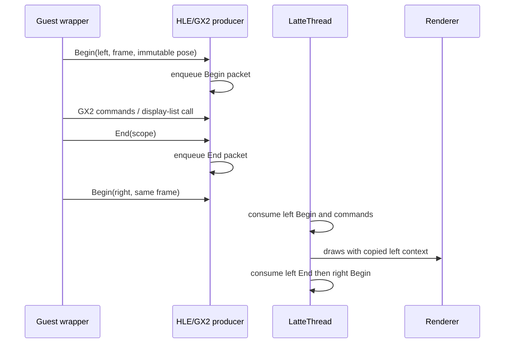

# Cemu Guest Function Patch 与 Custom SDK 实施 Spec

日期：2026-09-13。状态：**待实施；本文件定义目标契约，不代表接口已经存在。**
实施交接对象：后续实施任务（包括用户安排的 Opus 4.8）。阅读本文即可开始实施，不要求读取原会话。

## 1. 交付目标与设计决定

交付一条可复现的链路：开发者用 C/C++ 实现 Wii U 游戏函数改造，用少量 PPC ASM 处理真实
调用约定，构建成 Graphic Pack 内的身份绑定模块，由 Cemu 装载、重定位和安装 hook；补丁既可
调用原 Guest 函数，也可通过版本化 SDK 调用编译进 Cemu 的 Host 服务。

首个实际适配对象为 BotW Wii U JP v208。支持相机、输入及渲染阶段改造，但不强制沿用
BetterVR 两次游戏逻辑的控制流。应让游戏适配决定共享哪些准备工作、哪些阶段随眼别执行。

本 spec 固定以下选择，实施者无需再做一轮架构选型：

1. **一种模块构建格式，两种使用方式。** 纯 Guest 函数补丁不要求 Host SDK；custom SDK
   在同一模块格式上增加服务声明和共享头文件，不再创建第二套 loader。
2. **离线处理 ELF，运行时处理受限模块。** C/C++/`.S` 编译、部分链接为 PPC ELF32 big-endian
   `ET_REL`；构建器输出规范化 section、符号和 relocation。Cemu 不链接 LLVM，也不加载任意 ELF。
3. **模块运行地址由 Cemu 分配。** 复用当前 codecave allocator；不得挪用游戏中一段“看起来全零”
   的地址，不得将 ELF 裸字节直接塞入 codecave 后忽略 relocation。
4. **Graphic Pack 负责选择，GuestPatch 负责安装。** 使用现有 `rules.txt` 标题/preset/启用入口，
   新增 companion manifest `guest_functions.json`；旧 `patch_*.asm` 保持兼容。
5. **Host 服务复用现有 HLE gateway。** 不加入新的 PPC CPU 指令族，不把 AArch64/Host 函数
   指针写入 Guest，不要求配套 JIT 性能优化先完成。
6. **眼别沿 GPU 命令顺序传播。** 产品协议独立于 profiler，不能用 Guest 线程更新的共享
   `current_eye` 直接驱动 LatteThread，也不先建设完整 FrameGraph/渲染计划框架。

完成范围是第 11 节 G0–G4；G5 是有明确边界的 BotW 双目后续阶段。纯函数和 Host 服务必须
至少有一个真实游戏调用实例，不能仅交付协议定义和始终不可用的 capability。

## 2. 已核对的实现基线

| 来源 | 本次读取的提交 | 可借鉴/复用内容 |
| --- | --- | --- |
| Cemu | `cb0839abe2176393169b1a484359b0094912093c` | Graphic Pack、PPC HLE、RPL、Guest 调试及有序 GPU tag |
| 本地 Azahar | `d7e268fa8714acf62e94d8b33a1015d47412166a` | Guest 函数构建、Custom SDK v4–v6、候选镜像安装、服务声明、调试身份 |
| BetterVR 固定参考 | `0e1053d58cdfbd592522dc892b1770418a1af009` | BotW v208 hook 和游戏语义；Host/XR 实现须分别审计 |

实施前记录实际 HEAD 和工作树差异。当前 Cemu 工作树有其他任务的 Latte/Vulkan 修改；本 spec
不把它们视为已完成基线，不得清理或混入提交。Azahar 和 `references/` 仓库只读；吸收结构和
经验证的行为，在 Cemu 自行实现，不复制其 GPL 实现。

### 2.1 Cemu 已存在与缺失的能力

| 位置 | 已确认事实 | 本次工作 |
| --- | --- | --- |
| [GraphicPack2PatchesApply.cpp](../../src/Cafe/GraphicPack/GraphicPack2PatchesApply.cpp)，`ApplyPatchGroups` | 为每组分配 codecave，解析到临时 patch buffer 后写入；callback 解析仍发生在写入循环内 | 新模块须先完成全部验证再提交；不能声称旧路径天然提供完整事务 |
| 同文件，`applyPatch/undoPatch` | 保存原字节，写入/恢复后调用 `PPCRecompiler_invalidateRange` | 复用失效入口，新增完整写入记录及生命周期协调 |
| [rpl.cpp](../../src/Cafe/OS/RPL/rpl.cpp)，`RPLLoader_AllocateCodeCaveMem/ReleaseCodeCaveMem` | 有分配和释放接口；allocator 当前实际按 256 字节对齐 | 统一预留模块与 stub 空间，检测分配失败及所有权 |
| [MMU.h](../../src/Cafe/HW/MMU/MMU.h) | codecave 区为 `0x01800000..0x01BFFFFF`，共 4 MiB | 纳入总预算，不能为每个包承诺无限空间 |
| [rpl.cpp](../../src/Cafe/OS/RPL/rpl.cpp)，`RPLLoader_MakePPCCallable` | 注册 Host handler 并生成 Guest-callable HLE stub | SDK 使用真实注册的 gateway；拒绝 unsupported import |
| [PPCInterpreterHLE.cpp](../../src/Cafe/HW/Espresso/Interpreter/PPCInterpreterHLE.cpp) | `0xFFD0` 表示 unsupported HLE，非零导入地址不证明服务存在 | 严格解析并输出实际服务身份 |
| [GX2_Command.cpp](../../src/Cafe/OS/libs/gx2/GX2_Command.cpp)，`GX2EmitGuestGpuTag` | 标记在 command stream 中有序；当前主动跳过固定容量 display list | 新语义 packet 复用有序传递方式，显式处理 display list |

现有运行、逆向与 ASM 语法以 [Guest patch 架构](../architecture/cemu-graphic-pack-asm.md)、
[逆向调试链路](../architecture/guest-reverse-debug-mod-pipeline.md) 和
[GPU 语义标记](../architecture/guest-semantic-framegraph.md) 为准。

### 2.2 对 Azahar 的取舍

阅读入口：

- [机制总览](/Users/bytedance/workspace/emulations/3ds/azahar/docs/manual/self/guest-patch-guide/07-custom-sdk-system.md)
- [独立函数构建器](/Users/bytedance/workspace/emulations/3ds/azahar/tools/guest-functions/build.py)
- [v4 混合构建](/Users/bytedance/workspace/emulations/3ds/azahar/guest/custom/v4/build.py)
- [loader](/Users/bytedance/workspace/emulations/3ds/azahar/src/core/file_sys/guest_mod.cpp)
- [Host exports](/Users/bytedance/workspace/emulations/3ds/azahar/src/core/guest_host_exports.h)
- [v5 渲染合作协议](/Users/bytedance/workspace/emulations/3ds/azahar/guest/custom/v5/README.md)
- [v6 观察协议](/Users/bytedance/workspace/emulations/3ds/azahar/guest/custom/v6/README.md)

采用：C/C++ 与薄 ASM 分工、源码/产物身份、严格 import 指纹、Host export 声明、候选写入、
启动期安装、运行时映射后的符号验证，以及已接入消费链才报告能力可用。

不照搬：ARM11/softfp/`svc #255`、固定 CodeSet 地址、RX-only 模块限制、ZAR 容器和多套
格式分叉。Cemu 需要处理 PPC 大端、r2/r13、paired-single、RPL section 重定位，以及异步
GX2/Latte 命令流。Azahar 文档的不同章节曾记录不同 ABI 版本；对照时以该提交实际 export
表和服务消费代码为准，不从 README 的旧版本号推断当前运行能力。

## 3. 目录与责任范围

以下为**拟新增路径**，可按 Cemu 风格细分文件，但不得改变职责：

```text
tools/guest-functions/
  build.py / verify.py / debug_symbols.py / doctor.py
  schema/                      # recipe、runtime manifest、debug metadata
  tests/                       # 自编 PPC fixture，无游戏二进制
guest/custom/v1/
  include/cemu/                # Host ABI、wire、数学与 C/C++ 包装
  runtime/                     # 少量 freestanding compiler helper
  tests/ / examples/
src/Cafe/GuestPatch/
  GuestPatchModule.*           # 模块、符号、generation、安装记录
  GuestPatchLoader.*           # prepare/commit/retire
  GuestPatchRelocator.*        # 受限 PPC fixup
  GuestPatchHost.*             # HLE 分发、上下文、服务表
  GuestRenderScope.*           # 有序眼别/帧上下文的生产与消费
games/reverse/botw/wiiu-v208/patches/<feature>/v1/
  build.json / include/ / src/ / trampolines/ / validation/
```

通用 SDK 在主仓；游戏地址、类型证据、hook 配方在对应游戏目录。敏感二进制/完整重建源码沿
现有 private 子仓约定保存，不能为了建立示例修改或重新分发 RPX。无需移动已有 IDA 数据库。

运行包：`rules.txt`、`guest_functions.json`、`guest/<module>/image.bin`。调试构建另外保留
`module.elf`、link map、`debug.json`、依赖清单和反汇编；运行包不需要带源游戏或完整 ELF。

## 4. 身份、格式与加载布局

### 4.1 四种独立版本

- recipe schema：`cemu.guest-function-build.v1`。
- runtime schema：`cemu.guest-functions.v1`。
- SDK 源码版本：`guest/custom/v1`；Host ABI 和每种 wire version 单独编号。
- package revision/内容哈希：表示一次具体构建，不能代替游戏身份或运行 generation。

schema 文件必须定义必填项、数值范围、额外字段策略和错误路径。Python 与 C++ 使用同一组
有效/无效 fixture，避免构建器接受而真实 loader 拒绝的差异。

### 4.2 runtime manifest 必须表达的内容

| 字段组 | 契约 |
| --- | --- |
| `identity` | title ID、region、title/update version、模块名、patch checksum、源 RPX SHA-256；RPL 导入另列模块身份 |
| `image` | 相对路径、文件 SHA、规范化模块内容 digest、size；禁止逃出包根的路径 |
| `sections` | id、kind=`text/rodata/data/bss`、image offset、file size、memory size、alignment；BSS file size 为 0 |
| `symbols` | 唯一名称、所属 section 与偏移、kind；外部符号只来自声明 import 或 loader 保留符号 |
| `imports` | Guest 函数/数据、真实 RPL export、SDK export 三种类型；模块 section+offset、原始指纹和 ABI evidence |
| `relocations` | patch section+offset、精确类型、symbol、**显式 signed addend**；按第 5 节检查 |
| `hooks` | `callsite/entry/manual`、原始字节、定位 section+offset、target、原函数策略、ABI profile、证据路径 |
| `host` | 最低 Host ABI、必需/可选 export 名称；纯 Guest 模块省略 |
| `dependencies` | 与同一启动中的模块/patch 冲突约束；v1 不隐式允许重叠覆盖或链式 detour |

VA、源文件 offset 和 section offset 是三种不同地址；manifest 中的地址记录必须带所属模块和
section，不能统一做 `VA - 常量`。运行时用 RPL 实际 section mapping 得到 Guest VA。

源 RPX SHA 绑定**未加补丁的实际输入文件**，不等于 Cemu updated/base 短 hash、patch CRC 或
已重定位内存 hash。启动时从 loader 实际使用的来源计算并缓存该 SHA；复用现有导出身份模型，
不每帧读文件。hook 验证比较实际待改写字节；若含 RPL relocation，构建器必须记录预期 relocation
并由 loader 按同一 mapping 计算期望值，不能通过宽泛 mask 跳过验证。

BotW 首个 recipe 固定以下身份，地址仍须逐项验证：

```text
title_id       = 00050000101C9300
title_version  = 208
module         = u-king
patch_crc      = 0x6267BFD0
source_rpx_sha = ba58da5b95ce929e005d058ceb08b9b2788d1ab2bbc8a6c189bbadca0bb34d30
```

依据：[现有 identity manifest](../../games/reverse/botw/wiiu-v208/identity/analysis-manifest.json)。
`references/botw` 为 Switch v1.5.0，只能帮助理解语义，不提供 Wii U 地址、布局或 ABI。

### 4.3 内存与可写状态

每模块在 codecave arena 申请一个有所有者的连续 allocation，内部按 section 对齐布局；包括
text、rodata、显式 data/bss、context 和预先计入预算的 stub。首版单模块默认上限 256 KiB，
可配置上限仍不得超过 arena 剩余容量；所有整数加法先检查溢出。对齐先支持 4/8/16/256，
更大对齐明确拒绝或由 allocator 单独实现，不忽略需求。

支持小型、零初始化或常量初始化的 POD 全局状态；拒绝 TLS、动态初始化、构造/析构列表、
异常运行库、隐式堆分配和未声明的 writable section。状态只属于当前 title/module generation，
重载必须清零。跨 Guest 线程共享状态需要明确同步；不得把普通全局变量当 TLS。

`text/rodata/data` 是 loader 的逻辑访问约束，不宣称现有统一 Guest 内存已经具备操作系统级
逐段 RX/RW 隔离。发布后的代码写入仍须走统一 patch/JIT 失效机制。

## 5. 工具链、PPC relocation 与跳转

### 5.1 构建契约

采用支持 PPC32 的 Clang/LLD；`doctor.py` 编译并解析一个最小 fixture，验证 ELF32、MSB、
`EM_PPC`、实际 CPU 指令、ABI 和 relocation 后输出工具链 receipt。不得假定 Android NDK
自带可用 PowerPC 后端，也不得用 macOS 默认 Mach-O linker。

起始候选为 `--target=powerpc-unknown-eabi -mcpu=750 -m32 -mbig-endian`；最终 flags 以
doctor 实测固定，不能把候选写成已验证工具链。要求 freestanding、非 PIC/PIE、无 AltiVec/VSX、
关闭自动向量化、异常/RTTI/栈保护/隐式运行库和 FP contraction。C11/C++17 与 LLVM `.S`
分别使用正确参数；不混用 Cemu `patch_*.asm` 的语法。

补丁不得建立自己的 r2/r13 small-data 环境；验证编译器保留方式、生成指令和 `.sdata/.sdata2`
等 section。首版遇到 SDA/GOT/TOC/TLS relocation 即拒绝，不添加假值绕过链接。

编译 `.o` 后用 LLD `-r` 部分链接，统一收集 section/symbol/RELA。只允许内部定义及显式
imports 未解析；弱未定义符号也不能默认置零。不将最终固定地址 ELF 整体平移。

产物记录完整传递 include（用编译器依赖输出收集）、源文件、模板、SDK/runtime/Foundation
依赖、工具版本和可执行文件 hash、flags、recipe、ELF/image/manifest hash。`verify.py` 在新目录
复建或验证同次产物，报告哪些比对完成；无需实现发布签名系统。

模块 digest 用确定的 section/symbol/relocation/hook 顺序与规范化 JSON 计算，并排除自身 digest
字段；`image.bin` 单独做文件 SHA。记录顺序或非语义 debug 路径不能使 runtime 产生不同布局。
运行中 relocation 后字节随实际分配基址变化，因此另输出本次 section mapping 与 installed
bytes hash，不能强求所有运行具有同一个整块内存 result SHA。

### 5.2 v1 relocation 白名单

定义 `S` 为已解析 Guest symbol VA，`A` 为显式加数，`P` 为本次 relocation 的 Guest VA。
构建端和 Host 端使用相同 golden cases，但独立解析并验证边界。

| 类型 | 运算和要求 |
| --- | --- |
| `R_PPC_ADDR32` | 写 `S+A` 的大端 32 位，必须在地址范围内 |
| `R_PPC_ADDR16_LO` | 写 `(S+A)&0xffff` |
| `R_PPC_ADDR16_HI` | 写 `((S+A)>>16)&0xffff` |
| `R_PPC_ADDR16_HA` | 写 `((S+A+0x8000)>>16)&0xffff`，特别测试低半字符号进位 |
| `R_PPC_REL24` | `D=S+A-P`；4 字节对齐且 `-0x02000000 <= D <= 0x01fffffc`；只替换 LI 字段，保留 opcode/AA/LK 并验证原指令是兼容形式 |
| `R_PPC_REL32` | 写 32 位 PC-relative 差值；计算使用宽整数并验证可表示范围 |

`ADDR16*` 的 offset 指向 ELF 定义的半字位置，大端指令立即数字段通常是 instruction+2，不能
无条件覆盖整个指令。保持 addend 独立，不从已重定位字节再次读取 addend。重叠 fixup、非法
section 写入、未知 relocation、不可达 branch 和未解析符号在 prepare 阶段拒绝。

初版不支持 `REL14`、GOT/PLT、SDA、TLS；如正常 fixture 需要扩展，先在此表新增语义和
拒绝/溢出用例，再实现。编译器生成 jump table 时必须验证它的实际 relocation，不能仅检查函数调用。

公式参考 [LLVM LLD PPC32 实现](https://github.com/llvm/llvm-project/blob/main/lld/ELF/Arch/PPC.cpp)；
不能拿 PPC64 ELFv1 的函数描述符、TOC 或 ABI 代替 PPC32。工具链支持范围参考
[Clang PowerPC 说明](https://clang.llvm.org/docs/UsersManual.html#powerpc)。

### 5.3 跳转与 original trampoline

三种 hook 分别处理：

- **callsite**：只改已验证的 `bl/bla`，检查原目标、AA/LK，保留返回到原调用点的 LR 语义。
  原函数入口不变，wrapper 直接导入原函数。
- **entry**：入口使用不设置 LR 的 `b/ba`；要调用原函数，导入必须指向 original trampoline，
  禁止再指向被覆盖入口造成递归。自动重放仅支持明确白名单的 prologue，例如 `mflr r0`、
  `stwu r1,-N(r1)` 和已审核的栈保存；不支持的首指令要求显式 ASM。
- **manual**：中间指令、特殊寄存器或精确控制流使用开发者编写 `.S` bridge，manifest 固定
  被覆盖字节与 continuation；loader 不声称具备通用 PPC 指令重定位器。

当前 codecave 全区处于 PPC absolute branch 可编码的低 32 MiB 内，因此安装到该区的单条
`ba/bla` 可以不破坏 r12/CTR。仍统一验证地址、对齐、AA/LK，不能把 absolute branch 当任意
32 位跳转。模块调用高地址原函数时优先 REL24，无法到达时只对已标定普通函数调用生成
`r12/CTR` veneer；非调用边界和 trampoline continuation 若无法无损跳转，明确拒绝并要求
显式 bridge。veneer 不覆盖 LR，不能把 `bctr` 换成会改变返回地址的 `bctrl`。

移动指令时拒绝未知 branch、`bl/mflr` 取 PC 惯用法、reservation 指令和未经证明的控制流；
分支源/目标、中间入口、覆盖范围与其它包的冲突全部记录。

## 6. PPC ABI 与 Guest/Host 边界

每个游戏导入提供 C 原型、参数/返回证据、调用点和线程约束。`extern "C"` 只固定名称，不能
证明与原游戏编译器 ABI 一致。

| 项目 | 必须处理的契约 |
| --- | --- |
| Guest 数据 | PPC32 指针、大端、经证据确认的字段和对齐；Host 用 `MPTR`/有界视图，不能直接 cast 成 Host 对象 |
| 栈/参数 | r1、back chain、栈上传参、隐藏 this/sret；SDK 内部 C ABI 采用经 doctor 验证的 16 字节栈对齐，原边界不满足时由 ASM 桥接 |
| 寄存器 | r2/r13 环境、LR、CTR、CR、XER 以及真实活跃 GPR/FPR；普通函数保存规则与中间 hook 的全活跃状态保存区分 |
| 浮点 | f1 等传参/返回、double 与 paired-single 两个分量、FPSCR；不能只保存一个 double 就宣称保留整个 paired FPR |
| C++ | 不跨原游戏 C++ ABI 传 STL、异常、成员函数指针或未知聚合类型；已重建 POD 使用 size/offset static_assert |
| 并发 | hook 可在多个 Guest core/thread 进入；不把 Host thread ID 当 Guest thread 身份 |

首版用自编 fixture 覆盖整数、指针、float/double、超过寄存器数量的参数、结构返回、嵌套
原函数调用、paired FPR 保留和特殊 bridge。C++ 默认输出 scalar PPC FP；需要 paired-single
时使用经过验证的 ASM/intrinsic helper，不能假定 Clang 自动生成 Espresso paired-single。

Host 算法替换是 SDK 服务的一种实现：以有界输入快照和明确输出替代一段完整算法。
Host 不直接调用 Guest C++ 地址；首版服务不做 Host→Guest 递归 callback。需要原函数时，
由 Guest wrapper 在服务返回后调用。优先选无阻塞的成块数学/转换算法，不按每个字段跨 HLE。

## 7. 安装事务、冲突与生命周期

新增 `Prepared -> Committed -> Active -> Retiring -> Retired` 和 `Rejected` 状态。
`Active` 只说明可执行，首次命中和语义验收单独记录。

1. **Prepare**：读取并 hash 全部资产、验证 identity/import/hook/能力，计算完整布局和写入范围，
   分配 owned arena，在 Host 临时 buffer 内完成 relocation、veneer、context 和 BSS 初始化。
2. **冲突检查**：与当前选中 ASM pack 和其它 function module 的实际写入范围比对，包含
   hook、数据和初始化 patch。新模块参与冲突时拒绝重叠，不能仅按加载顺序覆盖；不要求此次
   重写所有 legacy pack 相互之间的行为。
3. **Commit**：在 Guest 尚未进入游戏代码的启动安全点重新核对原字节，写模块和 hook，
   统一失效全部可执行范围，最后发布模块上下文、符号及 Active 状态。发生错误恢复本事务
   写入并失效恢复范围、撤销注册和释放 allocation；callback/服务解析不得留到写入以后。
4. **执行**：v1 不运行任意自动 Guest initializer；POD data/bss 和 loader 填写的 context 足以
   启动。需要游戏初始化的 wrapper 在已验证线程/时机显式完成，失败时调用原路径。
5. **Retire**：停止新服务调用/语义生产，恢复 hook 后使相关 JIT 失效；等待已在途 Guest
   执行与 Latte 引用退出，再释放模块、快照和符号。先停止生产者、再排空消费者、最后释放。

v1 在标题启动/重启时启用禁用，UI 中运行期变更标记为“重启生效”；不实施热替换。动态 RPL
加载只在可证明的模块装载安全点安装；否则报告 restart-required，不从任意 UI 线程改代码。
退出期间不执行会访问已卸载游戏对象的 Guest destructor。

当前 JIT 失效会撤销 jump table entry 并记录在编译中的 invalidation range，但不能据此假定
已经暂停所有在途核。与 [AArch64 spec](2026-09-13-powerpc-aarch64-recompiler-optimization-spec.md)
的 direct linking 工作共享范围失效/代码 generation 契约；启用 direct linking 后还必须断开入边。

## 8. Custom SDK v1 服务契约

### 8.1 调用 ABI

建立 Host 编译期服务 registry，使用稳定名称和数字 ID，输出一个由
`RPLLoader_MakePPCCallable` 创建的真实 dispatcher gateway。module loader 直接绑定它，
不通过“找不到也返回 unsupported trampoline”的宽松导入行为。

拟定 PPC 寄存器协议：

```text
r3 = export_id
r4 = module_context_handle
r5 = request Guest VA（无请求时为 0）
r6 = request 字节数
r7 = response Guest VA（无输出时为 0）
r8 = response capacity
返回 r3 = Status；其余副作用由 C ABI 与服务契约限定
```

`module_context_handle` 来自 loader 保留数据符号 `__cemu_custom_context`，查询到的 context
包含 size、Host ABI、title epoch、module generation、capabilities。句柄属于当前标题及模块
生命周期，失效后拒绝；manifest export 白名单在真实 dispatcher 检查。它是生命周期/兼容性
边界，不宣称在同一 Guest 地址空间内建立了恶意代码隔离。

registry、ContextV1 和每个 request/response 的字段顺序、offset、size、大小端 accessor 与
错误值在 G3 的共享头一次定义；Host/Guest 分别编译并跑同一 golden byte fixture。`read_input`
的 sample time 必须注明时钟域，返回有效位只覆盖实际已提供的数据。`math.transform_batch`
首版固定为有界点/向量矩阵变换，明确矩阵布局、输入 stride、点的 w=1/方向的 w=0、最大
元素数及重叠策略，不能留成接受任意 C++ 对象的“通用算法调用”。

标准状态固定为 `Ok/Unsupported/InvalidArgument/VersionMismatch/Stale/Unavailable/Busy`；
保留精确数值并由共享头单一定义。函数返回成功只说明该调用完成，不等于 GPU 已消费/完成。

wire 使用固定宽度 **big-endian** 字段，header 具有 size/version；无 Host 指针、`size_t`、
隐式 enum 布局、vtable。float 用明确的 IEEE754 bit representation 与 endian accessor。
Host 先验证整数溢出、对齐、完整范围和大小上限，再复制请求到 Host owned snapshot；
禁止异步消费者保存裸 Guest 请求指针。输入输出 alias 策略和错误时输出清零策略在每个服务
明确定义，用跨端 golden bytes 验证，而不是只比 `sizeof`。

### 8.2 首版服务与实际可用性

| 服务 | 目标行为与消费边界 |
| --- | --- |
| `runtime.query_caps` | 查询 Host ABI、实际启用功能、上限、title/module epoch；无需 XR 存在 |
| `xr.read_input` | 从 Foundation 取得不可变输入快照，返回 pose 有效位、sample/reference ID、时间基准、每眼投影/视图信息；未接 XR 时 `Unavailable` |
| `render.begin_scope` | 校验/拷贝 scope，分配并返回 scope ID，将有序 Begin packet 写入当前主 GX2 stream；没有 stream 时返回错误 |
| `render.end_scope` | 用 scope ID、frame/view 身份写入有序 End packet；不直接修改 renderer |
| `math.transform_batch` | 一个有上限的实际 Host 算法示例；使用 Foundation 可复用数学，返回 Guest 可消费结果并与 Guest 实现对比 |

SDK C/C++ 包装和 ASM 都必须走同一真实分发。用 fixture 验证 r3–r8 的顺序、请求内容、
返回码和内存副作用，不能只单测服务对象。首版所有调用走完整 HLE；fast HLE 可由另一 spec
独立提出，不能为看似只读的服务提前绕过调度、内存或状态同步。

共享 camera/math 使用 Foundation 可 freestanding 编译的部分；如需适配只做薄层，不维护
第二套矩阵约定。头动位姿、坐标系、行/列向量、矩阵乘法方向、米与游戏单位、FOV/IPD、
recenter/reference generation 在游戏适配中显式转换。没有真实 XR 输入时，合成 fixture 必须
标记 synthetic，不把它报告成设备 XR 支持。

## 9. 有序渲染 scope：解决眼别与资源寿命

先实现能实际伴随 GX2/Latte 流消费的最小协议，不引入通用 render-plan DAG。

`ScopeDescV1` 至少包含 title epoch、module generation、逻辑 frame ID、view index（mono/
left/right）、phase（shared/shadow/scene/post/ui/present）、pose snapshot ID、scope ID。
frame/snapshot ID 使用明确的 64 位 wire，不依赖 Host 指针和墙钟时间唯一性。

Host 在 Begin 成功时冻结描述；PM4 私有 packet 携带版本、长度、generation 和 snapshot/scope
身份，decoder 按消费顺序切换上下文。选择无冲突的新私有 opcode，检查所有普通/连续 draw/
indirect buffer/调试 dump 的分发路径，不只加一个 switch case。已有 profiler GPU tag 只作
参考，关闭 profiler 后产品 scope 仍必须完整工作。



约束：

- frame ID 是游戏逻辑帧，不等于 swap 次数；一次 world tick 与多个 view 分开计数。
- 同一 scope 的 Begin/End 属于同一个有序提交流；多 core 生产不能靠 Host 到达时间拼接。
  首版每个视图 scope 限定到游戏已验证的 GX2 主提交线程；不支持的跨流组合明确返回错误。
- display-list **录制**期禁止偷偷追加元数据，返回 `Unavailable`；在实际执行 list 的主流外包
  scope，子命令继承消费时上下文。list 若以后跨眼重放，不能将录制时眼别固化进去。
- render sequence 有合并时，scope 变化必须结束/刷新旧批次。metadata 不能仅进入日志而
  让 continued draw 仍使用上一眼资源。
- Begin 成功后快照至少活到 End 被消费；提交给 GPU 的资源引用延续到对应 fence 完成。
  Guest End 返回、PM4 End 消费、GPU fence 完成是三个时刻。
- 丢失/重复 End、旧 generation、队列溢出、长度错误、没有 command buffer 都有明确错误
  和计数。未知上下文不能继承上一帧的右眼状态；恢复 mono 或终止本帧双目提交。
- v1 上限建议每模块 8 个同时在途 frame、每流 scope 深度 16、单请求 64 KiB；达到上限
  返回 Busy/Unavailable 并走约定回退，不丢 marker 后继续宣称双目有效。

renderer 起初可只让现有绘制携带准确 context，实际按眼分配 attachment/提交 XR 的能力独立
报告。不得在 Guest 已跳过原绘制后才返回“能力不可用”；接管前必须取得当前 capability 和
本帧所需资源，后续失败要使本帧完整回退或明确取消，不能输出半帧。

## 10. BotW 首个适配与后续双目模式

G4 交付一个版本锁定的 C/C++ wrapper：使用已有 Wii U 身份与 profiler/BetterVR 调用图选择
有证据的函数，默认调用 original 保持行为；可选执行 `math.transform_batch` 或输入读取，
验证输出、ABI、回退与实际命中。现有 profiler 入口多为 detour，不能把它当已标定 BL 调用点。
选择 callsite 需要新证据；如使用现成 entry，只允许本 spec 的受限 trampoline。

G5 按具体调用图选择实现，不以 BetterVR 原控制流作为默认正确答案：

| 模式 | 用途 | 成本/语义条件 |
| --- | --- | --- |
| 单次 world tick，分别生成两眼 render queue | 优先验证的游戏侧模式 | 分离 Actor simulation 与模型/可见性入队；两眼 culling/LOD 必须正确 |
| Guest 发出一次结构化准备，Host 共享准备后执行两眼 | 热点确实在重复翻译/资源准备时 | 必须保留 per-eye camera、可见性、资源版本和真实依赖；不能盲重放同一 draw |
| 局部重复现有流程 | 部分引擎无法立即拆分时的过渡 | 精确证明哪些副作用重复、哪些被抑制；不是无条件双跑游戏逻辑 |

BotW 适配表必须逐项写出 simulation、animation、visibility、shadow、scene、post、UI、
readback/DrawDone 的拥有者和执行次数。不随意删除 DrawDone/query/readback；对旧控制流的
改变需要证明其反馈消费者。UI、阴影和某些准备可共享，但是否共享由捕获和 Guest 语义决定。

无需先逐个命名所有原生 pass；只要求当前被改动边界具备足够证据。Vulkan multiview 是
后端执行选项，SDK 不保证它自动减少两眼像素工作，也不将它设为基本函数 patch 的前置。

## 11. 可独立提交的实施阶段

| 阶段 | 必须交付 | 验收与下一步 |
| --- | --- | --- |
| G0 构建闭环 | schema、doctor、C/C++/ASM 构建器、规范化模块、verify、自编 fixture | 在两种分配基址对 relocation 做 golden 验证；直接/间接头修改可检测；马上进入 loader，不停留在设计 |
| G1 真实装载 | Graphic Pack companion、prepare/commit/rollback、section/import/hook/arena 管理 | interpreter 与 JIT 实际调用自编函数，返回值/内存正确；错误身份/重定位/冲突拒绝且零残留 |
| G2 ABI 与调试 | callsite、受限 entry/manual bridge、original trampoline、实际映射符号导出 | ABI fixture 和运行 dump 一致；禁用重启恢复 original；输出 recipe/ELF/runtime generation 身份 |
| G3 SDK 与命令 scope | 真实 dispatcher、cap query、数学服务、输入快照接口、有序 scope 全消费路径 | 真正 r3–r8 分发通过；跨帧/两眼/indirect-list 延迟测试无串眼；profiler off 同样工作 |
| G4 BotW 实例 | 精确 v208 wrapper、SDK 调用/回退、打包/部署说明、运行记录 | gameplay 命中、原函数返回与关键状态正确、退出/重启恢复；独立测开销；G0–G4 构成本 spec 基础完成 |
| G5 双目应用 | 第 10 节中经证据选定的游戏改造与 Foundation renderer/XR 消费 | 每逻辑帧执行次数、两眼矩阵/画面/资源/输入/帧提交正确，最后再报告性能；可单独任务继续 |

G0–G2 不依赖 XR、FrameGraph 或 AArch64 新后端；G3 不依赖 complete render takeover；
G4 不能用“capability 已定义”代替实际可用服务。模块 loader 与 renderer 优化分别提交，避免
在一个提交中同时改变安装、ABI 和游戏渲染控制流。

## 12. 验证方法与交接结果

实施后应提供以下**拟新增命令**；当前不要直接运行并当作已有工具：

```sh
python3 tools/guest-functions/doctor.py --toolchain /ABS/LLVM
python3 tools/guest-functions/build.py /ABS/build.json --identity /ABS/identity.json --rpx /ABS/source.rpx --module-map /ABS/guest-executable.json --toolchain /ABS/toolchain-receipt.json --output /ABS/new-build
python3 tools/guest-functions/verify.py /ABS/build.json --build /ABS/new-build
python3 -m unittest discover -s tools/guest-functions/tests -v
python3 -m unittest discover -s guest/custom/v1/tests -v
```

源 RPX 与 module-map 由现有 Guest executable 导出工作流提供；构建器只读取本地文件，先
核对它们与 identity 的绑定，再解析 hook/import 的原字节。`doctor.py` 的 receipt 路径和
后续构建入口统一写入工具 README，不能静默回退到 PATH 中另一个编译器。

Host 增加 `guest_patch_status` 和 `guest_patch_dump` 到现有 debug command 路由，Android/
桌面共用语义，不建第二套服务。输出至少有 selected/active/rejected、拒绝原因、title/module
身份、package hash、实际 section VA、原始/安装字节 hash、hook 命中、服务调用/拒绝、scope
emitted/consumed/retired、module generation。debug symbols 依据本次 mapping 生成，禁止
将 ELF ET_REL 的 symbol offset 直接当作 Guest VA。

验证矩阵：

- 装载/重定位：错误 ELF/class/endian/schema、越界/溢出、半字位置、HA carry、branch 正负
  极限、未知符号、BSS、重复/冲突包、容量不足、失败回滚、不同分配基址。
- CPU/ABI：interpreter、AArch64 JIT、可用时 x86-64 JIT；真实寄存器桥、原函数嵌套调用、
  两个 FPR 分量、栈参数/返回、重载后旧 JIT/旧符号不再执行。
- SDK：跨真实 HLE 分发、invalid/overlap buffer、错误版本、未声明服务、旧 handle、没有 XR、
  退出中调用。fixture 可用模拟输入，但不能替代真实设备的 XR 验收。
- GPU scope：人为延迟 Latte 消费，交错两眼/连续帧、flush、indirect list 重复执行、scope
  变化时的 continued draw、退出排空；确认实际 draw context，而不只看 Begin/End 数量。
- BotW：同一身份/存档/场景，先 default wrapper A/B，再 SDK，再双目；记录 CPU Guest、
  HLE、Latte 翻译、GPU 时间和帧时间。构建/抓帧模式开销不混入性能基线。

Native 变更运行相关 CMake 构建，Android 可运行和性能验证固定 `relWithDebInfo`；不卸载/
清数据。设备步骤遵循 [构建 skill](../../skills/cemu-android-build-validation/SKILL.md)、
[Guest patch skill](../../skills/cemu-guest-game-patching/SKILL.md)、
[性能 skill](../../skills/cemu-android-performance/SKILL.md)。如旧 skill 的 root 示例与当前
AGENTS.md 冲突，以 AGENTS.md 的 `~/workspace/devices` adapter 为准。

每阶段交付一份 receipt：实际 commit/dirty patch hash、工具链、游戏身份、配置、命令与
结果、产物 hash、最高证据级别、未完成项和下一步。生成、安装、执行、ABI、功能、运行稳定性、
性能分别标记。没有设备时继续完成离线与可运行的 Host 工作，准确列出缺失的真机验收；
不能将这部分标为通过，也无需因此停在尚未实现的 loader 之前。

## 13. 与 AArch64 实施者的协作约定

本项拥有 `GuestPatch/`、`tools/guest-functions/`、`guest/custom/`、Graphic Pack 接入与服务/
scope 路由；另一 spec 拥有 Espresso IML/backend/RA/代码缓存。两项不共享尚未稳定的新增
JIT IR 或直接 Host 调用 ABI，先使用现有 HLE 和 `PPCRecompiler_invalidateRange`。

只需共同确认：范围失效包含在编译中的任务；direct link 安装/撤销绑定代码 generation；
patch/模块退出不会复用仍在途的代码地址；Guest dump 始终可看到完整 `PPCInterpreter_t`
状态。处理这些接点不要求把两个任务合成一个大改动。

实施时维护阶段状态并更新文档，保留准确未完成项。不要重写当前其他任务的 renderer 改动；
实施分支、构建产物与验证记录保持可单独审查。
