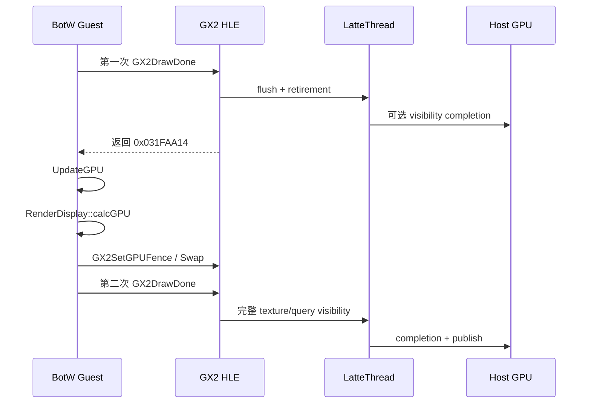
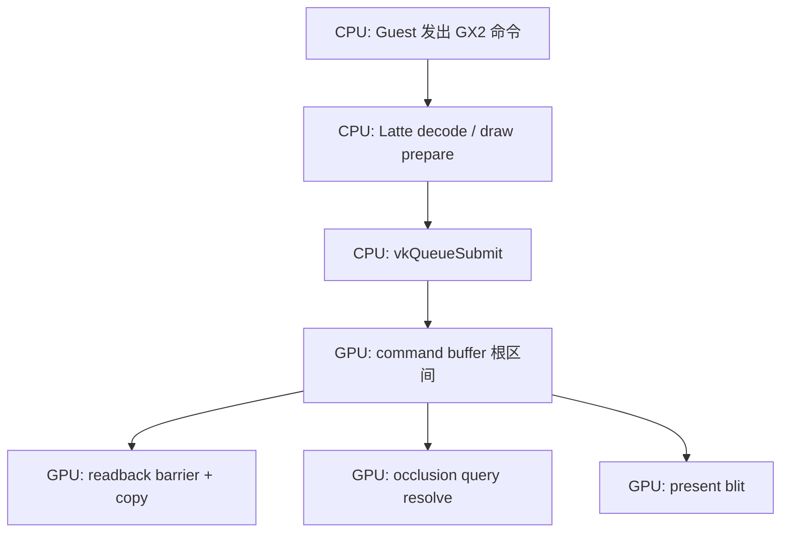
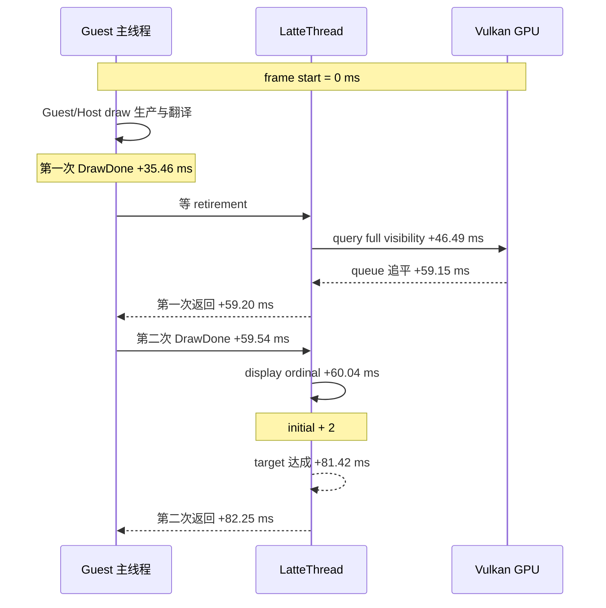
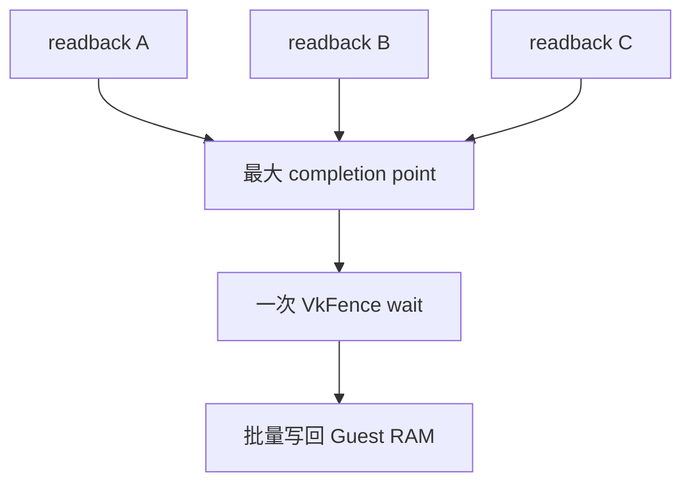
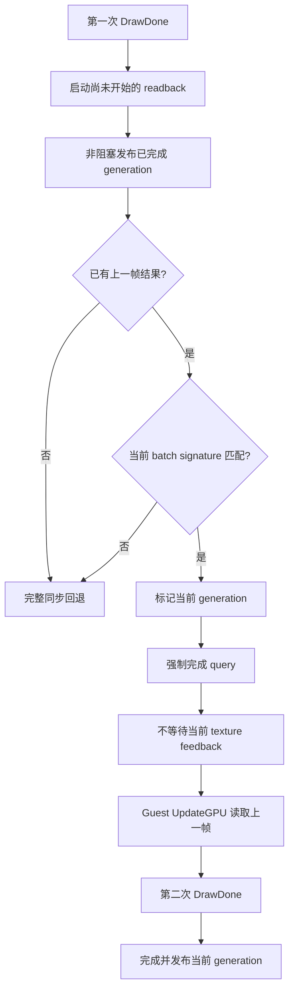
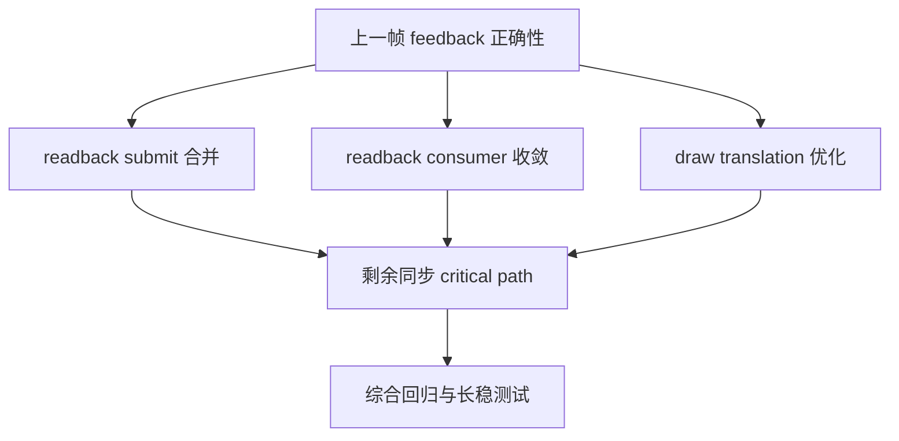
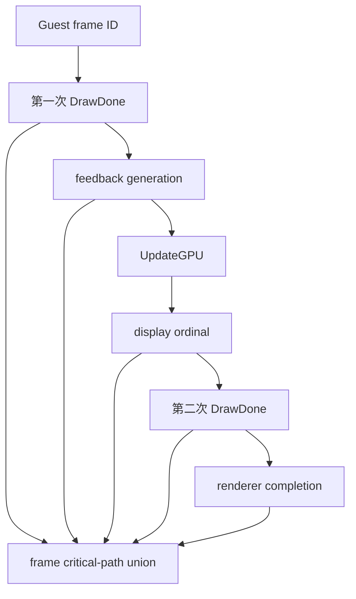

# BotW Host GPU Feedback 优化 Spec

## 1. 结论与实施边界

BotW JP v208 当前最大的已验证收益来自**延后第一次 `GX2DrawDone` 的 Guest-memory
visibility barrier**，让 Host CPU、Latte command processing 和 Host GPU 恢复重叠。它不是
减少 draw call、降低分辨率或少复制约 10 KiB 数据带来的收益。

现有实验路径不能直接产品化。第一次 `GX2DrawDone` 返回后，BotW 会进入
`UpdateGPU / RenderDisplay::calcGPU`；该阶段有权读取 GPU 生成的分析结果。直接省略整条
`IT_HLE_SYNC_ASYNC_OPERATIONS` 会同时推迟 texture readback 与 query，且没有验证当前待处理
任务是否确实允许读取上一帧结果。

后续实现冻结为以下方向：

1. 保留第一次 `GX2DrawDone` 的 command flush、TCL timestamp 与 Guest retirement wait；
2. 用显式的 `GuestFeedbackBoundary` 代替“什么都不发”；
3. 只允许已验证的 texture feedback 批次读取上一帧结果；
4. query、未知 readback、首帧、超龄 generation 和异常状态全部执行完整同步；
5. 第二次 `GX2DrawDone` 永远保留完整 texture/query visibility barrier；
6. 身份、callsite 和策略由 BotW v208 Graphic Pack 注册，通用 Cemu renderer 不硬编码游戏地址；
7. Vulkan 与 Metal 共用上层 generation/visibility 状态机，backend 只提供 completion point。

在 correctness 与长时间真机验证完成前，该能力保持 title-scoped、可关闭、默认不推广到
其他游戏。

## 2. 已验证事实

### 2.1 两次 `GX2DrawDone` 的 Guest 时序

BotW JP v208 主模块 checksum 为 `0x6267BFD0`。函数 `sub_31FA9E0` 每帧执行两次
`GX2DrawDone`：

| 阶段 | 调用指令 | 返回 LR | 作用 |
|---|---:|---:|---|
| pre-update | `0x031FAA10` | `0x031FAA14` | 在 `UpdateGPU` 前建立完成/可见性边界 |
| post-swap | `0x031FAB20` | `0x031FAB24` | 在 fence、swap 后完成帧尾同步 |

第一次调用之后存在真实 Guest callback，不是空白间隔：



动态 debugger 解析到帧对象的 callback 为 `0x03A128C0`。其 mode 非零路径进入
`sub_3A12720`，静态字符串明确包含 `UpdateGPU` 与 `RenderDisplay::calcGPU`。因此后续设计
必须把第一次边界当成“Guest 将消费 GPU feedback”，不能称为冗余 DrawDone。

### 2.2 第一次边界的稳定回读签名

当前稳定 gameplay 中，强制 visibility batch 每帧主要包含以下三个小结果：

| 尺寸 | 格式 | 字节数 | 观测频率 | 当前解释 |
|---|---|---:|---:|---|
| `64×8` | `0x823`，RGBA32F | 8192 | 约 1/帧 | GPU 分析中间结果 |
| `64×3` | `0x820`，RGBA16F | 1536 | 约 1/帧 | GPU 分析归约结果 |
| `64×1` | `0x823`，RGBA32F | 1024 | 约 1～2/帧 | 标量/小数组反馈 |
| **合计** |  | **10,752** | `3 jobs/帧` | 第一次边界的稳定强制批次 |

IDB 同时存在 `light_analyzer`、`LightAnalyzer`、`cExposure`、luminance 等字符串，因此这些
资源很可能属于较广义的 LightAnalyzer/RenderDisplay GPU feedback。但“每块 surface 对应
哪个最终 CPU consumer”尚未证明。关闭 `uking_dynamic_exposure` 对该批次没有影响，所以
不能把它们简化为已确认的 AutoExposure 数据。

另有约 `512×512 RGBA8`、约 1 MiB 的异步回读，观测频率约 2 次/帧。它通常在第一次强制
barrier 前已经完成，不属于上述 10,752 字节强制批次；后续可独立审计，不能混入本阶段的
允许列表。

### 2.3 当前 A/B 数据

以下数据来自完成 warmup、截图确认已进入实际 BotW gameplay 后的稳定窗口。无 gameplay
画面的 header-only 采集已作废，不参与任何结论。

| 指标 | legacy 完整同步 | 实验性第一次延迟 | 变化 |
|---|---:|---:|---:|
| FPS | 10.500 | 19.535 | +86.0% |
| frame time | 95.289 ms | 51.212 ms | -46.3% |
| Host command consume | 79.019 ms | 42.324 ms | -46.4% |
| draw translate | 18.054 ms | 16.056 ms | -11.1% |
| readback visibility wait | 18.351 ms | 7.689 ms | -58.1% |
| Vulkan submits | 11.332/帧 | 11.331/帧 | 基本不变 |
| readback submits | 4.332/帧 | 4.333/帧 | 基本不变 |

有效实验 trace 的 normalized artifact：

```text
artifact id:
20260807-075355-852-tracy-tracy-live-normalized-only-55206e7a

path:
/Users/bytedance/.profilerstudy/traces/captures/
20260807-075355-852-tracy-tracy-live-normalized-only-55206e7a
```

Profiler MCP 保存原始 `.tracy` 时遇到重复 key `-32768` 的 writer 错误，因此这里不声称已
生成对应 raw trace。normalized artifact、运行时 counters 和 gameplay 截图共同构成当前
证据。

这些数据证明“提前排空 graphics queue”是主要瓶颈，但尚不能证明上一帧反馈在所有天气、
室内外、曝光和遮挡场景中都与原行为等价。

### 2.4 后续测试基线策略

日常优化、StatusLayer 检查和新 profiler tag 验证统一从已经取得收益的
`Host Readback Deferral` 路径继续，不再为每次小改动恢复到约 10.5 FPS 的完整同步版本。
当前基线已从无条件 deferral 升级为 guarded previous-generation 路径。完成完整 warmup 并进入
gameplay 后，StatusLayer 显示 `GPU feedback ON`、`hit / age 1`；截图证据为：

```text
_out/profiler/botw-feedback-p1/guarded-gpu-timestamp-warmup-complete.png
```

首次启用 guarded 路径时出现的 Android `SIGSEGV` 已归因为 Android 入口调用
`ExceptionHandler_Init()` 后破坏 ART signal chain，而不是 generation 队列本身越界。Android
入口不再安装这套 Cemu signal handler。随后又修正了一处分类问题：已经完成的同形状 readback
曾被错误并入当前 active batch，造成假 signature mismatch；现在 active queue 是安全判定的唯一
来源，只有 active queue 为空时才把 completed candidate 用作诊断信息。

最新 10 秒 Tracy 窗口记录了 138 次 feedback boundary，其中 137 次进入 fast path；另 1 次
出现 `2 jobs / 2,560 bytes`，按设计以 `signature_mismatch` 完整同步回退。其余边界为
`3 jobs / 10,752 bytes`，generation age 为 1，query 每次保持 full sync。按本次窗口内的增量计算，
`fast_path + fallback == boundaries` 成立。这里的 fallback 是安全门槛生效的正向证据，不应当
为了追求 100% 命中率而放宽签名。

完整同步只保留在以下场合：正式归因 A/B、正确性回归、异常 fallback 验证，以及需要证明
某项收益不是场景漂移时。P2 的交错顺序属于正式阶段门禁，不是每次本地迭代的固定前置。
guarded previous-generation 路径已经通过基础 gameplay 验证；正式 3 分钟正确性矩阵和 P2
交错 A/B 仍未完成，因此它仍是 BotW JP v208 专用实验路径。

### 2.5 Tracy GPU 时间证据

Tracy Vulkan GPU timestamp 已作为正式证据源接入，采样层级如下：



GPU 根 scope 和子 scope 的统计口径不同：

| GPU scope | 层级 | 含义 | 统计要求 |
|---|---|---|---|
| `vulkan.command_buffer.gpu` | 根 | 一整个 Vulkan command buffer 在 GPU 上的执行区间 | 用于 GPU covered time；不同根区间按时间 union |
| `vulkan.readback_copy` | 子 | image barrier、依赖满足与 copy 的区间 | 已包含在根区间内，不得再次相加 |
| `vulkan.occlusion_query.resolve` | 子 | query result resolve 命令本身 | CPU query wait 不等于此 scope 的 GPU 时长 |
| `vulkan.present_blit` | 子 | 最终上屏 blit | 已包含在根区间内 |

为了控制采集扰动，已经移除每 draw 一个 GPU scope 的方案。它在 10 秒内产生约 48 万 GPU
zone 和约 196 MiB payload，采样本身会显著污染性能。改为 command-buffer 根 scope 与少量关键
子 scope 后，最新窗口只有 3,588 个 GPU zone、约 39 MiB decoded payload，同时仍能覆盖
readback、query 和 present 的关键 GPU 阶段。

最新有效 artifact：

```text
artifact id:
20260807-102523-455-tracy-tracy-live-normalized-only-75255dd4

path:
/Users/bytedance/.profilerstudy/traces/captures/
20260807-102523-455-tracy-tracy-live-normalized-only-75255dd4
```

该窗口有 3,588 个 GPU zone，其中 3,577 个使用真实 `GpuTime`，11 个仅因采集首尾缺少配对
timestamp 而使用 CPU-submit fallback。GPU 层级为 1,565 个 depth-0 与 2,023 个 depth-1；
所有正常子边都为 command-buffer 根到 readback、query 或 present，没有错误的
command-buffer 嵌套或 readback 到 present 关系。

ProfilerStudy 的 Tracy decoder 同步修正了四个会污染结论的问题：

1. `timestampPeriod` 以 `float * long` 计算时丢失绝对时间精度，导致 GPU 时间被量化为
   `8.388608 ms`；现改为 double 精度，最新数据的最小正 start delta 为约 `0.52 us`；
2. GPU zone 现在保留 `depth` 与 `parentId`，可以区分根区间和嵌套子区间；
3. Tracy 动态 source-location 指针只在 target heap 中临时有效，decoder 现按内容生成稳定 ID，
   避免旧 zone 后续被错误重命名；
4. Linux perf hardware sample 携带绝对 TSC，不能进入 thread delta 累加器；否则开启硬件采样
   的设备会把后续 CPU zone 膨胀到 `10^17 ns` 量级。

对应 ProfilerStudy 提交为 `93f0eef`、`a79b1a7`、`77a8f39`、`ea75c2a`。

只统计真实 GPU timestamp 的全窗口结果：

| GPU scope | 次数 | 总时长 | 平均 | P50 | P90 | P99 | 最大 |
|---|---:|---:|---:|---:|---:|---:|---:|
| command buffer 根 | 1,557 | 4,499.500 ms | 2.890 ms | 1.244 ms | 8.792 ms | 10.559 ms | 19.467 ms |
| present blit | 137 | 104.631 ms | 0.764 ms | 0.347 ms | 0.387 ms | 约 6.645 ms | 7.115 ms |
| readback copy | 641 | 79.528 ms | 0.124 ms | 0.008 ms | 0.036 ms | 6.139 ms | 6.880 ms |
| query resolve | 1,242 | 1.490 ms | 0.001 ms | 0.001 ms | 0.001 ms | 0.002 ms | 0.005 ms |

在 frame 20～120 的稳定段内，CPU frame interval 平均 `75.91 ms`、P50 `82.39 ms`、P90
`83.91 ms`；把 command-buffer 根区间按 frame 裁剪并取 union 后，GPU covered time 平均
`32.95 ms`、P50 `33.53 ms`、P90 `42.18 ms`，约占该段 frame wall time 的 `43.4%`。

因此当前可以确认：Host GPU 确实有约 33 ms/帧的工作量，但它不足以单独解释约 76 ms 的
frame interval。根区间内未被 readback/query/present 子 scope 细分的部分占绝大多数，主要由
draw、barrier 和其他渲染命令构成；另一方面，CPU 侧 command consume、DrawDone retirement、
display ordinal wait 和 draw prepare 仍在关键路径。尤其 GPU query resolve 总计仅约 1.49 ms，
而 CPU query visibility wait 明显更长，这说明 CPU 多数时间是在等 queue 中更早的 GPU 工作
或 completion，而不是 query resolve 指令本身很慢。

Tracy 连接期间存在明显采样扰动，本次窗口包含 1,333,027 个 CPU zone，因此窗口内约
12～15 FPS 不能直接与断开 profiler 后、不同场景中的约 19～20 FPS 横向比较。GPU 时间用于
判断同一窗口里的 CPU/GPU 包含与等待关系；正式收益仍按 P2 的同场景交错 A/B 测量。

### 2.6 AYN Thor 12 FPS 复采与设备差异

换用 AYN Thor 后，设备属性确认其平台为 `QCS8550 / kalama`，CPU 最高频率约
`3.1872 GHz`；它属于 8 Gen 2 级平台，不是此前 Pico B3110 的更新 CPU 架构。Activity、窗口、
Surface 与截图均为横屏 `1920x1080`，StatusLayer 同时报告 `Source 1280x720 -> 1280x720`、
`Output 1920x1080`，因此本轮约 12 FPS 不是横竖屏或 internal resolution 配置回退。

完成 warmup 并进入可操作的初始神庙场景后，使用包含 ProfilerStudy `ea75c2a` 的本地 MCP
server 采集 10 秒：

```text
artifact id:
20260807-130031-160-tracy-tracy-live-normalized-only-55b013f8

path:
/Users/bytedance/.profilerstudy/traces/captures/
20260807-130031-160-tracy-tracy-live-normalized-only-55b013f8
```

该窗口得到约 115 个完整 frame interval、1,076,690 个 CPU zone、3,902 个 GPU zone，其中
3,885 个使用真实 GPU timestamp。GPU 层级为 1,366 个 depth-0 与 2,536 个 depth-1，父子关系
完整。117 个 feedback counter 样本全部为 `3 jobs / 10,752 bytes / signature_matched=1 /
generation_age=1`；`fast_path` 在窗口内前进 116，说明稳定窗口实际持续命中 guarded 路径，
不能再用此前加载阶段的累计 signature mismatch 解释 12 FPS。

| 指标 | 10 秒窗口总计 | 约每帧 | 解释 |
|---|---:|---:|---|
| GPU command-buffer 根区间 | 5,313.33 ms | 45～46 ms | 同一 graphics queue 的真实 GPU 主体工作 |
| 两次 DrawDone retirement wait | 5,164.62 ms | 44.1 ms | Guest 阻塞，可能与 Host/GPU 工作重叠 |
| display ordinal wait | 2,612.94 ms | 22.3 ms | 当前不是 immediate path |
| query full visibility | 1,343.29 ms | 11.5 ms | query resolve 本体很短，主要在等更早 queue 工作 |
| `vulkan.draw.prepare.full` | 1,382.50 ms | 11.8 ms | 约 3,690 draws 的 Host state/pipeline 准备 |
| command decode self time | 880.56 ms | 7.5 ms | 排除其子等待后的 Host decoder 自身时间 |
| GPU readback copy 子区间 | 20.43 ms | 0.17 ms | 已包含于 command-buffer 根区间，不能重复相加 |
| GPU query resolve 子区间 | 3.41 ms | 0.03 ms | resolve 指令本身不是 11.5 ms CPU wait 的来源 |

这些 wall time 存在包含和并行，不能求和。它们证明：guarded texture feedback 已经稳定生效，
12 FPS 来自较弱 Host CPU/GPU 上仍保留的真实 GPU 工作、Guest/Host 同步和 draw translation
共同限制。下一阶段要先为 query visibility、DrawDone retirement 与 display ordinal 建立同帧
因果链；在证明 Guest query consumer 可以接受上一代结果前，不得直接跳过 query full sync。

### 2.7 同帧同步因果链复采

在 2.6 的设备和场景上安装加入 frame/sequence 关联指标的 RelWithDebInfo APK，执行完整
`warmup_a 10 15000 5000 250 60000`。`warmup_status` 最终为 `completed=10`、
`vpad_reads=1992`、`vpad_a_reads=29`，截图确认仍在可操作的初始神庙场景，StatusLayer 为
`GPU feedback ON / hit / age 1`、`1920x1080`、约 3,966 draws。

正式稳定窗口为：

```text
artifact id:
20260807-132100-054-tracy-tracy-live-normalized-only-ce79d5f6

path:
/Users/bytedance/.profilerstudy/traces/captures/
20260807-132100-054-tracy-tracy-live-normalized-only-ce79d5f6

screenshot:
_out/profiler/botw-feedback-p1/ayn-thor-causal-warmup-complete.png

profiler 断开后的同场景截图：
_out/profiler/botw-feedback-p1/ayn-thor-causal-profiler-disconnected.png
```

窗口包含 118 个完整 frame interval、1,182,035 个 CPU zone、3,124 个 GPU zone，其中
3,113 个使用真实 GPU timestamp；120 个完整 Guest frame 均有两次 DrawDone。按 PM4 packet
携带的 `guest_frame_id` 和 `draw_done_sequence` 关联，而不是用最近时间猜测，结果为：

Profiler 断开后 StatusLayer 仍为 `12.1 FPS / 82.35 ms`，与连接时的约 12.0 FPS 接近；因此
本轮 12 FPS 不是 Tracy 连接本身造成的回退。

| 区间 | 样本 | 平均等待 | 等待前状态 | 等待后状态 |
|---|---:|---:|---|---|
| 第一次 DrawDone，phase 1 | 120 | 19.897 ms | 平均 21.492 个 retirement marker 未完成 | marker gap 恒为 0 |
| 其中 query full visibility，mode 2 | 120 | 11.925 ms | 平均 8.925 个 in-flight/Guest query，event gap 18.850 | query 均清空，event gap 恒为 1 |
| 第二次 DrawDone，phase 2 | 121 | 22.681 ms | 平均 1.983 个 retirement marker 未完成 | marker gap 恒为 0 |
| 其中第二次 query visibility，mode 0 | 121 | 0.004 ms | in-flight/Guest query 均为 0，event gap 为 1 | 状态不变 |
| 其中 display ordinal | 120 | 21.077 ms | `target - initial` 每次严格为 2 | `final == target` 每次成立 |

display wait 平均有 20.708 次 wakeup，是当前 1 ms `wait_for` slice 的检查次数，不等于 20
个真实 VSYNC event。它说明现有 Host event 路径已经去掉 Guest RAM busy-poll，但仍由
LatteThread 推进 virtual VSYNC 并等待两个 ordinal；不能把这 21 ms 解释成 query 或 readback。

同一窗口的渲染/翻译基线为：

| 指标 | 约每帧 | 含义 |
|---|---:|---|
| CPU frame interval | 83.160 ms | 对应约 12.0 FPS |
| GPU command-buffer 根区间 | 46.041 ms，11.34 个 command buffer | 当前 GPU 工作给出的理论上限约 21.7 FPS |
| GPU readback copy | 0.183 ms，4.69 次 | 不是 12 FPS 主体 |
| GPU query resolve | 0.016 ms，9 次 | resolve 指令本身几乎可忽略 |
| GPU present blit | 0.663 ms，约 1 次 | 不是主瓶颈 |
| Host draw translate | 17.248 ms | 约 3,965 draws |
| full draw | 约 1,186 次，阶段合计约 10.70 ms | shader/context 改变导致完整状态准备 |
| fast draw | 约 2,779 次 | 同一 draw sequence 内的增量路径 |
| command decode self | 约 7.25 ms | 不含嵌套等待 |

约 1,186 次 full draw 中，平均 1,126 次由 changed context register 结束前一 draw pass，
占约 94.9%。累计 `command_translation_status` 的 top break 为：

| register range | 语义 | 累计占 context break |
|---|---|---:|
| `0xA225..0xA229` | fetch shader program block | 68.34% |
| `0xA216..0xA21A` | vertex shader program block | 14.25% |
| `0xA010` | color target 0 base | 4.51% |
| `0xA210..0xA214` | pixel shader program block | 4.18% |
| `0xA200` | depth control | 3.18% |
| `0xA104` | alpha-test control | 2.08% |
| `0xA020` | color target 0 view | 1.57% |

这些项合计约 98.1%，说明大多数 pass break 是实际 shader/target/depth 状态切换，不是可以
直接忽略的无关 context packet。已有 pipeline cache 也不是 full draw 的主要 CPU 花费：

| full-draw 子阶段 | 约每帧 |
|---|---:|
| Host state/render-pass 处理 | 3.117 ms |
| Vulkan draw API 录制 | 2.252 ms |
| vertex/uniform buffer 处理 | 1.816 ms |
| index decode/bind | 1.223 ms |
| descriptor 处理 | 0.814 ms |
| uniform 更新 | 0.770 ms |
| pipeline lookup/bind | 0.615 ms |
| prelude | 0.098 ms |

因此 P5 不应只继续堆 pipeline hash cache；优先审计 shader 切换后能否复用 Host state、buffer/
index binding 与 descriptor 结果，以及减少导致 Vulkan render-pass 物理结束的 framebuffer、
self-dependency、texture/buffer operation。

frame 50 是一条可读的代表性关键链，frame wall time 为 82.169 ms：



结论因此进一步收敛：

1. 第一次 DrawDone 不是空 barrier。准确模式下它同时覆盖真实 GPU queue 尾部、约 9 个
   occlusion query 和约 21 个 retirement marker；后续运行时证据又证明 BotW 此处全部是
   GPU query，而 Cemu 当前 conditional render 不执行 Host draw culling。受控
   `always_visible` A/B 已把 query wait 降到约 0，并把第一次 DrawDone 从 19.90 ms 降到
   10.30 ms。完整边界见 `docs/architecture/mobile-occlusion-query-hsr.md`；
2. 第二次 DrawDone 的 query 已经为空，它几乎完全包含 display ordinal pacing；若要优化，
   必须把 ordinal 建模为显式 presentation/Guest scheduler dependency，不能简单把 `+2` 改成
   `+1` 或提前退休；
3. 约 46 ms 的 GPU 根区间与约 17 ms 的 Host draw translation 仍是真实工作。即使完全消除
   Host 等待，GPU 侧也先给出约 21.7 FPS 的上限；继续提升需要同时减少 render-pass/submit
   碎片与约 3,966 draw 的 GPU/Host 成本。

## 3. 为什么 readback batch 本身没有解决问题

当前 Vulkan readback 在 graphics queue 中录制 `vkCmdCopyImageToBuffer`，以 command-buffer
ID 作为有序 completion point。批量等待已经把三个独立 `ForceFinish()` 合并成等待最大
completion point 一次：



等待次数从 3 次/帧降为 1 次/帧，但 wall time 没有明显下降。原因是等待最新 readback 仍然
要求同一 graphics queue 上更早的约四千次 draw 完成。10,752 字节复制量不是主要成本，
真正代价是**在 Guest CPU 即将执行 UpdateGPU 时过早建立全队列完成点**。

因此本阶段不继续围绕 memcpy、映射方式或单个 fence API 做微优化，而先改变反馈的时序
契约。

## 4. 目标模型

### 4.1 核心对象

上层增加 backend-neutral 的三个概念：

| 对象 | 作用 |
|---|---|
| `GuestFeedbackPolicy` | Graphic Pack 注册的 callsite、最大延迟和允许的 batch signature |
| `GuestVisibilityGeneration` | 一组 readback job、总字节、submission point、发布状态和帧序号 |
| `GuestFeedbackBoundary` | 第一次 DrawDone 处的“发布已完成旧结果或安全回退”操作 |

`GuestVisibilityGeneration` 至少记录：

- 单调 generation ID；
- 捕获它的 DrawDone/frame ordinal；
- job 数量、字节数和顺序无关的 signature hash；
- 最晚 renderer completion point；
- `scheduled`、`completed`、`published`、`consumed` 状态；
- 发布时的 age；
- 每个 job 的尺寸、pitch、format、slice/mip；
- 可选的 Guest RAM 发布前后 checksum，仅用于诊断，不进入热路径默认配置。

### 4.2 正常快速路径

第一次 `GX2DrawDone` 不再简单省略 `IT_HLE_SYNC_ASYNC_OPERATIONS`，而是写入专用的
Host-only feedback boundary packet。LatteThread 处理顺序如下：



这里“上一帧”指最近一次已发布、age 不超过 1 的 generation。第二次 DrawDone 发布当前
generation 后，下一帧的 UpdateGPU 才消费它。第一帧或重置后的第一帧没有旧结果，必须
完整同步，不能读取未初始化 Guest RAM。

### 4.3 query 与 texture 必须拆开

现有 `IT_HLE_SYNC_ASYNC_OPERATIONS` 同时 force-finish texture readback 和 query。实验路径
直接省略它时，两类可见性都被推迟；这超出了当前证据。

专用 feedback boundary 必须执行：

1. texture：仅在 signature 与 generation 条件满足时允许延迟；
2. query：继续执行 `LatteQuery_UpdateFinishedQueriesForceFinishAll()`；
3. 如果 query 的等待重新吃掉全部收益，先记录真实结果，再决定是否对具体 query 建立独立
   语义，不得预先一起跳过。

### 4.4 允许批次的 signature

第一版 signature 使用与地址无关的 multiset，不把一次运行中的 physical address 固化进
通用 Cemu：

```text
job count = 3
total bytes = 10752
jobs = {
  (64, 8, pitch=64, format=0x823, bytes=8192),
  (64, 3, pitch=64, format=0x820, bytes=1536),
  (64, 1, pitch=64, format=0x823, bytes=1024)
}
```

signature 只作为第一层安全门槛，不等于最终语义证明。若后续 IDA/runtime correlation 找到
明确 consumer，应让 Guest patch 注册实际资源或 consumer token，逐步替代纯形状匹配。

### 4.5 强制回退条件

出现以下任一条件时，本帧执行 legacy 完整 texture/query visibility：

- 尚无已发布的上一 generation；
- 上一 generation age 大于 1；
- job 数量、总字节、尺寸、pitch、format、slice/mip 任一不匹配；
- active queue 中出现 signature 之外的未完成 readback；
- 仍有 scheduled readback 无法安全归入当前 generation；
- generation 顺序倒退、重复发布或 completion point 不单调；
- renderer reset、device lost、title stop、Graphic Pack unload；
- 当前 renderer 不提供有序 completion point；
- query 同步或 Guest visibility 状态报告异常；
- 标题/mod 未注册该策略。

回退是正常功能路径，不是 assert。每种原因必须有独立 counter，避免把安全回退误诊为性能
回归。

## 5. Guest/Host ABI

Graphic Pack 的 `.callback entry` 注册策略，不直接在通用 Host 代码中写 BotW 的 title ID、
version 或 callsite：

```text
hook_RegisterGuestFeedbackPolicy(
    guestLr,
    maxGenerationAge,
    policyDescriptor)
```

第一阶段可用固定、受版本控制的 policy kind 减少 Guest ABI 复杂度，但至少满足：

- `moduleMatches = 0x6267BFD0` 绑定 BotW JP v208；
- Guest callsite `0x031FAA14` 由 pack 传入；
- Host 只接受明确 opt-in，不从游戏名猜测；
- 注册失败返回 0，Guest 继续使用 legacy 路径；
- 注册状态在 title stop/reset 时清空；
- 不认识的 policy version 必须拒绝，而不是按最接近版本执行。

现有 `hook_RegisterDrawDoneVisibilityDeferral` 可保留为实验对照，但正式路径应换成上述 policy
注册，并在验证结束后删除无条件 deferral 分支。

## 6. Profiler 与 debugbus 指标

### 6.1 必需 counters

| counter | 含义 |
|---|---|
| `cemu.feedback.enabled` | 当前是否注册 feedback policy |
| `cemu.feedback.boundaries` | 命中的第一次 DrawDone 数 |
| `cemu.feedback.fast_path` | generation/signature 通过数 |
| `cemu.feedback.fallback` | 完整同步回退数 |
| `cemu.feedback.fallback_reason` | 最近一次枚举原因 |
| `cemu.feedback.jobs` | 当前候选 job 数 |
| `cemu.feedback.bytes` | 当前候选总字节 |
| `cemu.feedback.signature` | 当前 signature hash |
| `cemu.feedback.generation_scheduled` | 最近排队 generation |
| `cemu.feedback.generation_published` | 最近发布 generation |
| `cemu.feedback.generation_consumed` | UpdateGPU 将看到的 generation |
| `cemu.feedback.generation_age` | 消费时延迟帧数 |
| `cemu.feedback.query_full_sync` | 特殊边界仍完整处理 query 的次数 |

`fallback_reason` 同时保留分原因累计 counter，例如 `no_previous_generation`、
`signature_mismatch`、`unknown_readback`、`generation_too_old`、`renderer_reset`。

### 6.2 CPU scopes

```text
gx2.guest.draw_done.feedback_boundary
latte.feedback.publish_completed
latte.feedback.classify_batch
latte.feedback.query_visibility
latte.feedback.fallback_full_visibility
latte.feedback.defer_current_generation
latte.feedback.publish_current_generation
```

### 6.3 GPU scopes

GPU scope 必须使用 Tracy Vulkan timestamp，不能把 CPU 录制 command buffer 的时间冒充 GPU
执行时间。当前保留以下低扰动层级：

```text
vulkan.command_buffer.gpu
  vulkan.readback_copy
  vulkan.occlusion_query.resolve
  vulkan.present_blit
  surface_scale.native_boundary_copy
  surface_scale.resample
```

默认不恢复 per-draw GPU zone。需要继续拆分根区间时，优先按低频、语义明确的 command
batch 或 render phase 建 scope，并在引入前给出每帧 zone 预算。

### 6.4 debugbus

新增 `guest_feedback_status`，至少输出：

```text
enabled=true
policy_version=1
guest_lr=0x031FAA14
boundaries=...
fast_path=...
fallback=...
fallback_reason=none
jobs=3
bytes=10752
generation_scheduled=...
generation_published=...
generation_consumed=...
generation_age=1
query_full_sync=...
```

不得只用 `enabled=true` 宣称功能有效；`fast_path`、generation 和 gameplay 证据必须同时成立。

## 7. 分阶段实施顺序

### 7.1 完整优化路线图

后续性能工作按下表推进。优先级表示开始顺序，不表示这些 wall time 可以直接相加：

| 优先级 | 工作包 | 当前证据 | 目标 | 前置条件 | 独立验收指标 |
|---:|---|---|---|---|---|
| 1 | 上一帧 GPU feedback | 实验性 deferral 使 FPS `10.50→19.54`，但第一次 DrawDone 后存在真实 consumer | 双缓冲/generation、严格 signature、异常自动完整同步 | 本 spec P0 观测稳定 | generation age=1、无错误画面、收益接近实验路径 |
| 2 | 合并 readback submit | 约 `4.33` 次/帧；强制批次为 3 jobs/10,752 bytes | 共用 staging/completion，降到 `1～2` 次/帧 | feedback correctness 通过 | readback submit、completion wait 与 frame time |
| 3 | 收紧 readback 判定 | `TM_LINEAR_ALIGNED` 被保守视为可回读；另有 `512×512 RGBA8` 高频异步回读 | 只为有真实 Guest CPU consumer 的资源保留回读 | producer/consumer 证据齐全 | jobs/bytes/submit 下降且 Guest RAM 行为一致 |
| 4 | Host draw 翻译 | `3800～4200` draws，translate 约 `16 ms/帧` | 减少冗余 state、packet、pass 和重复翻译 | feedback 改动已单独归因 | translate 时间下降，draw 输出与 RenderDoc 帧一致 |
| 5 | 剩余同步 critical path | DrawDone retirement 约 `15.4 ms/帧`、readback `7.7 ms/帧`、display ordinal `4.3 ms/帧` | 证明包含/并行/阻塞关系后，只优化真正串行段 | 新 scope/counter 完整 | critical-path union、off-CPU/on-CPU、GPU completion |

依赖关系如下：



各工作包必须使用独立开关或独立提交做 A/B。不得同时修改 feedback 时序、删除 readback
和重写 draw translation 后只给一组 FPS，因为那样无法判断正确性风险和收益来源。

### P0：只观测 generation，不改变行为

状态：**实现完成，基础 gameplay 验证完成；正式 3 分钟场景矩阵待补。**

1. 为 readback job 增加 generation 与 signature metadata；
2. 在两次 DrawDone 记录候选批次；
3. 仍执行完整同步；
4. 验证稳定 gameplay 是否持续得到相同的 `3 jobs / 10,752 bytes`；
5. 记录其他场景或加载阶段的 signature 变化。

退出条件：至少 3 分钟 gameplay 无 metadata 生命周期错误，且首帧/加载阶段的异常批次能
被明确区分。

### P1：专用 feedback boundary 与安全回退

状态：**实现完成，Android 基础 gameplay 验证通过。** 当前 active-only signature、上一帧
generation hold/publish、query full sync、异常完整回退和 StatusLayer 状态均已生效。最新 10 秒
窗口为 137 次 fast path 与 1 次 signature mismatch fallback，满足窗口增量守恒。长稳正确性和
P2 正式交错 A/B 仍是阶段门禁。

1. 新增 policy 注册和 Host-only boundary packet；
2. texture 与 query visibility 拆开；
3. 只在上一 generation 已发布且 signature 精确匹配时走快速路径；
4. 第二次 DrawDone 完整发布当前 generation；
5. 删除正式路径对“跳过整个 async sync”的依赖。

退出条件：`fast_path + fallback == boundaries`，generation 单调，所有 signature 外场景自动
回退，禁用 pack 后完全恢复 legacy。

### P2：同场景交错 A/B

顺序至少为：

```text
legacy → guarded feedback → legacy → guarded feedback
```

每轮都必须：

1. 使用 Android `relWithDebInfo`；
2. 覆盖安装，不卸载、不清数据；
3. 执行 `warmup_a 10 15000 5000 250 60000`；
4. `warmup_status=completed`，并检查 `vpad_reads`、`vpad_a_reads`；
5. 截图确认处于同一个可操作 gameplay 区域；
6. 再采集至少 30 秒 Tracy 稳定窗口；
7. 记录 frame/zone/plot 数和 CPU/GPU zone；
8. 断开 Tracy 后再读状态层 FPS，区分 profiler 自身开销。

主要比较：FPS、frame time、Host consume、draw translate、readback visibility、query
visibility、DrawDone retirement、submit reason、draw 数、CPU 和 GPU covered time。

### P3：减少 readback submit

只有 P2 correctness 通过后再做：

- 同 generation 的小型 feedback copy 共用 staging allocation；
- 尽可能录入同一 command buffer；
- 只对 generation 的最大 submission point 建立 completion；
- 目标从当前约 `4.33` readback submit/帧降至 `1～2`；
- 不能为了 submit 数好看而延长超过一帧的反馈 age。

已排除的错误捷径：把 Vulkan 常规 draw-pass submit threshold 从 300 提到 600，虽然把总
submit 从 `10.42` 降到 `8.41` 次/帧，但 readback visibility fence wait 从 `1.41` 增至
`7.17 ms/帧`，feedback-boundary DrawDone 从 `3.09` 增至 `9.17 ms/帧`。物理 GPU 能接受
更大 batch，不代表 Guest feedback consumer 能接受更晚 completion。P3 必须合并同一
generation 的 copy/completion，并保持反馈及时发布；不得用延迟整个 graphics batch 代替。

### P4：审计非反馈回读

把 `TM_LINEAR_ALIGNED` 的保守 `enableReadback` 改为 usage/consumer 驱动前，先对每个高频
surface 记录 producer、最后 GPU write、CPU read 证据和生命周期。尤其要把 `512×512`
异步回读与 10,752 字节反馈批次分开。没有 consumer 证据的资源只能进入候选清单，不能
直接删除回读。

### P5：继续优化 draw translation

feedback 路径稳定后，约 `16 ms/帧` 的 Host draw translation 是下一条独立主线：

- 冗余 SET register packet 合并；
- pipeline/state 翻译缓存；
- 安全的短 render-pass 合并；
- BotW 高频 command pattern 快速路径；
- RenderDoc 实帧与 Tracy command marker 关联。

这部分不与 feedback 改动混在同一个 A/B，避免无法归因。

### P6：重建剩余同步 critical path

对稳定 gameplay 的同一帧建立 causal/containment 统计，不再把下列平均 wall time 直接
相加：

| 当前区间 | 最新稳定窗口 | 已回答/仍需回答的问题 |
|---|---:|---|
| 第一次 DrawDone retirement | 19.897 ms/帧 | 包含 11.925 ms query/GPU completion；仍需证明上一帧 query 结果是否合法 |
| 第二次 DrawDone retirement | 22.681 ms/帧 | query 已空，主要包含 21.077 ms display ordinal |
| readback GPU copy | 0.183 ms/帧 | copy 本身很短；submit/recycle 与 completion 仍需单独合并 |
| display ordinal | 21.077 ms/帧 | 每次严格等待两个 ordinal，是明确 pacing；仍需区分可重叠 pacing 与 Guest 必需阻塞 |

实施要求：

1. 以第一次 feedback-boundary DrawDone 递增 `guest_frame_id`，同一帧后续 DrawDone、query
   visibility packet 和 display ordinal packet 都携带该 ID；每次 DrawDone 另有独立递增的
   `draw_done_sequence`，不能仅靠时间邻近推断关联；
2. 分开统计 Host on-CPU、Host off-CPU、Guest blocked 和 GPU covered time；
3. 输出 scope union 与关键链，而不是 scope duration 求和；
4. 对 display ordinal 记录 target/published/consumed 和 condition-variable wakeup；
5. 对 DrawDone 记录 retirement point 与最后必需 visibility point 的差；
6. 只有证明等待不是必要 pacing/真实 GPU 工作后，才允许改变语义。

首轮观测指标固定如下。它们只增加 PM4 HLE packet 的内部关联字段与 Tracy counter，不允许
跳过 query、retirement 或 display wait：

| 阶段 | scope/counter | 含义 |
|---|---|---|
| Guest DrawDone | `gx2.guest.draw_done.wait_retirement.{feedback_boundary,post_feedback,generic}` | 区分第一边界、同帧后续 DrawDone 与其他调用 |
| Guest DrawDone | `cemu.sync.draw_done.{frame_id,sequence,phase,guest_lr}` | DrawDone 身份；phase 为 `0/1/2 = generic/boundary/post-feedback` |
| Guest DrawDone | `cemu.sync.draw_done.{target_retirement,initial_retired,final_retired,gap_before,gap_after,wait_us}` | Guest 等待前后的 retirement 差及实际 wall time |
| query visibility | `cemu.sync.query.{frame_id,draw_done_sequence,feedback_mode,wait_us}` | 精确关联触发 query full visibility 的 DrawDone |
| query visibility | `cemu.sync.query.{in_flight,guest_queries,event_gap,renderer_active}_{before,after}` | 等待前后 Host query 队列与 Guest query consumer 状态 |
| query visibility | `cemu.sync.query.feedback_generation_{published,consumed}`、`feedback_generation_age` | query barrier 对应的 feedback generation |
| display ordinal | `cemu.host.display_ordinal.feedback_frame_id` | 将既有 target/initial/final/wakeup 指标关联到第一次 DrawDone 所在 Guest frame |

`guest_frame_id` 是 Guest/Host 同步链 ID，不等价于 presentation frame number。GPU command-buffer
scope 仍通过 Tracy 时间线与该 ID 的 query visibility 区间做 containment；在 renderer 没有显式
提交 ID 前，不得把时间上相邻的任意 GPU root 强行标成同一 Guest frame。

首轮观测实现与真机复采已经完成，结果见 2.7。下一步不再增加同义 counter，优先做两项
相互隔离的实验：

1. 根据 context-break register 排名减少不必要的 full-draw 重建，并按
   `full_draw.{host_state,api,buffers,indices}` 分阶段 A/B；
2. BotW occlusion query 的首轮 consumer 证据与显式 always-visible A/B 已完成：稳定窗口全部
   为 GPU query、CPU query 为 0，且 Host predication 尚不剔除 draw。神庙 gameplay 的
   `GX2QueryGetOcclusionResult` 调用计数在完整 warmup 和随后 3 分 25 秒内始终为 0；PID
   稳定、query 全部完成且无 device lost/GPU page fault。下一步扩展到室外、植被、敌人、
   粒子、菜单和传送场景矩阵。产品默认已经改为 conservative-visible bypass：不创建 Host
   query，让 Host depth/Hi-Z/HSR 处理实际遮挡；`accurate` 只保留为兼容和归因对照。
   默认实现复验又确认 3 分 31 秒内 `45,996 queries == completed == bypassed`，同时记录到
   46,005 组 GPU `pixelsMustPass` predication、CPU getter 仍为 0；同进程短 A/B 为
   12.0 → 13.0 FPS。该轮绝对值与早先 11.6 → 16.0 FPS 不同，后续只采用同进程交错比较。



这一阶段的输出决定下一步属于“继续异步化”“减少 Host 调度延迟”还是“等待本来就是目标
帧节奏”。如果只是必要 pacing，则保留现状，不用错误的忙碌度优化换取错误速度。

## 8. 正确性与性能退出标准

### 8.1 正确性

- 室内、室外、昼夜切换、强明暗变化和太阳遮挡场景无明显曝光滞后或闪烁；
- UI、地图、菜单切换无读回错误；
- 至少连续运行 3 分钟，无 hang、native crash、device lost 或 GPU page fault；
- query 始终保持完整可见性，除非后续另有独立证据；
- generation age 稳定为 1，不能静默增长；
- 任何 signature 变化都回退，不产生错误画面；
- 关闭/移除 pack 并重启后，counters 和行为回到 legacy；
- Vulkan 实机通过；Metal 至少通过共享 C++ 构建与状态机测试。

### 8.2 性能

- 同场景 guarded 路径目标接近实验路径的约 19.5 FPS；
- 若 query 完整同步导致收益降低，这是合法结果，必须如实记录；
- `readback visibility wait` 相对 legacy 明显下降；
- `draw translate` 和 draw 数不应被误写成本阶段收益；
- submit 数在 P1 可以不变，到 P3 才要求下降；
- 不把不同 gameplay 场景、warmup 前或 Tracy header-only 样本放入同一表格。

### 8.3 立即停止扩展的条件

- 上一帧反馈引发可见画面错误或 gameplay 行为变化；
- signature 在正常 gameplay 中频繁变化，导致无法可靠分类；
- 必须硬编码运行时 physical address 才能工作；
- query 完整同步证明第一次边界必须等待同一条 graphics queue；
- Host bookkeeping 开销抵消同步收益；
- Metal 无法表达相同语义且上层开始出现 Vulkan-only 分支。

停止后保留 profiler/generation 观测能力，回退到 legacy，不继续扩大特例。

## 9. 预期代码入口

| 责任 | 文件 |
|---|---|
| policy 注册、DrawDone 分流与状态 | `src/Cafe/OS/libs/gx2/GX2_Event.cpp` |
| Host-only packet | `src/Cafe/HW/Latte/Core/LattePM4.h` |
| feedback boundary 执行 | `src/Cafe/HW/Latte/Core/LatteCommandProcessor.cpp` |
| generation、signature 与批量发布 | `src/Cafe/HW/Latte/Core/LatteTextureReadback.cpp` |
| readback metadata | `src/Cafe/HW/Latte/Core/LatteTextureReadbackInfo.h` |
| Vulkan completion point | `src/Cafe/HW/Latte/Renderer/Vulkan/TextureReadbackVk.cpp` |
| Metal completion point | `src/Cafe/HW/Latte/Renderer/Metal/LatteTextureReadbackMtl.cpp` |
| debugbus | `src/Cafe/Diagnostics/CemuDiagnostics.cpp` |
| BotW v208 注册 pack | `tools/guest-mods/botw-v208-host-readback-deferral/` |

## 10. 当前结论与下一步

已经落地并通过基础验证的方向：

1. 第一次 DrawDone 使用“严格签名 + 上一帧 generation”，不再依赖无条件 deferral；
2. query 保持完整同步；
3. `3 jobs / 10,752 bytes` 是临时安全签名，任何变化自动完整回退；
4. StatusLayer、debugbus、CPU Tracy counter 与 Vulkan GPU timestamp 已组成同一条证据链；
5. GPU 根区间平均约 33 ms/帧，当前低 FPS 仍是 GPU 工作与 Host 翻译/同步共同造成，不能只按
   “GPU 渲染压力”处理。

下一步严格按阶段门禁执行：

1. 补齐 guarded 路径 3 分钟正确性矩阵；
2. 只在正式归因时执行 P2 的同场景交错 A/B，并同时记录 CPU critical path 与 GPU covered
   time；
3. P2 通过后进入 P3，把同 generation 的小 readback 集中到更少的 staging/completion；
4. GPU 根区间若仍占主要部分，再设计低频 render-phase GPU scope；不得恢复每 draw 采样；
5. draw translation 优化继续保持独立 A/B，不与 feedback/readback submit 改动混合。
