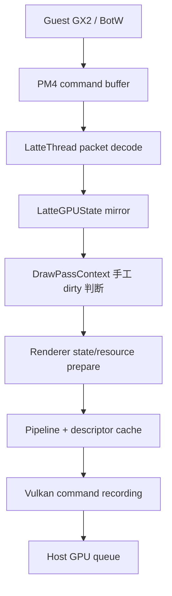
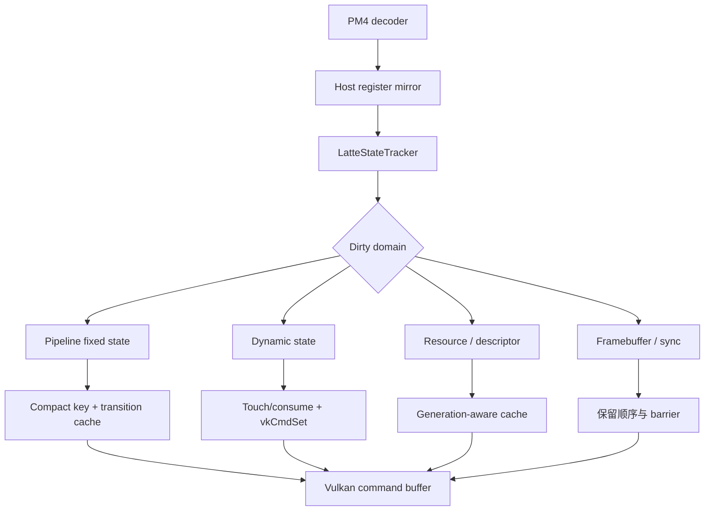
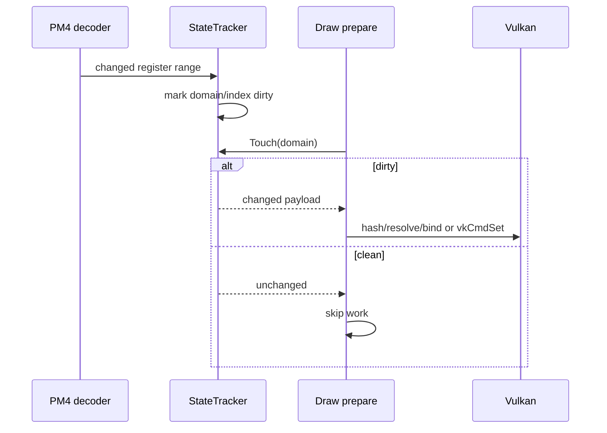

# Cemu PM4 到 Vulkan 翻译优化 Spec

## 1. 一句话目标

在不改变 Latte/Guest 可观察语义、不引入平台专用第二套路径的前提下，减少 Cemu 对高频 PM4
寄存器与 draw packet 的重复解析、状态重建、pipeline/descriptor 查找和 Vulkan 状态提交成本，
并用 BotW v208 的稳定 gameplay 数据证明收益与正确性。

## 2. 状态与实施分支

- 实施分支：`feature/malos/pm4_optimize`。
- 基线分支：`feature/malos/basic_version` 的 `26b614d8`。
- 已完成基线优化：Guest context shadow 写入保持不变，值未变化的 Host register mirror store
  可跳过；BotW v208 30 秒窗口内跳过 `70,115,265 / 87,461,082` 个 payload store，消除率
  `80.1%`。
- 当前限制：上述结果只减少 C++ mirror store；SET packet 解码、dirty routing、pipeline hash、
  descriptor hash、资源解析和 Vulkan API 调用是否被跳过，必须分别测量，不能由 80.1% 推断。
- 本分支当前已完成 P0、P1、P2 和 P3 的实验实现。P1/P2 已通过结构与真机正确性门禁；P3 已
  证明约 47.7% 的 pipeline lookup 可由 transition cache 接管，但 CPU stage 的稳定净收益尚需
  三个同场景窗口复验，因此暂不视为已达到合入门槛。
- 合入策略：本分支从产品主线分出，不 rebase 已推送历史；验证完成后由维护者决定是否 merge
  回 `feature/malos/basic_version`。

## 3. 背景与问题定义

BotW 的一帧通常包含约 3,800～4,200 次 draw。Guest 通过 GX2 构造 Latte PM4 command
buffer，Host LatteThread 顺序解码 packet、更新 `LatteGPUState`、准备 Cemu renderer 状态，最后
记录 Vulkan command buffer。现代 Host GPU 能承受这一级别的三角形工作量，但每 draw 前后的
串行 CPU 翻译、资源解析、同步与小粒度状态提交可能成为帧率上限。

当前已有 continuous draw pass/fast draw 优化，但状态追踪仍分散在：

- PM4 SET packet 的 register mirror 更新；
- `DrawPassContext` 内的手工寄存器范围判断；
- `draw_beginSequence()` 的 shader/FBO/texture/viewport/scissor 全量准备；
- full/continued draw 内的 pipeline hash/cache 与 descriptor cache；
- `VkRendererState` 内少量 ad-hoc 状态比较。

当前路径可简化为：



优化目标不是绕过 Cemu 直接让 Guest 调 Vulkan。Guest 与 Host 的 GPU、地址空间、资源布局、
shader ISA 和同步模型不同，必须保留语义翻译层；本项目优化的是该层的增量化、缓存和批处理。

## 4. 参考实现与事实来源

### 4.1 固定快照

| 来源 | 记录时提交 | 用途 | 不可直接采用的部分 |
| --- | --- | --- | --- |
| Cemu 当前仓库 | `26b614d8` | 行为与兼容性唯一基准 | 不因参考实现不同而改 Guest 语义 |
| `references/decaf-emu` | `e6c528a2` | Latte PM4 opcode、寄存器、shadow、draw 语义交叉验证 | Vulkan 后端较旧，不作为性能模板 |
| 本地 Citron | `02db2a88` | register dirty table、`Touch*` 消费、紧凑 pipeline key、transition cache | Maxwell method stream 不是 Latte PM4 |
| 本地 Azahar | `da48ebd2` | Android/Adreno 的动态状态比较、scheduler、pipeline/descriptor bind 策略 | PICA command/状态语义不是 Latte |
| 本地 shadPS4 | `e1cf4752` | 现代 AMD PM4、resource/barrier、Vulkan 翻译边界 | Liverpool/GCN 不是 Latte，寄存器与 packet 不兼容 |

本地路径：

- Citron：`/Users/bytedance/workspace/emulations/switch/citron`；
- Azahar：`/Users/bytedance/workspace/emulations/3ds/azahar`；
- shadPS4：`/Users/bytedance/workspace/emulations/ps4/shadps4`。

这些本地仓库可能同时由其他任务使用，只允许读取，不允许格式化、清理、切分支或提交。

### 4.2 来源优先级

出现冲突时按以下顺序裁决：

1. Cemu 当前可运行行为、已有测试与真机证据；
2. Wii U/GX2 可观察语义和 Decaf 对 Latte PM4 的交叉证据；
3. Citron/Azahar/shadPS4 的 Host 组织方式；
4. 仅基于现代 GPU 特性的性能推断。

Decaf 与三个本地参考仓库均为 GPL 系实现，Cemu 为 MPL-2.0。本项目采用 clean-room
重写：只吸收抽象设计、状态分类和经独立验证的行为，不逐行复制代码、布局或常量表；Latte
寄存器值与范围只能来自 Cemu/公开硬件定义或独立验证。

## 5. 目标与非目标

### 5.1 目标

- 把 `register index -> dirty domain` 变为集中、可审计、表驱动的映射。
- 只在值真实变化时标 dirty，只在消费者需要时清除 dirty。
- 区分 pipeline 固定状态、Vulkan 动态状态、descriptor/resource 状态和同步状态。
- 降低 pipeline hash/global map lookup、descriptor hash/lookup 和重复 `vkCmd*` 绑定。
- 保持 Vulkan 为 Android 主验证后端，同时不破坏 Metal 编译和共享 renderer 接口。
- 每项优化都有独立计数器、A/B 开关或可回退提交，能说明收益来自哪里。
- 为后续 shadow FrameGraph/recompile 提供结构化状态与资源依赖输入。

### 5.2 非目标

- 不做 Guest PM4 到 Host Vulkan 的 ABI 直通。
- 不让 BotW 专用 Mod 直接提交 Vulkan handle、Guest 地址或 Host 指针。
- 不在本阶段引入完整异步 command scheduler 或跨线程 renderer 重写。
- 不恢复 OpenGL；设计和验证均不为已移除的 OpenGL 保留复杂分支。
- 不以删除 Foundation、XR、ImGui、debugbus、profiler 或其他构建项换取性能。
- 不把静态纹理放大、internal resolution、readback 反馈和 occlusion policy 混入同一个 A/B。

## 6. 必须保持的语义约束

1. Guest context shadow 地址存在时，每次 shadow memory store 都必须执行；Host mirror 去重不得
   改变 Guest 可观察内存。
2. special register handler 即使数值相同也按当前语义执行，除非单独证明 handler 幂等且无
   Guest/Host 副作用。
3. PM4 packet 顺序、indirect buffer 嵌套、draw/copy/clear/query/barrier/submit 顺序保持不变。
4. texture/resource identity 不能只由 Guest address 判断；format、dimension、tile mode、view、
   swizzle、generation 和 Host representation 都可能参与 key。
5. pipeline key 必须覆盖所有真正的 Vulkan 固定状态；迁为动态状态后才允许从 key 移除。
6. descriptor cache 命中仍要保持对象生命周期、command-buffer 引用和 self-dependency 检查。
7. command buffer 切换、render pass 被外部操作打断或 Host state 被辅助 pass 改写后，相关动态
   状态必须显式 invalidate，不能依赖“上一 draw 应该还在”。
8. readback、DrawDone、query、display ordinal 和 Guest feedback 的同步语义不由本 spec 放宽。
9. 任一优化出现画面差异、device lost、GPU fault、未配对 query 或 Guest 反馈 generation 错误，
   先回退该项，不以 FPS 收益覆盖正确性问题。

## 7. 目标架构



状态更新与消费时序：



## 8. 状态域设计

第一版至少划分以下 domain。一个寄存器可影响多个 domain，表项必须支持一对多，而不是强制
单一枚举。

| 大类 | 细分 domain | 消费点 | 初始策略 |
| --- | --- | --- | --- |
| Shader | VS/PS/GS program、fetch layout | shader update / pipeline | 变化时结束 fast sequence |
| Pipeline | primitive、raster、depth/stencil、blend equation、target format | pipeline key | fixed key/transition cache |
| Dynamic | viewport、scissor、depth bias、blend constants | `vkCmdSet*` | dirty 才提交 |
| Buffer | vertex、index、VS/PS/GS uniform | buffer cache/bind | index mask + generation |
| Texture | VS/PS/GS texture view | texture update/descriptor | 变化时结束 sequence，后续细化 |
| Sampler | VS/PS/GS sampler | descriptor | 先结束 sequence，测量后细化 |
| Target | color/depth target、view、extent | FBO/render pass | 保留强边界 |
| Synchronization | query、barrier、readback、DrawDone、present | submit/sync | 不参与状态去重 |
| Guest constants | VS/PS ALU constants | uniform upload | 保留 dirty range/mask |

表驱动映射只决定“谁需要重新计算”，不直接决定“能否跨 draw 合并”。后者仍由 render/resource
依赖和同步约束裁决。

## 9. 组件设计

### 9.1 `LatteStateTracker`

- 输入是已经确认发生真实值变化的 register range；未变化 packet 不进入 mark 路径。
- Context、Resource、Sampler、ALU/Control Constant 分别使用静态规则表。
- 规则至少包含起止寄存器、domain、元素 stride、元素数量和边界策略。
- range 跨多个元素时标记完整 index mask，不能只按 `registerStart` 标第一个 buffer。
- `Touch*` 返回并清除相应 dirty bit/mask；需要多个消费者的 domain 使用独立 consumer bit，避免
  第一个消费者提前清掉另一个消费者需要的状态。
- command buffer reset、辅助 blit/copy、render pass 外部状态修改必须调用 `InvalidateHostState()`。
- 初期保持在 LatteThread 单线程内，不增加每 packet 原子操作或锁。

### 9.2 Pipeline key 与 transition cache

- 保留现有 `PipelineInfo` 和 stable cache 兼容性，不一次性替换磁盘格式。
- 先记录 full/fast draw 的 hash 计算数、global hit/miss、创建数和当前 pipeline 重用数。
- key 分成 shader identity、render-pass compatibility、fixed-function 三段；动态状态不得继续污染
  fixed key。
- 借鉴 Citron 的“当前 pipeline 到下一 pipeline”边缓存，但采用 Cemu 自己的 key 与生命周期。
- transition entry 至少校验 source、完整 target key 和 target pointer/generation；pipeline 注销时
  必须同步移除，禁止悬空裸指针。
- 初始指标在 30 秒 BotW gameplay 中记录到 `500,693` 次 global hit 且无 miss，说明 lookup
  本身是稳定、重复的热路径。第一版因此采用 renderer 级 256-entry direct-mapped L1：entry
  同时匹配 source pointer、target vertex base hash 和完整 state hash，再校验目标 shader/fetch
  identity；冲突或不匹配一律回退现有两层 global cache。
- renderer 级 L1 便于在 `PipelineInfo` 注销时集中清理所有 source/target entry，也避免在每个
  pipeline 上分配容器。后续只有数据证明 direct-map 冲突率过高时，才比较扩大容量或改成每
  pipeline 小型 edge vector；不能只凭参考实现形态替换。

### 9.3 Dynamic state

- 第一批：blend constants、depth bias；两者 Cemu 已有明确 Vulkan 动态状态边界。
- 第二批：viewport/scissor；必须先梳理 surface copy、present、ImGui 等辅助 pass 对
  `VkRendererState` 的 invalidation。
- 扩展动态状态（cull/depth/stencil/topology）只在设备 feature 支持、pipeline key 能正确缩减且
  Android/桌面 A/B 均通过后启用。
- 每种状态分别记录 requested、emitted、elided，不能只报总数。

### 9.4 Resource 与 descriptor

- 先测量 `GetDescriptorSetStateHash()`、cache hit/miss、new set、bind 和 dynamic-offset-only 更新。
- 值未变化的 Resource packet 不得触发重复 texture/buffer 解析。
- 缓存 key 必须带 Host resource/view generation，避免 Guest 地址复用导致陈旧 descriptor。
- 小型 descriptor update template、push descriptor 或 descriptor buffer 都是设备能力相关实验项；
  先比较 Adreno 驱动能力和调用成本，不预设 Citron 方案一定更快。
- 同一 pipeline + descriptor set + dynamic offsets 完全相同时才可跳过 bind；command buffer reset 后
  必须重新绑定。

### 9.5 Command scheduler

Citron/Azahar 的 worker scheduler 可减少主渲染线程 Vulkan 调用开销，但 Cemu 当前存在 Guest
readback、DrawDone、query、display ordinal 和 surface lifecycle 的同步边界。本阶段只记录设计：

- 先把不可重排节点标成 hard barrier；
- 使用 shadow FrameGraph 证明可重排区间；
- 再做 command record worker PoC；
- 未通过反馈/同步验证前不进入默认执行路径。

## 10. 可观测性

所有计数由 LatteThread 帧内非原子累加、帧末批量发布到 Foundation profiler。至少增加：

- `cemu.command.host.dirty_mark.*_per_frame`；
- `cemu.command.host.dirty_consume.*_per_frame`；
- `cemu.command.host.dirty_unclassified_register_words_per_frame`；
- `cemu.command.host.pipeline.hash_calls_per_frame`；
- `cemu.command.host.pipeline.transition_hits_per_frame`；
- `cemu.command.host.pipeline.global_hits_per_frame`；
- `cemu.command.host.pipeline.misses_per_frame`；
- `cemu.command.host.descriptor.hash_calls_per_frame`；
- `cemu.command.host.descriptor.cache_hits_per_frame`；
- `cemu.command.host.descriptor.cache_misses_per_frame`；
- `cemu.command.host.dynamic_state.<state>.requested_per_frame`；
- `cemu.command.host.dynamic_state.<state>.emitted_per_frame`；
- `cemu.command.host.dynamic_state.<state>.elided_per_frame`。

`command_translation_status` 输出相同聚合信息并支持 `reset`。结构化诊断对象优先使用 Foundation
reflection 注册字段；固定 profiler counter 名称使用静态表，不在 draw 热路径拼接字符串。

关键比率：

```text
dirty_precision = consumed_dirty / marked_dirty
transition_hit_rate = transition_hits / pipeline_lookup_requests
descriptor_hit_rate = descriptor_hits / descriptor_hash_calls
dynamic_elision = elided / requested
translation_cost_per_draw = draw_translate_us / draws
```

比率只用于解释 CPU 工作量，最终性能结论仍以相同 gameplay、相同频率状态的多窗口 frame time
分布为准。

## 11. 实施阶段

### P0：参考基线与 Spec

- 接入 `references/decaf-emu`，URL 指向 `tencentmalos` fork。
- 固定四套参考快照、用途、许可与禁止边界。
- 建立本 spec 和 AGENTS/CLAUDE 入口。

退出标准：`git submodule sync --recursive` 和 `git submodule status --recursive` 正常；文档可由下一
位维护者独立确定来源优先级、阶段和验证方法。

### P1：表驱动 dirty routing（无行为变化）

- 把 Resource/ALU 手工范围判断集中到规则表。
- 修正跨多个 7-word buffer descriptor 的 packet：标记所有相交 index，而不是只标 start index。
- 增加 classified/unclassified、mark/consume 指标。
- 保持 texture/sampler/context 的现有 draw-pass break 行为。

退出标准：相同 PM4 输入的 draw-pass end reason、full/fast draw 数和渲染输出不变；所有有效
buffer/constant range 被分类，未知范围只计数、不擅自优化。

### P2：低风险 Host dynamic state 去重

- blend constants 使用与 depth bias 同等级的 command-buffer-local cache。
- depth bias 补 requested/emitted/elided 指标。
- 每次 command buffer reset 或辅助 pass 污染后强制 invalidate。

退出标准：BotW 90 秒正确性快验通过；dynamic state emitted 明显小于 requested，且 Vulkan
validation、RenderDoc draw state 与基线一致。

### P3：Pipeline lookup transition cache

- 先只加指标收集 global lookup 分布。
- 实现小容量 source->target direct-mapped edge cache 和生命周期失效。
- global cache 仍是正确性 fallback；miss 时行为与当前实现一致。

退出标准：transition hit rate、hash/global lookup 降幅和 CPU stage time 有稳定证据；pipeline
创建数、stable cache 行为和画面不变。

当前结果：结构门禁通过，正式 gameplay 窗口 transition hit rate 为 `47.7%`、pipeline miss 为
`0`；`draw_translate` 单窗口约下降 `2.3%`，但 pipeline stage 未同步下降且设备帧率会跳动，
所以 P3 的 CPU 收益门禁仍为待复验。

### P4：Resource/descriptor 增量化

- 按 dirty mask 跳过不相关 shader stage 的 descriptor hash/lookup。
- 缓存完整 descriptor binding snapshot 和 Host generation。
- 对 dynamic-offset-only 变化走轻量路径。

退出标准：descriptor hit/miss/bind 数据证明减少工作；self-dependency、texture invalidation 和
地址复用测试通过。

### P5：扩大 dynamic state / compact key

- 依据设备 feature 逐项迁移 viewport/scissor 以及扩展动态状态。
- 每迁出一项，才从 pipeline key 中删除对应字段。
- stable cache version 必须显式升级或保持兼容。

退出标准：Android Adreno 与 macOS Vulkan/Metal 编译门禁通过；不支持 extension 的设备保留
正确 fallback。

### P6：FrameGraph 驱动的批处理/异步记录（暂缓）

- 仅在 P1～P5 证明串行 Host 翻译仍是主要瓶颈后启动。
- hard barrier、resource hazard 和 Guest feedback 必须先进入可验证图模型。

退出标准另立 spec；本 spec 不授权直接启用 worker scheduler 或跨 barrier 重排。

## 12. 验证矩阵

### 12.1 构建

Android 性能和真机验证统一使用：

```sh
cd src/android
./gradlew assembleRelWithDebInfo
adb install -r app/build/outputs/apk/relWithDebInfo/app-relWithDebInfo.apk
```

桌面至少执行相关 CMake/Ninja 构建；Metal 路径没有运行条件时也必须通过编译。OpenGL 已移除，
不在矩阵内。

### 12.2 Gameplay 前置条件

1. 先连接 `localabstract:cemu-tracy` 并核对 Cemu PID/program；
2. 执行 `open_last_game`；
3. 执行 `warmup_a 10 15000 5000 250 60000`；
4. `warmup_status=completed` 后截图确认已进入可操作 BotW 场景；
5. 再开始正式 10～40 秒采样窗口和 90 秒正确性计时。

未进入 gameplay 的样本一律丢弃。Tracy 的绝对 FPS 不能替代断开 profiler 后状态层读数。

### 12.3 每阶段强制检查

- 同场景至少 3 个稳定窗口，报告 median、P90/P99 frame time，而不是单点 FPS。
- `draws_per_frame`、Guest submission/words、full/fast draw 保持可比。
- CPU：draw translate、sequence begin/end、pipeline、descriptor、host-state stage。
- GPU：command-buffer root union、render phase、readback/query/present；不能把嵌套 inclusive 相加。
- PID 90 秒不变，内存无持续异常增长。
- logcat 无 native fatal、device lost、KGSL/SMMU/GPU page fault。
- query begin/end、Guest feedback generation、DrawDone 与 display ordinal 指标合法。
- RenderDoc 抓帧用于验证 pipeline/descriptor/dynamic state 等价，不把普通截图称为抓帧。

### 12.4 收益门槛

- 结构优化可先以 CPU stage 降幅成立，但默认启用前需在至少三个相同场景窗口中观察到稳定改善。
- 小于测量抖动的 FPS 变化不写成收益；可保留为维护性改造的前提是热路径计数不增加且代码边界
  更清晰。
- 任一 title-specific fast path 必须显式标注 title/version/module checksum，并保留通用 fallback。

## 13. 风险与回退

| 风险 | 表现 | 回退/防护 |
| --- | --- | --- |
| dirty 漏标 | 偶发错误状态或闪烁 | unknown 保守 dirty；逐域启用；RenderDoc 对照 |
| key 缺字段 | 错 pipeline 被复用 | debug 重算/完整 key 校验；global fallback |
| transition 悬空 | crash/UAF | 注销时清 edge；generation；集中 ownership |
| descriptor 陈旧 | 错纹理、地址复用问题 | Host resource generation 纳入 snapshot |
| command buffer 状态污染 | 辅助 pass 后状态错误 | reset/invalidate API；不得隐式假设 |
| profiler 自扰动 | FPS 下降或排序变化 | 帧内累加、帧末发布；断开 profiler 对照 |
| GPL 实现混入 | 许可风险 | clean-room 重写；review 时保留来源说明但不复制代码 |

每个 P 阶段使用独立聚焦提交。出现回归时回退该提交，不把多个语义优化压成一个不可拆提交。

## 14. 必须停下来确认的决策点

以下事项不由本 spec 自动授权：

1. 改变 Guest readback/DrawDone/query/display ordinal 可见时序；
2. 默认启用 title/version 专用 command pattern fast path；
3. 修改 stable pipeline cache 磁盘格式或使旧 cache 全量失效；
4. 引入 worker scheduler、跨线程 Vulkan command recording 或跨 hard barrier 重排；
5. 依赖仅部分 Android 驱动支持、且没有通用 fallback 的 Vulkan extension。

## 15. 本轮实施结果与下一批

本分支已经实施：

1. Decaf 子模块与文档入口；
2. Resource/ALU register range 的集中表驱动分类；
3. dirty 分类、pipeline/descriptor/dynamic state 基线指标；
4. command-buffer-local blend constants 去重；
5. 256-entry pipeline transition cache 与销毁失效；
6. Android RelWithDebInfo 构建、BotW warmup 后 90 秒正确性验证和 30 秒正式 Tracy 窗口；
7. macOS `build_no_vcpkg` 中受影响的三个 CemuCafe unity translation unit 编译验证。

详细证据见 `docs/verification/botw-pm4-vulkan-translation-p1-p3.md`。下一批从 P3 的三个同场景
复验开始；只有 P3 收益稳定后才进入 P4 descriptor 增量化，避免同时改变两个热点导致归因失真。
