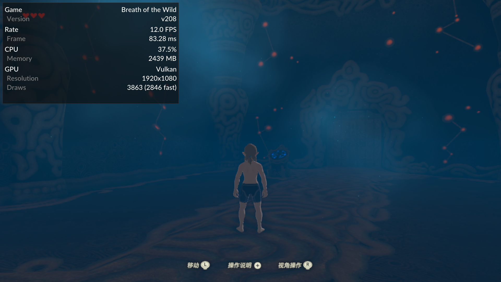
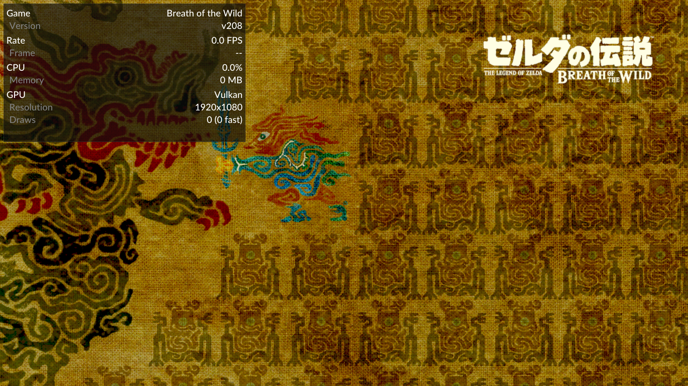
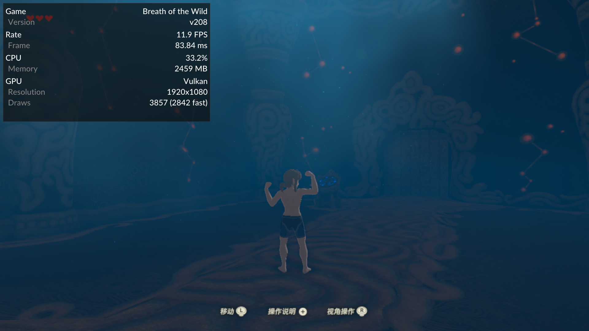
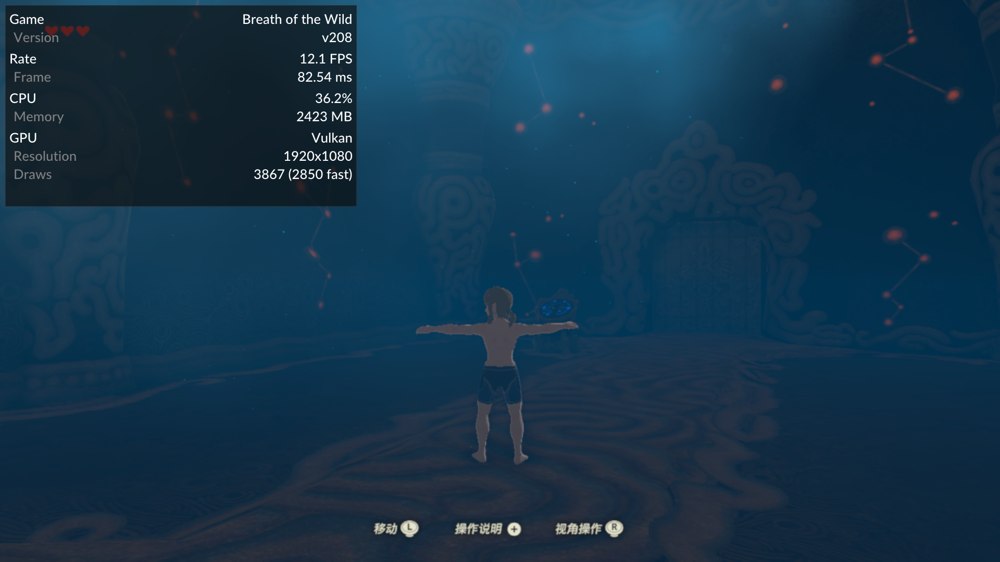

# BetterVR Android 真机兼容性探针

## 目标

在不修改用户游戏、存档和原配置的前提下，区分以下问题：

1. Cemu Android 能否解析 BetterVR graphic pack；
2. BotW v208 的 `moduleMatches` 是否命中；
3. codecave/绝对地址 patch 是否 applied；
4. 自定义 HLE hook 是否实际存在并执行；
5. 完整 warmup 后能否进入 gameplay；
6. 测试结束后能否恢复无 mod 状态。

## 安全与配置备份

使用 `adb install -r` 覆盖安装，未卸载应用、未清数据。测试前备份到：

```text
_out/device-backups/20260801-before-resolution-bettervr/
├── settings.xml
├── controllerProfiles/
└── title_list_cache.xml
```

探针只写入：

```text
/sdcard/Android/data/info.cemu.cemu/files/graphicPacks/customGraphicPacks/<probe>
```

核心包和 Graphics 子包串行测试；切换时停止应用并删除上一轮由本次测试创建的精确目录。

## 构建验证

```sh
cmake --build build_no_vcpkg --target CemuCafe -j2
cd src/android
./gradlew assembleRelWithDebInfo
```

结果：macOS `CemuCafe` target 和 Android `assembleRelWithDebInfo` 都成功。APK：

```text
src/android/app/build/outputs/apk/relWithDebInfo/app-relWithDebInfo.apk
SHA-256 95b21774cf6bd9ca63808cda8848a166a3930cd4351fa70f2d615cd484d68388
android:debuggable=true
```

## 分辨率回归

覆盖安装后执行 `open_last_game` 和默认 `warmup_a`。返回：

```text
warmup_state=completed
title_running=true
controller_ready=true
completed=6
```

截图确认进入 gameplay，并显示 `Resolution 1920x1080`：



## BetterVR Core 原包

### 静态审计

```sh
skills/cemu-guest-game-patching/scripts/audit_graphic_pack.py \
  /Users/bytedance/workspace/BotW-BetterVR/resources/BreathOfTheWild_BetterVR \
  --cemu-root . \
  --expected-title 00050000101C9300 \
  --expected-module 0x6267BFD0
```

摘要：30 个 patch file/group、352 个绝对地址、82 个 import、66 个自定义 hook import；当前 Cemu `src/` 没有找到这些自定义 hook 的 native 实现证据。

### 运行结果

日志确认：

```text
TitleVersion: v208
Loaded module 'u-king' with checksum 0x6267bfd0
Applying patch group 'BetterVR_ImproveGUI_V208' ...
...
Applying patch group 'BetterVR_CameraControls_V208' ...
Activate graphic pack: .../Better VR
```

为区分真实 HLE 与 unsupported trampoline，只在这一轮临时把 `logflag` 从 `0` 改为 `4`，测试后恢复原文件。实际调用：

```text
Unsupported lib call: coreinit.hook_OSReportToConsole
Unsupported lib call: coreinit.hook_EndCameraSide
Unsupported lib call: coreinit.hook_BeginCameraSide
Unsupported lib call: coreinit.hook_InjectXRInput
Unsupported lib call: coreinit.hook_UpdateSettings
```

完整日志：[bettervr-core-unsupported-api.log](bettervr-core-unsupported-api.log)。

默认 warmup 虽然到达 `completed=6`，画面仍停在 BotW 启动图，未进入 gameplay：



判定：`parsed/matched/applied/executed` 有证据；`semantic/runtime` 失败。BetterVR Core 不能在当前 Android 构建上原样工作。

## BetterVR Graphics 子包

原始 `rules.txt` 含 `__BETTERVR_*__` launcher 模板，审计返回 exit code 2。只在 `_out/bettervr-graphics-device-probe` 展开模板，默认 1x 使用 `1280x720`，未修改上游仓库。

真机日志：

```text
Applying patch group 'BotW_GUIAspectRatio_V208'
Applying patch group 'BotW_AspectRatio_Shared'
Applying patch group 'BotW_AspectRatio_V208'
Applying patch group 'BotW_GUIScreenNames_V208'
Activate graphic pack: .../Graphics (For BetterVR)
```

完整日志：[bettervr-graphics-device-test.log](bettervr-graphics-device-test.log)。

默认 warmup 完成并进入 gameplay，截图时约 `11.9 FPS / 83.84 ms`：



判定：Graphics 子包达到 `runtime`；没有验证 stereo、HLE controller、XR input 或 OpenXR present。

## 恢复

测试后执行：

1. 停止应用；
2. 删除本次创建的两个精确 probe 目录；
3. 空目录使用 `rmdir`，不递归删除用户目录；
4. 把原始 `settings.xml` 推回设备；
5. 重新启动无 mod BotW，并再次执行默认 warmup；
6. 检查日志中没有 BetterVR graphic pack activation。

恢复验证已通过：设备回拉的 `settings.xml` 与测试前备份逐字节一致，
`graphicPacks` 探针目录不存在；[恢复日志](bettervr-restore.log)只有
`------- Activate graphic packs -------` 标题，没有 BetterVR 激活项。默认 warmup 再次进入
gameplay，约 `12.1 FPS / 82.54 ms`：



## 结论

| 能力 | 结果 |
| --- | --- |
| v208/version gate | 通过 |
| Cemu `.asm` parser | 通过 |
| `moduleMatches` | 通过 |
| codecave/绝对地址 patch | 通过 |
| BetterVR Graphics 子包 | gameplay 通过 |
| BetterVR 自定义 HLE | 缺失，运行时 unsupported |
| BetterVR Core 原包 | 未通过，卡在启动画面 |
| Stereo/OpenXR | 未验证且当前不可用 |

架构解释和推进建议见 [BotW BetterVR 在 Cemu Android 上的实现边界](../../architecture/botw-bettervr-android.md)。
