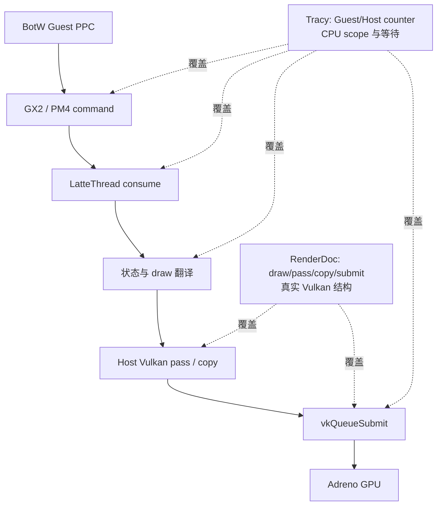
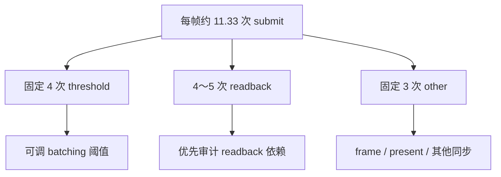

# BotW Guest 命令翻译与 Host Vulkan 提交基线

## 结论

这轮验证已经把“截图看不出原因”收敛为可量化的三层成本：

1. BotW v208 在稳定 gameplay 中每帧平均产生约 `3971` 个 Cemu draw，Guest 与 Host
   command submission 都固定为 `60` 次，队列末端没有积压。瓶颈不是 Guest command
   buffer 没有及时送到 LatteThread。
2. Host 对 draw 的直接翻译平均为 `17.786 ms/帧`，占 `94.059 ms` 平均帧时的约
   `18.9%`。因此 Guest command 到 Host renderer 的 translate 是实质成本，但不能解释
   全部约 10.6 FPS。
3. 一份对齐 Cemu Guest 帧边界的完整 RDC 直接看到 `4241` 个 Vulkan draw、`255` 个
   render pass、`216` 次 copy 和 `12` 次 queue submit。`66.3%` 的 pass 只有一个 draw，
   `82.4%` 的 pass 不超过四个 draw，说明 Host 侧还存在明显的短 pass、copy 和同步抖动。
4. Tracy 稳定窗口把 submit 原因进一步分解为：固定 `4` 次 draw-pass threshold submit、
   平均 `4.33` 次 readback submit、固定 `3` 次其他 submit。Readback 与阈值提交不是
   “命令解析慢”的另一种叫法，而是独立的 Host command-buffer 生命周期和同步成本。

因此后续不应直接跳到“Guest 绕过 PM4，调用 Host Vulkan”。优先级应是：保留 Guest
语义，先合并 readback、延长安全 render-pass 生命周期、降低冗余 SET packet 的 Host
处理量；每项都用同场景 A/B 数据验证。

## 验证身份

| 项目 | 实测值 |
| --- | --- |
| 分支 | `feature/malos/basic_version` |
| APK | Gradle `relWithDebInfo` / Native `RelWithDebInfo` / debuggable |
| 包名 | `info.cemu.cemu` |
| 设备 | Tracy 报告 `Pico B3110`，serial `PB3210PGL6170004G`，8 核 ARM64 |
| 游戏 | BotW Wii U JP v208 / DLC v80 |
| Renderer | Vulkan |
| warmup | `warmup_a 10 15000 5000 250 60000` |
| gameplay 确认 | warmup completed 后 Android 截图，Guest `vpad_a_reads=51` |
| Cemu hash | `ab6e8f2b` |

本验证包含两种不同证据，不能互相替代：

| 证据 | 用途 | 本机路径 |
| --- | --- | --- |
| Tracy 0.10 trace | CPU scope、per-frame counter、submit 原因 | `_out/profiler/botw-command-submit-reasons-native.tracy` |
| Tracy gameplay 截图 | 确认稳定窗口对应实际场景 | `_out/profiler/botw-command-submit-reasons-native/gameplay-after-warmup.png` |
| Guest-frame RDC | Host Vulkan draw/pass/copy/submit 真实结构 | `_out/renderdoc/botw-guest-frame-warm-20260807/info.cemu.cemu_2026.07.31_03.06_capture.rdc` |
| RenderDoc manifest | warmup、Guest frame、设备路径、hash | `_out/renderdoc/botw-guest-frame-warm-20260807/capture-manifest.json` |
| RenderDoc gameplay 截图 | 确认 RDC 之前已进入 gameplay | `_out/renderdoc/botw-guest-frame-warm-20260807/gameplay-before-capture.png` |

产物身份：

| 产物 | Bytes | SHA-256 |
| --- | ---: | --- |
| Tracy | 156,255,875 | `bd613936cd24eee1b683bbd7de8c37d8d6795bbdd78f35c92b324e120f79cb50` |
| RDC | 326,785,835 | `e880d24982c4736d468dd5e65b5129dc9af5ad3f99646b785f3882b48001622b` |

RDC 仍保留在设备：

```text
/sdcard/Android/media/info.cemu.cemu/files/RenderDocForPico/
info.cemu.cemu_2026.07.31_03.06_capture.rdc
```

## 证据边界



- Tracy 统计的是 Cemu 语义帧和 Host CPU wall time，可回答 translate、wait、submit 的
  时间与原因；不能仅凭 scope 名字证明 Vulkan 命令真的落入 RDC。
- RenderDoc 记录真实 Vulkan action，可回答 draw/pass/copy/submit 数量；当前 remote MCP
  的 `pipeline_outputs` 对本样本仍返回空 viewport/target，不能把空值解释为未绑定。
- Android 截图只用于确认 gameplay 和 StatusLayer，不承担 GPU action 归因。

## Tracy 稳定窗口

Tracy 在进入游戏前连接，完整记录启动与 warmup。正式统计只取 trace 最后 30 秒，即
`182574429867` 到 `212574429867 ns`。这一窗口已经完成全部 10 次 A 和 60 秒 settle。
逐帧 counter 有 319 个样本；FPS、frame time、进程 CPU 等低频统计有 28 个样本。

### 帧级基线

| 指标 | 平均 | 最小 | 最大 |
| --- | ---: | ---: | ---: |
| FPS | 10.639 | 10.022 | 11.178 |
| Frame time | 94.059 ms | 89.458 ms | 99.772 ms |
| Draws | 3971.4 | 3962 | 3983 |
| Fast draws | 2780.9 | 2775 | 2789 |
| Cemu process CPU | 23.270% | 20.949% | 28.452% |
| Guest quanta | 411.4 | 324 | 1472 |
| Display ordinal last wait | 25.986 ms | 7.501 ms | 33.674 ms |

23% 是整个 8 核进程的统计，不能解释成“只用了两个核”。它与 LatteThread 串行关键路径、
Guest PPC 并行线程和等待同时存在是相容的。

### Guest command 是否堆积

| 指标 | 平均/帧 | 范围 |
| --- | ---: | ---: |
| Guest submissions | 60 | 60～60 |
| Host submissions | 60 | 60～60 |
| Guest words | 135,749 | 129,312～142,960 |
| Host words | 135,749 | 129,312～142,960 |
| Pending submissions | 0 | 0～0 |
| Pending words | 0 | 0～0 |

Guest/Host 的 submission 与 word 数逐帧相等，且 pending 为零。这里的 `word` 是模拟
command stream 的 32-bit word，不是 Guest 到 Host 的 memcpy 字节数。该结果只排除了
“command queue 持续积压”，没有排除 LatteThread 消费本身过慢。

### Host consume 与 translate

| Host 阶段 | 平均/帧 | 最小 | 最大 |
| --- | ---: | ---: | ---: |
| Command consume | 77.010 ms | 50.545 ms | 94.581 ms |
| Draw translate | 17.786 ms | 15.413 ms | 22.415 ms |
| Draw-sequence begin | 5.472 ms | 4.563 ms | 9.029 ms |
| Draw-sequence end | 4.594 ms | 3.769 ms | 7.487 ms |
| Sequence-end submit | 4.107 ms | 3.309 ms | 7.030 ms |

`draw_translate` 约占平均帧时的 `18.9%`，`consume` 约占 `81.9%`。两者不能相加，因为
translate、sequence begin/end 和等待都嵌套或发生在 consume 内。结合前一轮 Tracy 的
`display wait`、async readback 和 Vulkan submit 子阶段，consume 的剩余部分主要应继续
按等待、readback、parser/state residual 拆分。

### SET packet 冗余

| 指标 | 平均/帧 |
| --- | ---: |
| Changed SET packets | 19,470.5 |
| Redundant SET packets | 22,757.7 |
| Changed SET words | 156,864.0 |
| Redundant SET words | 96,773.8 |

按 packet 数计算，冗余 SET 占 `53.9%`；按 word 数计算占 `38.2%`。这为 Host 侧状态
去重、批处理或 BotW 已知状态组合快速通道提供了空间，但不能直接丢弃 packet：某些值相同
的写入仍可能承担顺序、hazard 或 Guest 可观察语义。

## Vulkan submit 原因

| 分类 | 平均/帧 | 最小 | 最大 | 占全部 submit |
| --- | ---: | ---: | ---: | ---: |
| 全部 submit | 11.332 | 11 | 12 | 100% |
| Draw-pass threshold | 4.000 | 4 | 4 | 35.3% |
| Readback | 4.332 | 4 | 5 | 38.2% |
| Other | 3.000 | 3 | 3 | 26.5% |
| Submit 内记录的 Cemu draw pass | 1190.2 | 1108 | 1307 | — |



这组计数解释了为什么 RenderDoc 完整帧会看到 12 次 submit。阈值类固定为 4，说明当前
draw-pass batching 上限稳定触发；readback 每帧至少 4 次，说明 copy/readback 是结构性
工作，不是偶发 shader 编译。`other=3` 仍需在调用点继续分类，不能自动写成 present。

## RenderDoc 完整 Guest 帧

普通 RenderDoc `CaptureFrame` 以 Android WSI present 为边界。Cemu 的 Guest frame 与
Android present 解耦：一次普通抓取只拿到 93 个 draw 的 submit 片段，下一次甚至只有
`vkQueuePresentKHR`。因此本轮新增 `renderdoc_guest_capture`，在
`LattePerformanceMonitor_frameBegin` 后开始，在下一次 `SwapBuffers` 后结束。

manifest 证明 capture 从 Guest frame `2278` 跨到 `2279`，最终获得：

| 指标 | 数量 |
| --- | ---: |
| Root actions | 4994 |
| Vulkan draw | 4241 |
| Begin/End render pass | 255 / 255 |
| Copy | 216 |
| Queue submit begin/end | 12 / 12 |
| Clear | 2 |
| Present | 1 |
| Resources | 5550 |
| Native textures | 731 |
| Validation/debug messages | 0 |

RenderDoc draw `4241` 与 Cemu counter 的约 `3971` 不共享同一统计边界；RDC 还包含 Host
layer/output 等 action。两者数量同阶且 submit 数吻合，可证明 Cemu 的高 draw 计数确实
落成了数千个 Host Vulkan draw，而不是仅仅在 parser 侧重复计数。

### Render pass 粒度

| Draws/pass | Pass 数 |
| ---: | ---: |
| 1 | 169 |
| 2 | 22 |
| 3 | 9 |
| 4 | 10 |
| 5～10 | 12 |
| 11～100 | 18 |
| 101～300 | 10 |
| 301 以上 | 5 |

- `169 / 255 = 66.3%` 的 pass 只有一个 draw。
- `210 / 255 = 82.4%` 的 pass 不超过四个 draw。
- 这些不超过四个 draw 的 pass 只承载 `280 / 4241 = 6.6%` 的 draw。

这不是“所有 one-draw pass 都能合并”的证明。Attachment、load/store、feedback、readback、
query 和 Guest 同步都可能要求切断 pass；但它把后续审计范围明确收敛到 210 个低利用率
pass，而不是泛泛优化全部 4241 个 draw。

### Submit 工作分布

| Submit | Event 范围 | Draw | Copy | Render pass |
| ---: | --- | ---: | ---: | ---: |
| 1 | 6～65 | 8 | 1 | 4 |
| 2 | 84～2037 | 497 | 16 | 25 |
| 3 | 2047～5082 | 868 | 4 | 18 |
| 4 | 5096～8915 | 1180 | 8 | 42 |
| 5 | 8947～12083 | 849 | 50 | 31 |
| 6 | 12097～14069 | 630 | 43 | 50 |
| 7 | 14078～14562 | 79 | 19 | 33 |
| 8 | 14620～15277 | 95 | 69 | 36 |
| 9 | 15283～15407 | 17 | 6 | 10 |
| 10 | 15416～15500 | 15 | 0 | 4 |
| 11 | 15509～15535 | 3 | 0 | 2 |
| 12 | 15538～15541 | 0 | 0 | 0 |

前五个主要 submit 承载 `3402 / 4241 = 80.2%` 的 draw。第 7～9 个 submit 只有 191 个
draw，却带有 94 次 copy 和 79 个 pass，是明显的 copy/pass-heavy 尾部。这与 Tracy 每帧
4～5 次 readback submit 互相支持；但没有逐 submit reason marker 前，不能把 RenderDoc
表中的某一个 submit 与某一个 Tracy reason 强行一一绑定。

### 资源与 swapchain

完整 RDC 的纹理表开头包含 resource `851`～`856`，共 6 张 `1920x1080` RGBA8、
单样本 swapchain image，每张 8,294,400 bytes，合计约 47.46 MiB。旧的 submit 片段只
列出 5 张，不能再作为当前 swapchain image count 基线。

六张 image 是轮转缓冲池，不表示每帧绘制六次 1080p。当前性能问题的直接证据仍是
4241 draws、255 passes、216 copies 和 11～12 次 submit；swapchain count 主要影响常驻
显存和 in-flight 深度。

## 当前瓶颈判断

| 假设 | 判断 | 证据 |
| --- | --- | --- |
| Guest command queue 持续积压 | 不支持 | Guest/Host 60 次、words 相等、pending 为 0 |
| Guest→Host draw translate 没有成本 | 否 | 17.786 ms/帧，约占帧时 18.9% |
| 全部 12 FPS 都由 translate 解释 | 不支持 | consume 还含约 26 ms display wait、readback/async、submit 与 residual |
| 高 draw 只是 Cemu 统计口径 | 不支持 | RDC 直接看到 4241 个 Vulkan draw |
| submit 主要由 draw 阈值产生 | 不完整 | 阈值 4 次，readback 4～5 次，other 3 次 |
| 大量短 pass 值得审计 | 支持 | 82.4% 的 pass 不超过 4 draw |
| 六张 swapchain 每帧都被重绘 | 不支持 | 它们是 image pool；无六倍 action 证据 |

## 下一步优化顺序

1. **P0：细分 `other=3`。** 给 frame-end、present、query、explicit flush 等调用点补 reason，
   保证所有 submit 总和闭合，避免把未知项猜成 present。
2. **P1：审计 4～5 次 readback submit。** 记录 readback resource、区域、consumer、同步
   要求和可延迟帧数；先寻找同 resource/同 consumer 的合并机会。
3. **P2：定位 210 个低 draw pass。** 在 RenderDoc/Tracy 中关联 attachment identity、
   load/store、结束原因；只合并 attachment 和 hazard 兼容的连续 pass。
4. **P3：对 threshold 做 A/B。** 只在 P1 后测试 batching threshold；观察 submit CPU、
   fence wait、GPU bubbles、内存峰值和画面正确性，不能只看 submit 数下降。
5. **P4：减少冗余 SET 的 Host 开销。** 优先缓存解析/比较结果或为 BotW 已验证状态组合
   建快速路径；Guest command stream 和可观察同步语义保持不变。

每项 A/B 必须使用同一 APK variant、同一 BotW 场景、相同 warmup，并至少报告：FPS、
frame time、draw/pass/copy/submit、submit reason、Host consume/translate、readback/wait、
GPU time 以及 RDC/trace hash。不能用单张 StatusLayer 截图代替。

## 采集器限制

本轮 Profiler MCP live capture `s14` 只读取了 Tracy welcome header，frame/zone/plot 都是
零，同时 debugbus 报告 `profiler_connected=false`。该样本已判为无效，没有参与上述
任何性能数值。有效 trace 使用同协议 Tracy 0.10 capture，经 adb forward 连接并由
debugbus 确认 `profiler_connected=true`。

190 秒 trace 含 1362 万个 CPU zone，超过当前 Profiler MCP 离线 reader 的单段上限；
官方 Tracy Worker 可以正常打开并报告 2287 帧，本文的 counter 表取最后 30 秒。后续正式
回归宜在 warmup 完成后只采 20～30 秒，或者提升 MCP reader 的 zone 上限/流式能力。
