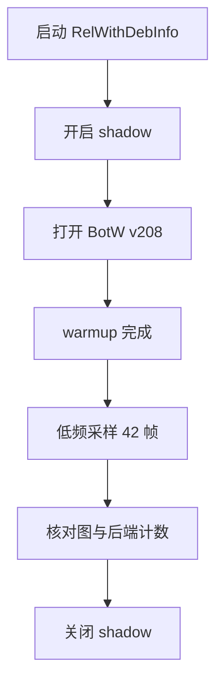
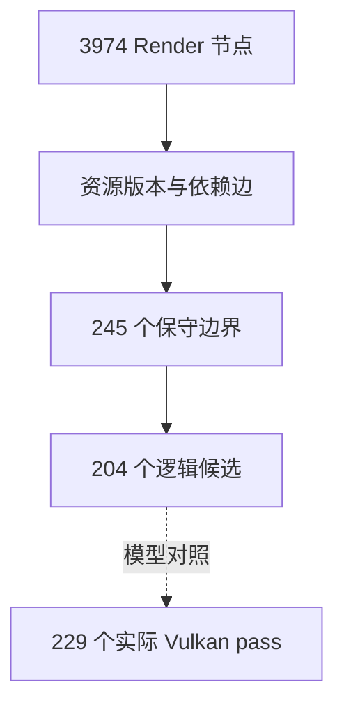

# BotW FrameGraph shadow P1 Android 验证

## 结论

P1 的只观测 FrameGraph 已在 BotW JP v208 gameplay 中完成真机验证。它能以低频整帧采样恢复
约 4000 个 Guest render 节点的资源依赖，并把它们归纳为约 200 个逻辑 RenderPass 候选；现有
Vulkan 执行器同一采样帧实际产生约 229 个 render pass 和 8 次 submit。P1 没有接管执行顺序，
所以这些数字是后续重编译的输入和校验基线，不是已经获得的 pass 合并收益。

本机瞬时 FPS 会明显跳动，本验证不使用截图 FPS 比较 shadow 开关收益。截图只证明标题、场景、
分辨率、patch 和 draw 量级正确。



## 环境与产物

| 项目 | 值 |
| --- | --- |
| 分支 | `feature/malos/basic_version` |
| 基础提交 | `ab6e8f2b75c1`；验证包含工作区未提交改动 |
| Android variant | `relWithDebInfo` |
| APK SHA-256 | `5f969017a1b001942e1eb0fac7f627fc301bb774f96f2d693174f9ce8175174a` |
| 设备 | AYN Thor / `kalama` / Adreno 740 |
| 标题 | The Legend of Zelda: Breath of the Wild，JP v208 |
| renderer | Vulkan |
| internal / texture scale | `1x / 1x` |
| Guest source / output | `1280x720 / 1920x1080` |
| screenshot | `_out/profiler/botw-framegraph-shadow-p1-low-frequency.png` |
| screenshot SHA-256 | `678fe42b62f7dac0a0f47675a473b3e56953637c653ea9765514dd2a28ec710d` |

截图中为可操作的神庙场景，StatusLayer 报告 BotW v208、GPU feedback ON、occlusion bypassed、
约 3963 draws。截图与 shadow 的完整采样帧不是同一时刻，因此只能比较量级，不能要求 draw 数
逐项相等。

## 执行方法

覆盖安装 APK 后，在打开标题前启用 shadow，再执行已有的无 UI warmup：

```sh
adb -s 9c2841a4 install -r \
  src/android/app/build/outputs/apk/relWithDebInfo/app-relWithDebInfo.apk

adb -s 9c2841a4 shell dumpsys activity service \
  info.cemu.cemu/.utils.DebugDumpService framegraph_shadow_status on
adb -s 9c2841a4 shell dumpsys activity service \
  info.cemu.cemu/.utils.DebugDumpService open_last_game
adb -s 9c2841a4 shell dumpsys activity service \
  info.cemu.cemu/.utils.DebugDumpService warmup_a \
  10 15000 5000 250 20000
```

`warmup_status` 最终为 `completed`，10 次 A 全部完成，`vpad_reads=1665`、
`vpad_a_reads=64`，且 `title_running=true`。采样结束后必须关闭 observer：

```sh
adb -s 9c2841a4 shell dumpsys activity service \
  info.cemu.cemu/.utils.DebugDumpService framegraph_shadow_status off
```

## 最终结构快照

关闭 observer 时保留的最后一个完整采样帧如下：

| 分类 | 指标 | 值 |
| --- | --- | ---: |
| 采样 | observed / compiled / period | `2494 / 42 / 60` |
| 节点 | total / render | `4222 / 3974` |
| 节点 | transfer / query / readback / present | `1 / 18 / 4 / 2` |
| 边界 | hard barrier / hard boundary | `223 / 245` |
| 资源 | resources / versions / accesses | `2517 / 11225 / 25638` |
| 依赖边 | total | `27505` |
| 依赖边 | RAW / WAR / WAW | `78 / 2 / 11047` |
| 依赖边 | read order / hard barrier | `12070 / 4308` |
| 归属 | tagged render / tagged draw | `3974 / 3974` |
| pass | logical candidates | `204` |
| pass | render nodes merged into candidates | `3770` |
| 后端 | actual Vulkan render passes / submits | `229 / 8` |
| 编译 | end-of-frame candidate scan | `131 us` |

同步边界的组成是：Guest memory write `78`、bottom-of-pipe `61`、Guest visibility `2`、
display ordinal `1`、surface sync `81`。这些是 P2/P3 不能直接跨越的初始边界，不应为了减少
pass 数而删除。

## 完整性检查

下列计数均为零：

- unresolved alias fallback；
- missing surface identity fallback；
- attachmentless render fallback；
- unclosed node fallback；
- node、access、edge capacity overflow；
- unknown command barrier。

仅有 `raw_address_fallbacks=3`，对应尚未全部解析回 surface identity 的 copy/clear/present 类
地址访问。它们仍按保守依赖处理，没有被当作可自由重排的资源。



候选数比实际 Vulkan pass 少 25，只能说明存在值得继续核对的切分差异。后端可能因为未进入
shadow IR 的内部操作、attachment view 细节或驱动约束继续拆分，不能把 25 直接当成可消除的
pass。

## 性能判断边界

本轮尝试的 Tracy 连接只解码出硬件采样，`frameCount=0`、`zoneCount=0`、`plotCount=0`，不符合
采集有效性门槛，已经丢弃，不能用它证明 CPU/GPU 收益。后续性能结论必须先修复或绕过该采集
问题，并对固定 gameplay 区间比较以下结构指标：

- Guest draw、逻辑候选与实际 Vulkan pass；
- submit、DrawDone、readback 和 display wait；
- Vulkan command buffer 内部 GPU 子区间；
- 相同 patch、分辨率、warmup 和场景下的帧时间分布。

P1 的有效结论仅限于：观测链路可工作、资源图没有容量失败、RenderPass 确实处于 FrameGraph
编译流程中，并且下一阶段可以用 shadow 结果审计 P2 状态去重与 P3 安全岛，而不是直接接管执行。
