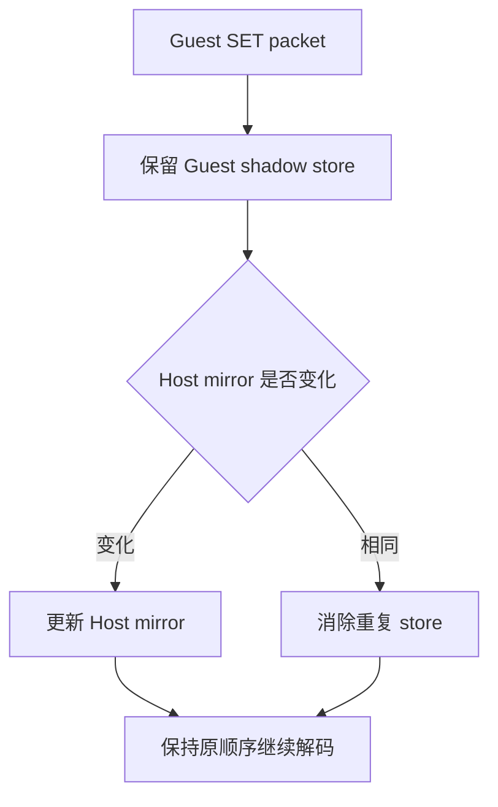

# BotW FrameGraph Host 状态去重 P2 Android 验证

## 结论

P2 的第一步已经在 BotW JP v208 gameplay 中完成真机验证：Cemu 保留原始 PM4 顺序和 Guest
context shadow 写入，只跳过值未变化的 Host `LatteGPUState` mirror store。30 秒固定窗口内，
`87,461,082` 个寄存器 payload word 中有 `70,115,265` 次 Host store 被消除，覆盖率为
`80.1%`。

这是一项确定的 Host CPU 写入削减，但不能直接解释成 80.1% 的帧时间收益。PM4 解码、Guest
shadow 内存写入、special-range callback、dirty-domain 判断、约 4000 次 draw 和 Vulkan 录制
仍然执行。本轮不使用设备上跳动的瞬时 FPS 宣称性能收益。



## 环境与产物

| 项目 | 值 |
| --- | --- |
| 分支 | `feature/malos/basic_version` |
| 基础提交 | `c3c8dd6b6305`；验证包含本文对应工作区改动 |
| Android variant | `relWithDebInfo` |
| APK SHA-256 | `f15a191ba5f8e5753de07777f039ab6a6f1658813299829a9f4a06a09ccad7b1` |
| 设备 | AYN Thor / `kalama` / Adreno 740 |
| 标题 | The Legend of Zelda: Breath of the Wild，JP v208 |
| renderer | Vulkan |
| internal / texture scale | `1x / 1x` |
| Guest source / output | `1280x720 / 1920x1080` |
| screenshot | `_out/profiler/botw-state-dedup-p2-shadow-aware.png` |
| screenshot SHA-256 | `c1d3d3599875ea3e370e19a70e883a1da4369f0ed3148090676d7868ac451aad` |

截图确认处于可操作神庙场景，StatusLayer 报告 BotW v208、GPU feedback ON、occlusion
`bypassed / visible`、约 3964 draws。截图中的 `18.9 FPS` 只用于确认应用仍在推进，不参与收益
判断。

## 语义边界

BotW 启用了 Latte context shadow。初版诊断刻意把 Guest shadow 与 Host mirror 写入一起保留，
30 秒内报告的 `register_elided_store_words=0`，证明二者不能被含混地当成同一个“状态写入”。
最终实现将它们分开：

| 行为 | 处理 |
| --- | --- |
| Guest shadow 地址非零时的内存写入 | 每次保留，维持 Guest 可观察语义 |
| Host mirror 值发生变化 | 写入并标记状态变化 |
| Host mirror 值没有变化 | 只消除该次 C++ store |
| special register range | handler 仍每个 packet 执行 |
| dirty-domain callback | 仍执行；只由真实值变化决定 dirty |
| draw / copy / barrier / submit | 顺序与数量不由本步骤改变 |

因此本步骤不跨越 shader program 切换，也不尝试合并 RenderPass。此前 15 秒基线中，
`277,285` 次 context draw-pass break 有 `190,255` 次来自 FS program 范围 `0xa225..0xa229`，
这类变化仍属于必须保留的状态边界。

## 30 秒结构窗口

完成 `warmup_a 10 15000 5000 250 60000`、截图确认 gameplay 后，执行：

```sh
adb -s 9c2841a4 shell dumpsys activity service \
  info.cemu.cemu/.utils.DebugDumpService command_translation_status reset

# 保持同一静止 gameplay 30 秒

adb -s 9c2841a4 shell dumpsys activity service \
  info.cemu.cemu/.utils.DebugDumpService command_translation_status
```

聚合结果：

| 指标 | 值 |
| --- | ---: |
| changed packets | `10,059,863` |
| redundant packets | `11,774,437` |
| register payload words | `87,461,082` |
| applied Host stores | `17,345,817` |
| elided Host stores | `70,115,265` |
| Host store elision | `80.1%` |
| context draw-pass breaks | `582,903` |

按状态域拆分：

| 状态域 | payload | 实际写入 | 跳过写入 | 消除率 |
| --- | ---: | ---: | ---: | ---: |
| Context | `19,799,551` | `3,153,573` | `16,645,978` | `84.1%` |
| Resource | `60,647,825` | `13,021,543` | `47,626,282` | `78.5%` |
| Constant | `1,536,864` | `886,519` | `650,345` | `42.3%` |
| Sampler | `4,569,846` | `265,368` | `4,304,478` | `94.2%` |
| Config | `906,996` | `18,814` | `888,182` | `97.9%` |

Resource 是绝对消除量最大的域，Sampler/Config 的相对冗余最高。下一步若继续降低状态翻译
成本，应优先测量 Resource 的 descriptor/buffer 解析是否仍在值未变时重复执行，而不是继续扩大
mirror store 特判。

## 90 秒正确性快验

按仓库统一标准，在完整 warmup 和截图确认后保持同一 gameplay 至少 90 秒：

- PID 始终为 `6202`，`title_running=true`、`title_paused=false`；
- 90 秒时 PSS 从 `2,340,073 KB` 到 `2,341,500 KB`，约增加 `1.4 MB`；
- 当前 PID 的 logcat 没有 native fatal、device lost、KGSL/SMMU fault 或 GPU page fault；
- occlusion conditional begin/end 保持配对，Host conditional culling 仍关闭；
- warmup 完成 `10/10`，`vpad_a_reads=62`，不是只依赖完成状态推断按键有效。

测试实际因已发出的轮询延伸到约 120 秒，结束时 PID 和画面仍正常；后续常规快验按用户确认的
90 秒标准停止，不再默认延长到 3 分钟。

## Profiler 指标

这些数据由 LatteThread 先在当前帧内无原子累加，再在帧末按状态域批量发布，避免为了诊断每个
SET packet 都执行原子操作。经 Foundation Tracy 发布以下逐帧 counter：

- `cemu.command.host.register_payload_words_per_frame`；
- `cemu.command.host.applied_register_store_words_per_frame`；
- `cemu.command.host.elided_register_store_words_per_frame`；
- `cemu.command.host.register_store_elision_milli_ratio_per_frame`。

`command_translation_status` 同时保留自 reset 以来的聚合值和五个状态域明细，适合在 Tracy 不
连接时做低干扰覆盖率验证。后续性能 A/B 仍需在相同场景采多个稳定窗口，并结合
`draw_translate_us_per_frame`、dirty-domain、descriptor/pipeline prepare 与 GPU timeline，不能
只看 store 数量。
