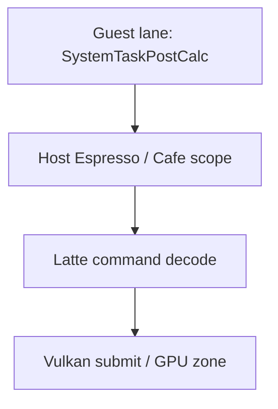

# Android Guest Profile Tag 真机验证

## 1. 验证结论

BotW v208 Guest Mod 的 section 已通过 `coreinit` HLE bridge 进入 Foundation profiler，并在
Tracy 中按 Guest `OSThread` 显示为独立虚拟线程 lane。它与 Cemu Host CPU scope、Vulkan
GPU zone 和原有 Guest counter 存在于同一次采集中。

验证设备为 AYANEO Pocket DS，应用为 native `RelWithDebInfo`、APK
`android:debuggable=true`。验证日期为 2026-08-01（Asia/Shanghai）。

## 2. 构建结果

以下命令通过：

```sh
cmake --build build_no_vcpkg --target foundation_profiler -j4
cmake --build build_no_vcpkg --target CemuCafe -j4
cd src/android
./gradlew assembleRelWithDebInfo
```

Android 构建耗时 22 秒，APK 位于：

```text
src/android/app/build/outputs/apk/relWithDebInfo/app-relWithDebInfo.apk
```

旧 `build/` 目录仍引用已经移除的 vcpkg toolchain，不能作为当前基线；无 vcpkg 的
`build_no_vcpkg` 可正常构建。

## 3. Probe 身份

Probe 由仓库脚本从 BetterVR 固定源生成：

```text
source_commit=0e1053d58cdfbd592522dc892b1770418a1af009
module_matches=0x6267BFD0
title_id=00050000101C9300
title_version=208
```

`audit_graphic_pack.py` 结果：1 个 patch 文件、1 个 patch group、40 个绝对地址、2 个
Host import，缺失证据和未解析模板均为 0。设备端文件与本地 SHA-256 一致：

| 文件 | SHA-256 |
|---|---|
| `rules.txt` | `3ff1b5fd19782f136d17e0bab137a396994dc3d0d696ee623c2b64042e09540c` |
| `patch_guest_profiler.asm` | `fb239305fb67f61ab197b03a18af171e501e1d48f6431b679f7bfec35212892f` |

部署只使用 AYANEO 的 `xsu` 写入独立目录：

```text
/sdcard/Android/data/info.cemu.cemu/files/graphicPacks/customGraphicPacks/
  BotW_v208_Guest_Profiler/
```

设备返回 `uid=0(root)`、`context=u:r:xsud:s0`；最终文件 owner 为
`u0_a177:ext_data_rw`，SELinux label 为 `media_rw_data_file`。

## 4. Warmup 与场景确认

Tracy 连接成功后依次执行 `open_last_game` 和默认 `warmup_a`：

```text
delay_ms=35000
count=6
interval_ms=10000
press_ms=250
settle_ms=60000
```

以上是 2026-08-01 采集时的历史参数。2026-08-02 起当前默认值已缩短为
`delay_ms=15000`、`interval_ms=5000`，其余参数不变；RelWithDebInfo 覆盖安装后已用
无参数 `warmup_a` 读取回执确认新默认值，并用等价显式参数完成 6/6 次 A 和 gameplay
截图验证。

最终 `warmup_state=completed`，截图人工确认处于初始神庙内的可操作 gameplay，而不是
标题、菜单或加载画面。状态层同时确认：

```text
Game=Breath of the Wild
Version=v208
GPU=Vulkan
Resolution=1920x1080
Rate≈10 FPS
```

## 5. Guest 运行时证据

warmup 后执行 `guest_profiler_reset`，再观察约 25 秒稳定 gameplay。查询瞬间结果为：

```text
active_spans=1
invalid_section_count=0
unmatched_end_count=0
span_overflow_count=0
timeline_tag_begin_count=80147
timeline_tag_end_count=80146
```

`begin - end == active_spans`，说明差值来自查询瞬间仍在执行的合法 span，不是丢失 End。
命中的 section 为 12–24、33、35–37、39；与此前 BotW v208 probe 的场景覆盖一致。

稳定窗口中的部分 counter：

| section | calls | average µs | max µs |
|---|---:|---:|---:|
| `PPCSystemStateMachine` | 380 | 16,849 | 62,216 |
| `PPCPhysicsPostBgBaseProcMgr` | 380 | 3,161 | 23,304 |
| `PPCSystemTaskPostCalc` | 380 | 19,401 | 48,547 |
| `PPCActorJob0_1` | 21,458 | 182 | 20,699 |
| `PPCActorJob1_1` | 14,495 | 138 | 11,577 |
| `PPCActorJob2_1Ragdoll` | 13,319 | 44 | 1,982 |
| `PPCActorJob4` | 17,864 | 44 | 2,897 |

## 6. Tracy 时间线证据

Profiler MCP 使用 Tracy 0.10.0 协议采集：

```text
capture_profile(
  url="android://localabstract:cemu-tracy",
  protocol="tracy",
  duration_seconds=210,
  keep_session=true
)
```

会话 `s9` 解码出 24 条 CPU thread、7,534,481 个 CPU zone、1 个 GPU context 和
4,988,059 个 GPU zone。Guest scope 可直接按名称查询：

| scope | Tracy lane | 代表性长实例 |
|---|---|---:|
| `PPCSystemTaskPostCalc` | `Cemu Guest 0x0E192E80` | 426.062 ms |
| `PPCActorJob0_1` | `Cemu Guest 0x12AFC1A0` | 28.476 ms |
| `PPCActorJob0_1` | `Cemu Guest 0x12B3CA78` | 20.701 ms |

这些 lane 的 Tracy thread ID 使用 Host 保留高位命名空间，名称里的十六进制值是原始
Guest `OSThread` 地址。Actor job 同时出现在两条 Guest lane，证明 tag 没有错误绑定到
触发 HLE 的某条固定 Host worker。

同一会话还包含 `latte.command_buffer.decode`、`espresso.recompiler.compile`、
`latte.sync.wait_reg_mem`、`vulkan.command_buffer.wait_for_fence` 等 Host scope，因此可以按
绝对时间关联 Guest、Host 和 GPU。



### 6.1 采集边界注意事项

Tracy live capture 可能在 scope 尚未结束时断开。当前 MCP 对未闭合的尾部 zone 会给出异常
巨大的 aggregate duration；同一现象也出现在既有 Host scope
`latte.command_buffer.decode`，不是 Guest 时钟换算错误。判断单个 Guest span 时使用
`find_top_slices` 的已闭合实例，并用 `begin - end == active_spans` 复核运行时配对。

### 6.2 2026-08-02 稳定 gameplay 热点

第二轮采集先用 15 秒初始等待、5 秒 A 间隔完成 warmup，并在 60 秒 settle 后截图确认
Link 已进入初始神庙的可操作场景。随后保持同一进程和场景不动，采集 60 秒 Tracy：

| 指标 | 结果 |
|---|---:|
| Frame | 598，约 9.97 FPS |
| CPU zone | 3,219,277 |
| GPU context | 1 |
| GPU zone | 2,321,540 |
| 解析到 GPU time | 2,321,113 |
| CPU submit fallback | 427 |
| 未配对 GPU timestamp | 30 |
| Guest lane | 3 |

导入诊断显示 live LZ4 event 已完整解码。GPU time 覆盖率超过 99.98%；少量 fallback 和
30 个未配对 timestamp 位于采集边界，不能据此推断 GPU zone 整体失真。

稳定窗口的闭合 CPU scope 分布如下。不同线程和父子 scope 会重叠，`total` 不能直接相加：

| 侧别 | scope | total ms | p50 ms | p90 ms | p99 ms | 闭合 max ms |
|---|---|---:|---:|---:|---:|---:|
| Guest | `PPCSystemTaskPostCalc` | 11,685.6 | 19.442 | 21.219 | 25.562 | 29.408 |
| Guest | `PPCSystemStateMachine` | 边界污染 | 17.166 | 20.147 | 29.535 | 边界污染 |
| Guest | `PPCActorJob0_1` | 6,069.6 | 0.098 | 0.223 | 2.828 | 7.184 |
| Guest | `PPCActorJob1_1` | 3,183.7 | 0.052 | 0.239 | 1.500 | 15.418 |
| Guest | `PPCPhysicsPostBgBaseProcMgr` | 1,913.1 | 2.955 | 3.990 | 5.604 | 19.542 |
| Host | `latte.sync.wait_reg_mem` | 12,756.9 | 21.354 | 23.779 | 28.585 | 34.054 |
| Host | `vulkan.command_buffer.wait_for_fence` | 12,947.2 | 2.781 | 7.125 | 8.565 | 11.441 |
| Host | `vulkan.submit` | 6,507.6 | 0.825 | 1.728 | 2.511 | 3.508 |

最长帧为 frame 69，耗时 132.149 ms。该帧的关键切片为：

| scope / 侧别 | frame 69 内耗时 |
|---|---:|
| Host `latte.command_buffer.decode`，裁剪后 total / self | 109.202 / 4.990 ms |
| Host `latte.sync.wait_reg_mem` | 30.455 ms |
| Guest `PPCSystemStateMachine`，total / self | 25.057 / 20.336 ms |
| Guest `PPCSystemTaskPostCalc` | 18.008 ms |
| Host `vulkan.command_buffer.wait_for_fence` | 15.782 ms |
| GPU `vulkan.draw` | 41.943 ms |

同帧 CPU/GPU 比为 3.151，Profiler MCP 判定主导侧为 CPU。当前证据支持以下优先级：

1. Guest `PPCSystemTaskPostCalc` 与 Host `latte.sync.wait_reg_mem` 都稳定占用约 20 ms，首先
   检查 Guest 帧尾与 Latte command processor / GPU 同步之间的交接；相似周期只说明强
   相关，仍需按绝对时间验证因果。
2. Vulkan readback / fence wait 是 Host 的主要阻塞来源。`wait_for_fence` 在 60 秒内累计
   12.95 秒，说明优化目标不只是 Guest 算法，也包括同步与 readback 频率。
3. GPU 在最长帧仍需约 41.9 ms；全窗口 `vulkan.draw` GPU time 累计 28.19 秒，折合每帧
   约 47.0 ms。即使完全消除 CPU 瓶颈，当前 1920x1080 场景也还达不到稳定 30 FPS。
4. Actor job 确有开销，但分布在 3 条 Guest lane；`PPCActorJob0_1` 的单次 p50 仅
   0.098 ms，属于高频并行次级热点，不应先于帧尾同步处理。
5. warmup 后 recompiler 只出现 22 次、累计 116 ms，说明本窗口不是由持续 JIT 编译主导。

全局 aggregate 中 `latte.command_buffer.decode` 和 `PPCSystemStateMachine` 各有一个跨 live
capture 边界的未闭合实例，产生约 `2.302e11 ms` 的伪时长。本节已排除该 total/max，使用
闭合分位数和 frame-local 裁剪结果。控制侧本轮没有观察到 `profiler_connected=true`，因此
预定的 `guest_profiler_reset` 未执行；Guest `calls` counter 是累计值，不能当 60 秒绝对值。
但 counter 首末差与 trace 内闭合 zone 数一致，Guest timeline、Host CPU 和 GPU 热点不受
此限制。

本轮 trace 保存为：

```text
_out/performance/20260802-guest-profile/botw-guest-stable.tracy
```

文件由 MCP Tracy writer 生成，大小 199,962,092 字节，可由当前 MCP 重新载入；它保留 CPU
zone、counter 和 GPU zone，但不是 live stream 的 byte-exact 副本，CPU hierarchy 与硬件
采样没有写入该派生文件。

## 7. 验收矩阵

| 项目 | 结果 |
|---|---|
| Foundation profiler 构建 | 通过 |
| CemuCafe macOS ARM64 构建 | 通过 |
| Android RelWithDebInfo APK | 通过 |
| BotW v208/CRC 身份 | 通过 |
| 完整 warmup + gameplay 截图 | 通过 |
| Guest section 配对 | 通过，三类错误均为 0 |
| Tracy Guest 虚拟 lane | 通过，至少 3 条 lane 有直接查询证据 |
| 同会话 Host CPU + Vulkan GPU | 通过 |
| 无 Mod 对照 | 通过，Tracy 已连接但无 Guest tag，gameplay 正常 |

## 8. 回退与清理

采集结束后关闭 MCP 会话 `s8`、`s9`，停止应用，并只删除：

```text
/sdcard/Android/data/info.cemu.cemu/files/graphicPacks/customGraphicPacks/
  BotW_v208_Guest_Profiler
/data/local/tmp/cemu_botw_profiler_probe
```

`xsu find` 对 probe 目录无输出，`adb forward --list` 为空。验证前后
`settings.xml` 均为：

```text
a21a874eed0be97ae98c11432dc0840cb566a3cffdf0ffabd293fc712b2e5abe
```

`cmp` 返回相同，因此没有覆盖恢复配置，也没有卸载应用或清除数据。当前设备上保留的是
RelWithDebInfo APK 和用户原配置，临时 Guest profiler pack 已移除；需要再次采集时必须由
暂存脚本重新生成并审计。

## 9. Guest→Host 与帧尾 HLE 归属复测

后续复测使用 AYANEO Pocket DS、Android RelWithDebInfo、Vulkan、BotW v208，Render 与
Static Texture 均为 1x。先建立并丢弃一条启动期 Tracy 连接以注册 Vulkan GPU context，
随后完整执行 15 秒延迟、6 次每 5 秒 A、60 秒 settle；`warmup_status=completed` 且截图
确认位于初始神庙可操作场景后，执行 `guest_profiler_reset`，最后才采正式 session `s28`。
该 15 秒窗口用于 HLE 调用归属复测，不替代最长帧结论所要求的连续 20 秒验收窗口。

| 项目 | 结果 |
| --- | --- |
| APK SHA-256 | `8e420abe76e8b9c90e48087c7ed8e957709e87819c8e0c04adb456dc5794f88c` |
| capture 参数 | 15 秒 |
| frame-set 帧 | 147 |
| CPU / GPU zone | 1,402,942 / 575,875 |
| GPU time zone | 575,875 |
| Guest lane | 3 |
| 断开 Tracy 状态层 | 12.0 FPS / 83.16 ms |
| draws | 3,861，其中 fast 2,844 |
| settings SHA-256 | `893ffdac05f7805562b068bd1a6f58bebec7851eab2f0e40cdc67f2f79779df7`，覆盖安装前后未变 |

正式 trace：

```text
_out/performance/20260802-guest-host-transfer/botw-1x-frame-end-attribution.tracy
SHA-256 44b50c6d219f0e32f4002acdf269459df13fddddee7533b6d4d70caa4edd9541
```

新 counter 证明每个 Guest 帧固定出现：一次 `GX2SetGPUFence`、一次
`GX2SwapScanBuffers`、两次 `GX2DrawDone`。DrawDone 的两个 LR 各出现 149 次，严格
交替为 `0x031FAA14`、`0x031FAB24`；swap 固定为 `0x031FAB20`，fence 固定为
`0x031FAB04`。这与 BetterVR 在 `0x031FAA10` NOP 第一处 DrawDone、并在
`0x031FAB1C` 包装 swap + 单次 post-swap DrawDone 的补丁位置一致。

session 内 298 个 `gx2.guest.draw_done` scope 累计 6,887.7 ms，平均 23.1 ms/次；Host
记录 299 次 `latte.sync.async_operations`，累计 3,161.0 ms。frame #70 为 98.352 ms，
关键数据为：

| 侧别 | scope | frame #70 |
| --- | --- | ---: |
| Guest HLE/PPC Core | 第一、第二次完整 `gx2.guest.draw_done` | 25.274 / 21.975 ms |
| Guest lane | `PPCSystemTaskPostCalc` | 18.327 ms |
| Guest lane | `PPCSystemStateMachine` | 16.814 ms |
| Host Latte | `latte.sync.async_readback` | 25.117 ms |
| Host Latte | `latte.sync.wait_reg_mem` | 19.889 ms |
| Host Latte | command ring 等待 Guest | 15.433 ms |
| Host Latte | 4,031 次 `vulkan.draw.prepare` | 19.369 ms |
| Host GPU | covered time | 8.389 ms |

Guest HLE 与 Latte scope 位于不同线程并存在重叠，不能把表中时间直接相加。本轮新增的
结论是调用因果：两次 DrawDone 触发 full-sync/readback，一次 fence 触发
`WAIT_REG_MEM`；GPU 本身不是 1x 场景的首要限制。

命令提交也已按 active Guest section 归属。正式窗口中 8,940 次 submission 的 command
word 差值约 20.81M，其中 DrawTV 99.41%、DrawDRC 0.51%、未归属 0.07%。这些 words
是共享 indirect buffer 长度，不是 Guest→Host memcpy 流量。完整解释、Mermaid 时序和
后续 A/B 条件见 [`../architecture/cemu-frame-performance.md`](../architecture/cemu-frame-performance.md)。

复测结束后已核对设备 pack 仅含 hash 匹配的 `rules.txt` 与
`patch_guest_profiler.asm`，随后删除精确目录
`customGraphicPacks/BotW_v208_Guest_Profiler` 并停止 Cemu。settings 与采集前备份 hash
一致，没有执行恢复、卸载或清数据；设备上已有的 RenderDoc adb forward 属于其他图形
工作流，本轮未修改。
