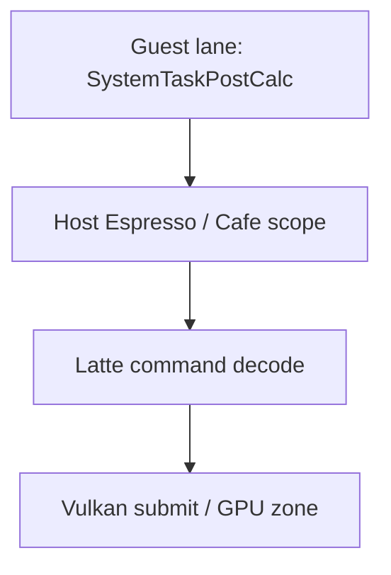

# Android Guest Profile Tag 真机验证

## 1. 验证结论

BotW v208 Guest Mod 的 section 已通过 `coreinit` HLE bridge 进入 Foundation profiler，并在
Tracy 中按 Guest `OSThread` 显示为独立虚拟线程 lane。它与 Cemu Host CPU scope、Vulkan
GPU zone 和原有 Guest counter 存在于同一次采集中。

验证设备为 AYANEO Pocket DS，应用为 native `RelWithDebInfo`、APK
`android:debuggable=true`。验证日期为 2026-08-01（Asia/Shanghai）。

## 2. 构建结果

以下命令通过：

```sh
cmake --build build_no_vcpkg --target foundation_profiler -j4
cmake --build build_no_vcpkg --target CemuCafe -j4
cd src/android
./gradlew assembleRelWithDebInfo
```

Android 构建耗时 22 秒，APK 位于：

```text
src/android/app/build/outputs/apk/relWithDebInfo/app-relWithDebInfo.apk
```

旧 `build/` 目录仍引用已经移除的 vcpkg toolchain，不能作为当前基线；无 vcpkg 的
`build_no_vcpkg` 可正常构建。

## 3. Probe 身份

Probe 由仓库脚本从 BetterVR 固定源生成：

```text
source_commit=0e1053d58cdfbd592522dc892b1770418a1af009
module_matches=0x6267BFD0
title_id=00050000101C9300
title_version=208
```

`audit_graphic_pack.py` 结果：1 个 patch 文件、1 个 patch group、40 个绝对地址、2 个
Host import，缺失证据和未解析模板均为 0。设备端文件与本地 SHA-256 一致：

| 文件 | SHA-256 |
|---|---|
| `rules.txt` | `3ff1b5fd19782f136d17e0bab137a396994dc3d0d696ee623c2b64042e09540c` |
| `patch_guest_profiler.asm` | `fb239305fb67f61ab197b03a18af171e501e1d48f6431b679f7bfec35212892f` |

部署只使用 AYANEO 的 `xsu` 写入独立目录：

```text
/sdcard/Android/data/info.cemu.cemu/files/graphicPacks/customGraphicPacks/
  BotW_v208_Guest_Profiler/
```

设备返回 `uid=0(root)`、`context=u:r:xsud:s0`；最终文件 owner 为
`u0_a177:ext_data_rw`，SELinux label 为 `media_rw_data_file`。

## 4. Warmup 与场景确认

Tracy 连接成功后依次执行 `open_last_game` 和默认 `warmup_a`：

```text
delay_ms=35000
count=6
interval_ms=10000
press_ms=250
settle_ms=60000
```

最终 `warmup_state=completed`，截图人工确认处于初始神庙内的可操作 gameplay，而不是
标题、菜单或加载画面。状态层同时确认：

```text
Game=Breath of the Wild
Version=v208
GPU=Vulkan
Resolution=1920x1080
Rate≈10 FPS
```

## 5. Guest 运行时证据

warmup 后执行 `guest_profiler_reset`，再观察约 25 秒稳定 gameplay。查询瞬间结果为：

```text
active_spans=1
invalid_section_count=0
unmatched_end_count=0
span_overflow_count=0
timeline_tag_begin_count=80147
timeline_tag_end_count=80146
```

`begin - end == active_spans`，说明差值来自查询瞬间仍在执行的合法 span，不是丢失 End。
命中的 section 为 12–24、33、35–37、39；与此前 BotW v208 probe 的场景覆盖一致。

稳定窗口中的部分 counter：

| section | calls | average µs | max µs |
|---|---:|---:|---:|
| `PPCSystemStateMachine` | 380 | 16,849 | 62,216 |
| `PPCPhysicsPostBgBaseProcMgr` | 380 | 3,161 | 23,304 |
| `PPCSystemTaskPostCalc` | 380 | 19,401 | 48,547 |
| `PPCActorJob0_1` | 21,458 | 182 | 20,699 |
| `PPCActorJob1_1` | 14,495 | 138 | 11,577 |
| `PPCActorJob2_1Ragdoll` | 13,319 | 44 | 1,982 |
| `PPCActorJob4` | 17,864 | 44 | 2,897 |

## 6. Tracy 时间线证据

Profiler MCP 使用 Tracy 0.10.0 协议采集：

```text
capture_profile(
  url="android://localabstract:azahar-tracy",
  protocol="tracy",
  duration_seconds=210,
  keep_session=true
)
```

会话 `s9` 解码出 24 条 CPU thread、7,534,481 个 CPU zone、1 个 GPU context 和
4,988,059 个 GPU zone。Guest scope 可直接按名称查询：

| scope | Tracy lane | 代表性长实例 |
|---|---|---:|
| `PPCSystemTaskPostCalc` | `Cemu Guest 0x0E192E80` | 426.062 ms |
| `PPCActorJob0_1` | `Cemu Guest 0x12AFC1A0` | 28.476 ms |
| `PPCActorJob0_1` | `Cemu Guest 0x12B3CA78` | 20.701 ms |

这些 lane 的 Tracy thread ID 使用 Host 保留高位命名空间，名称里的十六进制值是原始
Guest `OSThread` 地址。Actor job 同时出现在两条 Guest lane，证明 tag 没有错误绑定到
触发 HLE 的某条固定 Host worker。

同一会话还包含 `latte.command_buffer.decode`、`espresso.recompiler.compile`、
`latte.sync.wait_reg_mem`、`vulkan.command_buffer.wait_for_fence` 等 Host scope，因此可以按
绝对时间关联 Guest、Host 和 GPU。



### 6.1 采集边界注意事项

Tracy live capture 可能在 scope 尚未结束时断开。当前 MCP 对未闭合的尾部 zone 会给出异常
巨大的 aggregate duration；同一现象也出现在既有 Host scope
`latte.command_buffer.decode`，不是 Guest 时钟换算错误。判断单个 Guest span 时使用
`find_top_slices` 的已闭合实例，并用 `begin - end == active_spans` 复核运行时配对。

## 7. 验收矩阵

| 项目 | 结果 |
|---|---|
| Foundation profiler 构建 | 通过 |
| CemuCafe macOS ARM64 构建 | 通过 |
| Android RelWithDebInfo APK | 通过 |
| BotW v208/CRC 身份 | 通过 |
| 完整 warmup + gameplay 截图 | 通过 |
| Guest section 配对 | 通过，三类错误均为 0 |
| Tracy Guest 虚拟 lane | 通过，至少 3 条 lane 有直接查询证据 |
| 同会话 Host CPU + Vulkan GPU | 通过 |
| 无 Mod 对照 | 通过，Tracy 已连接但无 Guest tag，gameplay 正常 |

## 8. 回退与清理

采集结束后关闭 MCP 会话 `s8`、`s9`，停止应用，并只删除：

```text
/sdcard/Android/data/info.cemu.cemu/files/graphicPacks/customGraphicPacks/
  BotW_v208_Guest_Profiler
/data/local/tmp/cemu_botw_profiler_probe
```

`xsu find` 对 probe 目录无输出，`adb forward --list` 为空。验证前后
`settings.xml` 均为：

```text
a21a874eed0be97ae98c11432dc0840cb566a3cffdf0ffabd293fc712b2e5abe
```

`cmp` 返回相同，因此没有覆盖恢复配置，也没有卸载应用或清除数据。当前设备上保留的是
RelWithDebInfo APK 和用户原配置，临时 Guest profiler pack 已移除；需要再次采集时必须由
暂存脚本重新生成并审计。
