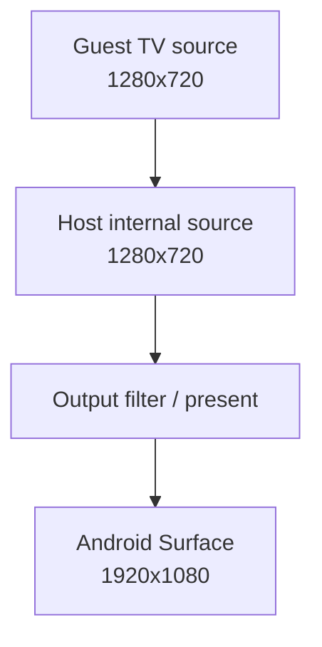

# Cemu Internal Resolution P0 Android 验证

## 1. 结论

Internal Resolution 的 P0 可观测性阶段已在 Android Vulkan + BotW v208 gameplay
完成验收，尚未启用 2x，也没有改变任何 surface 的实际尺寸。当前实现能够从同一份
title-scoped 快照回答以下问题：

- surface 的 guest/host extent、format、usage、first-use 和 family；
- attachment、copy、resolve、alias/reinterpret 关系；
- 最终 TV source 的 guest/host extent 与 Android Surface output extent；
- `Sampled -> RenderTarget` 与 `RenderTarget -> Sampled` 首次用途转换；
- readback、copy scale conflict、alias conflict 与 Graphic Pack 固定尺寸冲突；
- 诊断代码自身的 Tracy CPU 开销。

P0 的结果只是为 P1 policy 提供事实基础。`configured_factor=1`、`active_factor=1`、
`families_scaled=0` 均为预期，不能把 Graphic Pack 测试夹具命中误解为全局内部倍率已
实现。

## 2. 验证环境

| 项目 | 实测值 |
| --- | --- |
| 分支 | `feature/malos/basic_version` |
| 代码基点 | `ab6e8f2b` 加当前未提交 P0 改动 |
| APK | `relWithDebInfo` |
| Native build type | `RelWithDebInfo` |
| 设备 | AYANEO Pocket DS，序列号 `01108YHE01017563` |
| CPU | ARM64，8 cores |
| Renderer | Vulkan |
| 游戏 | The Legend of Zelda: Breath of the Wild，v208 / DLC v80 |
| Gameplay 场景 | 初始神庙内，可控制 Link 的实际场景 |
| Output | `1920x1080` |

覆盖安装使用 `adb install -r`，没有卸载应用、清数据或修改用户 `settings.xml`。

## 3. 实现边界

### 3.1 title 生命周期

`CafeSystem::LaunchForegroundTitle()` 在标题开始运行前调用
`SurfaceResolutionDiagnostics::BeginTitle()`。该入口会：

- 清空上一标题的 surface、family edge、统计和 TV/Pad source；
- 重置 first-use sequence；
- 增加 `title_generation`；
- 保留全局递增的 `surface_id`，避免上一标题迟到的析构回调碰撞到新标题 ID。

因此诊断历史与 title 生命周期一致，不绑定单帧，也不会跨标题无限积累。真机两轮独立
启动均得到 `title_generation=1`；自动脚本同时要求运行标题的 generation 大于 0。

### 3.2 线程安全快照

DebugBus 请求先在 `s_mutex` 下复制 surface、edge、counter 和 present source，随后在
锁外完成 family 归并、排序与序列化。texture-cache 不会与 dumpsys 并发迭代同一个
容器，大结果的反射输出也不会持续占用 texture 诊断锁。

### 3.3 foundation 反射输出

诊断输出没有为每条命令重复拼 `"field="`。实现定义扁平 payload，并用 foundation 的
`REFLECT_CLASS_PROPERTIES` 从 C++ 成员名注册字段；`ReflectionDebugDump::PackScalarObject`
统一遍历反射属性，生成稳定的 `key=value`。DebugBus 只保留 section begin/end 作为集合
边界。

这样新增字段只需修改 payload 与其反射成员列表，Android dumpsys 和桌面 debugbus 共享
同一份序列化代码，也没有为了文本输出引入 foundation packing 的 JSON/YAML 等额外依赖。

## 4. Warmup 与画面确认

执行顺序：

```sh
adb -s 01108YHE01017563 shell dumpsys activity service \
  info.cemu.cemu/.utils.DebugDumpService open_last_game
adb -s 01108YHE01017563 shell dumpsys activity service \
  info.cemu.cemu/.utils.DebugDumpService warmup_a
```

默认 warmup 实测参数：

| 参数 | 值 |
| --- | ---: |
| title/controller ready 后延迟 | 15 秒 |
| A 键次数 | 6 |
| A 键间隔 | 5 秒 |
| 单次按住 | 250 ms |
| 最终稳定等待 | 60 秒 |

`warmup_status` 依次经过 `delaying -> running -> settling -> completed`，6 次 A 全部完成，
且全过程 `title_running=true`。completed 后截屏确认处于可操作神庙场景；状态层显示
BotW v208、Vulkan、`Internal Native (1x)`、`Source 1280x720 -> 1280x720` 和
`Output 1920x1080`。

## 5. 无 Graphic Pack 的 1x 基线

执行：

```sh
skills/cemu-android-performance/scripts/verify_surface_scale_p0.sh \
  01108YHE01017563
```

聚合结果：

| 指标 | 实测值 |
| --- | ---: |
| `title_generation` | 1 |
| active / total surfaces | 1620 / 2774 |
| active families | 1523 |
| native estimated bytes | 506,295,773（482.84 MiB） |
| Graphic Pack fixed surfaces | 0 |
| copy scale conflicts | 0 |
| alias/reinterpret conflicts | 6995 |
| readbacks | 6008 |
| resized readbacks | 0 |
| readback failures | 0 |
| TV guest extent | `1280x720x1` |
| TV host extent | `1280x720x1` |
| configured / active factor | 1 / 1 |

### 5.1 First-use 转换证据

本轮共找到 170 个同时作为 sampled texture 和 render target 的 surface：

| 转换 | 数量 |
| --- | ---: |
| `SampledToRenderTarget` | 14 |
| `RenderTargetToSampled` | 156 |

可复现样本：

| surface | family | extent | format | sampled first-use | RT first-use |
| ---: | ---: | --- | --- | --- | --- |
| 401 | 381 | `1280x720x1` | `0x41a` | seq 843 / frame 622 / draw 85348 | seq 1221 / frame 625 / draw 88766 |
| 396 | 381 | `1280x720x1` | `0x1a` | seq 833 / frame 622 / draw 85347 | seq 1222 / frame 625 / draw 88766 |
| 1618 | 1617 | `320x180x1` | `0x816` | seq 3804 / frame 1132 / draw 335761 | seq 3964 / frame 1133 / draw 339550 |

这证明不能用“首次 sampled 就永久归类为静态纹理”的简单策略；P1 resolver 必须结合
title 内后续 usage 与 family 传播。

### 5.2 Guest / host / output 边界



P0 保持 `A == B`；只有 `B -> D` 是既有最终输出缩放。后续 internal factor 只能改变
host internal extent，不能回写 guest GX2 尺寸，也不能把 output 尺寸当作内部尺寸。

## 6. Graphic Pack 固定尺寸验证

测试使用：

`skills/cemu-android-performance/fixtures/botw-p0-native-texture-redefine/rules.txt`

fixture 默认启用，但只把 BotW 的 `1280x720` 和 `854x480` 纹理覆盖为相同尺寸。它不会
改变画面或用户配置，目的只是走通真实 `TextureRedefine` 命中路径。重新启动 App、进入
gameplay 并完成同一 warmup 后执行：

```sh
REQUIRE_GRAPHIC_PACK=1 \
  skills/cemu-android-performance/scripts/verify_surface_scale_p0.sh \
  01108YHE01017563
```

结果：

| 指标 | 实测值 |
| --- | ---: |
| fixed surfaces | 13 |
| pack 相关冲突 | 1043 |
| TV guest / host | `1280x720x1` / `1280x720x1` |
| sampled -> RT | 12 |
| readbacks / failures | 4542 / 0 |
| copy scale conflicts | 0 |

代表 family：

| family | surface 数 | extent | usage | pack fixed | edge / conflict |
| ---: | ---: | --- | --- | --- | --- |
| 1 | 2 | `854x480x1` | ColorAttachment, PresentSource, GuestUpload | 是 | 5 / 4 |
| 7 | 1 | `1280x720x1` | Sampled, ColorAttachment, PresentSource, GuestUpload | 是 | 3 / 3 |
| 400 | 7 | `1280x720x1` | Sampled, ColorAttachment, DepthStencilAttachment, GuestUpload | 是 | 1092 / 1083 |

冲突样本为 surface 420 与 1748 的 `view_incompatible`；两侧 guest/host extent 均被
反射 payload 完整记录。fixture 在验证后已从设备删除并重启 App，仓库副本仍可重新部署。

## 7. Tracy 开销

既有有效 Tracy session `s17` 覆盖 490 帧，capture program 为 `info.cemu.cemu`，设备信息
为 AYANEO Pocket DS / ARM64 / 8 cores，并包含 Vulkan GPU context。直接相关 CPU zone：

| Zone | 总时长 | 次数 |
| --- | ---: | ---: |
| `SurfaceScale.ReadbackBoundary` | 3.122 ms | 2303 |
| `SurfaceScale.BuildFamily` | 1.297 ms | 1994 |
| `SurfaceScale.ResolvePolicy` | 0.146 ms | 417 |
| 合计 | 4.565 ms | 4714 |

平均每帧为 `4.565 / 490 = 0.009316 ms`。同一采集窗口的 `cemu.frame_time_us` 样本约为
88–106 ms，直接标记路径约占 0.0093%，明显低于 P0 的 1% 目标。详细 surface/edge 的
复制和反射序列化只在 DebugBus 请求时发生，不进入逐帧路径。

## 8. 退出标准对照

| P0 退出标准 | 结果 | 证据 |
| --- | --- | --- |
| 画面和分配尺寸不变 | 通过 | gameplay 截屏；guest/host 都为 1280×720；factor 1 |
| 一份快照还原主要 family | 通过 | family 1、7、400 及其 usage/edge/conflict |
| 明确 TV guest/host/output | 通过 | 1280×720 / 1280×720 / 1920×1080 |
| 列出 Sampled 后转 RT | 通过 | 14 个；surface 401、396、1618 样本 |
| 列出 readback、alias 与 Pack 冲突 | 通过 | 6008 readbacks、6995 aliases、1043 Pack conflicts |
| instrumentation 低于 1% | 通过 | 0.009316 ms/frame，约占采集 frame time 0.0093% |
| macOS Native 构建 | 通过 | `/tmp/cemu-o0.jPymO6` RelWithDebInfo |
| Android Native/APK 构建 | 通过 | `assembleRelWithDebInfo` |

下一阶段是 P1：引入统一 resolution model/resolver，但仍保持 1x；在 P1 自身退出标准
满足前，不增加 Android 2x UI，也不进入实际 scaled allocation。

## 9. RenderDoc GPU 资源交叉验证

使用 gameplay 截图确认后的 BotW Vulkan RDC 做 Android remote replay，得到 134 个 host
draw、80 个 capture resource、17 张 native texture，且 debug/validation message 为 0。
主 pass 的 `1280x720` viewport、4 张 color target 和 1 张 depth target 与 P0 debugbus 的
TV guest/host `1280x720` 一致；5 张 swapchain image 为 `1920x1080`，与 StatusLayer output
一致。

本 RDC 没有 materialize 写入 swapchain 的 action，因此只把 `1920x1080` 作为 output
resource extent 证据，不声称已经定位最终缩放 event。完整身份、SHA-256、纹理表、关键
event 和证据边界见 `docs/architecture/renderdoc-graphics-analysis.md`；可复用流程见
`skills/cemu-renderdoc-analysis/SKILL.md`。
