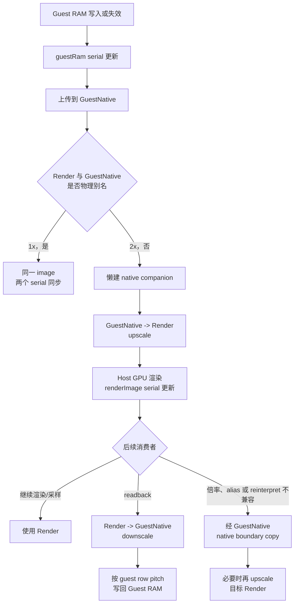
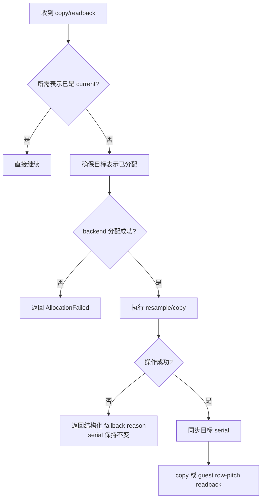

# Cemu Internal Resolution P2 验证

## 结论

P2 的 guest-native / host-render 双表示、mip/slice 内容序号、跨表示同步、native
boundary copy、可缩放 readback 和失败返回合约已经完成。Vulkan 与 Metal 消费同一套
Core 状态机，并各自实现 companion 分配、表示 copy、color/depth resample 和 readback。

Production policy 仍固定为 1x。本阶段没有增加 XML、环境变量、debugbus 或 UI 倍率入口；
2x descriptor 只由独立测试 harness 注入。因而这里的结论是“2x 表示机制可被验证”，不是
“BotW 已经以 2x 运行”。真实 title 的 2x family 分类、显存预算和实机画面验证属于 P3。

## P2 数据流



最大 serial 所在的表示是当前内容权威。只有 backend 操作成功后，目标表示才继承来源
serial；失败不会提前把目标标为 current。

## 实现覆盖

| P2 项 | 实现与结果 |
| --- | --- |
| T0 subresource serial | `LatteSurfaceContentSerials` 按 mip/slice 保存 guest RAM、GuestNative、Render serial；guest invalidation、upload、GPU write、clear、copy、readback 均接入 |
| 表示规划 | `LatteSurfacePlanRepresentationSync()` 只从 serial 决定来源和目标；1x 别名不提交 backend 操作 |
| copy 路由 | `LatteSurfaceSelectCopyPath()` 将倍率不兼容、format reinterpret 和 alias conflict 统一路由到 native boundary |
| 失败合约 | 普通 copy、format conversion、表示分配/同步均返回 `LatteSurfaceOperationResult`；不支持、格式、尺寸、分配失败不再静默 `return` |
| Vulkan | 可恢复地懒分配 GuestNative image；表示 copy 使用显式 image barrier/copy；resample 使用 `vkCmdBlitImage`，并检查 blit/linear-filter 能力 |
| Metal | 懒分配 GuestNative texture；表示同步使用 utility shader；color、integer、depth 分开建 pipeline，depth/color conversion 不再使用未定义的 raw blit |
| readback | resized surface 先同步到 GuestNative，再按 guest mip extent 和目标 row pitch 回写；压缩、非整字节格式、越界、pitch 不足及超过 32 MiB 明确失败 |
| 诊断 | companion create/release/bytes/peak、upscale/downscale/sync failure、native boundary copy/failure 都进入 foundation reflection、debugbus 和 profiler counter |

### copy 与 readback 的失败边界



## 自动化测试

构建使用 RelWithDebInfo，并显式打开 internal tests：

```sh
cmake --build build_no_vcpkg --target CemuSurfaceRepresentationTests -- -j6
./build_no_vcpkg/src/Cafe/CemuSurfaceRepresentationTests
ctest --test-dir build_no_vcpkg -R SurfaceRepresentation --output-on-failure
```

结果：专用 harness 与 CTest 均通过。

| 测试 | 覆盖内容 |
| --- | --- |
| serial 状态机 | guest upload、render write、downscale、readback、失败不迁移 serial、1x 别名 |
| subresource 隔离 | 两级 mip、两个 array slice；只修改目标 subresource |
| companion 生命周期 | Vulkan/Metal create、sync、release、bytes；1x 不创建 companion |
| failure injection | Vulkan/Metal allocation failure 与 resample failure 均使 policy 回退 native，并保留 requested extent/fallback reason |
| color | nearest upscale、linear downsample 及 guard/padding 不被越界改写 |
| depth | 两级 mip、两个 slice 的整数 pattern 精确往返，不插值 |
| GPU -> CPU -> GPU | 3x2 guest、6x4 render、带 padding 的 CPU row pitch，往返后 pattern 一致 |
| copy | 1x -> 2x native boundary、同倍率 subrect、mip/slice 隔离 |
| 路由 | scale mismatch、reinterpret、alias conflict 必须走 native boundary |

RelWithDebInfo 下定义了 `NDEBUG`，因此 harness 使用独立的 `REQUIRE`，不会因 `assert`
被裁掉而产生“空测试通过”。

## macOS / Metal 验证

```sh
cmake --build build_no_vcpkg --target CemuBin -- -j6
```

结果：`bin/Cemu_relwithdebinfo` 完整链接成功。为验证 Metal utility shader 能被真实 runtime
编译，临时把本机 renderer 切到 Metal 后启动 BotW WUA；日志确认载入：

```text
Base:   00050000101c9300_v0
Update: 0005000e101c9300_v208
DLC:    0005000c101c9300_v80
TitleVersion: v208
```

标题运行约 20 秒，没有 utility shader/library 编译错误。P2 production 固定 1x，因此本轮
没有真实触发 2x companion 或懒创建的 format-conversion pipeline，不能把启动成功解释为
Metal 2x 画面验收。

验证前的 `settings.xml` 已备份并原样恢复；恢复后文件与备份的 SHA-256 均为：

```text
0b30f5c7b3eb0e648468cf7198890c0df9fa3466201ba964a9dcbb42d3ae1f80
```

## Android Vulkan 1x 回归

### 构建与安装

```sh
cd src/android
./gradlew assembleRelWithDebInfo
adb install -r app/build/outputs/apk/relWithDebInfo/app-relWithDebInfo.apk
```

结果：`BUILD SUCCESSFUL`，覆盖安装成功；没有卸载 App 或清除用户配置。

```text
APK: src/android/app/build/outputs/apk/relWithDebInfo/app-relWithDebInfo.apk
SHA-256: 8d36775b162f5d2ee2cc089145cb7a9ba2de5e5ee4c1ca686adc8e3524487c75
```

设备：AYANEO Pocket DS，serial `01108YHE01017563`。

### warmup 与画面确认

使用 `open_last_game` 后执行默认 `warmup_a`：标题/controller ready 后等待 15 秒，发送
6 次 A，按键起点间隔 5 秒、每次按住 250 ms，最后稳定 60 秒。最终状态：

```text
warmup_state=completed
title_running=true
controller_ready=true
completed=6
```

截图确认已进入 BotW v208 初始神庙的可操作 gameplay，而不是 loading 或菜单：

```text
Renderer  Vulkan
Internal  Native (1x)
Source    1280x720 -> 1280x720
Output    1920x1080
```

截图位置：`_out/internal-resolution-p2/android-p2-final-1x.png`。本轮未连接 Tracy，截图中
12.0 FPS / 83.15 ms 只用于识别运行场景，不形成性能结论。

### 1x 诊断结果

`skills/cemu-android-performance/scripts/verify_surface_scale_p0.sh` 返回
`surface scale P0 verification passed`。关键值：

```text
configured_factor=1
active_factor=1
families_total=1523
families_scaled=0
families_native=1523
families_fallback=0
native_companion_bytes=0
native_companion_peak_bytes=0
companion_creates=0
companion_releases=0
representation_upscales=0
representation_downscales=0
representation_sync_failures=0
native_boundary_copies=0
native_boundary_copy_failures=0
copy_scale_conflicts=0
readbacks_total=5565
resized_readbacks=0
readback_failures=0
tv_guest_extent=1280x720x1
tv_host_extent=1280x720x1
```

这证明 P2 新增状态在 1x 下不会建立常驻双份纹理，也没有破坏 BotW 既有 readback/copy
路径。`alias_conflicts=7285` 是 P0/P1 已有的关系诊断计数，不是 copy 失败；实际 copy
route 仍由兼容性判断决定。

## 已知边界与 P3 输入

P2 已满足“机制和自动化合约完整”，但以下能力尚未形成真实 title 2x 证据：

- D24S8/stencil resample：Metal 明确返回 unsupported；Vulkan 仍依赖设备格式的 blit
  capability。首版应把 stencil family 归入 `ForceNative`，不能泛化成 depth 全支持。
- MSAA 跨倍率 resolve：当前明确失败，不静默跳过；P3 family preflight 应先归入
  `ForceNative`，之后再设计专门 resolve。
- 1D、3D、压缩 surface：表示 resample 明确拒绝；静态/数据纹理继续保持 native。
- failure injection 验证的是 Core policy 和两后端合约 fixture。真实 Vulkan/Metal title 2x
  分配失败后的整 family 回退，需要随 P3-T1/T2/T3 的 family preflight 一起验收。
- Metal 本轮验证了主程序链接、utility MSL 编译与 BotW v208 title 启动；懒创建的特定
  depth/color conversion pipeline 要在 P3 的真实 workload 中单独核对。

因此 P3 的第一个动作应是配置/title snapshot 与 family preflight，而不是直接开放 UI。
