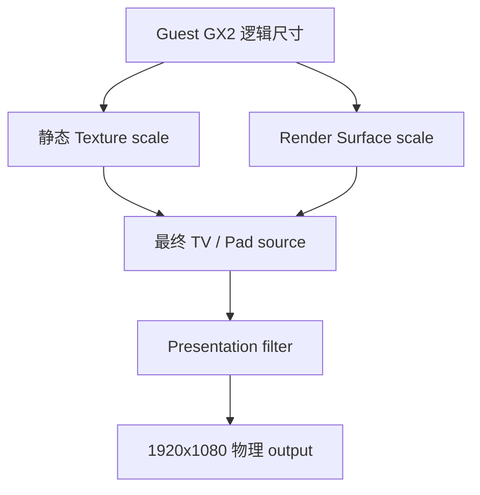
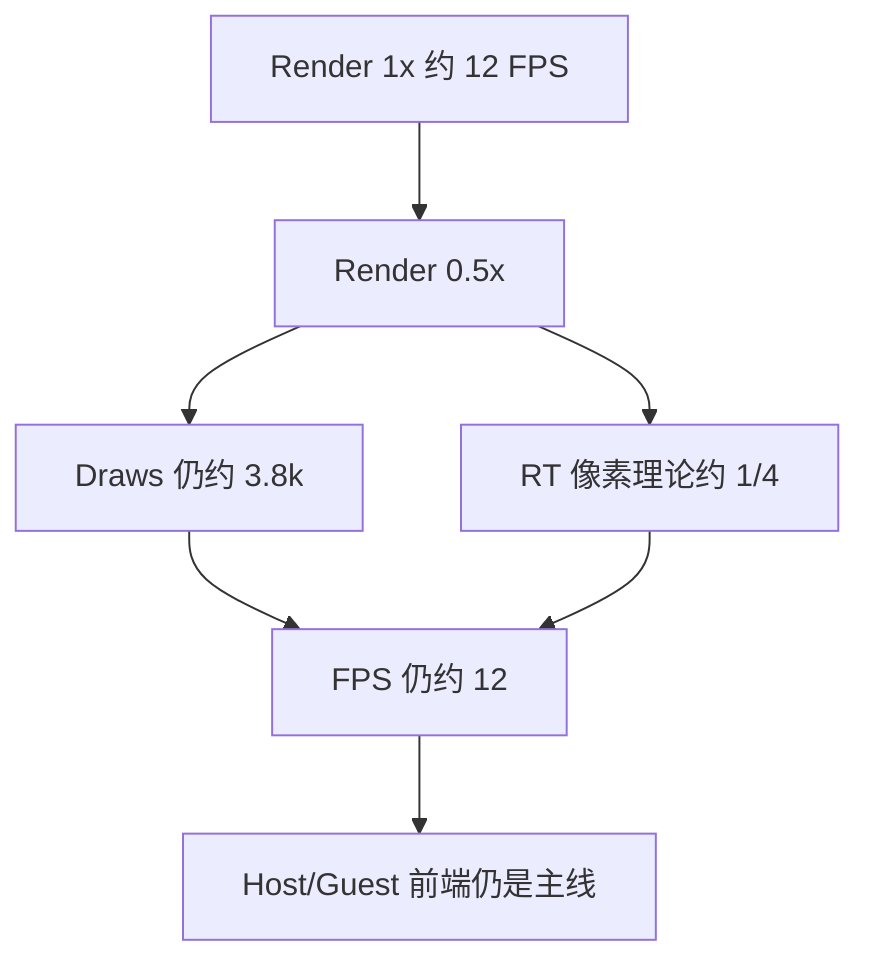
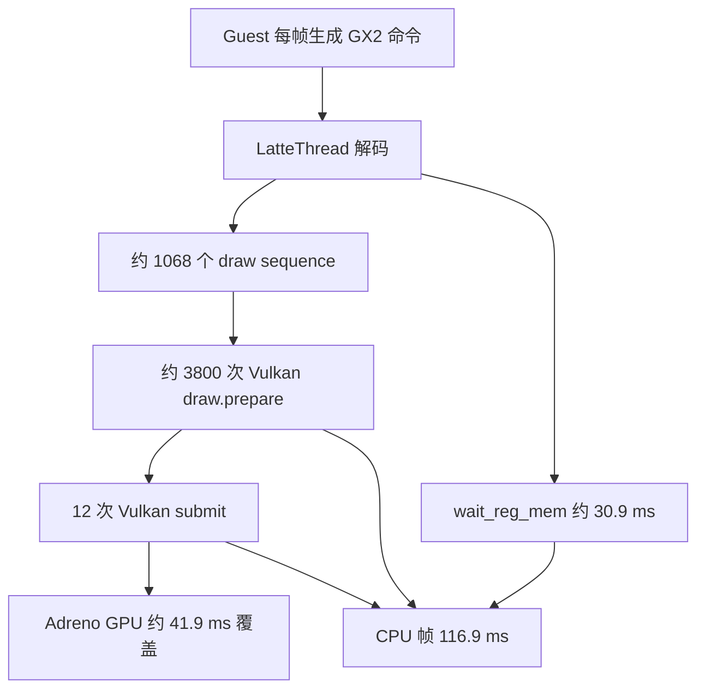
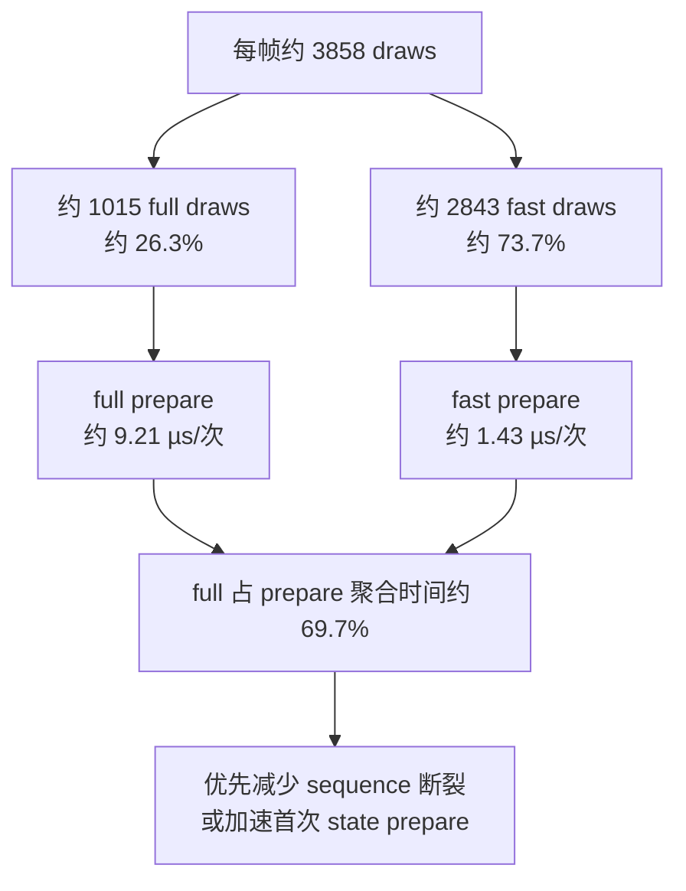

# Internal Resolution P3 验证记录

本文记录 Cemu P3 在 AYANEO Pocket DS 上的实际验证。游戏为 BotW v208 / DLC v80，
Android APK 使用 Native `RelWithDebInfo` 且保持 `android:debuggable=true`。所有运行轮次
均通过 `open_last_game` 启动，并执行默认 warmup：title/controller 就绪后等待 15 秒，
每 5 秒按一次 A，共 6 次，最后稳定等待 60 秒。只有截图确认进入可操作神庙场景后，
才把数据记为 gameplay 证据。

## 配置与保护

- 设备：`01108YHE01017563` / AYANEO Pocket DS。
- 用户原始配置备份：
  `_out/internal-resolution/p3/config-backup/settings.xml.before-p3`。
- 原始配置 SHA-256：
  `ddd474ec59fbf437078e82e35d0d08febe98468015edc99bef9731905322928c`。
- APK 只使用 `adb install -r` 覆盖安装；未卸载应用、未清数据。
- P3 结束后已先停止 App，再把上述文件原样推回设备；回拉文件与备份通过 `cmp`，两者
  SHA-256 均为 `ddd474ec59fbf437078e82e35d0d08febe98468015edc99bef9731905322928c`。
  Cemu 保持停止状态，设备上未遗留 0.5x / Texture 2x 实验配置。

旧配置只有 `InternalResolutionFactor=2`。新版本首次读取时正确迁移为：

```text
configured_render_scale_percent=200
active_render_scale_percent=200
configured_static_texture_scale_factor=1
active_static_texture_scale_factor=1
```

新权威 key 为 `RenderSurfaceScalePercent` 与 `StaticTextureScaleFactor`；旧 key 只用于
迁移与向旧版本兼容保存。

## 三个独立尺度域



Static Texture 与 Render Surface 在 title 启动时分别冻结。未压缩、非 CPU-readable、
首次用途为 GuestUpload/Sampled 的 2D 候选可以进入 Texture 2x；资源后续成为 attachment
时迁移到 Render scale。BCn、video、3D、MSAA 和明确的 CPU 边界仍保持 native。

## 实机画面结果

| 组合 | Source | Output | 面板瞬时值 | 画面结果 | 证据 |
| --- | --- | --- | --- | --- | --- |
| Texture 1x + Render 1x | 1280x720 → 1280x720 | 1920x1080 | 约 12 FPS | 既有 P1/P2 基线正确 | `docs/verification/internal-resolution-p1-android.md` |
| Texture 1x + Render 2x | 1280x720 → 2560x1440 | 1920x1080 | 8.6 FPS，3,824 draws（2,813 fast） | 神庙场景正确 | `_out/internal-resolution/p3/android-2x/gameplay.render2-texture1-formatcopy-late.png` |
| Texture 2x + Render 0.5x | 1280x720 → 640x360 | 1920x1080 | 10.5～12.2 FPS，3,802～3,811 draws | 神庙场景正确，明显更软 | `_out/internal-resolution/p3/android-half-texture2.depthsync.png` |

面板是单时刻观察，不是稳定 benchmark。它能支持瓶颈方向判断，不能用来计算精确百分比。

## 同步失败定位与修正

最初 Render 2x 虽能正确显示，但 debugbus 记录了约 1.1 万次 native-boundary copy
失败。新增 `surface_scale_failures` 后定位到以下几类：

1. 同字节宽的颜色格式重解释，例如 `0x1a ↔ 0x816`、`0x806 ↔ 0x7`。
2. D16 depth（GX2 `0x5`）在 Adreno 上没有 Vulkan blit capability。
3. R32_FLOAT（GX2 `0x80e`）不支持 linear filter。
4. 3D/特殊维度 native-boundary copy 明确返回 `DimensionUnsupported`。

修正策略：

- Vulkan 颜色 copy 允许相同 texel block size 的非压缩 color format，仍拒绝深度、压缩
  和不同 block size。
- R32_FLOAT 的 linear filter 不可用时显式降为 nearest，不跳过同步。
- D16 depth 跨尺度同步复用 Vulkan surface-copy draw pipeline，用 nearest depth sample
  写入目标 depth attachment。
- 3D/特殊维度继续作为已知不支持边界报告，不能伪装成功。

颜色格式修正后的 Render 2x 轮次把 `native_boundary_copy_failures` 从约 1.1 万次降到
约 500 次。D16/R32 修正后，最终 gameplay 状态为：

```text
representation_sync_failures=0
native_boundary_copy_failures=512
readback_failures=0
```

剩余 512 次全部有结构化原因：496 次 GX2 format `0x1` 和 16 次 `0x816` 的
`NativeBoundaryCopy / DimensionUnsupported`。已不再包含 D16、R32_FLOAT、格式重解释或
静默跳过同步。

## 性能判断：当前不是单纯 Render 压力



0.5x 没有越过约 12 FPS，而 2x 会降到约 8.6 FPS。合理结论是：2x 会增加 GPU
raster/RT 压力并形成额外瓶颈，但 1x 当前上限主要不由像素吞吐决定。约 3,800 draws
及约 2,800 fast draws 在尺度变化后基本不变，Guest GX2 packet、Host LatteThread
decode、draw.prepare、descriptor/pipeline 状态处理和 submit 仍要逐项执行。

下一轮 Tracy 应优先把 draw 按 Guest pass/marker、normal/fast path、pipeline/descriptor
命中和 submit batch 聚合，判断能否合并、缓存或为 BotW 建立可验证的 Host 快速通道；
不应继续只靠降低 internal resolution 寻找主要提帧收益。

### 10 秒 Tracy 复核

在上述最终 gameplay 状态又采集了 10 秒 Tracy：

- 本地 trace：`_out/internal-resolution/p3/cemu-botw-render0.5-texture2.tracy`，SHA-256
  `1b6472a4c4a16a87c2225e66d36cd62070a7172bce1fe461084d080bc0ba247a`。
- MCP artifact：`20260802-135545-191-tracy-tracy-live-normalized-only-9be1a8fd`。
- 102 帧；1 秒统计窗口内 draws 为 3,846～3,860。
- 最长帧 `#42` 为 116.938 ms；同帧 Host GPU 覆盖为 41.943 ms。

最长帧中的关键 Host CPU scope 如下。各 scope 存在父子或相邻关系，不能把所有行直接
相加；`vulkan.draw.prepare` 的 self time 则可以直接说明逐 draw 固定成本。

| Scope | 次数 | 累计耗时 | 含义 |
| --- | ---: | ---: | --- |
| `vulkan.draw.prepare` | 3,801 | 26.157 ms | 平均约 6.88 µs/draw，占整帧约 22.4% |
| `latte.sync.wait_reg_mem` | 1 | 30.890 ms | Guest/Host/GPU 同步等待，是另一条独立主线 |
| `vulkan.submit` | 12 | 14.839 ms | command buffer 结束、回收、等待与 queue submit 的合计 scope |
| `latte.draw_pass.decode` | 1,068 | 22.256 ms | fast draw sequence 的解析；内部包含部分 draw 工作 |
| `SurfaceScale.PreflightAttachmentGroup` | 1,068 | 4.367 ms | 当前 P3 每个 draw pass 的附加检查成本 |
| `SurfaceScale.Vulkan.Resample` | 135 | 0.943 ms | internal scale 转换的 CPU 记录成本，不是本帧主项 |



因此“约 3,800 draws 是瓶颈来源”可以更精确地表述为：它已经被证实是当前 Host CPU
长帧的重要组成部分，单是 prepare 就消耗约四分之一帧；但同步等待也接近 31 ms，不能
把全部 100 ms 都归因于 draw 数。

随后安装含拆分标签的新 APK，再次完整 warmup 后采集 8 秒：

- Trace：`_out/internal-resolution/p3/cemu-botw-render0.5-texture2-draw-split.tracy`，SHA-256
  `c28c525a0ff0ea15d746d8b96bc02d8249b70245090bc30a8920eef3dfc2f61e`。
- MCP artifact：`20260802-140406-654-tracy-tracy-live-normalized-only-f2bfa8f5`。
- 每帧总 draw 3,855～3,860；full 1,013～1,016；fast 2,842～2,845；fast ratio
  73.6%～73.7%。
- 全段 `vulkan.draw.prepare.full`：45,590 次 / 419.959 ms，平均约 9.21 µs。
- 全段 `vulkan.draw.prepare.fast`：127,669 次 / 182.493 ms，平均约 1.43 µs。



这说明优化目标不应被简化成“把 3,800 次 draw 都变快”。当前更集中的问题是每帧约
1,000 次 full draw / draw-sequence 首次准备：它只占 draw 数的约四分之一，却占这两类
prepare 聚合时间的约 69.7%。下一轮应给 sequence 终止原因、pipeline/descriptor cache
命中和 full prepare 子阶段加计数，再判断哪些状态切换可以跨 draw 保留。

## 当前退出状态

- [x] Render/Texture/output 配置和 title snapshot 相互独立。
- [x] 旧 `InternalResolutionFactor=2` 可迁移到 Render 200%。
- [x] BotW Vulkan Android 的 Render 2x 与 Texture 2x + Render 0.5x 均进入 gameplay。
- [x] StatusLayer 常显两类 scale、guest→host source 与 physical output。
- [x] D16/R32 同步失败归零，只剩 512 次明确报告的特殊维度边界。
- [ ] Metal macOS 实际游戏验证。
- [ ] 非 BotW readback/video、Graphic Pack 与 alias-heavy title 回归。
- [ ] 上述项目完成前不开放普通用户设置 UI。
