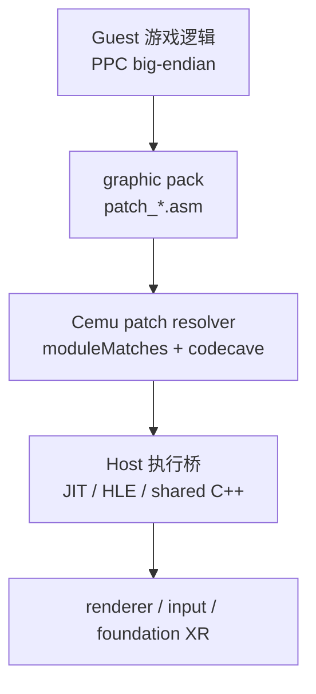
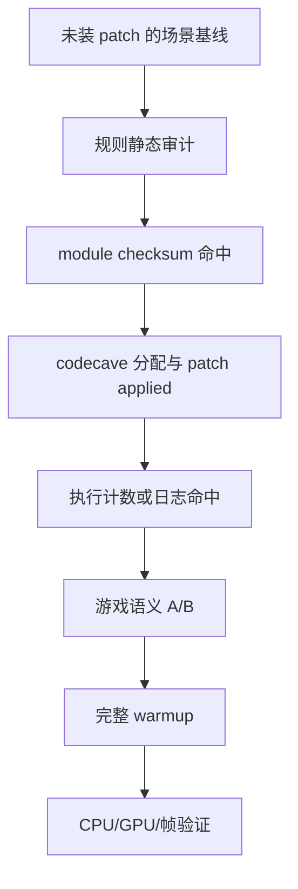

# Cemu Guest patch 模型

## 四层边界

- Guest 层：游戏自己的代码、数据、对象布局、线程和渲染调用。
- Patch 层：改写 Guest 指令，或在 codecave 中增加 PPC 逻辑。
- Host 桥：把 Guest 调用变成 Cemu 内部 HLE/native callback。
- 平台能力：Vulkan/Metal/OpenGL、输入、窗口、XR runtime。

任何一层缺失，都不能把“graphic pack 已激活”当成功能完成。

## RPX/RPL 和版本锚点

Wii U RPX/RPL 是 PPC big-endian ELF 派生格式。优先记录 Cemu 运行时输出的：

- title ID、title version、region；
- `Loaded module '<name>' with checksum 0x........`；
- RPX updated/base hash；
- 实际装载的是 base、update 还是 WUA 中的合成视图。

`moduleMatches` 匹配的是 Cemu patch CRC，不等于 title version 或普通文件 SHA。跨版本迁移时先用字符串、vtable、调用图和数据流找语义锚点，再确认新地址；不要把另一架构或另一版本的字节签名直接套用。

## Cemu patch 关键语义

- Cemu 优先读取同目录下的 `patch_*.asm`；存在时不再读取旧 `patches.txt`。
- 每个 patch group 应有 `moduleMatches`，低地址通常按 codecave 内偏移重定位。
- `.origin = codecave` 让 assembler 从组内 codecave 起点布置标签和指令。
- `import.<module>.<function>` 通过 RPL/HLE export 解析。
- 写入后 Cemu 会失效对应 JIT range；这只证明写入，不证明控制流命中。

当前 Cemu 对缺失的函数导入可能创建含 `0xFFD0` 的 unsupported trampoline，并返回一个非零地址。因此 resolver 可以成功、group 可以被标为 applied，但第一次执行该导入时只会走 unsupported handler。必须用运行日志或 HLE counter 区分真正注册的 callback。

## PPC hook 审核清单

- 覆盖前原指令是否记录、是否需要在 codecave 重放；
- 分支距离是否适合 `bl/b`，远跳是否使用 CTR；
- LR、CTR、CR、r0、易失 GPR/FPR 是否按调用约定保存；
- 返回值寄存器是否符合调用方；
- Guest 指针是否经过 MPTR/内存边界转换；
- 结构字段的 endian、对齐和生命周期是否验证；
- 多核 Guest 线程是否会并发进入 hook；
- 禁用/卸载 patch 后能否恢复原指令。

## 最小验证梯度

发生崩溃、卡死或错误画面时，先确定最高成功层级，再缩小到单个 group/单个 hook；不要在完整 mod 上同时改 Guest 和 Host 两侧。
